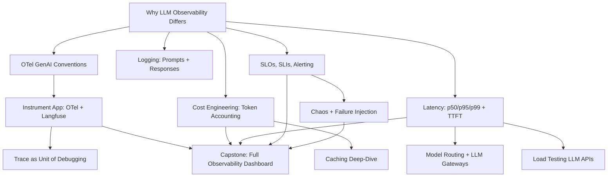

# Phase 07: Observability, Cost & Reliability

13 lessons. ~14 hours. Instrument your AI systems so you can see what is happening, know what it costs, and prove it meets its SLOs.

## The through-line

A 200 OK with a hallucinated answer looks identical to a correct one at the HTTP layer. LLM observability requires capturing semantic content, token counts, cost, and quality signals — not just HTTP metrics. This phase builds the full observability stack: traces, logs, cost accounting, latency profiling, SLOs, and chaos testing.

## What you build

## Lessons

| # | Lesson | Artifact | Time |
|---|--------|----------|------|
| 01 | Why LLM Observability Differs | `prompt-llm-observability-primer.md` | ~45 min |
| 02 | OpenTelemetry GenAI Conventions | `skill-otel-genai-spans.md` | ~60 min |
| 03 | Instrument an App: Raw OTel to Langfuse/Phoenix | `skill-langfuse-instrumentation.md` | ~75 min |
| 04 | The Trace as the Unit of Debugging | `skill-trace-debug-workflow.md` | ~60 min |
| 05 | Logging Prompts, Responses, Tool Calls | `skill-llm-request-logger.md` | ~45 min |
| 06 | Cost Engineering: Token Accounting, Dashboards | `skill-cost-dashboard.md` | ~60 min |
| 07 | Caching Deep-Dive: Prompt/Prefix + Semantic | `skill-caching-strategy.md` | ~75 min |
| 08 | Latency: p50/p95/p99, TTFT, Where Time Goes | `skill-latency-profiler.md` | ~60 min |
| 09 | Model Routing & LLM Gateways | `skill-model-router.md` | ~60 min |
| 10 | Load Testing LLM APIs | `skill-llm-load-test.md` | ~45 min |
| 11 | SLOs, SLIs & Alerting for AI Features | `skill-ai-slo-template.md` | ~45 min |
| 12 | Chaos & Failure Injection | `skill-chaos-test-suite.md` | ~45 min |
| 13 | Capstone: Full Observability + Cost Dashboard | `runbook-observability-setup.md` | ~90 min |

## Prerequisites

Phase 06 (Shipping) for the FastAPI service being instrumented. Basic familiarity with HTTP and Python async.

## Stack

- Python + `anthropic` SDK
- `opentelemetry-sdk` + `opentelemetry-exporter-otlp-proto-grpc`
- `langfuse` SDK for LLM-native tracing
- `structlog` for structured logging
- `sentence-transformers` for semantic caching (L07)
- `litellm` for provider-agnostic routing (L09)
- SQLite for cost accounting
- Docker for the capstone
