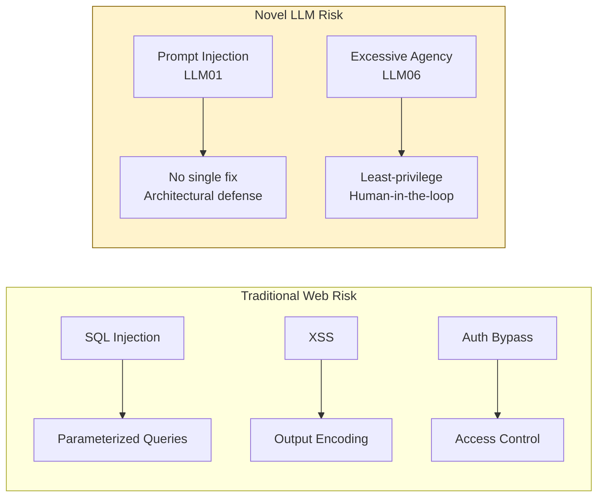

# نموذج التهديد: OWASP LLM Top 10 (2025)

> إن لم تسمِّ التهديد، فلن تستطيع الدفاع ضده.

**النوع:** تعلّم
**اللغات:** Python
**المتطلبات:** أساسيات Python، إلمام بواجهات LLM APIs، إتمام P02 RAG أو P04 Agents
**الوقت:** ~60 دقيقة
**أهداف التعلّم:**
- تسمية وشرح جميع مخاطر OWASP LLM العشرة (إصدار 2025) بلغة واضحة
- التمييز بين الخطرين الفريدين لأنظمة LLM واللذين لا يوجد لهما نظير في أمن الويب التقليدي
- تقدير الاحتمالية والأثر لكل خطر ضمن سياق تطبيق محدد
- بناء سكربت لنمذجة التهديدات يُنتج سجل مخاطر مُرتّب حسب الأولوية
- تطبيق النموذج على خدمة RAG حقيقية لتحديد أهم 3 مخاطر فيها

---

## MOTTO

نموذج التهديد ليس وثيقة امتثال (compliance). إنه القائمة المُرتّبة حسب الأولوية لما سيؤذيك في الإنتاج (production).

---

## المشكلة

لقد أطلقتَ للتو مساعد دعم عملاء مبني على RAG. تكوّنت مراجعتك الأمنية مما يلي: سأل مدير أمن المعلومات (CISO) "هل يستخدم HTTPS؟" فقلتَ نعم. بعد ستة أشهر، ينشر باحث تدوينة: "استخرجتُ كامل الـ system prompt من روبوت محادثة [شركتك] في 4 رسائل." يعيد مديرك التقني (CTO) توجيه التدوينة إليك الساعة 11 مساءً.

منحك التفكير الأمني التقليدي للويب دفاعات ضد SQL injection، وحمايات XSS، وطبقات وسيطة للمصادقة (auth middleware). لكن فريقك الأمني لم يرَ قط نظامًا يستطيع فيه المستخدم تغيير ما يفعله التطبيق بمجرد كتابة جمل بالإنجليزية. لا يملكون نموذجًا ذهنيًا لهذا.

إن OWASP LLM Top 10 (إصدار 2025) هو ذلك النموذج الذهني. إنها قائمة منظّمة بفئات المخاطر العشر التي تظهر بشكل متكرر عبر أنظمة LLM في الإنتاج. لا تخبرك بما يجب بناؤه، بل تخبرك أين تنظر وكيف تسمّي ما تجده. تلك هي الخطوة الأولى: تسمية التهديد.

---

## المفهوم

### قائمة OWASP LLM Top 10 (2025)

```
LLM01  Prompt Injection           User or retrieved content overrides model instructions
LLM02  Sensitive Information      Model reveals PII, secrets, or system prompt contents
       Disclosure
LLM03  Supply Chain               Poisoned model weights, datasets, or third-party components
LLM04  Data and Model Poisoning   Training or fine-tuning data is manipulated to alter behavior
LLM05  Improper Output Handling   Model output is rendered or executed without sanitization
LLM06  Excessive Agency           Model takes real-world actions beyond its intended scope
LLM07  System Prompt Leakage      System prompt contents are extracted by the user
LLM08  Vector and Embedding       Poisoned embeddings, malicious retrieval, index manipulation
       Weaknesses
LLM09  Misinformation             Model generates plausible but false information confidently
LLM10  Unbounded Consumption      No limits on token use, API calls, or cost, enabling DoS
```

### مصفوفة المخاطر

ضع كل خطر على محورَي الاحتمالية والأثر (likelihood x impact) لتطبيقك المحدد. الخطر عالي الاحتمالية وعالي الأثر يُعالَج أولًا.

```
         HIGH IMPACT
              |
  LLM06       |  LLM01
  Excessive   |  Prompt
  Agency      |  Injection
              |
  LLM07       |  LLM02
  Prompt      |  Sensitive
  Leakage     |  Disclosure
-----------+----------------- HIGH LIKELIHOOD
  LLM09    |  LLM05
  Misinfor-|  Improper Output
  mation   |  Handling
              |
  LLM03  LLM04  LLM08  LLM10
  (varies by architecture)
```

هذا توزيع افتراضي لمساعد RAG عام موجّه للجمهور. يتغير توزيعك بناءً على معماريتك، ومستخدميك، وما يُسمح للنموذج بفعله.

### الخطران الفريدان لأنظمة LLM

تملك تطبيقات الويب التقليدية دفاعات ضد الحقن (parameterized queries)، وكشف المعلومات (access control)، وسلسلة التوريد (dependency scanning)، وحجب الخدمة DoS (rate limiting). ثمانية من مخاطر OWASP LLM العشرة تُقابل فئات مخاطر تقليدية بنكهات خاصة بـ LLM.

اثنان لا يُقابلان شيئًا:

**LLM01 Prompt Injection** لا يوجد له نظير مباشر في أمن الويب لأنه لم يسبق لأي فئة تطبيقات أن سمحت لمدخلات المستخدم بتغيير ما يفعله التطبيق على مستوى المنطق (logic layer). الـ SQL injection يتلاعب بالبيانات. أما الـ prompt injection فيتلاعب بعملية الاستدلال نفسها.

**LLM06 Excessive Agency** لا يوجد له نظير لأنه لم يسبق لأي فئة تطبيقات أن فوّضت إجراءات مفتوحة في العالم الحقيقي إلى مكوّن يفسّر اللغة الطبيعية. نموذج ويب (web form) يُرسل شيئًا محددًا واحدًا. أما الـ agent فقد يقرر إرسال رسائل بريد، وحذف ملفات، واستدعاء واجهات APIs خارجية بناءً على جملة إنجليزية من المستخدم.

ابدأ بـ LLM01 وLLM06. هما الأصعب في الدفاع والأكثر احتمالًا لإحداث حوادث في الإنتاج.



---

## البناء

### سكربت لنمذجة التهديدات لتطبيقات LLM

يمرّ السكربت على كل خطر من مخاطر OWASP LLM العشرة، ويطلب من المهندس تقدير الاحتمالية والأثر، ويُنتج سجل مخاطر مُرتّبًا تتصدره المخاطر الأعلى أولوية.

راجع `code/main.py` للاطلاع على التنفيذ الكامل. البنية الأساسية:

```python
OWASP_LLM_TOP_10 = [
    {
        "id": "LLM01",
        "name": "Prompt Injection",
        "description": "User input or retrieved content overrides model instructions.",
        "attack_surface": "User turn, retrieved documents, tool outputs",
    },
    {
        "id": "LLM02",
        "name": "Sensitive Information Disclosure",
        "description": "Model reveals PII, credentials, or system prompt contents.",
        "attack_surface": "Training data, context window, direct questioning",
    },
    # ... all 10 risks
]
```

لكل خطر، يسأل السكربت:

```
LLM01: Prompt Injection
  Description: User input or retrieved content overrides model instructions.
  Attack surface: User turn, retrieved documents, tool outputs

  Rate LIKELIHOOD (1=rare, 2=possible, 3=likely): 3
  Rate IMPACT (1=low, 2=medium, 3=high): 3
  Notes (optional): Users can upload documents that contain instructions.
```

المُخرج هو سجل مخاطر مُرتّب حسب درجة الخطر (likelihood x impact):

```
RISK REGISTER
=============
Rank  ID      Name                        L  I  Score  Priority
1     LLM01   Prompt Injection            3  3  9      CRITICAL
2     LLM06   Excessive Agency            3  3  9      CRITICAL
3     LLM02   Sensitive Info Disclosure   3  2  6      HIGH
4     LLM07   System Prompt Leakage       2  3  6      HIGH
5     LLM05   Improper Output Handling    2  2  4      MEDIUM
...
```

كما يُحفظ السجل في `risk_register.json` للتتبّع والتدقيق.

> **اختبار من الواقع:** فريقك على وشك إطلاق مساعد ذكاء اصطناعي قادر على قراءة صفحات Confluence الداخلية وإنشاء تذاكر Jira نيابةً عن المستخدمين. قبل كتابة سطر واحد من الكود الأمني، أيّ خطرين من مخاطر OWASP LLM ستصنّفهما على أنهما CRITICAL ولماذا؟

LLM01 (Prompt Injection) لأن صفحات Confluence قابلة للكتابة من خارج النظام من قِبل كثير من المستخدمين، ما يعني أن محتوى مَحقونًا في صفحة قد يتجاوز تعليمات المساعد عند قراءته لتلك الصفحة. وLLM06 (Excessive Agency) لأن المساعد قادر على إنشاء تذاكر Jira في نظام تتبّع المشاريع الإنتاجي لديك، ما يعني أن حقنًا ناجحًا قد يُنشئ آلاف التذاكر المزعجة، أو يعدّل تذاكر قائمة، أو يتصرف نيابةً عن المهاجم داخل أنظمتك الداخلية.

---

## الاستخدام

### تطبيق نموذج التهديد على خدمة RAG في المرحلة 02

خدمة RAG في المرحلة 02 (المشروع الختامي: `phases/02-retrieval-and-rag/16-capstone-rag-service/`) هي خدمة لاسترجاع المستندات وتوليد الإجابات. شغّل سكربت نمذجة التهديدات عليها بتزويده بوصف للتطبيق عند بدء التشغيل:

```
App description: FastAPI RAG service. Users submit questions. System retrieves
relevant document chunks from pgvector, constructs a prompt, and generates
an answer using Claude. No authentication. Documents are pre-loaded from
internal PDFs. No tool use or external API calls from the model.
```

أهم 3 مخاطر متوقعة لهذه المعمارية:

```
Rank  ID      Name                        Score  Priority
1     LLM09   Misinformation              6      HIGH
2     LLM01   Prompt Injection            6      HIGH
3     LLM07   System Prompt Leakage       4      MEDIUM
```

**يحتل LLM09 مرتبة عالية** لعدم وجود مصادقة، ولأن قاعدة المستخدمين غير مُتحقَّق منها، ولأن الاستشهادات المُهلوَسة (hallucinated citations) في نظام كثيف المستندات عالية الاحتمالية. لا تملك الخدمة أي تحقّق من المُخرجات.

**يحتل LLM01 مرتبة عالية** لأن خط أنابيب RAG يسترجع مقاطع المستندات ويحقنها في الـ prompt. أي مستند يحوي نص حقن يصبح ناقلًا للهجوم. وبما أن المستندات مُحمّلة مسبقًا من ملفات PDF (وليست إدخالًا حيًّا من المستخدم)، فالاحتمالية معتدلة، لكنها ليست صفرًا: قد يرفع مُطّلع خبيث (malicious insider) ملف PDF مسمومًا.

**يحتل LLM07 مرتبة متوسطة** لأن الـ system prompt هو طبقة الإعداد الوحيدة وهي على الأرجح ليست تافهة. المستخدم الذي يستخرجه يستطيع فهم منطق الترشيح وصياغة مدخلات لتجاوزه.

> **نقلة في المنظور:** يقول مستشار أمني: "أمن الذكاء الاصطناعي ما هو إلا أمن الويب بأسماء جديدة." بعد بناء نموذج تهديد OWASP، لماذا يكون هذا التأطير ناقصًا؟

لا يوجد لـ LLM01 وLLM06 نظير مباشر في أمن الويب لأنهما يستغلان شيئًا لم تملكه أي فئة تطبيقات سابقة: مكوّن استدلال يفسّر اللغة الطبيعية بوصفها تعليمات. لا يوقف الـ prompt injection أيُّ parameterized query أو output encoder لأن الحقن لا يحدث على طبقة البيانات. إنه يحدث على طبقة الاستدلال. نموذج التهديد جديد لأن فئة النظام نفسها جديدة.

---

## التسليم

الأثر (artifact) الذي يُنتجه هذا الدرس هو قالب نموذج تهديد قابل لإعادة الاستخدام لتطبيقات LLM. راجع `outputs/prompt-llm-threat-model.md`.

يُملأ هذا القالب مرة واحدة لكل تطبيق عند بدء المشروع، ويُحدَّث كلما تغيّرت المعمارية بشكل جوهري: عند إضافة أدوات، أو تغيّر النموذج، أو ربط مصادر بيانات جديدة، أو تغيّر صلاحيات المستخدم. إنه المُدخَل لكل قرار أمني لاحق.

---

## التقييم

كيف تعرف أن نموذج التهديد مفيد وليس مجرد خانة امتثال (compliance checkbox)؟

**فحص التغطية.** بعد تشغيل النموذج، هل تستطيع أن تشير إلى دفاع محدد أو قرار معماري لكل خطر CRITICAL وHIGH؟ إن لم يكن لخطر CRITICAL أي إجراء تخفيف (mitigation) مرتبط به، فقد كشف النموذج ثغرة عليك سدّها.

**وتيرة التحديث.** أعد تشغيل نموذج التهديد بعد كل تغيير معماري كبير. إن لم يتغير سجل المخاطر منذ 6 أشهر بينما أضفت 3 أدوات جديدة إلى الـ agent، فالنموذج قديم.

**ربط الحوادث.** عند وقوع حادثة أمنية، تحقّق مما إذا كانت تُقابل خطرًا موجودًا أصلًا في السجل. إن كانت كذلك وكانت مصنّفة CRITICAL بلا إجراء تخفيف، فالنموذج نجح لكن الفريق لم يتصرف بناءً عليه. وإن لم تُقابل أي خطر مُسجّل، فثمة ثغرة في نموذج التهديد.

**القابلية للقراءة عبر الفرق.** هل يستطيع مهندس لم يبنِ النظام أن يقرأ سجل المخاطر ويفهم ما هي أهم 3 مخاطر ولماذا؟ إن لم يستطع، فالأوصاف بحاجة إلى أن تكون أكثر تحديدًا.
