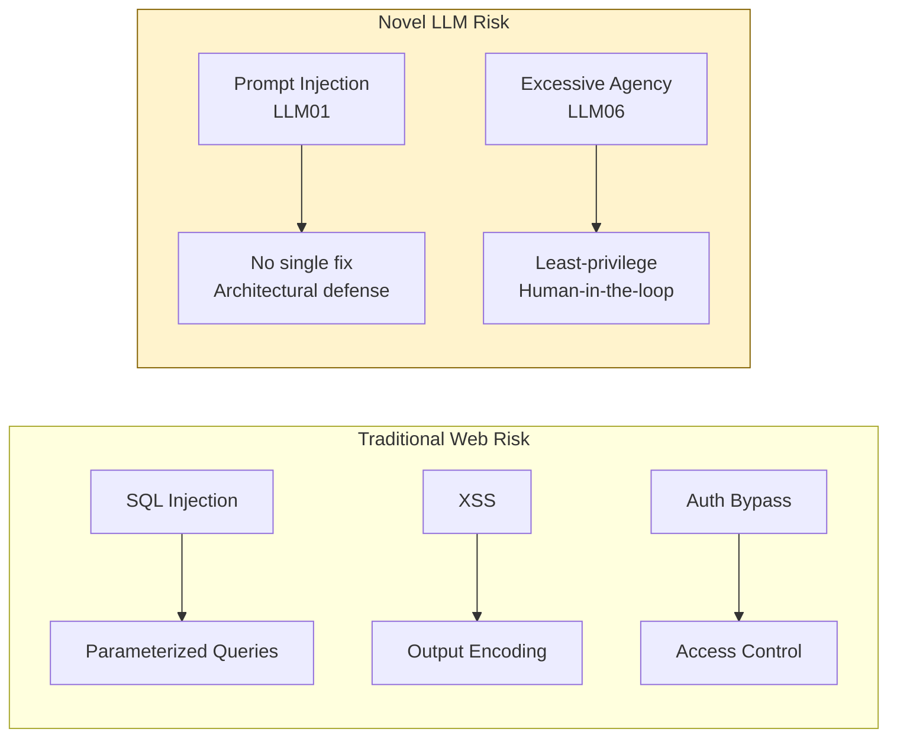

# Threat Model: OWASP LLM Top 10 (2025)

> If you do not name the threat, you cannot defend against it.

**Type:** Learn
**Languages:** Python
**Prerequisites:** Basic Python, familiarity with LLM APIs, completed P02 RAG or P04 Agents
**Time:** ~60 min
**Learning Objectives:**
- Name and explain all 10 OWASP LLM risks (2025 edition) in plain language
- Distinguish the two risks unique to LLM systems with no traditional web security analogue
- Rate likelihood and impact for each risk in a specific application context
- Build a threat-modeling script that produces a prioritized risk register
- Apply the model to a real RAG service to identify its top 3 risks

---

## MOTTO

A threat model is not a compliance artifact. It is the prioritized list of what will hurt you in production.

---

## THE PROBLEM

You have just shipped a RAG-powered customer support assistant. Your security review consisted of: the CISO asking "does it use HTTPS?" and you saying yes. Six months later, a researcher posts a blog: "I extracted the full system prompt of [your company]'s chatbot in 4 messages." Your CTO forwards the post at 11pm.

Traditional web security thinking gave you SQL injection defenses, XSS protections, auth middleware. But your security team has never seen a system where the user can change what the application does by writing English sentences. They have no mental model for it.

The OWASP LLM Top 10 (2025 edition) is that mental model. It is a structured list of the 10 categories of risk that appear repeatedly across production LLM systems. It does not tell you what to build. It tells you where to look and what to call what you find. That is the first step: naming the threat.

---

## THE CONCEPT

### The OWASP LLM Top 10 (2025)

```
LLM01  Prompt Injection           User or retrieved content overrides model instructions
LLM02  Sensitive Information      Model reveals PII, secrets, or system prompt contents
       Disclosure
LLM03  Supply Chain               Poisoned model weights, datasets, or third-party components
LLM04  Data and Model Poisoning   Training or fine-tuning data is manipulated to alter behavior
LLM05  Improper Output Handling   Model output is rendered or executed without sanitization
LLM06  Excessive Agency           Model takes real-world actions beyond its intended scope
LLM07  System Prompt Leakage      System prompt contents are extracted by the user
LLM08  Vector and Embedding       Poisoned embeddings, malicious retrieval, index manipulation
       Weaknesses
LLM09  Misinformation             Model generates plausible but false information confidently
LLM10  Unbounded Consumption      No limits on token use, API calls, or cost, enabling DoS
```

### The Risk Matrix

Plot each risk on likelihood x impact for your specific application. A risk that is high-likelihood and high-impact gets addressed first.

```
         HIGH IMPACT
              |
  LLM06       |  LLM01
  Excessive   |  Prompt
  Agency      |  Injection
              |
  LLM07       |  LLM02
  Prompt      |  Sensitive
  Leakage     |  Disclosure
-----------+----------------- HIGH LIKELIHOOD
  LLM09    |  LLM05
  Misinfor-|  Improper Output
  mation   |  Handling
              |
  LLM03  LLM04  LLM08  LLM10
  (varies by architecture)
```

This is a default placement for a public-facing RAG assistant. Your placement changes based on your architecture, your users, and what the model is permitted to do.

### The Two Risks Unique to LLM Systems

Traditional web applications have defenses for injection (parameterized queries), information disclosure (access control), supply chain (dependency scanning), and DoS (rate limiting). Eight of the ten OWASP LLM risks map to traditional risk categories with LLM-specific flavors.

Two do not:

**LLM01 Prompt Injection** has no direct web security analogue because no previous application class allowed user input to change what the application does at the logic layer. SQL injection manipulates data. Prompt injection manipulates the reasoning process.

**LLM06 Excessive Agency** has no analogue because no previous application class delegated open-ended real-world action to a component that interprets natural language. A web form submits one specific thing. An agent can decide to send emails, delete files, and call external APIs based on a user's English sentence.

Start with LLM01 and LLM06. They are the hardest to defend and the most likely to produce production incidents.



---

## BUILD IT

### A Threat-Modeling Script for LLM Applications

The script walks through each of the 10 OWASP LLM risks, prompts the engineer to rate likelihood and impact, and produces a sorted risk register with the highest-priority risks at the top.

See `code/main.py` for the full implementation. The core structure:

```python
OWASP_LLM_TOP_10 = [
    {
        "id": "LLM01",
        "name": "Prompt Injection",
        "description": "User input or retrieved content overrides model instructions.",
        "attack_surface": "User turn, retrieved documents, tool outputs",
    },
    {
        "id": "LLM02",
        "name": "Sensitive Information Disclosure",
        "description": "Model reveals PII, credentials, or system prompt contents.",
        "attack_surface": "Training data, context window, direct questioning",
    },
    # ... all 10 risks
]
```

For each risk, the script asks:

```
LLM01: Prompt Injection
  Description: User input or retrieved content overrides model instructions.
  Attack surface: User turn, retrieved documents, tool outputs

  Rate LIKELIHOOD (1=rare, 2=possible, 3=likely): 3
  Rate IMPACT (1=low, 2=medium, 3=high): 3
  Notes (optional): Users can upload documents that contain instructions.
```

The output is a risk register sorted by risk score (likelihood x impact):

```
RISK REGISTER
=============
Rank  ID      Name                        L  I  Score  Priority
1     LLM01   Prompt Injection            3  3  9      CRITICAL
2     LLM06   Excessive Agency            3  3  9      CRITICAL
3     LLM02   Sensitive Info Disclosure   3  2  6      HIGH
4     LLM07   System Prompt Leakage       2  3  6      HIGH
5     LLM05   Improper Output Handling    2  2  4      MEDIUM
...
```

The register is also saved to `risk_register.json` for tracking and auditing.

> **Real-world check:** Your team is about to launch an AI assistant that can read internal Confluence pages and create Jira tickets on behalf of users. Before writing a single line of security code, which two OWASP LLM risks would you rate as CRITICAL and why?

LLM01 (Prompt Injection) because Confluence pages are externally writable by many users, meaning injected content in a page can override the assistant's instructions when it reads that page. LLM06 (Excessive Agency) because the assistant can create Jira tickets in your production project tracker, which means a successful injection could create thousands of spam tickets, modify existing tickets, or act on the attacker's behalf inside your internal systems.

---

## USE IT

### Apply the Threat Model to the Phase 02 RAG Service

The Phase 02 RAG service (capstone: `phases/02-retrieval-and-rag/16-capstone-rag-service/`) is a document retrieval and answer generation service. Run the threat-modeling script against it by providing a description of the app at startup:

```
App description: FastAPI RAG service. Users submit questions. System retrieves
relevant document chunks from pgvector, constructs a prompt, and generates
an answer using Claude. No authentication. Documents are pre-loaded from
internal PDFs. No tool use or external API calls from the model.
```

Expected top 3 risks for this architecture:

```
Rank  ID      Name                        Score  Priority
1     LLM09   Misinformation              6      HIGH
2     LLM01   Prompt Injection            6      HIGH
3     LLM07   System Prompt Leakage       4      MEDIUM
```

**LLM09 ranks high** because there is no authentication, the user base is unvetted, and hallucinated citations in a document-heavy system are high-likelihood. The service has no output validation.

**LLM01 ranks high** because the RAG pipeline retrieves document chunks and injects them into the prompt. Any document that contains injection text becomes an attack vector. Since documents are pre-loaded from PDFs (not live user input), the likelihood is moderate, but not zero: a malicious insider could upload a poisoned PDF.

**LLM07 ranks medium** because the system prompt is the only configuration layer and is likely non-trivial. A user who extracts it can understand the filtering logic and craft inputs to bypass it.

> **Perspective shift:** A security consultant says "AI security is just web security with new names." After building the OWASP threat model, why is that framing incomplete?

LLM01 and LLM06 have no direct web security analogues because they exploit something no previous application class had: a reasoning component that interprets natural language as instructions. No parameterized query or output encoder stops prompt injection because the injection does not happen at the data layer. It happens at the reasoning layer. The threat model is new because the system category is new.

---

## SHIP IT

The artifact this lesson produces is a reusable threat-model template for LLM applications. See `outputs/prompt-llm-threat-model.md`.

This template is filled out once per application at project start and updated whenever the architecture changes significantly: when tools are added, when the model changes, when new data sources are connected, or when user permissions change. It is the input to every subsequent security decision.

---

## EVALUATE IT

How do you know the threat model is useful and not just a compliance checkbox?

**Coverage check.** After running the model, can you point to a specific defense or architectural decision for each CRITICAL and HIGH risk? If a CRITICAL risk has no mitigation mapped, the model surfaced a gap you need to fill.

**Update cadence.** Re-run the threat model after each major architecture change. If the risk register has not changed in 6 months but you have added 3 new tools to your agent, the model is stale.

**Incident mapping.** When a security incident occurs, check whether it maps to a risk that was already in the register. If it does and was rated CRITICAL with no mitigation, the threat model worked but the team did not act on it. If it does not map to any registered risk, the threat model has a gap.

**Cross-team readability.** Can an engineer who did not build the system read the risk register and understand what the top 3 risks are and why? If not, the descriptions need to be more concrete.
