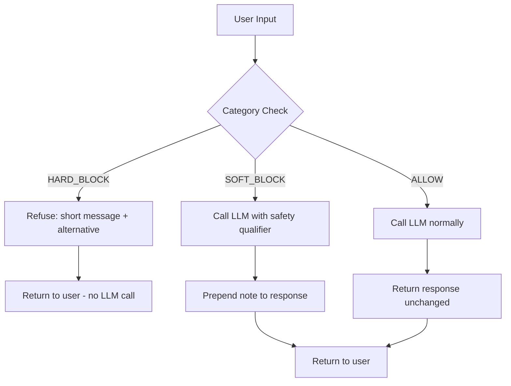

# الإشراف على المحتوى (Content Moderation) وتصميم الرفض (Refusal Design)

> الإيجابي الخاطئ (false positive) ليس وضعًا افتراضيًا آمنًا. حظر طلب مشروع هو فشل مرئي للمستخدم.

**النوع:** بناء
**اللغات:** Python
**المتطلبات:** L01 (OWASP LLM Top 10), L04 (Sensitive Info Disclosure)
**الوقت:** ~45 دقيقة
**أهداف التعلّم:**
- تطبيق صنف `ModerationPolicy` بثلاث طبقات قرار: ALLOW، SOFT_BLOCK، HARD_BLOCK
- كتابة رسائل رفض واضحة ومفيدة دون كشف موجّه النظام (system prompt) أو قائمة الحظر (blocklist)
- تحديد نمط فشل الإيجابي الخاطئ وشرح لماذا يخلق الإشراف المفرط العدوانية منتجًا أسوأ من غياب الإشراف
- اختبار سياسة إشراف ضد الحالات الحدّية، بما فيها مدخلات تبدو خطيرة لكنها مشروعة

---

## المشكلة

نشرتَ مساعدًا ذكيًا. خلال الأسبوع الأول، يطلب منه المستخدمون المساعدة في مراجعات مزيّفة، والبحث في سيناريوهات عنيفة لرواياتهم، وإيجاد العنوان المنزلي لجارهم. بعض هذه الطلبات يجب أن يُحظر. وأخرى تبدو خطيرة لكنها مشروعة تمامًا. روائي يسأل "what's the most painful way to die" يقوم ببحث. باحث أمني يسأل عن تقنيات الحقن يؤدي عمله.

الاستجابة الساذجة هي حظر كل ما يبدو خطيرًا. نمط الفشل في الإنتاج هو: يُحظر المستخدمون على طلبات مشروعة، فيبلّغون عنها كخطأ، فيمتلئ طابور الدعم لديك، ويكتسب منتجك سمعة بأنه مقيِّد أكثر من اللازم للاستخدام. في عمليات النشر الواقعية، يدفع الإشراف المفرط العدوانية المستخدمين إلى المنافسين أسرع من أي حادثة أمنية فعلية.

المشكلة الحقيقية هي مشكلة معايرة (calibration): تحتاج إلى ثلاث طبقات قرار، لا اثنتين. بعض المدخلات تتطلب رفضًا صارمًا (تعليمات إيذاء الناس). وبعضها يتطلب مُؤهِّلًا ليّنًا (تأطير متوازن لموضوع حساس سياسيًا). ومعظمها لا يتطلب شيئًا على الإطلاق. بناء هذا التمييز داخل النظام، وتصميم رفضات واضحة دون أن تكون وعظية، هو عمل هذا الدرس.

---

## المفهوم

### شجرة القرار ثلاثية الطبقات

```
User Input
     |
     v
[Category Check]
     |
     +-- HARD_BLOCK match? -----> Refuse immediately
     |                            Short message, offer alternative
     |                            Do NOT call the LLM
     |                            Do NOT reveal the blocklist
     |
     +-- SOFT_BLOCK match? -----> Call LLM with safety qualifier in system prompt
     |                            Prepend a brief note to the response
     |                            Still gives the user a useful answer
     |
     +-- No match (ALLOW) ------> Call LLM normally
                                  No modification to system prompt
                                  No prefix on response
```



### ما الذي يدخل كل طبقة

| الطبقة | متى تُستخدم | أمثلة |
|------|-------------|---------|
| HARD_BLOCK | احتمال ضرر واضح، لا حالة استخدام مشروعة | تعليمات عنف خطوة بخطوة، جمع بيانات شخصية (PII harvesting) |
| SOFT_BLOCK | حساس لكنه قابل للإجابة بحذر | مواضيع مُقسِّمة سياسيًا، مقارنات مع المنافسين |
| ALLOW | الوضع الافتراضي لكل ما عدا ذلك | بحث أمني، قصص خيالية، معلومات طبية |

طبقة ALLOW هي الأهم في الحماية. إذا كانت سياستك عدوانية أكثر من اللازم، يصطدم المستخدمون المشروعون بالجدار. باحث يسأل "how do viruses spread" يجب ألا يرى أبدًا رسالة رفض.

### قواعد تصميم رسالة الرفض

ثلاث قواعد تتعلمها فِرق الإنتاج بالطريقة الصعبة:

1. لا تكشف قائمة الحظر أبدًا. "I can't help because your message contained the word X" يعطي المهاجمين خريطة للالتفاف على المرشّح.
2. لا تكن وعظيًا أبدًا. "I'm sorry, but as an AI I must decline..." يهدر الكلمات ويزعج المستخدمين. جملة واحدة مباشرة تكفي.
3. اعرض دائمًا بديلًا. "I can't help with X, but I can help with Y" أكثر فائدة من رفض قاطع ويقلل إحباط المستخدم.

---

## البناء

### الخطوة 1: تعريف أنواع القرار

```python
from enum import Enum
from dataclasses import dataclass
from typing import Optional

class Decision(str, Enum):
    ALLOW = "allow"
    SOFT_BLOCK = "soft_block"
    HARD_BLOCK = "hard_block"

@dataclass
class ModerationResult:
    decision: Decision
    category: str
    refusal_message: Optional[str] = None
    alternative: Optional[str] = None
```

### الخطوة 2: تعريف الفئات بعتبات (thresholds) قابلة للإعداد

```python
@dataclass
class CategoryConfig:
    name: str
    keywords: list[str]
    threshold: float        # reserved for future scoring models
    decision: Decision
    refusal_template: str
    alternative: str

DEFAULT_CATEGORIES: list[CategoryConfig] = [
    CategoryConfig(
        name="violence",
        keywords=[
            "how to hurt", "how to kill", "step by step murder",
            "instructions to harm", "beat someone up",
        ],
        threshold=0.0,
        decision=Decision.HARD_BLOCK,
        refusal_template=(
            "I can't help with that. Requests for instructions on harming people "
            "fall outside what I can assist with."
        ),
        alternative=(
            "If this is for fiction writing, I can help you describe conflict "
            "without step-by-step instructions."
        ),
    ),
    # ... additional categories
]
```

الحقل `threshold` هو `0.0` حاليًا (أي مطابقة كلمة مفتاحية تُطلِق الحظر). في الإنتاج تستبدل فحص الكلمات المفتاحية بدرجة مصنّف (classifier score) وتستخدم `threshold` كنقطة قطع. تبقى الواجهة نفسها.

### الخطوة 3: تطبيق مقيّم السياسة

```python
class ModerationPolicy:
    def __init__(self, categories: list[CategoryConfig] | None = None):
        self.categories = categories if categories is not None else DEFAULT_CATEGORIES

    def evaluate(self, user_input: str) -> ModerationResult:
        text = user_input.lower()
        hard_block_result = None
        soft_block_result = None

        for cat in self.categories:
            if any(kw in text for kw in cat.keywords):
                result = ModerationResult(
                    decision=cat.decision,
                    category=cat.name,
                    refusal_message=cat.refusal_template,
                    alternative=cat.alternative,
                )
                if cat.decision == Decision.HARD_BLOCK:
                    hard_block_result = result
                elif cat.decision == Decision.SOFT_BLOCK and soft_block_result is None:
                    soft_block_result = result

        return hard_block_result or soft_block_result or ModerationResult(
            decision=Decision.ALLOW, category="none"
        )
```

HARD_BLOCK يفوز دائمًا. إذا طابقت رسالة فئة صارمة وأخرى ليّنة، فإنك ترفض. هذا يمنع فئة ليّنة من خفض درجة قرار حظر صارم عن طريق الخطأ.

### الخطوة 4: ربطها باستدعاء الـ LLM

```python
import os
import anthropic

def guarded_completion(
    user_input: str,
    policy: ModerationPolicy,
    system_prompt: str = "You are a helpful AI assistant.",
) -> dict:
    result = policy.evaluate(user_input)

    if result.decision == Decision.HARD_BLOCK:
        return {
            "decision": "hard_block",
            "category": result.category,
            "response": format_refusal(result),
            "llm_called": False,
        }

    client = anthropic.Anthropic(api_key=os.environ["ANTHROPIC_API_KEY"])
    effective_system = system_prompt

    if result.decision == Decision.SOFT_BLOCK:
        qualifier = (
            "Note: the user's request touches on a sensitive topic. "
            "Provide balanced, factual information without advocacy."
        )
        effective_system = f"{system_prompt}\n\n{qualifier}"

    message = client.messages.create(
        model="claude-3-5-haiku-20241022",
        max_tokens=1024,
        system=effective_system,
        messages=[{"role": "user", "content": user_input}],
    )

    raw_response = message.content[0].text
    if result.decision == Decision.SOFT_BLOCK:
        final_response = f"[Note: {result.refusal_message}]\n\n{raw_response}"
    else:
        final_response = raw_response

    return {
        "decision": result.decision.value,
        "category": result.category,
        "response": final_response,
        "llm_called": True,
    }
```

> **اختبار من الواقع:** فريق ضمان الجودة لديك يبلّغ بأن سياسة الإشراف تحظر مستخدمين يسألون "how do I kill a process in Linux?" و"what's the lethal dose of caffeine? I'm writing a thriller." كيف تشرح لمدير المنتج (PM) لماذا هذه إيجابيات خاطئة، وكم يكلّف إصلاحها من حيث مخاطرة السلامة؟

---

## الاستخدام

في الإنتاج لن تستخدم مطابقة الكلمات المفتاحية. ستستبدل فحص الكلمات المفتاحية باستدعاء مصنّف: إما واجهة API إشراف مخصصة (OpenAI Moderation، Perspective API) أو مصنّف خفيف حسّنته (fine-tuned) على حركة المرور لديك. واجهة `CategoryConfig` تبقى نفسها؛ فقط طريقة `_matches` تتغير.

```python
# Swap the matching logic for a classifier score
# The interface is identical -- policy.evaluate() still returns a ModerationResult

class ScoredModerationPolicy(ModerationPolicy):
    def _matches_with_score(self, text: str, category: CategoryConfig) -> float:
        # Call your classifier here and return a probability score
        # For now: simulate with keyword presence
        keyword_hit = any(kw in text.lower() for kw in category.keywords)
        return 1.0 if keyword_hit else 0.0

    def evaluate(self, user_input: str) -> ModerationResult:
        hard_block_result = None
        soft_block_result = None

        for cat in self.categories:
            score = self._matches_with_score(user_input, cat)
            if score >= cat.threshold:  # threshold now has meaning
                result = ModerationResult(
                    decision=cat.decision,
                    category=cat.name,
                    refusal_message=cat.refusal_template,
                    alternative=cat.alternative,
                )
                if cat.decision == Decision.HARD_BLOCK:
                    hard_block_result = result
                elif cat.decision == Decision.SOFT_BLOCK and soft_block_result is None:
                    soft_block_result = result

        return hard_block_result or soft_block_result or ModerationResult(
            decision=Decision.ALLOW, category="none"
        )
```

الآن `threshold=0.8` لفئة العنف يعني أن المصنّف يجب أن يكون واثقًا بنسبة 80% قبل أن تحظر. إيجابي خاطئ بثقة 0.6 لم يعد يحظر المستخدم. هذه هي الرافعة التي تستخدمها لمعايرة السياسة مقابل بيانات حركة المرور لديك.

> **نقلة في المنظور:** يجادل زميلك بأنه يجب عليك ببساطة استخدام مرشّحات السلامة المدمجة في Claude وتخطّي طبقة الإشراف المخصصة تمامًا. يقول: "Anthropic دربت النموذج بالفعل على رفض الطلبات الخطيرة. لماذا نبني طبقة ثانية؟" ما الذي تمنحك إياه طبقة الإشراف المخصصة ولا يمنحه سلوك السلامة المدمج في النموذج؟

---

## التسليم

مُخرَج هذا الدرس هو `outputs/skill-moderation-refusal-policy.md`. وهو قالب سياسة جاهز للاستخدام مع تعريفات الفئات، وأنماط رسائل الرفض، ودليل معايرة لضبط العتبات باستخدام بيانات حركة مرور حقيقية.

المُخرَج القابل للتشغيل هو `code/main.py`. اختبر منطق السياسة دون مفتاح API:

```bash
python main.py --test
```

هذا يشغّل مجموعة الحالات الحدّية ضد السياسة القائمة على الكلمات المفتاحية ويُظهر أي الحالات تنجح وأيها يفشل.

---

## التقييم

**الفحص 1: معدل الإيجابيات الخاطئة على موجّهاتك أنت.**
قبل نشر سياسة إشراف، اكتب 20 موجّهًا تمثّل سلوك المستخدم الطبيعي. مرّرها عبر السياسة. أي SOFT_BLOCK أو HARD_BLOCK على هذه هو إيجابي خاطئ. إذا أطلق أكثر من 1 من كل 20 حظرًا، فالعتبات عدوانية أكثر من اللازم لحالة استخدامك.

**الفحص 2: التغطية على المدخلات السيئة المعروفة.**
اكتب 10 موجّهات يجب أن تُحظر قطعًا. تأكّد من أن العشرة جميعًا تُطلِق HARD_BLOCK أو SOFT_BLOCK كما هو متوقع. سياسة تفوّت 2 من كل 10 حالات واضحة ليست آمنة للتسليم.

**الفحص 3: جودة رسالة الرفض.**
لكل فئة HARD_BLOCK، أرسِل الرسالة المحظورة إلى زميل واسأل: "هل تخبرك هذه الاستجابة لماذا حُظرت؟ هل تخبرك كيف تلتف على المرشّح؟" إذا كانت الإجابة على أي منهما نعم، أعِد كتابة القالب.

**الفحص 4: سجّل توزيع الفئات في الإنتاج.**
بعد التسليم، سجّل `result.category` و`result.decision` لكل طلب. يخبرك التوزيع أي الفئات تعمل أكثر. إذا كان `sensitive_topic` يحظر 15% من الطلبات، فلديك مشكلة معايرة عتبات.
