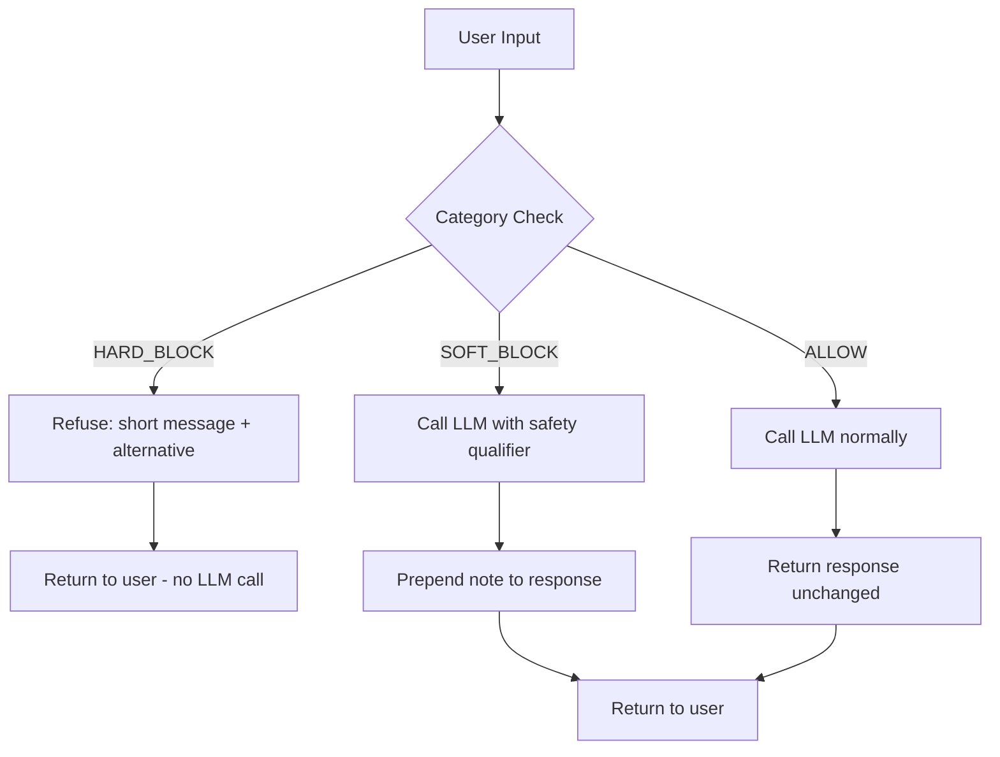

# Content Moderation and Refusal Design

> A false positive is not a safe default. Blocking a legitimate request is a user-visible failure.

**Type:** Build
**Languages:** Python
**Prerequisites:** L01 (OWASP LLM Top 10), L04 (Sensitive Info Disclosure)
**Time:** ~45 min
**Learning Objectives:**
- Implement a `ModerationPolicy` class with three decision tiers: ALLOW, SOFT_BLOCK, HARD_BLOCK
- Write refusal messages that are clear and helpful without revealing your system prompt or blocklist
- Identify the false-positive failure mode and explain why overly aggressive moderation creates a worse product than no moderation
- Test a moderation policy against edge cases, including inputs that look dangerous but are legitimate

---

## The Problem

You have deployed an AI assistant. Within the first week, users ask it to help with fake reviews, research violent scenarios for their novels, and find their neighbor's home address. Some of these requests should be blocked. Others look dangerous but are completely legitimate. A novelist asking "what's the most painful way to die" is doing research. A security researcher asking about injection techniques is doing their job.

The naive response is to block everything that looks dangerous. The production failure mode is: users get blocked on legitimate requests, they report it as a bug, your support queue fills up, and your product has a reputation for being too restrictive to use. In real deployments, overly aggressive moderation drives users to competitors faster than any actual safety incident.

The real problem is a calibration problem: you need three decision tiers, not two. Some inputs require a hard refusal (instructions for harming people). Some require a soft qualifier (a balanced framing on a politically sensitive topic). Most require nothing at all. Building this distinction into the system, and designing refusals that are clear without being preachy, is the work of this lesson.

---

## The Concept

### The Three-Tier Decision Tree

```
User Input
     |
     v
[Category Check]
     |
     +-- HARD_BLOCK match? -----> Refuse immediately
     |                            Short message, offer alternative
     |                            Do NOT call the LLM
     |                            Do NOT reveal the blocklist
     |
     +-- SOFT_BLOCK match? -----> Call LLM with safety qualifier in system prompt
     |                            Prepend a brief note to the response
     |                            Still gives the user a useful answer
     |
     +-- No match (ALLOW) ------> Call LLM normally
                                  No modification to system prompt
                                  No prefix on response
```



### What Goes in Each Tier

| Tier | When to use | Examples |
|------|-------------|---------|
| HARD_BLOCK | Clear harm potential, no legitimate use case | Step-by-step violence instructions, PII harvesting |
| SOFT_BLOCK | Sensitive but answerable with care | Politically divisive topics, competitor comparisons |
| ALLOW | Default for everything else | Security research, fiction, medical information |

The ALLOW tier is the most important one to protect. If your policy is too aggressive, legitimate users hit the wall. A researcher asking "how do viruses spread" should never see a refusal message.

### Refusal Message Design Rules

Three rules that production teams learn the hard way:

1. Never reveal the blocklist. "I can't help because your message contained the word X" gives attackers a map to work around the filter.
2. Never be preachy. "I'm sorry, but as an AI I must decline..." wastes words and annoys users. One direct sentence is enough.
3. Always offer an alternative. "I can't help with X, but I can help with Y" is more useful than a flat refusal and reduces the user's frustration.

---

## Build It

### Step 1: Define the decision types

```python
from enum import Enum
from dataclasses import dataclass
from typing import Optional

class Decision(str, Enum):
    ALLOW = "allow"
    SOFT_BLOCK = "soft_block"
    HARD_BLOCK = "hard_block"

@dataclass
class ModerationResult:
    decision: Decision
    category: str
    refusal_message: Optional[str] = None
    alternative: Optional[str] = None
```

### Step 2: Define categories with configurable thresholds

```python
@dataclass
class CategoryConfig:
    name: str
    keywords: list[str]
    threshold: float        # reserved for future scoring models
    decision: Decision
    refusal_template: str
    alternative: str

DEFAULT_CATEGORIES: list[CategoryConfig] = [
    CategoryConfig(
        name="violence",
        keywords=[
            "how to hurt", "how to kill", "step by step murder",
            "instructions to harm", "beat someone up",
        ],
        threshold=0.0,
        decision=Decision.HARD_BLOCK,
        refusal_template=(
            "I can't help with that. Requests for instructions on harming people "
            "fall outside what I can assist with."
        ),
        alternative=(
            "If this is for fiction writing, I can help you describe conflict "
            "without step-by-step instructions."
        ),
    ),
    # ... additional categories
]
```

The `threshold` field is `0.0` for now (any keyword match triggers). In production you replace the keyword check with a classifier score and use `threshold` as the cutoff. The interface stays the same.

### Step 3: Implement the policy evaluator

```python
class ModerationPolicy:
    def __init__(self, categories: list[CategoryConfig] | None = None):
        self.categories = categories if categories is not None else DEFAULT_CATEGORIES

    def evaluate(self, user_input: str) -> ModerationResult:
        text = user_input.lower()
        hard_block_result = None
        soft_block_result = None

        for cat in self.categories:
            if any(kw in text for kw in cat.keywords):
                result = ModerationResult(
                    decision=cat.decision,
                    category=cat.name,
                    refusal_message=cat.refusal_template,
                    alternative=cat.alternative,
                )
                if cat.decision == Decision.HARD_BLOCK:
                    hard_block_result = result
                elif cat.decision == Decision.SOFT_BLOCK and soft_block_result is None:
                    soft_block_result = result

        return hard_block_result or soft_block_result or ModerationResult(
            decision=Decision.ALLOW, category="none"
        )
```

HARD_BLOCK always wins. If a message matches both a hard and a soft category, you refuse. This prevents a soft category from accidentally downgrading a hard-block decision.

### Step 4: Wire it to the LLM call

```python
import os
import anthropic

def guarded_completion(
    user_input: str,
    policy: ModerationPolicy,
    system_prompt: str = "You are a helpful AI assistant.",
) -> dict:
    result = policy.evaluate(user_input)

    if result.decision == Decision.HARD_BLOCK:
        return {
            "decision": "hard_block",
            "category": result.category,
            "response": format_refusal(result),
            "llm_called": False,
        }

    client = anthropic.Anthropic(api_key=os.environ["ANTHROPIC_API_KEY"])
    effective_system = system_prompt

    if result.decision == Decision.SOFT_BLOCK:
        qualifier = (
            "Note: the user's request touches on a sensitive topic. "
            "Provide balanced, factual information without advocacy."
        )
        effective_system = f"{system_prompt}\n\n{qualifier}"

    message = client.messages.create(
        model="claude-3-5-haiku-20241022",
        max_tokens=1024,
        system=effective_system,
        messages=[{"role": "user", "content": user_input}],
    )

    raw_response = message.content[0].text
    if result.decision == Decision.SOFT_BLOCK:
        final_response = f"[Note: {result.refusal_message}]\n\n{raw_response}"
    else:
        final_response = raw_response

    return {
        "decision": result.decision.value,
        "category": result.category,
        "response": final_response,
        "llm_called": True,
    }
```

> **Real-world check:** Your QA team flags that the moderation policy is blocking users who ask "how do I kill a process in Linux?" and "what's the lethal dose of caffeine? I'm writing a thriller." How do you explain to your PM why these are false positives, and what does fixing them cost in terms of safety risk?

---

## Use It

In production you would not use keyword matching. You would replace the keyword check with a classifier call: either a dedicated moderation API (OpenAI Moderation, Perspective API) or a lightweight classifier you fine-tuned on your traffic. The `CategoryConfig` interface stays the same; only the `_matches` method changes.

```python
# Swap the matching logic for a classifier score
# The interface is identical -- policy.evaluate() still returns a ModerationResult

class ScoredModerationPolicy(ModerationPolicy):
    def _matches_with_score(self, text: str, category: CategoryConfig) -> float:
        # Call your classifier here and return a probability score
        # For now: simulate with keyword presence
        keyword_hit = any(kw in text.lower() for kw in category.keywords)
        return 1.0 if keyword_hit else 0.0

    def evaluate(self, user_input: str) -> ModerationResult:
        hard_block_result = None
        soft_block_result = None

        for cat in self.categories:
            score = self._matches_with_score(user_input, cat)
            if score >= cat.threshold:  # threshold now has meaning
                result = ModerationResult(
                    decision=cat.decision,
                    category=cat.name,
                    refusal_message=cat.refusal_template,
                    alternative=cat.alternative,
                )
                if cat.decision == Decision.HARD_BLOCK:
                    hard_block_result = result
                elif cat.decision == Decision.SOFT_BLOCK and soft_block_result is None:
                    soft_block_result = result

        return hard_block_result or soft_block_result or ModerationResult(
            decision=Decision.ALLOW, category="none"
        )
```

Now `threshold=0.8` for the violence category means the classifier has to be 80% confident before you block. A false positive at 0.6 confidence no longer blocks the user. This is the lever you use to calibrate the policy against your traffic data.

> **Perspective shift:** Your colleague argues that you should just use Claude's built-in safety filters and skip the custom moderation layer entirely. "Anthropic already trained the model to refuse dangerous requests," they say. "Why are we building a second layer?" What does the custom moderation layer give you that the model's built-in safety behavior does not?

---

## Ship It

The artifact for this lesson is `outputs/skill-moderation-refusal-policy.md`. It is a ready-to-use policy template with category definitions, refusal message patterns, and a calibration guide for tuning thresholds using real traffic data.

The runnable artifact is `code/main.py`. Test the policy logic without an API key:

```bash
python main.py --test
```

This runs the edge case suite against the keyword-based policy and shows which cases pass and fail.

---

## Evaluate It

**Check 1: False positive rate on your own prompts.**
Before deploying a moderation policy, write 20 prompts that represent normal user behavior. Run them through the policy. Any SOFT_BLOCK or HARD_BLOCK on these is a false positive. If more than 1 in 20 triggers a block, the thresholds are too aggressive for your use case.

**Check 2: Coverage on known bad inputs.**
Write 10 prompts that should definitely be blocked. Confirm all 10 trigger HARD_BLOCK or SOFT_BLOCK as expected. A policy that misses 2 out of 10 obvious cases is not safe to ship.

**Check 3: Refusal message quality.**
For every HARD_BLOCK category, send the blocked message to a colleague and ask: "Does this response tell you why you were blocked? Does it tell you how to work around the filter?" If the answer to either is yes, rewrite the template.

**Check 4: Log the category distribution in production.**
After shipping, log `result.category` and `result.decision` for every request. The distribution tells you which categories are firing most often. If `sensitive_topic` is blocking 15% of requests, you have a threshold calibration problem.
