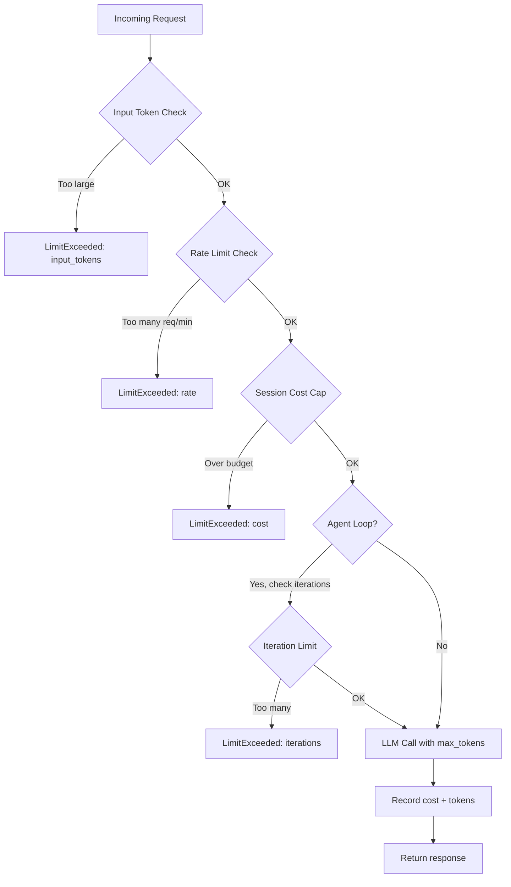

# الاستهلاك غير المحدود (Unbounded Consumption) وهجوم حجب الخدمة عبر التكلفة (Cost-DoS)

> طلب واحد غير محمي يمكن أن يكلّف 50$ ويحجب خيطك (thread) لمدة 5 دقائق. كل نقطة نهاية (endpoint) لـ LLM تحتاج إلى خمسة حدود قبل أن تصبح علنية.

**النوع:** بناء
**اللغات:** Python
**المتطلبات:** L01 (OWASP LLM Top 10), L02 (Prompt Injection)
**الوقت:** ~45 دقيقة
**أهداف التعلّم:**
- تحديد متجهات الهجوم الخمسة لاستنزاف موارد الـ LLM: المدخلات الضخمة، المخرجات اللانهائية، حلقات الوكيل (agent) التكرارية، الدفعات المتوازية، واستنزافات الجلسة
- تطبيق `ConsumptionGuard` يفرض الحدود الخمسة جميعًا ويُرجِع أخطاءً مهيكلة
- دمج `ConsumptionGuard` كطبقة وسيطة (middleware) في خدمة FastAPI
- حساب أثر التكلفة لطلب واحد غير محمي وشرح لماذا يجب أن تكون الحدود الخمسة جميعًا قائمة في آن واحد

---

## المشكلة

تنشر خدمة FastAPI تغلّف LLM. بعد ثلاث ساعات، تُظهر فاتورتك 800$ من الرسوم. السجلّات تُظهر أن مستخدمًا واحدًا أرسل مستندًا بحجم 200,000 رمز (token) مرارًا دون ضبط `max_tokens`. النموذج ولّد 50,000 رمز لكل رد. استغرق الطلب 8 دقائق. لم يستطع أي مستخدم آخر الحصول على ردود خلال تلك المدة.

هذا هو OWASP LLM10: الاستهلاك غير المحدود. وهو ليس مجرد مشكلة تكلفة. إنه متجه حجب خدمة (denial-of-service / DoS). طلب واحد يمكن أن يشغل خيط الاستدلال (inference thread) لديك، أو يستنزف ميزانيتك الشهرية، أو يُطلِق كشف الإساءة لدى مزوّد السحابة لديك ويعلّق حسابك.

توجد خمسة متجهات هجوم، وهي تتراكم. مستخدم خبيث واحد يمكن أن يضرب الخمسة جميعًا في آن واحد: إرسال مدخل ضخم، عدم ضبط حد للمخرَج، إطلاق حلقة وكيل، إطلاق طلبات متوازية، والتكرار عبر جلسات متعددة. دون وجود الحدود الخمسة جميعًا، أيٌّ منها كافٍ لإحداث حادثة إنتاج.

الإصلاح بسيط ومباشر: افحص قبل أن تستدعي. افرض الحدود قبل توليد أول رمز. أرجِع خطأً مهيكلًا، لا استثناءً (exception). سجّل أي حد جرى ضربه لتتمكن من اكتشاف الأنماط.

---

## المفهوم

### نقاط تفتيش حدود الاستهلاك الخمس

```
Incoming Request
      |
      v
[1] Input Token Check
      | Too large? --> Return LimitExceeded(input_tokens)
      |
      v
[2] Rate Limit Check (per user)
      | Too many requests/min? --> Return LimitExceeded(rate)
      |
      v
[3] Session Cost Cap Check
      | Session over budget? --> Return LimitExceeded(cost)
      |
      v
[4] Agent Loop Iteration Check (if inside an agent loop)
      | Too many iterations? --> Return LimitExceeded(iterations)
      |
      v
[5] LLM API Call
      | max_tokens=N enforced --> Output Token Cap
      |
      v
[Record cost, update session state]
      |
      v
Response
```



### لماذا يجب أن تكون الخمسة جميعًا موجودة

| الحد المفقود | متجه الهجوم | الأثر |
|---------------|--------------|--------|
| لا حد لرموز المدخل | إرسال مستند بحجم 500 ألف رمز | تكلفة مدخل 40$، الخيط محجوب 10 دقائق |
| لا max_tokens | النموذج يولّد حتى التوقف الطبيعي | تكلفة مخرَج 200$ لكل طلب |
| لا حد للمعدل | 100 طلب متوازٍ/دقيقة | 4,000$/ساعة، جميع المستخدمين الآخرين محجوبون |
| لا سقف تكلفة | الجلسة تتراكم بصمت إلى 500$ | لا تنبيه حتى وصول الفاتورة |
| لا حد للتكرار | الوكيل يدور حول مهمة غامضة | تكلفة لانهائية، لا يعود أبدًا |

---

## البناء

### الخطوة 1: تعريف أنواع الحدود

```python
from dataclasses import dataclass
from typing import Optional

@dataclass
class LimitExceeded:
    limit_type: str   # "input_tokens" | "output_tokens" | "rate" | "cost" | "iterations"
    value: float      # the value that exceeded the limit
    limit: float      # the configured limit
    message: str      # user-safe message (never reveal internal details)

@dataclass
class GuardResult:
    allowed: bool
    error: Optional[LimitExceeded] = None
```

### الخطوة 2: فحص رموز المدخل

```python
def check_input_tokens(self, user_input: str) -> GuardResult:
    # Estimate without an API call: 1 token ~ 4 characters
    estimated = len(user_input) // 4
    if estimated > self.input_token_limit:
        return GuardResult(
            allowed=False,
            error=LimitExceeded(
                limit_type="input_tokens",
                value=estimated,
                limit=self.input_token_limit,
                message=(
                    f"Your message is too long (estimated {estimated:,} tokens). "
                    f"Please shorten it to under {self.input_token_limit:,} tokens."
                ),
            ),
        )
    return GuardResult(allowed=True)
```

التقدير القائم على عدد الأحرف متحفّظ عن قصد. عدّ الرموز الدقيق يتطلب استدعاء مُجزّئ (tokenizer)، ما يضيف زمن استجابة. لبوابة مدخلات، المبالغة في التقدير بنسبة 20% مقبولة: المستخدمون المشروعون نادرًا ما يرسلون مدخلات قريبة من الحد.

### الخطوة 3: حد المعدل بنافذة منزلقة (sliding window)

```python
import time
from collections import defaultdict

class ConsumptionGuard:
    def __init__(self, ...):
        self._request_timestamps: dict[str, list[float]] = defaultdict(list)

    def check_rate_limit(self, user_id: str) -> GuardResult:
        now = time.time()
        window_start = now - 60.0  # 1-minute sliding window

        timestamps = self._request_timestamps[user_id]
        timestamps[:] = [t for t in timestamps if t >= window_start]

        if len(timestamps) >= self.rate_limit_rpm:
            oldest = timestamps[0]
            retry_after = int(60 - (now - oldest)) + 1
            return GuardResult(
                allowed=False,
                error=LimitExceeded(
                    limit_type="rate",
                    value=len(timestamps),
                    limit=self.rate_limit_rpm,
                    message=f"Rate limit exceeded. Retry in {retry_after} seconds.",
                ),
            )
        timestamps.append(now)
        return GuardResult(allowed=True)
```

النافذة المنزلقة أدق من النافذة الثابتة. مع نافذة ثابتة مدتها دقيقة واحدة، يمكن لمستخدم إرسال 10 طلبات عند الثانية 59 و10 أخرى عند الثانية 61 (أي 20 طلبًا فعليًا في ثانيتين). النافذة المنزلقة تمنع هذه الدفعة.

### الخطوة 4: سقف تكلفة الجلسة

```python
COST_PER_INPUT_TOKEN = 0.80 / 1_000_000
COST_PER_OUTPUT_TOKEN = 4.00 / 1_000_000

def check_session_cost(self, session_id: str) -> GuardResult:
    current_cost = self._session_costs[session_id]
    if current_cost >= self.session_cost_cap:
        return GuardResult(
            allowed=False,
            error=LimitExceeded(
                limit_type="cost",
                value=round(current_cost, 4),
                limit=self.session_cost_cap,
                message=(
                    f"Session cost cap reached (${current_cost:.4f}). "
                    "Please start a new session."
                ),
            ),
        )
    return GuardResult(allowed=True)

def record_cost(self, session_id: str, input_tokens: int, output_tokens: int) -> float:
    call_cost = (
        input_tokens * COST_PER_INPUT_TOKEN +
        output_tokens * COST_PER_OUTPUT_TOKEN
    )
    self._session_costs[session_id] += call_cost
    return call_cost
```

يجب أن يحدث تتبّع التكلفة بعد اكتمال الاستدعاء. فحص سقف التكلفة يحدث قبل الاستدعاء. هذا يعني أن الاستدعاء الأخير يمكن أن يتجاوز السقف قليلًا بمقدار تكلفة استدعاء واحد. هذا مقبول: البديل (فحص التكلفة في منتصف التوليد) غير ممكن مع معظم واجهات الـ API.

### الخطوة 5: حد تكرار حلقة الوكيل (agent loop)

```python
def check_iteration_limit(self, session_id: str) -> GuardResult:
    iterations = self._session_iterations[session_id]
    if iterations >= self.loop_iteration_limit:
        return GuardResult(
            allowed=False,
            error=LimitExceeded(
                limit_type="iterations",
                value=iterations,
                limit=self.loop_iteration_limit,
                message=(
                    f"Agent loop limit reached ({iterations} iterations). "
                    "The task may be too complex or stuck in a loop."
                ),
            ),
        )
    self._session_iterations[session_id] += 1
    return GuardResult(allowed=True)
```

هذا الحد يوقف حلقات الوكيل الجامحة. وكيل يستدعي أدوات، فيحصل على خطأ، ثم يعيد المحاولة إلى ما لا نهاية سيصطدم بهذا الحد بعد `loop_iteration_limit` خطوة. القيمة 10 افتراضي معقول لمعظم المهام؛ الوكلاء المعقدون متعددو الخطوات قد يحتاجون إلى 20-30.

> **اختبار من الواقع:** مستخدم يطلب من مساعد البرمجة الذكي لديك "fix all bugs in this repository" ويرفق قاعدة كود بحجم 50,000 سطر. الوكيل يبدأ الدوران عبر الملفات. دون سقف تكلفة أو حد تكرار، ما أسوأ تكلفة واقعية لجلسة واحدة، بافتراض 4$/مليون رمز مخرَج و200 رمز مولَّد لكل ملف؟

### الخطوة 6: ربط جميع الفحوص في guarded_completion

```python
import anthropic

def guarded_completion(
    user_input: str,
    user_id: str,
    session_id: str,
    guard: ConsumptionGuard,
    system_prompt: str = "You are a helpful AI assistant.",
    is_agent_loop: bool = False,
) -> dict:
    if is_agent_loop:
        iter_result = guard.check_iteration_limit(session_id)
        if not iter_result.allowed:
            return _limit_response(iter_result.error)

    result = guard.check_all(user_input, user_id, session_id)
    if not result.allowed:
        return _limit_response(result.error)

    client = anthropic.Anthropic(api_key=os.environ["ANTHROPIC_API_KEY"])
    message = client.messages.create(
        model="claude-3-5-haiku-20241022",
        max_tokens=guard.max_output_tokens,   # Limit 2 enforced here
        system=system_prompt,
        messages=[{"role": "user", "content": user_input}],
    )

    input_tokens = message.usage.input_tokens
    output_tokens = message.usage.output_tokens
    call_cost = guard.record_cost(session_id, input_tokens, output_tokens)

    return {
        "allowed": True,
        "response": message.content[0].text,
        "cost_usd": round(call_cost, 6),
        "session_cost_usd": round(guard.get_session_cost(session_id), 6),
    }
```

`max_tokens=guard.max_output_tokens` هو السطر الحاسم. هذه هي الطريقة الوحيدة لفرض حد رموز المخرَج. تعليمة موجّه مثل "limit your response to 500 tokens" هي إرشادية فقط وسينتهكها النموذج أحيانًا. معامل الـ API يفرضه خادم النموذج.

---

## الاستخدام

في الإنتاج تدمج `ConsumptionGuard` كطبقة وسيطة (middleware) في FastAPI ليحصل كل مسار (route) على الحماية تلقائيًا:

```python
from fastapi import FastAPI, Request, HTTPException
from fastapi.responses import JSONResponse

app = FastAPI()
guard = ConsumptionGuard(
    input_token_limit=4_000,
    max_output_tokens=1_024,
    rate_limit_rpm=20,
    session_cost_cap=2.00,
    loop_iteration_limit=15,
)

@app.middleware("http")
async def consumption_guard_middleware(request: Request, call_next):
    if request.url.path.startswith("/chat"):
        user_id = request.headers.get("X-User-ID", "anonymous")
        session_id = request.headers.get("X-Session-ID", "default")
        body = await request.body()
        user_input = body.decode()[:50_000]  # Safety truncation for the check itself

        result = guard.check_all(user_input, user_id, session_id)
        if not result.allowed:
            return JSONResponse(
                status_code=429,
                content={
                    "error": result.error.limit_type,
                    "message": result.error.message,
                },
            )
    return await call_next(request)

@app.post("/chat")
async def chat(request: Request):
    body = await request.json()
    user_id = request.headers.get("X-User-ID", "anonymous")
    session_id = request.headers.get("X-Session-ID", "default")
    result = guarded_completion(
        user_input=body["message"],
        user_id=user_id,
        session_id=session_id,
        guard=guard,
    )
    if not result["allowed"]:
        raise HTTPException(status_code=429, detail=result["error"])
    return result
```

لعمليات نشر الإنتاج، استبدل القواميس في الذاكرة (in-memory dictionaries) بـ Redis. الحالة في الذاكرة هي لكل عملية (per-process): إذا شغّلت عاملين (workers)، فلكل عامل عدّاد حد معدل خاص به، ما يضاعف فعليًا حد المعدل الحقيقي. Redis يمنحك حد معدل مشتركًا عبر جميع العمال والعمليات.

> **نقلة في المنظور:** يقول مهندس البنية التحتية لديك إنه يجب التعامل مع هذا على مستوى بوابة الـ API (nginx، Kong، AWS API Gateway) بقواعد حدود حجم الطلب وحدود المعدل. "لماذا نبني هذا في Python بينما البوابة تقوم بحد المعدل أصلًا؟" ما الذي يمنحك إياه `ConsumptionGuard` ولا يمنحه حد المعدل على مستوى البوابة؟

---

## التسليم

مُخرَج هذا الدرس هو `outputs/skill-consumption-limits.md`. وهو قالب إعداد جاهز للاستخدام مع حدود موصى بها حسب حالة الاستخدام (روبوت محادثة للمستهلك، أدوات للمطورين، أداة داخلية) وحاسبة أثر تكلفة.

شغّل العرض التوضيحي لرؤية الحدود الخمسة في الفعل دون إجراء استدعاءات API:

```bash
python main.py --demo
```

---

## التقييم

**الفحص 1: حساب التكلفة لعملية النشر لديك.**
قبل إعداد الحدود، احسب أسوأ تكلفة لطلب واحد غير محمي على نموذجك. الصيغة:

```
input_cost = input_token_limit * cost_per_input_token
output_cost = max_context_window * cost_per_output_token
worst_case_per_request = input_cost + output_cost
```

لـ claude-3-5-haiku بسعر 0.80$/4.00$ لكل مليون مع نافذة سياق 200k:
- المدخل: 200,000 * $0.0000008 = $0.16
- المخرَج: 200,000 * $0.000004 = $0.80
- الإجمالي: $0.96 لكل طلب

دون حدود، 100 طلب متوازٍ = 96$ في دقيقة واحدة.

**الفحص 2: تحقّق من أن الحدود ترفض الهجمات دون أخطاء.**
شغّل سكربت العرض التوضيحي وتأكّد من رفض جميع عمليات محاكاة الهجوم الخمس بنظافة. لا استثناءات، ولا تتبّعات مكدّس (stack traces)، فقط ردود `LimitExceeded` مهيكلة.

**الفحص 3: تحقّق من مرور الطلبات المشروعة.**
مرّر 10 طلبات قصيرة عادية عبر الحارس (guard). يجب أن تُظهر جميعها `allowed: True`. أي إيجابيات خاطئة تعني أن حدودك مقيِّدة أكثر من اللازم لحالة استخدامك.

**الفحص 4: في الذاكرة مقابل Redis.**
إذا شغّلت أكثر من عملية عامل واحدة، اختبر أن حد المعدل مشترك فعلًا. أرسِل 3 طلبات إلى العامل 1 و3 طلبات إلى العامل 2 (المستخدم نفسه). دون Redis، تمر الستة جميعًا. مع Redis، تُحظر الطلبات 4-6.
