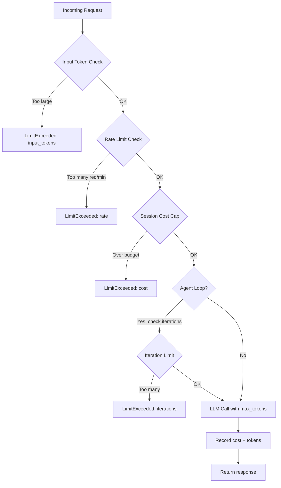

# Unbounded Consumption and Cost-DoS

> A single unguarded request can cost $50 and block your thread for 5 minutes. Every LLM endpoint needs five limits before it goes public.

**Type:** Build
**Languages:** Python
**Prerequisites:** L01 (OWASP LLM Top 10), L02 (Prompt Injection)
**Time:** ~45 min
**Learning Objectives:**
- Identify the five attack vectors for LLM resource exhaustion: massive inputs, infinite outputs, recursive agent loops, parallel bursts, and session drains
- Implement a `ConsumptionGuard` that enforces all five limits and returns structured errors
- Integrate `ConsumptionGuard` as a middleware layer in a FastAPI service
- Calculate the cost impact of a single unguarded request and explain why all five limits must be in place simultaneously

---

## The Problem

You deploy a FastAPI service that wraps an LLM. Three hours later, your bill shows $800 in charges. The logs show one user sent a 200,000-token document repeatedly with no `max_tokens` set. The model generated 50,000 tokens per response. The request took 8 minutes. No other users could get responses during that time.

This is OWASP LLM10: Unbounded Consumption. It is not just a cost problem. It is a denial-of-service vector. A single request can tie up your inference thread, exhaust your monthly budget, or trigger your cloud provider's abuse detection and get your account suspended.

Five attack vectors exist, and they compound. A single malicious user can hit all five simultaneously: send a massive input, set no output limit, trigger an agent loop, fire parallel requests, and repeat across multiple sessions. Without all five limits in place, any one of them is enough to cause a production incident.

The fix is straightforward: check before you call. Enforce limits before the first token is generated. Return a structured error, not an exception. Log which limit was hit so you can detect patterns.

---

## The Concept

### Five Consumption Limit Checkpoints

```
Incoming Request
      |
      v
[1] Input Token Check
      | Too large? --> Return LimitExceeded(input_tokens)
      |
      v
[2] Rate Limit Check (per user)
      | Too many requests/min? --> Return LimitExceeded(rate)
      |
      v
[3] Session Cost Cap Check
      | Session over budget? --> Return LimitExceeded(cost)
      |
      v
[4] Agent Loop Iteration Check (if inside an agent loop)
      | Too many iterations? --> Return LimitExceeded(iterations)
      |
      v
[5] LLM API Call
      | max_tokens=N enforced --> Output Token Cap
      |
      v
[Record cost, update session state]
      |
      v
Response
```



### Why all five must be present

| Missing limit | Attack vector | Impact |
|---------------|--------------|--------|
| No input token limit | 500k-token document sent | $40 input cost, thread blocked 10 min |
| No max_tokens | Model generates until natural stop | $200 output cost per request |
| No rate limit | 100 parallel requests/min | $4,000/hour, all other users blocked |
| No cost cap | Session accumulates $500 quietly | No alert until invoice arrives |
| No iteration limit | Agent loops on ambiguous task | Infinite cost, never returns |

---

## Build It

### Step 1: Define the limit types

```python
from dataclasses import dataclass
from typing import Optional

@dataclass
class LimitExceeded:
    limit_type: str   # "input_tokens" | "output_tokens" | "rate" | "cost" | "iterations"
    value: float      # the value that exceeded the limit
    limit: float      # the configured limit
    message: str      # user-safe message (never reveal internal details)

@dataclass
class GuardResult:
    allowed: bool
    error: Optional[LimitExceeded] = None
```

### Step 2: Input token check

```python
def check_input_tokens(self, user_input: str) -> GuardResult:
    # Estimate without an API call: 1 token ~ 4 characters
    estimated = len(user_input) // 4
    if estimated > self.input_token_limit:
        return GuardResult(
            allowed=False,
            error=LimitExceeded(
                limit_type="input_tokens",
                value=estimated,
                limit=self.input_token_limit,
                message=(
                    f"Your message is too long (estimated {estimated:,} tokens). "
                    f"Please shorten it to under {self.input_token_limit:,} tokens."
                ),
            ),
        )
    return GuardResult(allowed=True)
```

The character-based estimate is intentionally conservative. A precise token count requires a tokenizer call, which adds latency. For an input gate, overestimating by 20% is fine: legitimate users rarely send inputs near the limit.

### Step 3: Rate limit with sliding window

```python
import time
from collections import defaultdict

class ConsumptionGuard:
    def __init__(self, ...):
        self._request_timestamps: dict[str, list[float]] = defaultdict(list)

    def check_rate_limit(self, user_id: str) -> GuardResult:
        now = time.time()
        window_start = now - 60.0  # 1-minute sliding window

        timestamps = self._request_timestamps[user_id]
        timestamps[:] = [t for t in timestamps if t >= window_start]

        if len(timestamps) >= self.rate_limit_rpm:
            oldest = timestamps[0]
            retry_after = int(60 - (now - oldest)) + 1
            return GuardResult(
                allowed=False,
                error=LimitExceeded(
                    limit_type="rate",
                    value=len(timestamps),
                    limit=self.rate_limit_rpm,
                    message=f"Rate limit exceeded. Retry in {retry_after} seconds.",
                ),
            )
        timestamps.append(now)
        return GuardResult(allowed=True)
```

A sliding window is more accurate than a fixed window. With a fixed 1-minute window, a user can send 10 requests at second 59 and 10 more at second 61 (effectively 20 requests in 2 seconds). The sliding window prevents that burst.

### Step 4: Session cost cap

```python
COST_PER_INPUT_TOKEN = 0.80 / 1_000_000
COST_PER_OUTPUT_TOKEN = 4.00 / 1_000_000

def check_session_cost(self, session_id: str) -> GuardResult:
    current_cost = self._session_costs[session_id]
    if current_cost >= self.session_cost_cap:
        return GuardResult(
            allowed=False,
            error=LimitExceeded(
                limit_type="cost",
                value=round(current_cost, 4),
                limit=self.session_cost_cap,
                message=(
                    f"Session cost cap reached (${current_cost:.4f}). "
                    "Please start a new session."
                ),
            ),
        )
    return GuardResult(allowed=True)

def record_cost(self, session_id: str, input_tokens: int, output_tokens: int) -> float:
    call_cost = (
        input_tokens * COST_PER_INPUT_TOKEN +
        output_tokens * COST_PER_OUTPUT_TOKEN
    )
    self._session_costs[session_id] += call_cost
    return call_cost
```

Cost tracking must happen after the call completes. The cost cap check happens before the call. This means the final call can slightly exceed the cap by one call's worth of cost. That is acceptable: the alternative (checking cost mid-generation) is not possible with most APIs.

### Step 5: Agent loop iteration limit

```python
def check_iteration_limit(self, session_id: str) -> GuardResult:
    iterations = self._session_iterations[session_id]
    if iterations >= self.loop_iteration_limit:
        return GuardResult(
            allowed=False,
            error=LimitExceeded(
                limit_type="iterations",
                value=iterations,
                limit=self.loop_iteration_limit,
                message=(
                    f"Agent loop limit reached ({iterations} iterations). "
                    "The task may be too complex or stuck in a loop."
                ),
            ),
        )
    self._session_iterations[session_id] += 1
    return GuardResult(allowed=True)
```

This limit stops runaway agent loops. An agent that calls tools, gets an error, and retries indefinitely will hit this limit after `loop_iteration_limit` steps. 10 is a reasonable default for most tasks; complex multi-step agents may need 20-30.

> **Real-world check:** A user asks your AI coding assistant to "fix all bugs in this repository" and attaches a 50,000-line codebase. The agent starts looping through files. Without a cost cap or iteration limit, what is the realistic worst-case cost for a single session, assuming $4/million output tokens and 200 tokens generated per file?

### Step 6: Wire all checks into guarded_completion

```python
import anthropic

def guarded_completion(
    user_input: str,
    user_id: str,
    session_id: str,
    guard: ConsumptionGuard,
    system_prompt: str = "You are a helpful AI assistant.",
    is_agent_loop: bool = False,
) -> dict:
    if is_agent_loop:
        iter_result = guard.check_iteration_limit(session_id)
        if not iter_result.allowed:
            return _limit_response(iter_result.error)

    result = guard.check_all(user_input, user_id, session_id)
    if not result.allowed:
        return _limit_response(result.error)

    client = anthropic.Anthropic(api_key=os.environ["ANTHROPIC_API_KEY"])
    message = client.messages.create(
        model="claude-3-5-haiku-20241022",
        max_tokens=guard.max_output_tokens,   # Limit 2 enforced here
        system=system_prompt,
        messages=[{"role": "user", "content": user_input}],
    )

    input_tokens = message.usage.input_tokens
    output_tokens = message.usage.output_tokens
    call_cost = guard.record_cost(session_id, input_tokens, output_tokens)

    return {
        "allowed": True,
        "response": message.content[0].text,
        "cost_usd": round(call_cost, 6),
        "session_cost_usd": round(guard.get_session_cost(session_id), 6),
    }
```

`max_tokens=guard.max_output_tokens` is the critical line. This is the only way to enforce the output token limit. A prompt instruction like "limit your response to 500 tokens" is advisory and the model will sometimes violate it. The API parameter is enforced by the model server.

---

## Use It

In production you integrate `ConsumptionGuard` as FastAPI middleware so every route gets protection automatically:

```python
from fastapi import FastAPI, Request, HTTPException
from fastapi.responses import JSONResponse

app = FastAPI()
guard = ConsumptionGuard(
    input_token_limit=4_000,
    max_output_tokens=1_024,
    rate_limit_rpm=20,
    session_cost_cap=2.00,
    loop_iteration_limit=15,
)

@app.middleware("http")
async def consumption_guard_middleware(request: Request, call_next):
    if request.url.path.startswith("/chat"):
        user_id = request.headers.get("X-User-ID", "anonymous")
        session_id = request.headers.get("X-Session-ID", "default")
        body = await request.body()
        user_input = body.decode()[:50_000]  # Safety truncation for the check itself

        result = guard.check_all(user_input, user_id, session_id)
        if not result.allowed:
            return JSONResponse(
                status_code=429,
                content={
                    "error": result.error.limit_type,
                    "message": result.error.message,
                },
            )
    return await call_next(request)

@app.post("/chat")
async def chat(request: Request):
    body = await request.json()
    user_id = request.headers.get("X-User-ID", "anonymous")
    session_id = request.headers.get("X-Session-ID", "default")
    result = guarded_completion(
        user_input=body["message"],
        user_id=user_id,
        session_id=session_id,
        guard=guard,
    )
    if not result["allowed"]:
        raise HTTPException(status_code=429, detail=result["error"])
    return result
```

For production deployments, replace the in-memory dictionaries with Redis. In-memory state is per-process: if you run two workers, each worker has its own rate limit counter, effectively doubling the real rate limit. Redis gives you a shared rate limit across all workers and processes.

> **Perspective shift:** Your infrastructure engineer says you should handle this at the API gateway level (nginx, Kong, AWS API Gateway) with request-size limits and rate limiting rules. "Why build this in Python when the gateway already does rate limiting?" What does the `ConsumptionGuard` give you that gateway-level rate limiting does not?

---

## Ship It

The artifact for this lesson is `outputs/skill-consumption-limits.md`. It is a ready-to-use configuration template with recommended limits by use case (consumer chatbot, developer tools, internal tool) and a cost-impact calculator.

Run the demo to see all five limits in action without making API calls:

```bash
python main.py --demo
```

---

## Evaluate It

**Check 1: Cost calculation for your deployment.**
Before configuring limits, calculate the worst-case cost of a single unguarded request on your model. Formula:

```
input_cost = input_token_limit * cost_per_input_token
output_cost = max_context_window * cost_per_output_token
worst_case_per_request = input_cost + output_cost
```

For claude-3-5-haiku at $0.80/$4.00 per million with a 200k context window:
- Input: 200,000 * $0.0000008 = $0.16
- Output: 200,000 * $0.000004 = $0.80
- Total: $0.96 per request

Without limits, 100 parallel requests = $96 in one minute.

**Check 2: Verify limits reject attacks without errors.**
Run the demo script and confirm all five attack simulations are rejected cleanly. No exceptions, no stack traces, only structured `LimitExceeded` responses.

**Check 3: Verify legitimate requests pass through.**
Run 10 normal short requests through the guard. All should show `allowed: True`. Any false positives mean your limits are too restrictive for your use case.

**Check 4: In-memory vs. Redis.**
If you run more than one worker process, test that the rate limit is actually shared. Send 3 requests to worker 1 and 3 requests to worker 2 (same user). Without Redis, all 6 pass. With Redis, requests 4-6 are blocked.
