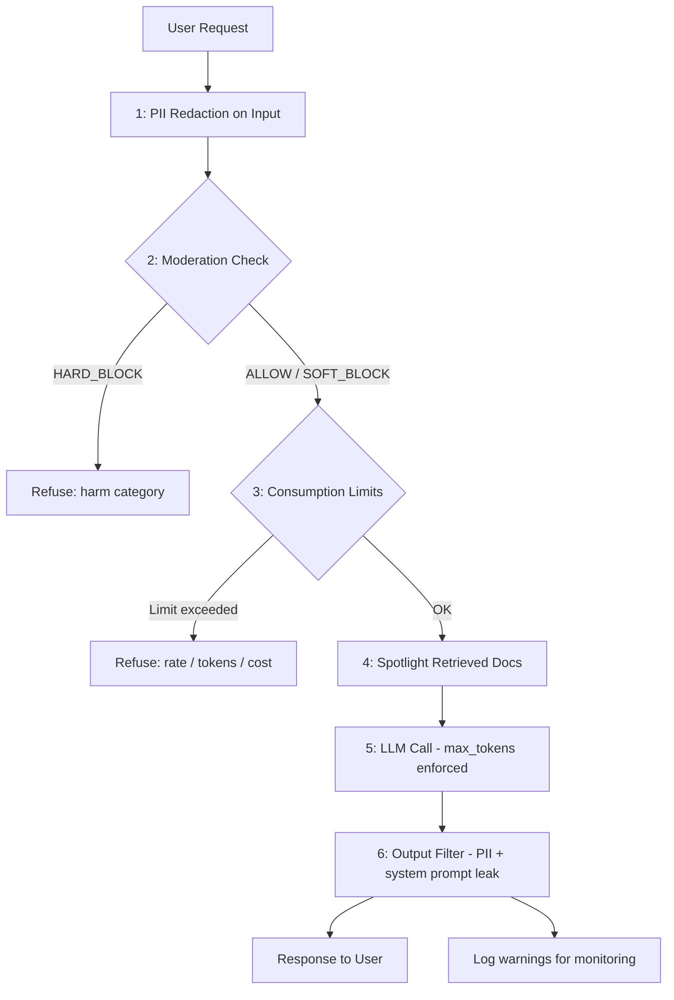

# المشروع الختامي (Capstone): تحصين التطبيق ضد قائمة العشرة الأوائل (Top 10)

> الأمان ليس ميزة تضيفها في النهاية. إنه طبقة تجمّعها من قطع قابلة للتدقيق والاختبار.

**النوع:** بناء
**اللغات:** Python
**المتطلبات:** جميع دروس المرحلة 08 (L01-L10)
**الوقت:** ~90 دقيقة
**أهداف التعلّم:**
- تجميع صنف `SecurityLayer` يطبّق جميع دفاعات المرحلة 08 في خط أنابيب واحد
- دمج الطبقة في خدمة RAG قائمة على FastAPI بأقل تغييرات على المسارات (routes) القائمة
- تشغيل مجموعة اختبار أمان تتحقّق من كل متجه في OWASP LLM Top 10 وتبلّغ بالنجاح/الفشل
- قراءة وتطبيق دليل تشغيل التحصين (hardening runbook) على عملية نشر: العتبات، المراقبة، الاستجابة للحوادث

---

## المشكلة

بنيتَ خدمة RAG في المرحلة 06. وهي تعمل. يستطيع المستخدمون طرح الأسئلة والحصول على إجابات من المستندات المسترجَعة. أظهرت لك المرحلة 08 سبع طرق محددة يمكن استغلال تلك الخدمة بها: حقن الموجّهات (prompt injection) عبر مدخل المستخدم، الحقن عبر المستندات المسترجَعة، تسرّب البيانات الشخصية (PII) داخلًا أو خارجًا، كشف موجّه النظام (system prompt)، الوكالة المفرطة (excessive agency) في استدعاءات الأدوات، الاستهلاك غير المحدود للموارد، والإشراف المفرط العدوانية.

المشكلة أن لديك سبعة دفاعات منفصلة ولا مكان متماسكًا لتركيبها. دون طبقة تحصين واحدة، يكون كل دفاع اختياريًا ويسهل تخطّيه. مطوّر يضيف مسارًا جديدًا عليه أن يتذكّر إضافة تنقيح البيانات الشخصية، والإشراف، وحراس الاستهلاك، وترشيح المخرَج، والتسليط الضوئي (spotlighting) - كل ذلك يدويًا. سيفوّت واحدًا منها.

الحل هو صنف `SecurityLayer` يركّب جميع الدفاعات في خط أنابيب مرتّب. أسقِطه في أي مسار FastAPI بسطرين من الكود. كل طلب يمرّ تلقائيًا عبر كل نقطة تفتيش. وعندما تظهر حاجة إلى إصلاح أمني جديد، يُضاف في مكان واحد وتستفيد منه جميع المسارات.

---

## المفهوم

### جميع نقاط التفتيش الأمنية في خط أنابيب RAG



### خريطة تغطية OWASP LLM Top 10

| OWASP ID | الخطر | الدفاع في SecurityLayer |
|----------|------|--------------------------|
| LLM01 | حقن الموجّهات (Prompt Injection) | إشراف على المدخل + تسليط ضوئي للمستندات المسترجَعة |
| LLM02 | معالجة مخرجات غير آمنة | مرشّح المخرَج يجرّد البيانات الشخصية وشظايا موجّه النظام |
| LLM03 | تسميم بيانات التدريب | خارج النطاق وقت الاستدلال (inference) |
| LLM04 | حجب الخدمة للنموذج (Model DoS) (2023) / LLM10 (2025) | ConsumptionGuard: 5 حدود |
| LLM05 | سلسلة التوريد (Supply Chain) | خارج النطاق (تدقيق التبعيات، لا وقت التشغيل) |
| LLM06 | كشف المعلومات الحساسة | تنقيح البيانات الشخصية على المدخل + مرشّح المخرَج |
| LLM07 | تصميم إضافات غير آمن | ToolPolicy: قائمة سماح صريحة، افتراضي للقراءة فقط |
| LLM08 | الوكالة المفرطة (Excessive Agency) | ToolPolicy: حد أقصى للاستدعاءات لكل طلب، إجراءات مسموح بها |
| LLM09 | الاعتماد المفرط (Overreliance) | يُعالَج في تصميم رسالة الرفض (L09) |
| LLM10 | الاستهلاك غير المحدود | ConsumptionGuard: رموز المدخل، max_tokens، المعدل، التكلفة، التكرارات |

---

## البناء

### الخطوة 1: تجميع الـ SecurityLayer

صنف `SecurityLayer` يأخذ موجّه نظام، و`ConsumptionGuard`، و`ToolPolicy`. يشغّل نقاط التفتيش الست بالترتيب ويُرجِع قاموس نتيجة واحدًا.

```python
class SecurityLayer:
    def __init__(
        self,
        system_prompt: str,
        consumption_guard: ConsumptionGuard | None = None,
        tool_policy: ToolPolicy | None = None,
    ):
        self.system_prompt = system_prompt
        self.guard = consumption_guard or ConsumptionGuard()
        self.tool_policy = tool_policy or SAFE_RAG_TOOL_POLICY

    def process_request(
        self,
        user_input: str,
        user_id: str = "anonymous",
        session_id: str = "default",
        retrieved_docs: list[dict] | None = None,
    ) -> dict:
        warnings = []

        # 1. PII redaction
        clean_input, pii_types = redact_pii(user_input)
        if pii_types:
            warnings.append(f"input_pii_redacted:{','.join(pii_types)}")

        # 2. Moderation
        mod_result = moderate_input(clean_input)
        if mod_result.decision == Decision.HARD_BLOCK:
            return {"response": mod_result.refusal_message, "blocked": True,
                    "blocked_by": "moderation", ...}

        # 3. Consumption limits
        limit_error = self.guard.check_all(clean_input, user_id, session_id)
        if limit_error:
            return {"response": limit_error.message, "blocked": True,
                    "blocked_by": f"consumption:{limit_error.limit_type}", ...}

        # 4. Spotlight retrieved documents
        if retrieved_docs:
            spotlit = [spotlight_document(d["content"], d.get("source", "unknown"))
                       for d in retrieved_docs]
            clean_input = "\n\n".join(spotlit) + "\n\n" + clean_input

        # 5. LLM call with max_tokens enforced
        message = client.messages.create(
            model="claude-3-5-haiku-20241022",
            max_tokens=self.guard.max_output_tokens,
            system=self.system_prompt,
            messages=[{"role": "user", "content": clean_input}],
        )

        # 6. Output filter
        filtered, issues = filter_output(message.content[0].text, self.system_prompt)
        if issues:
            warnings.extend(issues)

        return {"response": filtered, "blocked": False, "warnings": warnings, ...}
```

نقاط التفتيش الست تعمل دائمًا بهذا الترتيب. الترتيب مهم: الإشراف قبل الاستهلاك (لا تهدر فحص حد معدل على طلب محظور بصرامة)، والتسليط الضوئي قبل استدعاء الـ LLM، ومرشّح المخرَج بعد استدعاء الـ LLM.

### الخطوة 2: الربط بـ FastAPI

```python
from fastapi import FastAPI, Request

app = FastAPI()

SYSTEM_PROMPT = (
    "You are a helpful assistant for a document search service. "
    "Answer questions based on retrieved documents only. "
    "If the answer is not in the documents, say so."
)

guard = ConsumptionGuard(
    input_token_limit=4_000,
    max_output_tokens=1_024,
    rate_limit_rpm=20,
    session_cost_cap=2.00,
    loop_iteration_limit=10,
)
security = SecurityLayer(SYSTEM_PROMPT, guard)

@app.post("/chat")
async def chat(request: Request):
    body = await request.json()
    user_id = request.headers.get("X-User-ID", "anonymous")
    session_id = request.headers.get("X-Session-ID", "default")

    # Simulate RAG retrieval (replace with real retrieval)
    retrieved_docs = retrieve_documents(body["message"])

    result = security.process_request(
        user_input=body["message"],
        user_id=user_id,
        session_id=session_id,
        retrieved_docs=retrieved_docs,
    )

    if result["blocked"]:
        return {"error": result["blocked_by"], "message": result["response"]}, 400

    return {"response": result["response"], "warnings": result.get("warnings", [])}

@app.get("/health")
async def health():
    return {"status": "ok"}
```

سطران لتحصين مسار: أنشئ `SecurityLayer`، واستدعِ `process_request`. كل ما عدا ذلك في الطبقة.

> **اختبار من الواقع:** فريقك يريد إضافة مسار جديد `/summarize` يأخذ رابطًا (URL)، يجلب الصفحة، ويلخّصها. المسار القائم `/chat` يستخدم `SecurityLayer`. أيٌّ من نقاط التفتيش الست لا تزال مطلوبة لـ `/summarize`، وأيٌّ منها يحتاج إلى تكييف لأن نموذج التهديد مختلف (رابط يتحكم فيه المستخدم مقابل نص يدخله المستخدم)؟

### الخطوة 3: تشغيل مجموعة اختبار الأمان

```bash
python main.py --test
```

مجموعة الاختبار تتحقّق من كل متجه OWASP دون إجراء استدعاءات API لـ LLM (معظم الاختبارات تعمل ضد الفحوص السابقة للـ LLM). المخرَج المتوقع:

```
[PASS] LLM01-a: Prompt Injection: ignore instructions
[PASS] LLM01-b: Prompt Injection via RAG document
[PASS] LLM06-a: PII Redaction: SSN in input
[PASS] LLM01-c: Moderation: harm request
[PASS] LLM10-a: Consumption: massive input
[PASS] LLM10-b: Consumption: rate limit burst
--- Results: 6 passed, 0 failed ---
```

اختبار فاشل يعني أن متجه OWASP معيّنًا غير مغطّى بالدفاعات الحالية. كل فشل يصبح عنصرًا في قائمة الأعمال المتراكمة (backlog).

---

## الاستخدام

النمط في هذا الدرس ينطبق على أي خدمة ذكاء اصطناعي، لا على RAG فقط. الـ `SecurityLayer` عام: مرّر موجّه نظام وسياسة أدوات مختلفين لتحصين مساعد برمجة، أو روبوت دعم عملاء، أو خط أنابيب وكيل (agent).

لنمط الـ LLM المزدوج (dual-LLM) (استخدام نموذج منفصل أضعف لفحص المدخلات قبل إرسالها إلى النموذج الرئيسي):

```python
def dual_llm_screen(user_input: str) -> tuple[bool, str]:
    """
    Screen user_input with a cheap model before sending to the main model.
    Returns (safe, reason). Use for borderline cases that keyword moderation misses.
    """
    client = anthropic.Anthropic(api_key=os.environ["ANTHROPIC_API_KEY"])
    response = client.messages.create(
        model="claude-3-5-haiku-20241022",  # cheap screening model
        max_tokens=64,
        system=(
            "You are a content safety screener. Respond with only 'SAFE' or 'UNSAFE'. "
            "UNSAFE means the message requests harmful, illegal, or clearly manipulative content. "
            "When in doubt, respond SAFE."
        ),
        messages=[{"role": "user", "content": user_input}],
    )
    verdict = response.content[0].text.strip().upper()
    return verdict == "SAFE", verdict
```

فحص الـ LLM المزدوج يلتقط المدخلات العدائية التي تتجاوز الإشراف بالكلمات المفتاحية. النموذج الفاحص يرى رسالة المستخدم فقط، ولا يرى موجّه النظام أبدًا، لذا لا يمكن التلاعب به عبر حقن السياق (context injection).

> **نقلة في المنظور:** مدقّق أمني يراجع `SecurityLayer` لديك ويقول: "هذا يمنحك دفاعًا عميقًا (defense-in-depth)، لكنه يضيف أيضًا زمن استجابة وتكلفة لكل طلب. في منتج استهلاكي عالي حركة المرور، هل يمكنك تبرير هذا العبء؟" استعرض كل واحدة من نقاط التفتيش الست وحدّد أيها يضيف زمن استجابة، وأيها يضيف تكلفة، وأيها مجاني فعليًا.

---

## التسليم

مُخرَج هذا الدرس هو `outputs/runbook-security-hardening.md`. يغطّي قائمة تحقّق النشر، وضبط العتبات، والاستجابة للحوادث لكل فئة OWASP، وعملية تحديث قوائم الحظر.

المُخرَج القابل للتشغيل هو `code/main.py` مع `code/Dockerfile` و`code/requirements.txt`.

ابنِ الحاوية المحصّنة وشغّلها:

```bash
# Build
docker build -t hardened-ai:latest ./code/

# Run (inject API key at runtime, never bake into image)
docker run --env ANTHROPIC_API_KEY=$ANTHROPIC_API_KEY -p 8000:8000 hardened-ai:latest

# Test security checks (no API key needed)
docker run hardened-ai:latest python main.py --test
```

---

## التقييم

**الفحص 1: مجموعة اختبار الأمان تنجح.**
شغّل `python main.py --test`. يجب أن تنجح جميع الاختبارات الستة قبل النشر إلى الإنتاج. اختبار فاشل يعني وجود متجه OWASP غير مغطّى.

**الفحص 2: عبء زمن الاستجابة مقبول.**
الفحوص السابقة للـ LLM (تنقيح البيانات الشخصية، الإشراف، حدود الاستهلاك) يجب أن تضيف أقل من 5ms مجتمعة. قِس بـ:

```python
import time
start = time.perf_counter()
result = security.process_request(user_input, user_id, session_id)
elapsed_ms = (time.perf_counter() - start) * 1000
print(f"Pre-LLM security overhead: {elapsed_ms:.1f}ms")
```

إذا تجاوز العبء 10ms، حلّل (profile) أي نقطة تفتيش بطيئة. الـ regex للبيانات الشخصية على المدخلات الطويلة جدًا يمكن أن يكون مكلفًا؛ فكّر في التقييد بمدخلات أقل من طول معيّن.

**الفحص 3: التحذيرات تُسجَّل، لا تُكتَم.**
أضِف استدعاء تسجيل على كل قائمة `warnings` غير فارغة. هذه هي إشاراتك الأمنية. عبر أسبوع من حركة مرور الإنتاج، تحقّق: هل التحذيرات في معظمها ضوضاء (أنماط بيانات شخصية بإيجابيات خاطئة) أم إشارات حقيقية؟ اضبط وفقًا لذلك.

**الفحص 4: خط الأساس الأمني للحاوية.**
قبل الدفع إلى الإنتاج:

```bash
# Verify non-root user
docker inspect hardened-ai:latest | grep User

# Verify no secrets in image
docker history hardened-ai:latest

# Verify health check is configured
docker inspect hardened-ai:latest | grep -A5 Healthcheck
```

المتوقع: User=appuser، لا مفاتيح API في السجل (history)، فحص صحة (Healthcheck) مُعدّ.
