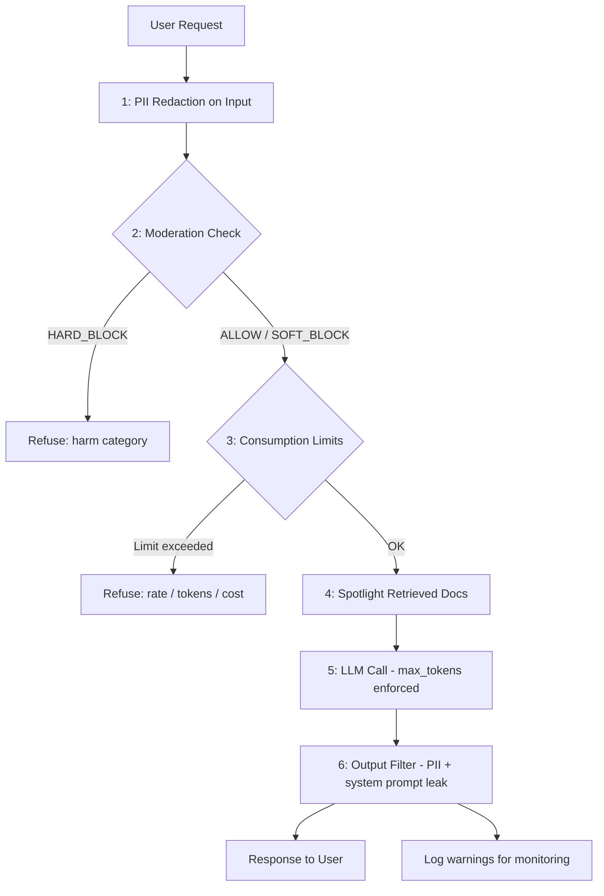

# Capstone: Harden the App Against the Top 10

> Security is not a feature you add at the end. It is a layer you assemble from auditable, testable pieces.

**Type:** Build
**Languages:** Python
**Prerequisites:** All Phase 08 lessons (L01-L10)
**Time:** ~90 min
**Learning Objectives:**
- Assemble a `SecurityLayer` class that applies all Phase 08 defenses in a single pipeline
- Integrate the layer into a FastAPI RAG service with minimal changes to the existing routes
- Run a security test suite that probes each OWASP LLM Top 10 vector and reports pass/fail
- Read and apply the hardening runbook to a deployment: thresholds, monitoring, incident response

---

## The Problem

You have built a RAG service in Phase 06. It works. Users can ask questions and get answers from retrieved documents. Phase 08 showed you seven specific ways that service can be exploited: prompt injection through user input, injection through retrieved documents, PII leaking in or out, system prompt disclosure, excessive agency in tool calls, unbounded resource consumption, and over-aggressive moderation.

The problem is that you have seven separate defenses and no coherent place to compose them. Without a single hardening layer, each defense is optional and easy to skip. A developer adding a new route has to remember to add PII redaction, moderation, consumption guards, output filtering, and spotlighting - all by hand. They will miss one.

The solution is a `SecurityLayer` class that composes all defenses into an ordered pipeline. Drop it into any FastAPI route with two lines of code. Every request automatically passes through every checkpoint. When a new security fix is needed, it gets added in one place and all routes benefit.

---

## The Concept

### All Security Checkpoints in the RAG Pipeline



### OWASP LLM Top 10 Coverage Map

| OWASP ID | Risk | Defense in SecurityLayer |
|----------|------|--------------------------|
| LLM01 | Prompt Injection | Input moderation + spotlighting for retrieved docs |
| LLM02 | Insecure Output Handling | Output filter strips PII and system prompt fragments |
| LLM03 | Training Data Poisoning | Out of scope at inference time |
| LLM04 | Model DoS (2023) / LLM10 (2025) | ConsumptionGuard: 5 limits |
| LLM05 | Supply Chain | Out of scope (dependency audit, not runtime) |
| LLM06 | Sensitive Info Disclosure | PII redaction on input + output filter |
| LLM07 | Insecure Plugin Design | ToolPolicy: explicit allowlist, read-only default |
| LLM08 | Excessive Agency | ToolPolicy: max calls per request, permitted actions |
| LLM09 | Overreliance | Addressed in refusal message design (L09) |
| LLM10 | Unbounded Consumption | ConsumptionGuard: input tokens, max_tokens, rate, cost, iterations |

---

## Build It

### Step 1: Assemble the SecurityLayer

The `SecurityLayer` class takes a system prompt, a `ConsumptionGuard`, and a `ToolPolicy`. It runs all six checkpoints in order and returns a single result dict.

```python
class SecurityLayer:
    def __init__(
        self,
        system_prompt: str,
        consumption_guard: ConsumptionGuard | None = None,
        tool_policy: ToolPolicy | None = None,
    ):
        self.system_prompt = system_prompt
        self.guard = consumption_guard or ConsumptionGuard()
        self.tool_policy = tool_policy or SAFE_RAG_TOOL_POLICY

    def process_request(
        self,
        user_input: str,
        user_id: str = "anonymous",
        session_id: str = "default",
        retrieved_docs: list[dict] | None = None,
    ) -> dict:
        warnings = []

        # 1. PII redaction
        clean_input, pii_types = redact_pii(user_input)
        if pii_types:
            warnings.append(f"input_pii_redacted:{','.join(pii_types)}")

        # 2. Moderation
        mod_result = moderate_input(clean_input)
        if mod_result.decision == Decision.HARD_BLOCK:
            return {"response": mod_result.refusal_message, "blocked": True,
                    "blocked_by": "moderation", ...}

        # 3. Consumption limits
        limit_error = self.guard.check_all(clean_input, user_id, session_id)
        if limit_error:
            return {"response": limit_error.message, "blocked": True,
                    "blocked_by": f"consumption:{limit_error.limit_type}", ...}

        # 4. Spotlight retrieved documents
        if retrieved_docs:
            spotlit = [spotlight_document(d["content"], d.get("source", "unknown"))
                       for d in retrieved_docs]
            clean_input = "\n\n".join(spotlit) + "\n\n" + clean_input

        # 5. LLM call with max_tokens enforced
        message = client.messages.create(
            model="claude-3-5-haiku-20241022",
            max_tokens=self.guard.max_output_tokens,
            system=self.system_prompt,
            messages=[{"role": "user", "content": clean_input}],
        )

        # 6. Output filter
        filtered, issues = filter_output(message.content[0].text, self.system_prompt)
        if issues:
            warnings.extend(issues)

        return {"response": filtered, "blocked": False, "warnings": warnings, ...}
```

The six checkpoints always run in this order. Order matters: moderation before consumption (don't waste a rate-limit check on a hard-blocked request), spotlighting before the LLM call, output filter after the LLM call.

### Step 2: Wire into FastAPI

```python
from fastapi import FastAPI, Request

app = FastAPI()

SYSTEM_PROMPT = (
    "You are a helpful assistant for a document search service. "
    "Answer questions based on retrieved documents only. "
    "If the answer is not in the documents, say so."
)

guard = ConsumptionGuard(
    input_token_limit=4_000,
    max_output_tokens=1_024,
    rate_limit_rpm=20,
    session_cost_cap=2.00,
    loop_iteration_limit=10,
)
security = SecurityLayer(SYSTEM_PROMPT, guard)

@app.post("/chat")
async def chat(request: Request):
    body = await request.json()
    user_id = request.headers.get("X-User-ID", "anonymous")
    session_id = request.headers.get("X-Session-ID", "default")

    # Simulate RAG retrieval (replace with real retrieval)
    retrieved_docs = retrieve_documents(body["message"])

    result = security.process_request(
        user_input=body["message"],
        user_id=user_id,
        session_id=session_id,
        retrieved_docs=retrieved_docs,
    )

    if result["blocked"]:
        return {"error": result["blocked_by"], "message": result["response"]}, 400

    return {"response": result["response"], "warnings": result.get("warnings", [])}

@app.get("/health")
async def health():
    return {"status": "ok"}
```

Two lines to harden a route: create `SecurityLayer`, call `process_request`. Everything else is in the layer.

> **Real-world check:** Your team wants to add a new route `/summarize` that takes a URL, fetches the page, and summarizes it. The existing `/chat` route uses `SecurityLayer`. Which of the six checkpoints are still needed for `/summarize`, and which ones need to be adapted because the threat model is different (user-controlled URL vs user-entered text)?

### Step 3: Run the security test suite

```bash
python main.py --test
```

The test suite probes each OWASP vector without making LLM API calls (most tests run against the pre-LLM checks). Expected output:

```
[PASS] LLM01-a: Prompt Injection: ignore instructions
[PASS] LLM01-b: Prompt Injection via RAG document
[PASS] LLM06-a: PII Redaction: SSN in input
[PASS] LLM01-c: Moderation: harm request
[PASS] LLM10-a: Consumption: massive input
[PASS] LLM10-b: Consumption: rate limit burst
--- Results: 6 passed, 0 failed ---
```

A failed test means a specific OWASP vector is not covered by the current defenses. Each failure becomes a backlog item.

---

## Use It

The pattern in this lesson applies to any AI service, not just RAG. The `SecurityLayer` is generic: pass in a different system prompt and tool policy to harden a code assistant, a customer support bot, or an agent pipeline.

For the dual-LLM pattern (using a separate weaker model to screen inputs before sending to the main model):

```python
def dual_llm_screen(user_input: str) -> tuple[bool, str]:
    """
    Screen user_input with a cheap model before sending to the main model.
    Returns (safe, reason). Use for borderline cases that keyword moderation misses.
    """
    client = anthropic.Anthropic(api_key=os.environ["ANTHROPIC_API_KEY"])
    response = client.messages.create(
        model="claude-3-5-haiku-20241022",  # cheap screening model
        max_tokens=64,
        system=(
            "You are a content safety screener. Respond with only 'SAFE' or 'UNSAFE'. "
            "UNSAFE means the message requests harmful, illegal, or clearly manipulative content. "
            "When in doubt, respond SAFE."
        ),
        messages=[{"role": "user", "content": user_input}],
    )
    verdict = response.content[0].text.strip().upper()
    return verdict == "SAFE", verdict
```

The dual-LLM screen catches adversarial inputs that bypass keyword moderation. The screening model sees only the user message, never the system prompt, so it cannot be manipulated via context injection.

> **Perspective shift:** A security auditor reviews your `SecurityLayer` and says: "This gives you defense-in-depth, but it also adds latency and cost to every request. In a high-traffic consumer product, can you justify the overhead?" Walk through each of the six checkpoints and identify which ones add latency, which add cost, and which ones are essentially free.

---

## Ship It

The artifact for this lesson is `outputs/runbook-security-hardening.md`. It covers deployment checklist, threshold tuning, incident response for each OWASP category, and the process for updating blocklists.

The runnable artifact is `code/main.py` with `code/Dockerfile` and `code/requirements.txt`.

Build and run the hardened container:

```bash
# Build
docker build -t hardened-ai:latest ./code/

# Run (inject API key at runtime, never bake into image)
docker run --env ANTHROPIC_API_KEY=$ANTHROPIC_API_KEY -p 8000:8000 hardened-ai:latest

# Test security checks (no API key needed)
docker run hardened-ai:latest python main.py --test
```

---

## Evaluate It

**Check 1: Security test suite passes.**
Run `python main.py --test`. All 6 probes must pass before deploying to production. A failing test means an OWASP vector is uncovered.

**Check 2: Latency overhead is acceptable.**
The pre-LLM checks (PII redaction, moderation, consumption limits) should add less than 5ms combined. Measure with:

```python
import time
start = time.perf_counter()
result = security.process_request(user_input, user_id, session_id)
elapsed_ms = (time.perf_counter() - start) * 1000
print(f"Pre-LLM security overhead: {elapsed_ms:.1f}ms")
```

If overhead exceeds 10ms, profile which checkpoint is slow. PII regex on very long inputs can be expensive; consider limiting to inputs under a certain length.

**Check 3: Warnings are logged, not silenced.**
Add a logging call on every non-empty `warnings` list. These are your security signals. Over a week of production traffic, check: are warnings mostly noise (false positive PII patterns) or genuine signals? Tune accordingly.

**Check 4: Container security baseline.**
Before pushing to production:

```bash
# Verify non-root user
docker inspect hardened-ai:latest | grep User

# Verify no secrets in image
docker history hardened-ai:latest

# Verify health check is configured
docker inspect hardened-ai:latest | grep -A5 Healthcheck
```

Expected: User=appuser, no API keys in history, Healthcheck configured.
