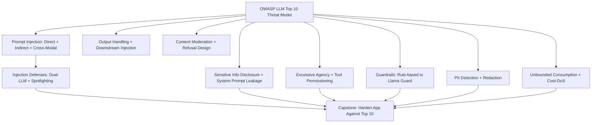

# Phase 08: Security, Safety & Guardrails

11 lessons. ~12 hours. Threat-model your AI app against the OWASP LLM Top 10, then build and layer the defenses that actually work in production.

## The through-line

LLM applications have a new attack surface that traditional web security does not cover: prompt injection via user input and retrieved content, model output used unsafely downstream, excessive agency granted to tools, and unbounded consumption that turns into a cost-DoS. This phase works through each threat systematically and builds reusable defenses.

## What you build

## Lessons

| # | Lesson | Artifact | Time |
|---|--------|----------|------|
| 01 | Threat Model: OWASP LLM Top 10 (2025) | `prompt-llm-threat-model.md` | ~60 min |
| 02 | Prompt Injection: Direct, Indirect, Cross-Modal | `skill-prompt-injection-defense.md` | ~60 min |
| 03 | Injection Defenses: Sandboxing, Allow-Lists, Dual-LLM | `skill-injection-defense-patterns.md` | ~60 min |
| 04 | Sensitive Info Disclosure & System Prompt Leakage | `skill-info-disclosure-defenses.md` | ~45 min |
| 05 | Excessive Agency & Tool Permissioning | `skill-tool-permission-policy.md` | ~45 min |
| 06 | Output Handling & Downstream Injection | `skill-output-safety-pipeline.md` | ~45 min |
| 07 | Guardrails: Raw to Llama Guard / NeMo | `skill-guardrail-pipeline.md` | ~60 min |
| 08 | PII Detection & Redaction | `skill-pii-redactor.md` | ~45 min |
| 09 | Content Moderation & Refusal Design | `skill-moderation-refusal-policy.md` | ~45 min |
| 10 | Unbounded Consumption & Cost-DoS | `skill-consumption-limits.md` | ~45 min |
| 11 | Capstone: Harden the App Against the Top 10 | `runbook-security-hardening.md` | ~90 min |

## Prerequisites

Phase 06 (Shipping) for the FastAPI service being hardened. Phase 04 (Agents) for tool permissioning context.

## Stack

- Python + `anthropic` SDK
- `bleach` for HTML sanitization
- `presidio-analyzer` for PII detection (L08, optional)
- `html`, `sqlite3` from stdlib for safe output handling
- Docker for the capstone
- No external guardrail service required: all patterns use Claude as the classifier
