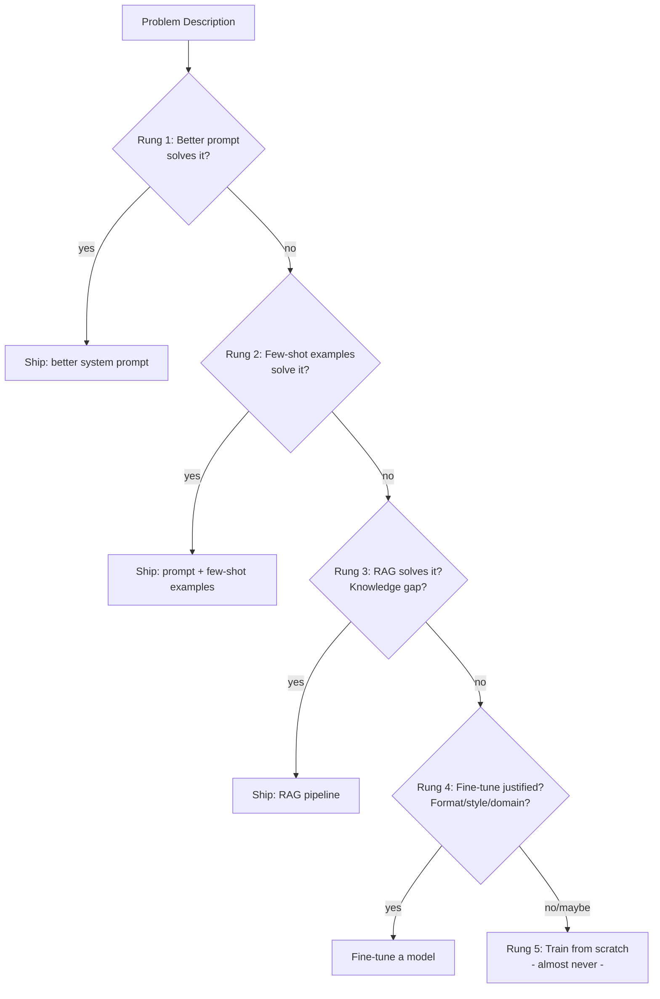

# سلّم القرار: Prompt أم RAG أم Fine-Tune؟

> اختر أرخص أداة تحلّ المشكلة. الـ fine-tuning هو الدرجة الرابعة، وليس الأولى.

**النوع:** تعلّم
**اللغات:** Python
**المتطلبات:** المرحلة 01 (هندسة الـ Prompt والسياق)، المرحلة 02 (الاسترجاع والـ RAG)
**الوقت:** ~45 دقيقة
**المرحلة:** 09 · Fine-Tuning

---

## أهداف التعلّم

- تسمية الدرجات الخمس في سلّم القرار وتكلفة كل درجة ومتطلباتها من البيانات
- شرح لماذا لا يضيف الـ fine-tuning معرفة جديدة للنموذج
- التمييز بين السيناريوهات الثلاثة التي يكون فيها الـ fine-tuning مبرَّرًا والثلاثة التي لا يكون
- بناء أداة CLI تمشّي وصف المشكلة عبر السلّم للوصول إلى توصية
- تطبيق السلّم على ثلاثة سيناريوهات واقعية والدفاع عن المخرجات

---

## المشكلة

فريق يطلق روبوت دعم عملاء مبنيًّا على GPT-4. الإجابات صحيحة تقنيًّا لكنها تبدو آلية وعامة - لا تشبه نبرة العلامة التجارية للشركة. أحدهم يقترح الـ fine-tuning. شخص آخر يقترح مجرد إضافة system prompt. وثالث يقول: فهرس دليل النبرة الداخلي واستخدم RAG. ثلاثة مهندسين معقولين، ثلاث إجابات مختلفة، وعملية fine-tuning بقيمة 20,000 دولار على الطاولة.

هذا القرار يُتّخذ بشكل خاطئ باستمرار. تلجأ الفِرَق إلى الـ fine-tuning بدافع الغريزة لأنه يبدو الحل الأكثر "أصالةً للذكاء الاصطناعي". يقضون أسابيع في بناء مجموعة بيانات، ويدفعون مقابل عملية تدريب، ويطلقون نموذجًا ليس أفضل بشكل قابل للقياس مما كان سيقدّمه system prompt مصمَّم جيدًا.

لهذا القرار إجابة صحيحة في معظم الحالات - إن طبّقته بشكل منهجي. السلّم يمنحك هذا المنهج.

---

## المفهوم

### الدرجات الخمس

```
COST ↑  DATA NEEDED ↑  TIME TO VALUE ↓
|
|  [5] Train from Scratch ..... millions of examples, months, tens of millions of $
|
|  [4] Fine-Tune .............. 100-10k examples, days-weeks, $50-$10k
|
|  [3] RAG .................... documents, hours, $0 extra per query
|
|  [2] Few-Shot Prompting ..... 3-20 examples in context, minutes, $0 extra
|
|  [1] Better System Prompt ... zero examples, minutes, $0 extra
|
COST ↓  DATA NEEDED ↓  TIME TO VALUE ↑
```

ابدأ دائمًا من الدرجة 1. اصعد فقط عندما تفشل الدرجة الحالية بشكل واضح. الانتقال من الدرجة 3 إلى الدرجة 4 يتطلب فشلًا موثَّقًا عند الدرجة 3.



### ما الذي تصلحه كل درجة فعليًّا

| الدرجة | ما الذي تصلحه | ما الذي لا تستطيع إصلاحه |
|------|---------------|--------------------|
| Prompt أفضل | التعليمات غير الواضحة، الشخصية الخاطئة، التنسيق الخاطئ | معرفة لم يتعلّمها النموذج أصلًا |
| Few-shot | تنسيق المخرجات غير المتسق، بنية المهام غير المألوفة | فجوات معرفية كبيرة، مفردات خاصة بمجال معيّن |
| RAG | المعرفة الناقصة، المعرفة القديمة، المعرفة الخاصة | الأسلوب، النبرة، اتساق تنسيق المخرجات |
| Fine-tune | اتساق الأسلوب/النبرة، المفردات المتخصصة، تنسيق المخرجات، خفض الـ latency عبر نموذج أصغر | معرفة يفتقر إليها النموذج الأساسي تمامًا |
| Train from scratch | مجال جديد كليًّا بلا أساس مُدرَّب مسبقًا | تقريبًا لا شيء يحتاجه الممارِس |

### الخط الفاصل بين المعرفة والسلوك

هذا أهم تمييز مفاهيمي في الـ fine-tuning:

- **المعرفة (Knowledge)** = الحقائق، الكيانات، الأحداث، محتوى المجال ("ما هي سياسة الاسترجاع لدينا؟")
- **السلوك (Behavior)** = كيف يعبّر النموذج عن مخرجاته ("أجِب بنبرة علامتنا التجارية، JSON فقط، مصطلحات طبية")

الـ fine-tuning يغيّر السلوك. ولا يضيف معرفة.

إن كان نموذجك الأساسي عاجزًا عن الإجابة على سؤال بالمرّة لأنه يفتقر إلى المعلومة، فإن الـ fine-tuning على 500 مثال للإجابة الصحيحة لن يصلح ذلك. سيتعلّم النموذج توليد نصّ يبدو كإجابات بذلك الأسلوب - وسيهلوس المحتوى. استخدم RAG للفجوات المعرفية. واستخدم الـ fine-tuning للفجوات السلوكية.

### متى يكون الـ Fine-Tuning مبرَّرًا

يستحق الـ fine-tuning تكلفته عندما تتحقق ثلاث نقاط أو أكثر مما يلي:

1. تنسيق مخرجات متسق لا يمكن الوصول إليه بشكل موثوق عبر الـ prompting (مخطط JSON صارم، صيغة كود)
2. مفردات متخصصة يسيء النموذج الأساسي استخدامها باستمرار (طبية، قانونية، خاصة بالملكية)
3. نبرة أو أسلوب يجب الحفاظ عليه عبر آلاف المدخلات المتنوعة
4. متطلب latency يستلزم نموذجًا أصغر (نموذج 7B مُحسَّن عبر fine-tuning يتفوق على نموذج 70B عبر الـ prompting)
5. التكلفة عند الحجم الكبير: نموذج أصغر مُحسَّن عبر fine-tuning أرخص لكل token من نموذج كبير يُستخدم عبر الـ prompting

### متى يكون الـ Fine-Tuning خطأً

توقّف وعُد إلى الدرجة 3 إن تحقق أيٌّ مما يلي:

- تحتاج إلى إضافة حقائق جديدة أو معلومات حديثة (الإجابة هي RAG)
- مجموعة بيانات التدريب لديك أقل من 100 مثال
- لا تستطيع تعريف عقد مدخلات/مخرجات واضح
- يفشل النموذج الأساسي في المهمة تمامًا حتى مع prompting جيد (الـ fine-tuning يضخّم قدرة موجودة؛ ولا يخلق قدرة جديدة)
- لم تجرّب بعدُ الـ few-shot prompting بـ 10 أمثلة أو أكثر

---

## البناء

### أداة DecisionLadder CLI

تأخذ هذه الأداة وصف المشكلة وتمشّي عبر السلّم ذي المستويات الخمسة بأسئلة نعم/لا منظَّمة. وتنتهي إلى توصية مع تعليل.

```python
# code/main.py
# Dependencies: none (stdlib only)
# Usage: python main.py

from __future__ import annotations
import json
import sys
from dataclasses import dataclass, field
from typing import Optional


@dataclass
class LadderQuestion:
    """A single question in the decision ladder."""
    id: str
    text: str
    yes_rung: Optional[str]  # rung to recommend if yes
    yes_label: str           # human label for the yes outcome
    no_continue: bool        # if True, continue to next question on no


LADDER_QUESTIONS: list[LadderQuestion] = [
    LadderQuestion(
        id="q1",
        text=(
            "Does the current system prompt clearly specify the persona, tone, "
            "format, and constraints? Have you tested at least 10 different phrasings "
            "of the instruction?"
        ),
        yes_rung=None,
        yes_label="Prompt engineering is not yet exhausted. Improve the system prompt first.",
        no_continue=True,
    ),
    LadderQuestion(
        id="q2",
        text=(
            "Have you tried adding 5-20 few-shot examples directly in the prompt "
            "that demonstrate the desired input/output pattern?"
        ),
        yes_rung=None,
        yes_label="Few-shot prompting is not yet exhausted. Add examples to the prompt first.",
        no_continue=True,
    ),
    LadderQuestion(
        id="q3",
        text=(
            "Is the problem primarily a KNOWLEDGE gap (missing facts, stale info, "
            "private documents the model was not trained on)? "
            "If yes, RAG is the right tool."
        ),
        yes_rung="RAG",
        yes_label=(
            "Use RAG. Index your knowledge base and retrieve relevant context at query time. "
            "Fine-tuning will not help here because it does not add new knowledge."
        ),
        no_continue=True,
    ),
    LadderQuestion(
        id="q4",
        text=(
            "Is the problem a BEHAVIOR gap: consistent output format, specialized vocabulary, "
            "brand tone, or latency/cost requirements that demand a smaller model? "
            "AND do you have at least 100 high-quality input/output examples?"
        ),
        yes_rung="FINE-TUNE",
        yes_label=(
            "Fine-tuning is justified. Build a curated dataset (see Lesson 02), "
            "start with the managed API (Lesson 03), and evaluate against your baseline (Lesson 05)."
        ),
        no_continue=True,
    ),
    LadderQuestion(
        id="q5",
        text=(
            "Are you building something with no available pretrained foundation - "
            "a completely novel domain with no overlap with any existing model? "
            "(This is extremely rare in practice.)"
        ),
        yes_rung="TRAIN-FROM-SCRATCH",
        yes_label=(
            "Training from scratch may be warranted, but verify that no existing model "
            "covers your domain first. This requires millions of examples, significant compute, "
            "and an ML research team."
        ),
        no_continue=False,
    ),
]


@dataclass
class EvaluationResult:
    """The result of running the decision ladder."""
    recommendation: str
    rung: int
    reasoning: str
    answers: list[dict] = field(default_factory=list)


RUNG_LABELS = {
    "PROMPT": 1,
    "FEW-SHOT": 2,
    "RAG": 3,
    "FINE-TUNE": 4,
    "TRAIN-FROM-SCRATCH": 5,
}


def ask_question(question: LadderQuestion) -> bool:
    """Ask a single ladder question and return True for yes, False for no."""
    print(f"\n{'='*60}")
    print(f"Question: {question.text}")
    print(f"{'='*60}")
    while True:
        answer = input("Answer [y/n]: ").strip().lower()
        if answer in ("y", "yes"):
            return True
        if answer in ("n", "no"):
            return False
        print("Please answer y or n.")


def run_ladder(problem: str) -> EvaluationResult:
    """Walk through the decision ladder and return a recommendation."""
    print(f"\nProblem: {problem}")
    print("\nWorking through the decision ladder from cheapest to most expensive...\n")

    answers = []

    for i, question in enumerate(LADDER_QUESTIONS):
        answered_yes = ask_question(question)
        answers.append({"question_id": question.id, "answer": "yes" if answered_yes else "no"})

        if answered_yes and question.yes_rung:
            # Positive branch: this rung is the recommendation
            rung_num = RUNG_LABELS.get(question.yes_rung, 4)
            return EvaluationResult(
                recommendation=question.yes_rung,
                rung=rung_num,
                reasoning=question.yes_label,
                answers=answers,
            )

        if answered_yes and not question.yes_rung:
            # Not yet exhausted this level - stay here
            return EvaluationResult(
                recommendation="PROMPT" if i == 0 else "FEW-SHOT",
                rung=i + 1,
                reasoning=question.yes_label,
                answers=answers,
            )

        # answered no: continue to next question

    # If we get through all questions with all no answers, default to prompting review
    return EvaluationResult(
        recommendation="REVISIT",
        rung=0,
        reasoning=(
            "Could not determine the right rung. Re-examine whether the problem is clearly "
            "defined. A fuzzy problem statement leads to the wrong tool choice."
        ),
        answers=answers,
    )


def print_result(result: EvaluationResult) -> None:
    """Print the evaluation result in a readable format."""
    print(f"\n{'='*60}")
    print("DECISION LADDER RESULT")
    print(f"{'='*60}")
    print(f"Recommendation: {result.recommendation} (Rung {result.rung})")
    print(f"\nReasoning:\n{result.reasoning}")
    print(f"\nYour answers: {json.dumps(result.answers, indent=2)}")


THREE_SCENARIOS = [
    {
        "name": "Customer tone matching",
        "description": (
            "The support chatbot answers correctly but sounds generic and corporate. "
            "The brand voice should be warm, direct, and human. "
            "We have 200 examples of 'bad' vs 'good' tone responses."
        ),
    },
    {
        "name": "Medical terminology extraction",
        "description": (
            "We need to extract ICD-10 codes from clinical notes. "
            "The base model gets common codes right but misses rare codes "
            "and uses wrong terminology for subspecialty conditions."
        ),
    },
    {
        "name": "FAQ answering",
        "description": (
            "Customers ask questions answered in our 500-page product manual. "
            "The base model makes up answers when it does not know. "
            "We have the manual but have not indexed it anywhere."
        ),
    },
]


def run_demo_scenarios() -> None:
    """Demonstrate the ladder on three canned scenarios without interactive input."""
    print("\nDEMO MODE: Running three scenarios with predetermined answers\n")

    scenario_answers = [
        # Customer tone matching: prompting exhausted, few-shot exhausted, not a knowledge gap, behavior gap with examples
        [False, False, False, True],
        # Medical terminology: prompting exhausted, few-shot exhausted, knowledge + behavior gap - RAG first
        [False, False, True, None],
        # FAQ answering: prompting not exhausted yet (no RAG in place)
        [False, False, True, None],
    ]

    for i, (scenario, answers) in enumerate(zip(THREE_SCENARIOS, scenario_answers)):
        print(f"\n{'#'*60}")
        print(f"Scenario {i+1}: {scenario['name']}")
        print(f"Problem: {scenario['description']}")
        print(f"{'#'*60}")

        # Simulate the ladder with predetermined answers
        result_answers = []
        recommendation = "REVISIT"
        rung = 0
        reasoning = ""

        for j, (question, answer) in enumerate(zip(LADDER_QUESTIONS, answers)):
            if answer is None:
                break
            result_answers.append({"question_id": question.id, "answer": "yes" if answer else "no"})

            if answer and question.yes_rung:
                recommendation = question.yes_rung
                rung = RUNG_LABELS.get(question.yes_rung, 4)
                reasoning = question.yes_label
                break
            if answer and not question.yes_rung:
                recommendation = "PROMPT" if j == 0 else "FEW-SHOT"
                rung = j + 1
                reasoning = question.yes_label
                break

        result = EvaluationResult(
            recommendation=recommendation,
            rung=rung,
            reasoning=reasoning,
            answers=result_answers,
        )
        print_result(result)


if __name__ == "__main__":
    if "--demo" in sys.argv:
        run_demo_scenarios()
    else:
        print("Decision Ladder: Prompt, RAG, or Fine-Tune?")
        print("--------------------------------------------")
        problem = input("Describe your problem in one sentence: ").strip()
        if not problem:
            problem = "Unspecified problem"
        result = run_ladder(problem)
        print_result(result)
```

> **اختبار من الواقع:** يسألك نائب رئيس المنتج: "لدينا منافس قام بوضوح بعمل fine-tuning لنموذجه على بيانات طبية - منتجه يستخدم المصطلحات الصحيحة ومنتجنا لا. لماذا لا نقوم نحن بالـ fine-tuning؟" كيف تشرح أن المقارنة قد تكون مضلِّلة، وما السؤالان اللذان ستطرحهما قبل الموافقة على بدء مشروع fine-tuning؟

---

## الاستخدام

شغّل العرض التوضيحي لرؤية تقييم السيناريوهات الثلاثة جميعها:

```bash
python main.py --demo
```

**السيناريو 1: مطابقة نبرة العميل** - يصل السلّم إلى الدرجة 4 (fine-tune) لأن الـ prompting والـ few-shot جُرِّبا وفشلا، وهي فجوة سلوكية (نبرة)، ولأن 200 مثال منسَّق متوفرة.

**السيناريو 2: استخراج المصطلحات الطبية** - يصل السلّم إلى الدرجة 3 (RAG) أولًا. المصطلحات الطبية هي جزئيًّا فجوة معرفية (رموز نادرة لم يُدرَّب عليها النموذج). الترتيب الصحيح: أضِف فهرس مصطلحات طبية عبر RAG، ثم قيّم ما إذا كان الـ fine-tuning لا يزال لازمًا للفجوة السلوكية المتبقية.

**السيناريو 3: الإجابة على الأسئلة الشائعة** - يصل السلّم إلى الدرجة 3 (RAG) فورًا. عبارة "يختلق النموذج إجابات لأنه لا يعرف" هي فجوة معرفية نموذجية. يجب فهرسة الدليل المؤلَّف من 500 صفحة واسترجاعه. الـ fine-tuning على أزواج الأسئلة الشائعة لن يصلح هذا - سيولّد النموذج بثقة إجابات تبدو معقولة لكنها خاطئة.

> **نقلة في المنظور:** يجادل زميل في الفريق: "الـ fine-tuning يمنحنا نموذجًا مخصَّصًا نملكه - إنه خندق تنافسي. أما RAG فهو مجرد غلاف استرجاع حول نموذج يستطيع أي أحد استخدامه." هل هذه حجة صحيحة للـ fine-tuning، وهل امتلاك fine-tune يشكّل فعلًا خندقًا تنافسيًّا في 2025؟

---

## التسليم

المُخرَج لهذا الدرس هو `outputs/prompt-finetune-decision-guide.md` - دليل منظَّم يمكن لأي مهندس تطبيقه على قرار ميزة ذكاء اصطناعي جديدة دون تشغيل الـ CLI.

شغّل الوضع التفاعلي لتقييم مشكلتك الخاصة:

```bash
python main.py
```

أو شغّل سيناريوهات العرض التوضيحي:

```bash
python main.py --demo
```

دليل القرار هو المُخرَج الدائم. الـ CLI أداة تعلّم تجعل عملية القرار صريحة وتجبرك على الإجابة عن كل سؤال قبل الصعود في السلّم.

---

## التقييم

**الفحص 1: اختبر السلّم مقابل قرارات خاطئة معروفة.**
خذ ثلاث حالات اتخذ فيها فريقك الخيار الخاطئ (قام بالـ fine-tuning بينما كان الـ prompting سيفي، أو استخدم الـ prompting بينما كان الـ fine-tuning مبرَّرًا). مرِّرها عبر السلّم. هل يُخرِج التوصية الصحيحة؟ إن لم يفعل، فالأسئلة تحتاج إلى صقل.

**الفحص 2: تتبّع زمن الوصول إلى القرار.**
ينبغي أن يستغرق تطبيق السلّم على أي مشكلة جديدة أقل من 10 دقائق. إن تجادل فريق حول سؤال لمدة 30 دقيقة، فالسؤال غامض. أعِد صياغته.

**الفحص 3: تحقق من التوصيات مقابل النتائج.**
بعد 60 يومًا، تحقق من عدد الأساليب الموصى بها عبر السلّم التي عُكِست لاحقًا. إطار قرار جيد يكون معدل العكس فيه أقل من 20%. تتبّع هذا عبر فريقك.

**الفحص 4: اختبار حالة حدّية - "لدينا بيانات لذا ينبغي أن نعمل fine-tuning".**
مرِّر هذا السيناريو عبر السلّم: "لدينا 50,000 محادثة مستخدم. نريد نموذجًا يجيب مثل أفضل وكلائنا البشريين." ينبغي أن يلتقط السلّم: هل استُنفِد الـ prompting والـ RAG أولًا؟ هل 50 ألف محادثة هي التنسيق الصحيح للـ fine-tuning (المحادثات الخام ليست أمثلة fine-tuning دون تنسيق)؟
