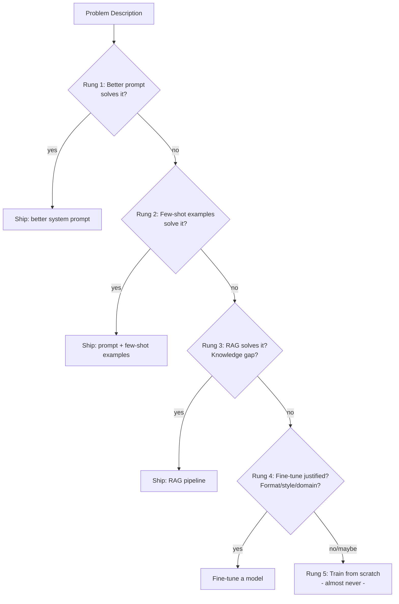

# The Decision Ladder: Prompt, RAG, or Fine-Tune?

> Choose the cheapest tool that solves the problem. Fine-tuning is rung four, not rung one.

**Type:** Learn
**Languages:** Python
**Prerequisites:** Phase 01 (Prompt and Context Engineering), Phase 02 (Retrieval and RAG)
**Time:** ~45 min
**Phase:** 09 · Fine-Tuning

---

## Learning Objectives

- Name the five rungs of the decision ladder and the cost/data requirement of each
- Explain why fine-tuning does not add knowledge to a model
- Distinguish the three scenarios where fine-tuning is justified from the three where it is not
- Build a CLI tool that walks a problem description through the ladder to reach a recommendation
- Apply the ladder to three realistic scenarios and defend the output

---

## The Problem

A team ships a customer support chatbot backed by GPT-4. The answers are technically correct but sound robotic and generic - not like the company's brand voice. Someone suggests fine-tuning. Another person suggests just adding a system prompt. A third says to index the internal tone guide and use RAG. Three reasonable engineers, three different answers, and a $20,000 fine-tuning run on the table.

This decision gets made wrong constantly. Teams reach for fine-tuning out of instinct because it sounds like the most "AI-native" solution. They spend weeks building a dataset, pay for a training run, and ship a model that is not measurably better than a well-crafted system prompt would have been.

The decision has a correct answer in most cases - if you apply it systematically. The ladder gives you that system.

---

## The Concept

### The Five Rungs

```
COST ↑  DATA NEEDED ↑  TIME TO VALUE ↓
|
|  [5] Train from Scratch ..... millions of examples, months, tens of millions of $
|
|  [4] Fine-Tune .............. 100-10k examples, days-weeks, $50-$10k
|
|  [3] RAG .................... documents, hours, $0 extra per query
|
|  [2] Few-Shot Prompting ..... 3-20 examples in context, minutes, $0 extra
|
|  [1] Better System Prompt ... zero examples, minutes, $0 extra
|
COST ↓  DATA NEEDED ↓  TIME TO VALUE ↑
```

Always start at rung 1. Move up only when the current rung demonstrably fails. Moving from rung 3 to rung 4 requires a documented failure at rung 3.



### What Each Rung Actually Fixes

| Rung | What it fixes | What it cannot fix |
|------|---------------|--------------------|
| Better prompt | Unclear instructions, wrong persona, wrong format | Knowledge the model never learned |
| Few-shot | Inconsistent output format, unfamiliar task structure | Large knowledge gaps, domain-specific vocabulary |
| RAG | Missing knowledge, stale knowledge, private knowledge | Style, tone, output format consistency |
| Fine-tune | Consistent style/tone, specialized vocabulary, output format, latency via smaller model | Knowledge the base model lacks entirely |
| Train from scratch | Truly novel domain with no pretrained foundation | Almost nothing a practitioner needs |

### The Knowledge vs. Behavior Line

This is the most important conceptual distinction in fine-tuning:

- **Knowledge** = facts, entities, events, domain content ("What is our refund policy?")
- **Behavior** = how the model expresses output ("Answer in our brand voice, JSON only, medical terminology")

Fine-tuning changes behavior. It does not add knowledge.

If your base model cannot answer a question at all because it lacks the information, fine-tuning on 500 examples of the correct answer will not fix it. The model will learn to generate text that looks like answers in that style - and it will hallucinate the content. Use RAG for knowledge gaps. Use fine-tuning for behavior gaps.

### When Fine-Tuning Is Justified

Fine-tuning earns its cost when three or more of these are true:

1. Consistent output format that cannot be reliably prompted (strict JSON schema, code syntax)
2. Specialized vocabulary that the base model consistently misuses (medical, legal, proprietary)
3. Tone or style that must be maintained across thousands of varied inputs
4. Latency requirement that demands a smaller model (a fine-tuned 7B beats a prompted 70B)
5. Cost at scale: a fine-tuned smaller model is cheaper per token than a large prompted model

### When Fine-Tuning Is a Mistake

Stop and go back to rung 3 if any of these are true:

- You need to add new facts or recent information (RAG is the answer)
- Your training dataset is under 100 examples
- You cannot define a clear input/output contract
- The base model fails on the task entirely even with good prompting (fine-tuning amplifies existing capability; it does not create new capability)
- You have not tried few-shot prompting with 10+ examples yet

---

## Build It

### The DecisionLadder CLI

This CLI takes a problem description and walks through the five-level ladder with structured yes/no questions. It lands on a recommendation with reasoning.

```python
# code/main.py
# Dependencies: none (stdlib only)
# Usage: python main.py

from __future__ import annotations
import json
import sys
from dataclasses import dataclass, field
from typing import Optional


@dataclass
class LadderQuestion:
    """A single question in the decision ladder."""
    id: str
    text: str
    yes_rung: Optional[str]  # rung to recommend if yes
    yes_label: str           # human label for the yes outcome
    no_continue: bool        # if True, continue to next question on no


LADDER_QUESTIONS: list[LadderQuestion] = [
    LadderQuestion(
        id="q1",
        text=(
            "Does the current system prompt clearly specify the persona, tone, "
            "format, and constraints? Have you tested at least 10 different phrasings "
            "of the instruction?"
        ),
        yes_rung=None,
        yes_label="Prompt engineering is not yet exhausted. Improve the system prompt first.",
        no_continue=True,
    ),
    LadderQuestion(
        id="q2",
        text=(
            "Have you tried adding 5-20 few-shot examples directly in the prompt "
            "that demonstrate the desired input/output pattern?"
        ),
        yes_rung=None,
        yes_label="Few-shot prompting is not yet exhausted. Add examples to the prompt first.",
        no_continue=True,
    ),
    LadderQuestion(
        id="q3",
        text=(
            "Is the problem primarily a KNOWLEDGE gap (missing facts, stale info, "
            "private documents the model was not trained on)? "
            "If yes, RAG is the right tool."
        ),
        yes_rung="RAG",
        yes_label=(
            "Use RAG. Index your knowledge base and retrieve relevant context at query time. "
            "Fine-tuning will not help here because it does not add new knowledge."
        ),
        no_continue=True,
    ),
    LadderQuestion(
        id="q4",
        text=(
            "Is the problem a BEHAVIOR gap: consistent output format, specialized vocabulary, "
            "brand tone, or latency/cost requirements that demand a smaller model? "
            "AND do you have at least 100 high-quality input/output examples?"
        ),
        yes_rung="FINE-TUNE",
        yes_label=(
            "Fine-tuning is justified. Build a curated dataset (see Lesson 02), "
            "start with the managed API (Lesson 03), and evaluate against your baseline (Lesson 05)."
        ),
        no_continue=True,
    ),
    LadderQuestion(
        id="q5",
        text=(
            "Are you building something with no available pretrained foundation - "
            "a completely novel domain with no overlap with any existing model? "
            "(This is extremely rare in practice.)"
        ),
        yes_rung="TRAIN-FROM-SCRATCH",
        yes_label=(
            "Training from scratch may be warranted, but verify that no existing model "
            "covers your domain first. This requires millions of examples, significant compute, "
            "and an ML research team."
        ),
        no_continue=False,
    ),
]


@dataclass
class EvaluationResult:
    """The result of running the decision ladder."""
    recommendation: str
    rung: int
    reasoning: str
    answers: list[dict] = field(default_factory=list)


RUNG_LABELS = {
    "PROMPT": 1,
    "FEW-SHOT": 2,
    "RAG": 3,
    "FINE-TUNE": 4,
    "TRAIN-FROM-SCRATCH": 5,
}


def ask_question(question: LadderQuestion) -> bool:
    """Ask a single ladder question and return True for yes, False for no."""
    print(f"\n{'='*60}")
    print(f"Question: {question.text}")
    print(f"{'='*60}")
    while True:
        answer = input("Answer [y/n]: ").strip().lower()
        if answer in ("y", "yes"):
            return True
        if answer in ("n", "no"):
            return False
        print("Please answer y or n.")


def run_ladder(problem: str) -> EvaluationResult:
    """Walk through the decision ladder and return a recommendation."""
    print(f"\nProblem: {problem}")
    print("\nWorking through the decision ladder from cheapest to most expensive...\n")

    answers = []

    for i, question in enumerate(LADDER_QUESTIONS):
        answered_yes = ask_question(question)
        answers.append({"question_id": question.id, "answer": "yes" if answered_yes else "no"})

        if answered_yes and question.yes_rung:
            # Positive branch: this rung is the recommendation
            rung_num = RUNG_LABELS.get(question.yes_rung, 4)
            return EvaluationResult(
                recommendation=question.yes_rung,
                rung=rung_num,
                reasoning=question.yes_label,
                answers=answers,
            )

        if answered_yes and not question.yes_rung:
            # Not yet exhausted this level - stay here
            return EvaluationResult(
                recommendation="PROMPT" if i == 0 else "FEW-SHOT",
                rung=i + 1,
                reasoning=question.yes_label,
                answers=answers,
            )

        # answered no: continue to next question

    # If we get through all questions with all no answers, default to prompting review
    return EvaluationResult(
        recommendation="REVISIT",
        rung=0,
        reasoning=(
            "Could not determine the right rung. Re-examine whether the problem is clearly "
            "defined. A fuzzy problem statement leads to the wrong tool choice."
        ),
        answers=answers,
    )


def print_result(result: EvaluationResult) -> None:
    """Print the evaluation result in a readable format."""
    print(f"\n{'='*60}")
    print("DECISION LADDER RESULT")
    print(f"{'='*60}")
    print(f"Recommendation: {result.recommendation} (Rung {result.rung})")
    print(f"\nReasoning:\n{result.reasoning}")
    print(f"\nYour answers: {json.dumps(result.answers, indent=2)}")


THREE_SCENARIOS = [
    {
        "name": "Customer tone matching",
        "description": (
            "The support chatbot answers correctly but sounds generic and corporate. "
            "The brand voice should be warm, direct, and human. "
            "We have 200 examples of 'bad' vs 'good' tone responses."
        ),
    },
    {
        "name": "Medical terminology extraction",
        "description": (
            "We need to extract ICD-10 codes from clinical notes. "
            "The base model gets common codes right but misses rare codes "
            "and uses wrong terminology for subspecialty conditions."
        ),
    },
    {
        "name": "FAQ answering",
        "description": (
            "Customers ask questions answered in our 500-page product manual. "
            "The base model makes up answers when it does not know. "
            "We have the manual but have not indexed it anywhere."
        ),
    },
]


def run_demo_scenarios() -> None:
    """Demonstrate the ladder on three canned scenarios without interactive input."""
    print("\nDEMO MODE: Running three scenarios with predetermined answers\n")

    scenario_answers = [
        # Customer tone matching: prompting exhausted, few-shot exhausted, not a knowledge gap, behavior gap with examples
        [False, False, False, True],
        # Medical terminology: prompting exhausted, few-shot exhausted, knowledge + behavior gap - RAG first
        [False, False, True, None],
        # FAQ answering: prompting not exhausted yet (no RAG in place)
        [False, False, True, None],
    ]

    for i, (scenario, answers) in enumerate(zip(THREE_SCENARIOS, scenario_answers)):
        print(f"\n{'#'*60}")
        print(f"Scenario {i+1}: {scenario['name']}")
        print(f"Problem: {scenario['description']}")
        print(f"{'#'*60}")

        # Simulate the ladder with predetermined answers
        result_answers = []
        recommendation = "REVISIT"
        rung = 0
        reasoning = ""

        for j, (question, answer) in enumerate(zip(LADDER_QUESTIONS, answers)):
            if answer is None:
                break
            result_answers.append({"question_id": question.id, "answer": "yes" if answer else "no"})

            if answer and question.yes_rung:
                recommendation = question.yes_rung
                rung = RUNG_LABELS.get(question.yes_rung, 4)
                reasoning = question.yes_label
                break
            if answer and not question.yes_rung:
                recommendation = "PROMPT" if j == 0 else "FEW-SHOT"
                rung = j + 1
                reasoning = question.yes_label
                break

        result = EvaluationResult(
            recommendation=recommendation,
            rung=rung,
            reasoning=reasoning,
            answers=result_answers,
        )
        print_result(result)


if __name__ == "__main__":
    if "--demo" in sys.argv:
        run_demo_scenarios()
    else:
        print("Decision Ladder: Prompt, RAG, or Fine-Tune?")
        print("--------------------------------------------")
        problem = input("Describe your problem in one sentence: ").strip()
        if not problem:
            problem = "Unspecified problem"
        result = run_ladder(problem)
        print_result(result)
```

> **Real-world check:** Your VP of Product asks: "We have a competitor that has clearly fine-tuned their model on medical data - their product uses the right terminology and ours doesn't. Why aren't we fine-tuning?" How do you explain that the comparison may be misleading, and what two questions would you ask before agreeing to start a fine-tuning project?

---

## Use It

Run the demo to see all three scenarios evaluated:

```bash
python main.py --demo
```

**Scenario 1: Customer tone matching** - The ladder reaches rung 4 (fine-tune) because prompting and few-shot were tried and failed, it is a behavior gap (tone), and 200 curated examples are available.

**Scenario 2: Medical terminology extraction** - The ladder reaches rung 3 (RAG) first. Medical terminology is partly a knowledge gap (rare codes the model was not trained on). The correct order is: add a medical terminology index via RAG, then evaluate whether fine-tuning is still needed for the residual behavior gap.

**Scenario 3: FAQ answering** - The ladder reaches rung 3 (RAG) immediately. The model "makes up answers because it does not know" is a textbook knowledge gap. The 500-page manual must be indexed and retrieved. Fine-tuning on FAQ pairs will not fix this - the model will confidently generate plausible-sounding answers that are wrong.

> **Perspective shift:** A teammate argues: "Fine-tuning gives us a customized model that we own - it's a moat. RAG is just a retrieval wrapper around a model anyone can use." Is that a valid argument for fine-tuning, and does ownership of a fine-tune actually constitute a competitive moat in 2025?

---

## Ship It

The artifact for this lesson is `outputs/prompt-finetune-decision-guide.md` - a structured guide that any engineer can apply to a new AI feature decision without running the CLI.

Run the interactive mode to evaluate your own problem:

```bash
python main.py
```

Or run the demo scenarios:

```bash
python main.py --demo
```

The decision guide is the durable artifact. The CLI is a learning tool that makes the decision process explicit and forces you to answer each question before moving up the ladder.

---

## Evaluate It

**Check 1: Test the ladder against known wrong decisions.**
Take three cases where your team made the wrong choice (fine-tuned when prompting would have worked, or prompted when fine-tuning was justified). Run them through the ladder. Does it output the correct recommendation? If not, the questions need sharpening.

**Check 2: Track time-to-decision.**
The ladder should take under 10 minutes to apply to any new problem. If a team debates a question for 30 minutes, the question is ambiguous. Rewrite it.

**Check 3: Validate recommendations against outcomes.**
After 60 days, check how many ladder-recommended approaches were later reversed. A good decision framework has a reversal rate under 20%. Track this across your team.

**Check 4: Edge case test - "we have data so we should fine-tune."**
Run this scenario through the ladder: "We have 50,000 user conversations. We want a model that answers like our best human agents." The ladder should catch: are prompting and RAG exhausted first? Is 50k conversations the right format for fine-tuning (raw conversations are not fine-tuning examples without curation)?
