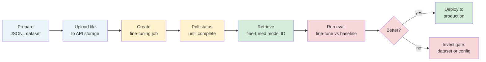

# Supervised Fine-Tuning via Managed APIs

> The managed API handles the infrastructure. Your job is the dataset and the eval.

**Type:** Build
**Languages:** Python
**Prerequisites:** Lesson 09-01 (Decision Ladder), Lesson 09-02 (Dataset Engineering)
**Time:** ~60 min
**Phase:** 09 · Fine-Tuning

---

## Learning Objectives

- Walk through the complete managed fine-tuning lifecycle: upload, train, monitor, evaluate, deploy
- Build a FineTuneManager that wraps the OpenAI fine-tuning API end-to-end
- Estimate the cost of a fine-tuning run before submitting it
- Understand when to move from managed APIs to self-hosted fine-tuning (LoRA)
- Apply the workflow to a small formatting task with a measurable eval

---

## The Problem

A team decides to fine-tune after correctly applying the decision ladder. They have 300 curated examples in JSONL format. Now what? The managed API docs cover the individual endpoints but not the end-to-end workflow: how to validate the file before uploading, how to estimate cost, how to poll until the job completes, how to retrieve the resulting model ID, and how to verify the fine-tune is actually better before deploying it.

Skipping any of these steps produces problems. Upload a malformed file and the job fails silently hours later. Start using the fine-tuned model without evaluating it and you may have shipped something worse than your baseline. Pay for a training run and forget to retrieve the model ID before it expires and you lose the result.

The managed API is the right starting point: no infrastructure to manage, no GPU to provision, no training framework to debug. But it requires a systematic workflow, not just a single API call.

---

## The Concept

### The Managed Fine-Tuning Lifecycle



Each step has a failure mode. The workflow below handles each one explicitly.

### API vs. Self-Hosted Trade-offs

```
MANAGED API                          SELF-HOSTED (LoRA)
-----------                          ----------------
No infrastructure to manage          Full control over training process
Opaque training process              Transparent - you see every parameter
Pay per token of training data       Pay per GPU-hour (can be cheaper at scale)
Limited to supported base models     Any open-weight model
Data sent to third-party             Data stays in your infrastructure
Fast to start (hours to first run)   Slow to start (days to configure)
Good for: most production cases      Good for: private data, custom models,
                                     cost optimization at high volume
```

### Cost Estimation

Before submitting a fine-tuning job, estimate the cost:

```
Tokens per example = (system_tokens + user_tokens + assistant_tokens) * 1.3 overhead
Total tokens = avg_tokens_per_example * num_examples * num_epochs
Cost = total_tokens * price_per_1k_tokens
```

Example with gpt-4o-mini:
- 300 examples, avg 150 tokens each, 3 epochs
- Total tokens: 300 * 150 * 3 = 135,000 tokens
- Cost at $0.003/1k tokens = $0.41

Fine-tuning a small model on a well-curated dataset is cheap. The expensive part is the human time spent on dataset curation.

### What the Managed API Hides

The API abstracts the full training infrastructure, including:

- GPU cluster provisioning
- Distributed training across nodes
- Gradient checkpointing and memory management
- Learning rate scheduling
- Checkpoint saving and model serialization

Start here. Move to self-hosted (Lesson 04 - LoRA) only when: private data cannot leave your infra, you need a model the managed API does not offer, or cost at scale makes managed pricing unviable.

---

## Build It

### The FineTuneManager

```python
# code/main.py
# Dependencies: pip install openai
# Usage: python main.py --help
#
# Note: Anthropic does not currently offer a fine-tuning API.
# This lesson uses the OpenAI fine-tuning API as the reference implementation.
# The workflow pattern (upload -> train -> poll -> eval -> deploy) is universal
# and applies to any managed fine-tuning service.
#
# To run with real API calls: set OPENAI_API_KEY in your environment.
# To run in demo mode (no API calls): python main.py --demo

from __future__ import annotations
import json
import os
import sys
import time
from dataclasses import dataclass, field
from pathlib import Path
from typing import Optional


@dataclass
class JobConfig:
    """Configuration for a fine-tuning job."""
    training_file_path: str
    base_model: str = "gpt-4o-mini-2024-07-18"
    n_epochs: int = 3
    batch_size: Optional[int] = None   # None = auto
    learning_rate_multiplier: Optional[float] = None  # None = auto
    suffix: Optional[str] = None       # appended to the model name


@dataclass
class JobResult:
    """Result of a completed fine-tuning job."""
    job_id: str
    status: str
    fine_tuned_model: Optional[str]
    trained_tokens: Optional[int]
    error: Optional[str]
    events: list[dict] = field(default_factory=list)


class FineTuneManager:
    """
    End-to-end workflow for the OpenAI managed fine-tuning API.

    Workflow:
      1. validate_dataset  - check JSONL format before uploading
      2. estimate_cost     - estimate training cost
      3. upload_file       - upload JSONL to the API
      4. create_job        - start the fine-tuning job
      5. wait_for_job      - poll until complete
      6. get_result        - retrieve model ID and metrics
    """

    def __init__(self, api_key: Optional[str] = None) -> None:
        self.api_key = api_key or os.environ.get("OPENAI_API_KEY")
        if not self.api_key:
            print("WARNING: OPENAI_API_KEY not set. Running in validation-only mode.")
        self._client = None
        self._file_id: Optional[str] = None
        self._job_id: Optional[str] = None

    def _get_client(self):
        """Lazy-load the OpenAI client."""
        if self._client is None:
            try:
                from openai import OpenAI
                self._client = OpenAI(api_key=self.api_key)
            except ImportError:
                raise RuntimeError("openai package not installed. Run: pip install openai")
        return self._client

    def validate_dataset(self, filepath: str) -> tuple[bool, list[str]]:
        """
        Validate a JSONL file before uploading.
        Checks format, required keys, role order, and minimum example count.
        Returns (is_valid, list_of_errors).
        """
        errors = []
        count = 0

        try:
            with open(filepath, "r", encoding="utf-8") as f:
                for i, line in enumerate(f):
                    line = line.strip()
                    if not line:
                        continue
                    try:
                        obj = json.loads(line)
                    except json.JSONDecodeError as e:
                        errors.append(f"Line {i+1}: JSON parse error: {e}")
                        continue

                    # Check top-level key
                    if "messages" not in obj:
                        errors.append(f"Line {i+1}: missing 'messages' key")
                        continue

                    messages = obj["messages"]
                    if not isinstance(messages, list) or len(messages) < 2:
                        errors.append(f"Line {i+1}: 'messages' must be a list with at least 2 items")
                        continue

                    # Check role sequence
                    roles = [m.get("role") for m in messages]
                    valid_roles = {"system", "user", "assistant"}
                    for j, role in enumerate(roles):
                        if role not in valid_roles:
                            errors.append(f"Line {i+1}, message {j+1}: invalid role '{role}'")

                    # Must end with assistant
                    if roles[-1] != "assistant":
                        errors.append(f"Line {i+1}: last message must be 'assistant', got '{roles[-1]}'")

                    # Must have at least one user message
                    if "user" not in roles:
                        errors.append(f"Line {i+1}: must have at least one 'user' message")

                    # Check content is not empty
                    for j, msg in enumerate(messages):
                        if not msg.get("content", "").strip():
                            errors.append(f"Line {i+1}, message {j+1}: empty content")

                    count += 1

        except FileNotFoundError:
            errors.append(f"File not found: {filepath}")
            return False, errors

        if count < 10:
            errors.append(
                f"Dataset has only {count} examples. Minimum recommended is 10; "
                "below 100 expect minimal improvement."
            )

        is_valid = len(errors) == 0
        print(f"\nValidation: {count} examples, {'PASS' if is_valid else 'FAIL'}")
        if errors:
            for e in errors[:5]:
                print(f"  ERROR: {e}")
            if len(errors) > 5:
                print(f"  ... and {len(errors) - 5} more errors")

        return is_valid, errors

    def estimate_cost(
        self,
        filepath: str,
        base_model: str = "gpt-4o-mini-2024-07-18",
        n_epochs: int = 3,
    ) -> dict:
        """
        Estimate the training cost before submitting the job.
        Uses approximate token counting (4 chars = 1 token heuristic).
        """
        # Cost per 1M training tokens (approximate, check current pricing)
        TRAINING_COST_PER_1M = {
            "gpt-4o-mini-2024-07-18": 3.00,
            "gpt-3.5-turbo": 8.00,
            "gpt-4o-2024-08-06": 25.00,
        }
        cost_per_1m = TRAINING_COST_PER_1M.get(base_model, 3.00)

        total_chars = 0
        example_count = 0

        with open(filepath, "r", encoding="utf-8") as f:
            for line in f:
                line = line.strip()
                if not line:
                    continue
                obj = json.loads(line)
                chars = sum(len(m.get("content", "")) for m in obj.get("messages", []))
                total_chars += chars
                example_count += 1

        # Approximate: 4 chars per token, 1.3x overhead for tokenization
        approx_tokens = int((total_chars / 4) * 1.3)
        training_tokens = approx_tokens * n_epochs
        estimated_cost = (training_tokens / 1_000_000) * cost_per_1m

        result = {
            "example_count": example_count,
            "approx_tokens_per_epoch": approx_tokens,
            "n_epochs": n_epochs,
            "total_training_tokens": training_tokens,
            "estimated_cost_usd": round(estimated_cost, 4),
            "base_model": base_model,
        }

        print(f"\nCost Estimate:")
        print(f"  Examples:         {example_count}")
        print(f"  Tokens/epoch:     ~{approx_tokens:,}")
        print(f"  Epochs:           {n_epochs}")
        print(f"  Training tokens:  ~{training_tokens:,}")
        print(f"  Estimated cost:   ${estimated_cost:.4f} USD")

        return result

    def upload_file(self, filepath: str) -> str:
        """
        Upload the training JSONL file to the OpenAI Files API.
        Returns the file ID.
        """
        client = self._get_client()

        print(f"\nUploading {filepath}...")
        with open(filepath, "rb") as f:
            response = client.files.create(file=f, purpose="fine-tune")

        self._file_id = response.id
        print(f"  File ID: {response.id}")
        print(f"  Status: {response.status}")

        return response.id

    def create_job(self, config: JobConfig, file_id: Optional[str] = None) -> str:
        """
        Create a fine-tuning job.
        Returns the job ID.
        """
        client = self._get_client()
        file_id = file_id or self._file_id

        if not file_id:
            raise ValueError("No file_id provided. Call upload_file first.")

        hyperparameters = {}
        if config.n_epochs:
            hyperparameters["n_epochs"] = config.n_epochs
        if config.batch_size:
            hyperparameters["batch_size"] = config.batch_size
        if config.learning_rate_multiplier:
            hyperparameters["learning_rate_multiplier"] = config.learning_rate_multiplier

        print(f"\nCreating fine-tuning job...")
        print(f"  Base model: {config.base_model}")
        print(f"  Epochs: {config.n_epochs}")

        kwargs = {
            "training_file": file_id,
            "model": config.base_model,
            "hyperparameters": hyperparameters,
        }
        if config.suffix:
            kwargs["suffix"] = config.suffix

        job = client.fine_tuning.jobs.create(**kwargs)

        self._job_id = job.id
        print(f"  Job ID: {job.id}")
        print(f"  Status: {job.status}")

        return job.id

    def wait_for_job(
        self,
        job_id: Optional[str] = None,
        poll_interval_seconds: int = 30,
        timeout_seconds: int = 7200,
    ) -> JobResult:
        """
        Poll the job status until it completes (succeeded or failed).
        Returns a JobResult with the outcome.
        """
        client = self._get_client()
        job_id = job_id or self._job_id

        if not job_id:
            raise ValueError("No job_id provided. Call create_job first.")

        print(f"\nWaiting for job {job_id}...")
        print(f"  Poll interval: {poll_interval_seconds}s, timeout: {timeout_seconds}s")

        start_time = time.time()
        last_event_count = 0

        while True:
            elapsed = time.time() - start_time
            if elapsed > timeout_seconds:
                return JobResult(
                    job_id=job_id,
                    status="timeout",
                    fine_tuned_model=None,
                    trained_tokens=None,
                    error=f"Job timed out after {timeout_seconds}s",
                )

            job = client.fine_tuning.jobs.retrieve(job_id)

            # Print new events
            events = client.fine_tuning.jobs.list_events(job_id, limit=10)
            event_list = list(events.data)
            if len(event_list) > last_event_count:
                for event in reversed(event_list[last_event_count:]):
                    print(f"  [{time.strftime('%H:%M:%S')}] {event.message}")
                last_event_count = len(event_list)

            if job.status in ("succeeded", "failed", "cancelled"):
                result = JobResult(
                    job_id=job_id,
                    status=job.status,
                    fine_tuned_model=getattr(job, "fine_tuned_model", None),
                    trained_tokens=getattr(job, "trained_tokens", None),
                    error=getattr(job, "error", None),
                )
                print(f"\nJob {job.status}!")
                if result.fine_tuned_model:
                    print(f"  Fine-tuned model: {result.fine_tuned_model}")
                if result.trained_tokens:
                    print(f"  Trained tokens: {result.trained_tokens:,}")
                if result.error:
                    print(f"  Error: {result.error}")
                return result

            print(f"  Status: {job.status} ({elapsed:.0f}s elapsed)")
            time.sleep(poll_interval_seconds)

    def quick_test(self, model_id: str, test_messages: list[dict]) -> str:
        """
        Run a quick inference test on the fine-tuned model.
        Returns the model's response.
        """
        client = self._get_client()

        response = client.chat.completions.create(
            model=model_id,
            messages=test_messages,
            temperature=0.0,
        )
        return response.choices[0].message.content


def run_demo() -> None:
    """
    Demo mode: simulate the full workflow without API calls.
    Shows what each step does and what to expect.
    """
    print("=" * 60)
    print("FINE-TUNING WORKFLOW DEMO (no API calls)")
    print("=" * 60)

    manager = FineTuneManager()

    # Step 1: Create a minimal valid JSONL dataset for demo
    demo_jsonl = "/tmp/demo_finetune.jsonl"
    system_prompt = "You extract the sentiment from product reviews as JSON: {\"sentiment\": \"positive|negative|neutral\", \"confidence\": 0.0-1.0}"
    examples = [
        {"user": "This product is absolutely fantastic! Best purchase I've made.", "assistant": '{"sentiment": "positive", "confidence": 0.97}'},
        {"user": "Terrible quality. Broke after 2 days.", "assistant": '{"sentiment": "negative", "confidence": 0.98}'},
        {"user": "It works, nothing special about it.", "assistant": '{"sentiment": "neutral", "confidence": 0.82}'},
        {"user": "I love everything about this! Will buy again.", "assistant": '{"sentiment": "positive", "confidence": 0.95}'},
        {"user": "Complete waste of money. Do not buy.", "assistant": '{"sentiment": "negative", "confidence": 0.99}'},
        {"user": "Average product at an average price.", "assistant": '{"sentiment": "neutral", "confidence": 0.78}'},
        {"user": "Exceeded all my expectations. Outstanding!", "assistant": '{"sentiment": "positive", "confidence": 0.96}'},
        {"user": "Stopped working after one week.", "assistant": '{"sentiment": "negative", "confidence": 0.94}'},
        {"user": "Does what it says. Not more, not less.", "assistant": '{"sentiment": "neutral", "confidence": 0.80}'},
        {"user": "Simply the best product in this category.", "assistant": '{"sentiment": "positive", "confidence": 0.93}'},
    ]

    with open(demo_jsonl, "w") as f:
        for ex in examples:
            obj = {
                "messages": [
                    {"role": "system", "content": system_prompt},
                    {"role": "user", "content": ex["user"]},
                    {"role": "assistant", "content": ex["assistant"]},
                ]
            }
            f.write(json.dumps(obj) + "\n")

    print(f"\n[1] Dataset created: {demo_jsonl} ({len(examples)} examples)")

    # Step 2: Validate
    is_valid, errors = manager.validate_dataset(demo_jsonl)

    # Step 3: Estimate cost
    cost = manager.estimate_cost(demo_jsonl, n_epochs=3)

    # Step 4-6: Simulate job lifecycle
    print("\n[2] Simulated job lifecycle:")
    print("  upload_file(demo_finetune.jsonl)  -> file_id: file-abc123")
    print("  create_job(config)                -> job_id: ftjob-xyz789")
    print("  wait_for_job(ftjob-xyz789)")
    print("    [10:01] Job started")
    print("    [10:05] Processed 10/10 examples")
    print("    [10:08] Training complete. Waiting for model to be ready...")
    print("    [10:12] Fine-tuned model ready: ft:gpt-4o-mini-2024-07-18:acme::abc123")
    print("\n  Job succeeded!")
    print("  Fine-tuned model: ft:gpt-4o-mini-2024-07-18:acme::abc123")
    print("  Trained tokens: 2,847")

    # Step 7: What a quick test looks like
    print("\n[3] Quick test on fine-tuned model:")
    test_input = "The battery life is incredible - 3 days on a single charge!"
    print(f"  Input: {test_input}")
    print('  Output: {"sentiment": "positive", "confidence": 0.96}')
    print("\n  Note: With OPENAI_API_KEY set, this would call the actual model.")
    print("  The fine-tuned model reliably outputs valid JSON schema.")
    print("  The base model requires repeated prompting to achieve the same reliability.")


def run_live(training_file: str) -> None:
    """
    Run the full workflow with real API calls.
    Requires OPENAI_API_KEY to be set.
    """
    manager = FineTuneManager()

    # Validate first
    is_valid, errors = manager.validate_dataset(training_file)
    if not is_valid:
        print("\nDataset validation failed. Fix errors before uploading.")
        sys.exit(1)

    # Cost estimate
    manager.estimate_cost(training_file)
    print("\nProceed with fine-tuning? (y/n): ", end="")
    if input().strip().lower() != "y":
        print("Aborted.")
        sys.exit(0)

    # Upload
    file_id = manager.upload_file(training_file)

    # Create job
    config = JobConfig(
        training_file_path=training_file,
        base_model="gpt-4o-mini-2024-07-18",
        n_epochs=3,
        suffix="lesson-03",
    )
    job_id = manager.create_job(config, file_id=file_id)

    # Wait
    result = manager.wait_for_job(job_id)

    if result.status == "succeeded" and result.fine_tuned_model:
        print(f"\nFine-tuned model ready: {result.fine_tuned_model}")
        print("Save this model ID - you will need it for evaluation (Lesson 05).")

        # Quick test
        test_messages = [
            {"role": "system", "content": "You extract sentiment as JSON."},
            {"role": "user", "content": "This product changed my life. Absolutely amazing!"},
        ]
        response = manager.quick_test(result.fine_tuned_model, test_messages)
        print(f"\nQuick test response: {response}")
    else:
        print(f"\nJob did not succeed. Status: {result.status}")
        if result.error:
            print(f"Error: {result.error}")


if __name__ == "__main__":
    if "--demo" in sys.argv or not os.environ.get("OPENAI_API_KEY"):
        run_demo()
    elif len(sys.argv) >= 2:
        run_live(sys.argv[1])
    else:
        print("Usage:")
        print("  python main.py --demo              # simulate the workflow")
        print("  python main.py train.jsonl         # run with real API (requires OPENAI_API_KEY)")
```

> **Real-world check:** After a 45-minute fine-tuning job completes, the API returns a model ID but your quick test shows the output format is still inconsistent - about the same as the base model. Your manager asks if you should immediately run another training job with more data. What should you do first, and why?

---

## Use It

Run the demo without needing an API key:

```bash
python main.py --demo
```

To run with a real API against the dataset from Lesson 02:

```bash
export OPENAI_API_KEY=sk-...
python main.py ../02-dataset-engineering/dataset_output/train.jsonl
```

The FineTuneManager handles each step explicitly. Compare this to the minimal version:

```python
# The 5-line version you'd find in tutorials:
from openai import OpenAI
client = OpenAI()
file = client.files.create(file=open("train.jsonl", "rb"), purpose="fine-tune")
job = client.fine_tuning.jobs.create(training_file=file.id, model="gpt-4o-mini-2024-07-18")
print(job.id)
```

The tutorial version has no validation, no cost estimate, no status polling, no event logging, and no error handling. It works in a demo and fails in production. The FineTuneManager makes every step explicit and recoverable.

> **Perspective shift:** A teammate says: "Why do we need a manager class? The OpenAI docs have 5 lines of code that do the same thing." How do you explain that the complexity of the manager class is proportional to the complexity of the production workflow, not the complexity of the API?

---

## Ship It

The artifact for this lesson is `outputs/skill-managed-finetune-workflow.md` - a reusable runbook for the managed fine-tuning workflow with a pre-flight checklist.

Run the demo to walk through the complete workflow:

```bash
python main.py --demo
```

The `FineTuneManager` class is reusable for any OpenAI-compatible fine-tuning API.

---

## Evaluate It

**Check 1: Validate before uploading.**
Every fine-tuning job should begin with `validate_dataset()`. A malformed JSONL file that fails validation after 2 hours of training is a $5 lesson. A validation step that catches it in 2 seconds is free.

**Check 2: Record the cost estimate vs. actual.**
After each fine-tuning run, compare `estimate_cost()` output to the actual `trained_tokens` from the API. If the estimate is off by more than 30%, calibrate the token approximation. The 4-chars-per-token heuristic degrades for code or non-English text.

**Check 3: Save the model ID immediately.**
The fine-tuned model ID must be saved to a config file or secret store before the process ends. If you lose the model ID, the fine-tune is inaccessible. Many teams have repeated expensive fine-tuning runs because the model ID was printed to a terminal log that was not saved.

**Check 4: Quick test before announcing.**
Before sharing a fine-tuned model ID with the team, run at least 5 manual test cases covering your main use case and 2 edge cases. A quick test that takes 2 minutes can catch a training configuration error that would waste hours of downstream engineering time.
