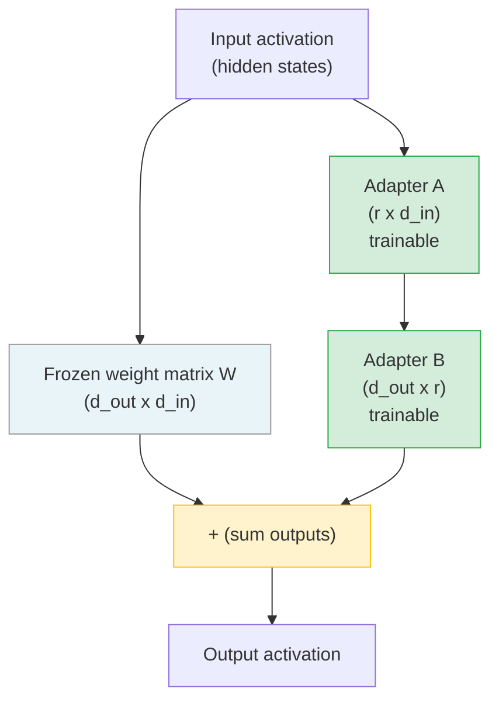

> أنت لا تعيد تدريب النموذج كاملًا. بل تضيف adapter صغيرًا يعترض التحديثات.

**النوع:** بناء
**اللغات:** Python
**المتطلبات:** الدرس 09-01 (سلّم القرار)، الدرس 09-02 (هندسة مجموعة البيانات)، الدرس 09-03 (Supervised Fine-Tuning عبر الـ APIs المُدارة)
**الوقت:** ~90 دقيقة
**المرحلة:** 09 - Fine-Tuning

---

## أهداف التعلّم

- فهم كيف يحقن LoRA مصفوفات قابلة للتدريب من تفكيك الرتبة (rank-decomposition) دون المساس بالأوزان المجمَّدة
- حساب توفير المعاملات (parameters) عند إعدادات rank مختلفة (r=4، 8، 16، 32)
- إعداد تهيئة QLoRA: تكميم 4-bit مع adapters من نوع LoRA على نموذج 7B
- اختيار target_modules الصحيحة لمعماريات قائمة على الـ attention
- معرفة كيفية دمج (merge) الـ adapter في النموذج الأساسي للنشر

---

## المشكلة

لدى فريق بيانات رعاية صحية خاصة لا يمكنها مغادرة بنيته التحتية. الـ APIs المُدارة خارج الحسبان. يحتاجون إلى عمل fine-tuning لنموذج 7B مفتوح الأوزان على مجموعة بيانات أسئلة وأجوبة سريرية: 2,000 مثال من أزواج أسئلة وأجوبة طبيب-مريض حيث يجب على النموذج الرد بـ JSON منظَّم يحتوي على مستوى الفرز (triage)، والأعراض الرئيسية، والخطوات التالية الموصى بها.

إعادة التدريب الكامل لنموذج 7B تتطلب تحديث جميع الـ 7 مليار معامل. هذا يحتاج إلى:

- 4 x A100 80GB GPUs (نحو 12 دولارًا/ساعة على السحابة)
- 8-10 ساعات من وقت التدريب
- 96-120 دولارًا لكل عملية تدريب
- عمليات متعددة لضبط الـ hyperparameters

لدى الفريق RTX 3090 واحد بذاكرة 24GB VRAM. الـ fine-tuning الكامل ليس خيارًا.

يحتاجون إلى طريقة لتكييف النموذج بكفاءة دون استبدال مساحة المعاملات بأكملها.

---

## المفهوم

### كيف يعمل LoRA

الـ fine-tuning الكامل يحدّث كل مصفوفة أوزان W في النموذج. بالنسبة لنموذج 7B، فذلك 7 مليار معامل يجب تخزينها وحساب الـ gradients لها وحفظها.

فكرة LoRA الثاقبة: تحديثات الأوزان اللازمة أثناء الـ fine-tuning تميل إلى أن تكون منخفضة الرتبة الجوهرية (low intrinsic rank). فبدلًا من تحديث W مباشرةً، احقن مصفوفتين صغيرتين A وB بجانب W:

```
W_new = W_frozen + B @ A
```

حيث:
- W هي مصفوفة الأوزان الأصلية المجمَّدة، بشكل (d_out, d_in)
- A هي مصفوفة قابلة للتدريب، بشكل (r, d_in)
- B هي مصفوفة قابلة للتدريب، بشكل (d_out, r)
- r هي الرتبة (rank)، عادةً من 8 إلى 64

ينخفض عدد المعاملات القابلة للتدريب من d_out x d_in إلى r x (d_in + d_out).

بالنسبة لطبقة إسقاط attention نموذجية في Llama 3.1 7B (d=4096، r=16):

```
Full:  4096 * 4096 = 16,777,216 parameters
LoRA:  16 * (4096 + 4096) = 131,072 parameters
Ratio: 0.78% of original
```

### معمارية حقن الـ Adapter



الأوزان المجمَّدة لا تتغير أبدًا. الـ gradients تتدفق فقط عبر A وB. عند الاستدلال (inference)، يمكنك إما:
1. إبقاء الـ adapter منفصلًا: أضِف B @ A لكل تمريرة أمامية (forward pass) (دون تعديل الأوزان)
2. الدمج: احسب W_merged = W + B @ A مرة واحدة، تخلّص من الـ adapter، وأطلق النموذج المدموج

### QLoRA: LoRA مع تكميم 4-bit

لا تزال الأوزان المجمَّدة بحاجة إلى أن تتسع في ذاكرة الـ GPU رغم أنها لا تُدرَّب. بالنسبة لنموذج 7B بدقة كاملة: 7B x 4 bytes = 28GB. وهذا يتجاوز بطاقة 24GB.

QLoRA = LoRA + تكميم الأوزان المجمَّدة إلى 4-bit (تنسيق NF4). تبقى مصفوفتا الـ adapter (A وB) بصيغة bfloat16 لاستقرار التدريب.

تفصيل الذاكرة لنموذج 7B مع QLoRA:

```
COMPONENT              PRECISION    MEMORY
-------------------------------------------
Frozen weights         4-bit NF4    ~4 GB
Activations            bfloat16     ~6 GB
Adapter A, B           bfloat16     ~0.1 GB
Optimizer states       float32      ~0.5 GB
Gradients (adapters)   float32      ~0.5 GB
-------------------------------------------
TOTAL                               ~11 GB
```

نموذج 7B كان يحتاج إلى 80GB يمكنه الآن التدريب على GPU استهلاكي واحد بسعة 24GB. ونموذج 13B يتّسع على بطاقتي 24GB.

### متى تستخدم أي rank

| الرتبة (r) | النسبة القابلة للتدريب (7B) | حالة الاستخدام |
|----------|-----------------|----------|
| 4 | ~0.04% | تكييف مجال خفيف، تكرار سريع |
| 8 | ~0.08% | fine-tuning قياسي، معظم الحالات |
| 16 | ~0.16% | تكييف مهام معقّدة، مخرجات منظَّمة |
| 32 | ~0.32% | تحوّل سلوكي كبير، أقصى جودة |
| 64 | ~0.64% | جودة قريبة من الـ fine-tune الكامل، عوائد متناقصة |

الـ rank الأعلى ليس أفضل دائمًا. r=16 هي نقطة البداية القياسية. لا تزِدها إلا إن رأيت training loss يصل إلى مرحلة استقرار مبكرًا مع وجود مجال للتحسّن.

---

## البناء

### إعداد تهيئة LoRA وعدّ المعاملات

شغّل العرض التوضيحي لرؤية الحسابات دون GPU:

```bash
python main.py --demo
```

يُظهِر العرض التوضيحي أعداد المعاملات لمختلف الـ ranks، ومتطلبات ذاكرة QLoRA، وتهيئة LoRA مرجعية. للاستخدام مع نموذج حقيقي (يتطلب GPU وتنزيلًا بحجم ~14GB):

```bash
python main.py --model meta-llama/Llama-3.1-8B --rank 16
```

حسابات معاملات LoRA الأساسية - دون الحاجة إلى مكتبات ML:

```python
def count_lora_params(d_in: int, d_out: int, rank: int) -> dict:
    full_params = d_in * d_out
    lora_params = rank * (d_in + d_out)
    return {
        "full": full_params,
        "lora": lora_params,
        "pct": lora_params / full_params * 100,
    }

# Attention projection in Llama 3.1 7B (d=4096)
result = count_lora_params(4096, 4096, rank=16)
# full=16,777,216  lora=131,072  pct=0.78%
```

إعداد QLoRA بمكتبات حقيقية:

```python
from transformers import AutoModelForCausalLM, BitsAndBytesConfig
from peft import LoraConfig, TaskType, get_peft_model
import torch

# Step 1: Load model in 4-bit (QLoRA)
bnb_config = BitsAndBytesConfig(
    load_in_4bit=True,
    bnb_4bit_quant_type="nf4",
    bnb_4bit_compute_dtype=torch.bfloat16,
    bnb_4bit_use_double_quant=True,
)

model = AutoModelForCausalLM.from_pretrained(
    "meta-llama/Llama-3.1-8B",
    quantization_config=bnb_config,
    device_map="auto",
)

# Step 2: Configure LoRA adapters
lora_config = LoraConfig(
    task_type=TaskType.CAUSAL_LM,
    r=16,
    lora_alpha=32,          # convention: 2 * r
    lora_dropout=0.05,
    target_modules=["q_proj", "k_proj", "v_proj", "o_proj"],
)

# Step 3: Wrap model - this freezes base weights and adds adapters
model = get_peft_model(model, lora_config)
model.print_trainable_parameters()
# Output: trainable params: 6,815,744 || all params: 8,036,335,616 || trainable%: 0.0848
```

> **اختبار من الواقع:** يقول زميل "فقط اضبط rank=64 للأمان، فعدد المعاملات الأكبر يعني نتائج أفضل." ما الخطأ في هذا المنطق؟
>
> الـ rank الأعلى يعني معاملات قابلة للتدريب أكثر، مما يعني ذاكرة أكثر أثناء التدريب وخطرًا أعلى للـ overfitting على مجموعات البيانات الصغيرة. نموذج 7B بـ r=64 يستهدف كل طبقات الـ attention يستخدم نحو 6 أضعاف معاملات الـ adapter مقارنةً بـ r=16. على مجموعة بيانات من 2,000 مثال، سيحدث overfitting لـ r=64 على الأرجح بينما يعمّم r=16 بشكل أفضل. استخدم r=64 فقط عندما يصل r=16 إلى مرحلة استقرار ويكون لديك بيانات كافية لدعمه.

---

## الاستخدام

### الـ SFTTrainer مع تكامل PEFT

تغلّف مكتبة `trl` حلقة التدريب الكاملة. تقدّم البيانات والتهيئة ونموذج PEFT - وهي تتولى الـ batching، وتجميع الـ gradients، والـ checkpointing:

```python
from trl import SFTTrainer, SFTConfig
from peft import LoraConfig, TaskType, get_peft_model
from transformers import AutoModelForCausalLM, AutoTokenizer, BitsAndBytesConfig
from datasets import load_dataset
import torch

# Load quantized model
bnb_config = BitsAndBytesConfig(
    load_in_4bit=True,
    bnb_4bit_quant_type="nf4",
    bnb_4bit_compute_dtype=torch.bfloat16,
)
model = AutoModelForCausalLM.from_pretrained(
    "meta-llama/Llama-3.1-8B",
    quantization_config=bnb_config,
    device_map="auto",
)
tokenizer = AutoTokenizer.from_pretrained("meta-llama/Llama-3.1-8B")

# Apply LoRA
lora_config = LoraConfig(
    task_type=TaskType.CAUSAL_LM,
    r=16,
    lora_alpha=32,
    lora_dropout=0.05,
    target_modules=["q_proj", "k_proj", "v_proj", "o_proj"],
)
model = get_peft_model(model, lora_config)

# Load dataset
dataset = load_dataset("json", data_files={"train": "train.jsonl", "test": "test.jsonl"})

# Configure and run training
training_args = SFTConfig(
    output_dir="./checkpoints",
    num_train_epochs=3,
    per_device_train_batch_size=4,
    gradient_accumulation_steps=4,   # effective batch size = 16
    learning_rate=2e-4,
    warmup_ratio=0.03,
    lr_scheduler_type="cosine",
    save_strategy="epoch",
    evaluation_strategy="epoch",
    bf16=True,
    max_seq_length=512,
    dataset_text_field="text",
)

trainer = SFTTrainer(
    model=model,
    train_dataset=dataset["train"],
    eval_dataset=dataset["test"],
    args=training_args,
)
trainer.train()

# Save the adapter (not the full model)
trainer.model.save_pretrained("./adapter")
```

للحصول على تسريع إضافي بمقدار 2x فوق QLoRA، يعدّل Unsloth أنوية الـ attention وإدارة الذاكرة. بديل جاهز للاستبدال:

```python
from unsloth import FastLanguageModel  # replaces AutoModelForCausalLM

model, tokenizer = FastLanguageModel.from_pretrained(
    model_name="meta-llama/Llama-3.1-8B",
    max_seq_length=512,
    load_in_4bit=True,
)
model = FastLanguageModel.get_peft_model(
    model,
    r=16,
    lora_alpha=32,
    target_modules=["q_proj", "k_proj", "v_proj", "o_proj"],
)
# Proceed with SFTTrainer as normal
```

> **نقلة في المنظور:** يجعل SFTTrainer تدريب LoRA يبدو بسيطًا - بضعة أسطر تهيئة واستدعاء `.train()`. لماذا يهم قسم البناء (BUILD IT) إن كان الإطار يتولى كل شيء؟
>
> عندما يفشل التدريب - وسيفشل - تأتي رسائل الخطأ من الطبقات أسفل الإطار. "CUDA out of memory" أثناء تجميع الـ gradients، أو NaN loss بعد الـ epoch الأول، أو validation perplexity أسوأ من خطّ الأساس: لا يمكن إصلاح أيٍّ من هذه بقراءة توثيق SFTTrainer. تصلحها بفهم ما الذي يتحكم فيه الـ rank، وما الذي يقايضه تكميم NF4، ولماذا يهم التكميم المزدوج للذاكرة، وما الذي يفعله تجميع الـ gradients فعلًا بحجم الـ batch الفعّال. الإطار يضغط الواجهة. ومعرفة قسم البناء هي ما تلجأ إليه عندما تنكسر الواجهة.

---

## التسليم

المُخرَج لهذا الدرس هو دليل تهيئة مرجعي لتدريب LoRA وQLoRA.

**`outputs/skill-lora-training-script.md`** يحتوي على:
- الـ hyperparameters الموصى بها لأحجام نماذج مختلفة (7B، 13B، 34B، 70B)
- الـ target modules حسب المعمارية (Llama، Mistral، Falcon، Qwen)
- نمط الدمج والرفع (merge-and-upload) لتحويل الـ adapter إلى نموذج مستقل
- أوضاع الفشل الشائعة وإصلاحاتها

### دمج الـ Adapter للنشر

بعد التدريب، يضيف الـ adapter زمن استجابة (latency) لكل تمريرة أمامية (ضرب مصفوفة إضافي لكل طبقة). للإنتاج، ادمجه في الأوزان الأساسية:

```python
from peft import PeftModel
from transformers import AutoModelForCausalLM, AutoTokenizer

# Load base model in full precision for clean merge
base_model = AutoModelForCausalLM.from_pretrained(
    "meta-llama/Llama-3.1-8B",
    torch_dtype=torch.float16,
    device_map="auto",
)
tokenizer = AutoTokenizer.from_pretrained("meta-llama/Llama-3.1-8B")

# Load and merge adapter
model = PeftModel.from_pretrained(base_model, "./adapter")
model = model.merge_and_unload()  # computes W + B@A for every layer

# Save merged model - this is a standalone model, no adapter needed
model.save_pretrained("./merged-model")
tokenizer.save_pretrained("./merged-model")
```

يتصرف النموذج المدموج بشكل مطابق لنسخة الـ adapter دون زمن استجابة مضاف. ارفعه إلى HuggingFace Hub أو ادفعه إلى سجلّك الداخلي.

---

## التقييم

### قياس تقارب التدريب مقابل الـ Overfitting

راقب هذه أثناء التدريب. سجّلها في Weights and Biases أو TensorBoard:

```
METRIC                    HEALTHY PATTERN             WARNING SIGN
---------------------------------------------------------------------------
Training loss             Decreases smoothly           Spikes or plateaus early
Validation loss           Decreases then levels off    Increases while train decreases
Train/val gap             <0.5 after convergence       >1.0 = overfitting
Grad norm                 Stable or decreasing         Exploding = LR too high
```

تباعد الـ training/validation loss هو الإشارة الأساسية للـ overfitting. إن بدأ الـ validation loss بالارتفاع بينما يواصل الـ training loss الانخفاض، أوقف التدريب عند الـ checkpoint الذي كان فيه الـ validation loss أدنى (هذا ما يفعله `load_best_model_at_end=True` في SFTConfig).

### مقارنة الـ Adapter بخطّ الأساس

بعد التدريب، استخدم منظومة التقييم من الدرس 09-05 لمقارنة الـ adapter المُحسَّن بالنموذج الأساسي:

```bash
python ../05-evaluating-fine-tune/code/main.py \
  --baseline meta-llama/Llama-3.1-8B \
  --fine-tuned ./merged-model \
  --test-set test.jsonl \
  --threshold 0.15
```

تحدد الراية `--threshold 0.15` الحد الأدنى من التحسّن الذي يبرّر النشر: إن لم يكن النموذج المُحسَّن أفضل بنسبة 15% على الأقل في المطابقة التامة (exact match)، فإن عملية التدريب لم تبرّر التكلفة التشغيلية لصيانة نموذج منفصل.

### الحد الأدنى من التقييم القابل للتطبيق قبل النشر

1. دقة المطابقة التامة (exact match) على مجموعة اختبار محجوزة (لا تتداخل أبدًا مع بيانات التدريب)
2. معدل صحة التنسيق (نسبة نجاح تحليل الـ JSON لمهام المخرجات المنظَّمة)
3. فحص الانحدار (regression): هل يكسر الـ adapter سلوكيات كانت لدى النموذج الأساسي؟ شغّل 50 حالة حدّية من المجالات القوية لخطّ الأساس.
