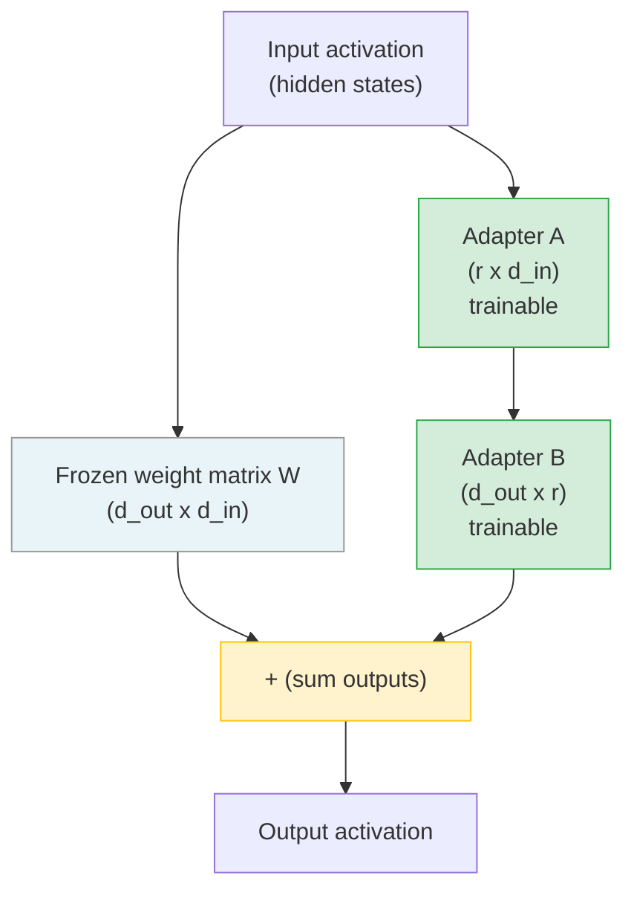

> You do not retrain the whole model. You add a tiny adapter that intercepts the updates.

**Type:** Build
**Languages:** Python
**Prerequisites:** Lesson 09-01 (Decision Ladder), Lesson 09-02 (Dataset Engineering), Lesson 09-03 (Supervised Fine-Tuning via Managed APIs)
**Time:** ~90 min
**Phase:** 09 - Fine-Tuning

---

## Learning Objectives

- Understand how LoRA injects trainable rank-decomposition matrices without touching frozen weights
- Calculate the parameter savings of different rank settings (r=4, 8, 16, 32)
- Configure a QLoRA setup: 4-bit quantization plus LoRA adapters on a 7B model
- Select the right target_modules for attention-based architectures
- Know how to merge an adapter back into the base model for deployment

---

## The Problem

A team has private healthcare data that cannot leave their infrastructure. Managed APIs are off the table. They need to fine-tune a 7B open-weight model on their clinical QA dataset: 2,000 examples of doctor-patient question-answer pairs where the model must respond with structured JSON containing triage level, key symptoms, and recommended next steps.

Full retraining of a 7B model requires updating all 7 billion parameters. That needs:

- 4 x A100 80GB GPUs (roughly $12/hour on cloud)
- 8-10 hours of training time
- $96-120 per training run
- Multiple runs to tune hyperparameters

The team has a single RTX 3090 with 24GB of VRAM. Full fine-tuning is not an option.

They need a way to adapt the model efficiently without replacing the entire parameter space.

---

## The Concept

### How LoRA Works

Full fine-tuning updates every weight matrix W in the model. For a 7B model, that is 7 billion parameters to store, compute gradients for, and save.

LoRA's insight: the weight updates needed during fine-tuning tend to have low intrinsic rank. Instead of updating W directly, inject two small matrices A and B alongside W:

```
W_new = W_frozen + B @ A
```

Where:
- W is the original frozen weight matrix, shape (d_out, d_in)
- A is a trainable matrix, shape (r, d_in)
- B is a trainable matrix, shape (d_out, r)
- r is the rank, typically 8 to 64

The number of trainable parameters drops from d_out x d_in to r x (d_in + d_out).

For a typical attention projection layer in Llama 3.1 7B (d=4096, r=16):

```
Full:  4096 * 4096 = 16,777,216 parameters
LoRA:  16 * (4096 + 4096) = 131,072 parameters
Ratio: 0.78% of original
```

### Adapter Injection Architecture



The frozen weights never change. Gradients only flow through A and B. At inference time, you can either:
1. Keep the adapter separate: add B @ A to each forward pass (no weight modification)
2. Merge: compute W_merged = W + B @ A once, discard the adapter, ship the merged model

### QLoRA: LoRA Plus 4-bit Quantization

The frozen weights still need to fit in GPU memory even though they are not being trained. For a 7B model in full precision: 7B x 4 bytes = 28GB. That exceeds a 24GB card.

QLoRA = LoRA + quantize the frozen weights to 4-bit (NF4 format). The adapter matrices A and B remain in bfloat16 for training stability.

Memory breakdown for a 7B model with QLoRA:

```
COMPONENT              PRECISION    MEMORY
-------------------------------------------
Frozen weights         4-bit NF4    ~4 GB
Activations            bfloat16     ~6 GB
Adapter A, B           bfloat16     ~0.1 GB
Optimizer states       float32      ~0.5 GB
Gradients (adapters)   float32      ~0.5 GB
-------------------------------------------
TOTAL                               ~11 GB
```

A 7B model that needed 80GB can now train on a single 24GB consumer GPU. A 13B model fits on two 24GB GPUs.

### When to Use Which Rank

| Rank (r) | Trainable % (7B) | Use Case |
|----------|-----------------|----------|
| 4 | ~0.04% | Light domain adaptation, fast iteration |
| 8 | ~0.08% | Standard fine-tuning, most cases |
| 16 | ~0.16% | Complex task adaptation, structured output |
| 32 | ~0.32% | Heavy behavioral shift, maximum quality |
| 64 | ~0.64% | Near full-tune quality, diminishing returns |

Higher rank is not always better. r=16 is the standard starting point. Only increase if you see training loss plateau early with room to improve.

---

## Build It

### LoRA Config Setup and Parameter Counting

Run the demo to see the math without a GPU:

```bash
python main.py --demo
```

The demo shows parameter counts for different ranks, QLoRA memory requirements, and a reference LoRA config. To use with a real model (requires GPU and ~14GB download):

```bash
python main.py --model meta-llama/Llama-3.1-8B --rank 16
```

The core LoRA parameter math - no ML libraries required:

```python
def count_lora_params(d_in: int, d_out: int, rank: int) -> dict:
    full_params = d_in * d_out
    lora_params = rank * (d_in + d_out)
    return {
        "full": full_params,
        "lora": lora_params,
        "pct": lora_params / full_params * 100,
    }

# Attention projection in Llama 3.1 7B (d=4096)
result = count_lora_params(4096, 4096, rank=16)
# full=16,777,216  lora=131,072  pct=0.78%
```

The QLoRA setup with real libraries:

```python
from transformers import AutoModelForCausalLM, BitsAndBytesConfig
from peft import LoraConfig, TaskType, get_peft_model
import torch

# Step 1: Load model in 4-bit (QLoRA)
bnb_config = BitsAndBytesConfig(
    load_in_4bit=True,
    bnb_4bit_quant_type="nf4",
    bnb_4bit_compute_dtype=torch.bfloat16,
    bnb_4bit_use_double_quant=True,
)

model = AutoModelForCausalLM.from_pretrained(
    "meta-llama/Llama-3.1-8B",
    quantization_config=bnb_config,
    device_map="auto",
)

# Step 2: Configure LoRA adapters
lora_config = LoraConfig(
    task_type=TaskType.CAUSAL_LM,
    r=16,
    lora_alpha=32,          # convention: 2 * r
    lora_dropout=0.05,
    target_modules=["q_proj", "k_proj", "v_proj", "o_proj"],
)

# Step 3: Wrap model - this freezes base weights and adds adapters
model = get_peft_model(model, lora_config)
model.print_trainable_parameters()
# Output: trainable params: 6,815,744 || all params: 8,036,335,616 || trainable%: 0.0848
```

> **Real-world check:** A colleague says "just set rank=64 to be safe, more parameters means better results." What is wrong with this reasoning?
>
> Higher rank means more trainable parameters, which means more memory during training and a higher risk of overfitting on small datasets. A 7B model with r=64 targeting all attention layers uses roughly 6x more adapter parameters than r=16. On a 2,000-example dataset, r=64 will likely overfit while r=16 generalizes better. Use r=64 only when r=16 plateaus and you have enough data to support it.

---

## Use It

### SFTTrainer with PEFT Integration

The `trl` library wraps the full training loop. You provide data, config, and a PEFT model - it handles batching, gradient accumulation, and checkpointing:

```python
from trl import SFTTrainer, SFTConfig
from peft import LoraConfig, TaskType, get_peft_model
from transformers import AutoModelForCausalLM, AutoTokenizer, BitsAndBytesConfig
from datasets import load_dataset
import torch

# Load quantized model
bnb_config = BitsAndBytesConfig(
    load_in_4bit=True,
    bnb_4bit_quant_type="nf4",
    bnb_4bit_compute_dtype=torch.bfloat16,
)
model = AutoModelForCausalLM.from_pretrained(
    "meta-llama/Llama-3.1-8B",
    quantization_config=bnb_config,
    device_map="auto",
)
tokenizer = AutoTokenizer.from_pretrained("meta-llama/Llama-3.1-8B")

# Apply LoRA
lora_config = LoraConfig(
    task_type=TaskType.CAUSAL_LM,
    r=16,
    lora_alpha=32,
    lora_dropout=0.05,
    target_modules=["q_proj", "k_proj", "v_proj", "o_proj"],
)
model = get_peft_model(model, lora_config)

# Load dataset
dataset = load_dataset("json", data_files={"train": "train.jsonl", "test": "test.jsonl"})

# Configure and run training
training_args = SFTConfig(
    output_dir="./checkpoints",
    num_train_epochs=3,
    per_device_train_batch_size=4,
    gradient_accumulation_steps=4,   # effective batch size = 16
    learning_rate=2e-4,
    warmup_ratio=0.03,
    lr_scheduler_type="cosine",
    save_strategy="epoch",
    evaluation_strategy="epoch",
    bf16=True,
    max_seq_length=512,
    dataset_text_field="text",
)

trainer = SFTTrainer(
    model=model,
    train_dataset=dataset["train"],
    eval_dataset=dataset["test"],
    args=training_args,
)
trainer.train()

# Save the adapter (not the full model)
trainer.model.save_pretrained("./adapter")
```

For additional 2x speedup on top of QLoRA, Unsloth patches the attention kernels and memory management. Drop-in replacement:

```python
from unsloth import FastLanguageModel  # replaces AutoModelForCausalLM

model, tokenizer = FastLanguageModel.from_pretrained(
    model_name="meta-llama/Llama-3.1-8B",
    max_seq_length=512,
    load_in_4bit=True,
)
model = FastLanguageModel.get_peft_model(
    model,
    r=16,
    lora_alpha=32,
    target_modules=["q_proj", "k_proj", "v_proj", "o_proj"],
)
# Proceed with SFTTrainer as normal
```

> **Perspective shift:** SFTTrainer makes LoRA training look trivial - a few config lines and a `.train()` call. Why does the BUILD IT section matter if the framework handles everything?
>
> When training fails - and it will fail - the error messages come from the layers below the framework. "CUDA out of memory" during gradient accumulation, NaN loss after epoch 1, validation perplexity worse than the baseline: none of these are fixable by reading the SFTTrainer docs. You fix them by understanding what rank controls, what NF4 quantization trades off, why double quantization matters for memory, and what gradient accumulation actually does to effective batch size. The framework compresses the interface. The BUILD IT knowledge is what you reach for when the interface breaks.

---

## Ship It

The artifact for this lesson is a reference configuration guide for LoRA and QLoRA training.

**`outputs/skill-lora-training-script.md`** contains:
- Recommended hyperparameters for different model sizes (7B, 13B, 34B, 70B)
- Target modules by architecture (Llama, Mistral, Falcon, Qwen)
- The merge-and-upload pattern for converting adapter to standalone model
- Common failure modes and their fixes

### Merging the Adapter for Deployment

After training, the adapter adds latency to every forward pass (an extra matrix multiply per layer). For production, merge it into the base weights:

```python
from peft import PeftModel
from transformers import AutoModelForCausalLM, AutoTokenizer

# Load base model in full precision for clean merge
base_model = AutoModelForCausalLM.from_pretrained(
    "meta-llama/Llama-3.1-8B",
    torch_dtype=torch.float16,
    device_map="auto",
)
tokenizer = AutoTokenizer.from_pretrained("meta-llama/Llama-3.1-8B")

# Load and merge adapter
model = PeftModel.from_pretrained(base_model, "./adapter")
model = model.merge_and_unload()  # computes W + B@A for every layer

# Save merged model - this is a standalone model, no adapter needed
model.save_pretrained("./merged-model")
tokenizer.save_pretrained("./merged-model")
```

The merged model behaves identically to the adapter version with no added latency. Upload to HuggingFace Hub or push to your internal registry.

---

## Evaluate It

### Measuring Training Convergence vs. Overfitting

Monitor these during training. Log to Weights and Biases or TensorBoard:

```
METRIC                    HEALTHY PATTERN             WARNING SIGN
---------------------------------------------------------------------------
Training loss             Decreases smoothly           Spikes or plateaus early
Validation loss           Decreases then levels off    Increases while train decreases
Train/val gap             <0.5 after convergence       >1.0 = overfitting
Grad norm                 Stable or decreasing         Exploding = LR too high
```

The training/validation loss divergence is the primary overfitting signal. If validation loss starts rising while training loss continues falling, stop training at the checkpoint where validation loss was lowest (this is what `load_best_model_at_end=True` does in SFTConfig).

### Comparing Adapter to Baseline

After training, use the eval harness from Lesson 09-05 to compare the fine-tuned adapter to the base model:

```bash
python ../05-evaluating-fine-tune/code/main.py \
  --baseline meta-llama/Llama-3.1-8B \
  --fine-tuned ./merged-model \
  --test-set test.jsonl \
  --threshold 0.15
```

The `--threshold 0.15` flag sets the minimum improvement to justify deployment: if the fine-tuned model is not at least 15% better on exact match, the training run did not justify the operational cost of maintaining a separate model.

### Minimum Viable Eval Before Deploying

1. Exact match accuracy on the hold-out test set (never overlap with training data)
2. Format validity rate (JSON parsing success rate for structured output tasks)
3. Regression check: does the adapter break behaviors the base model had? Run 50 edge cases from the baseline's strong areas.
