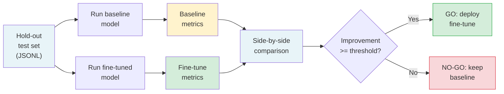

> الـ fine-tune الذي لا يُقيَّم مقابل خطّ أساس هو مجرد تخمين مكلف.

**النوع:** بناء
**اللغات:** Python
**المتطلبات:** الدرس 09-03 (Supervised Fine-Tuning عبر الـ APIs المُدارة)، الدرس 09-04 (LoRA وQLoRA)
**الوقت:** ~75 دقيقة
**المرحلة:** 09 - Fine-Tuning

---

## أهداف التعلّم

- بناء منظومة تقييم (eval harness) قابلة لإعادة الاستخدام تشغّل أي نموذجين على مجموعة الاختبار نفسها
- حساب دقة المطابقة التامة (exact match)، ومعدل صحة التنسيق، والتكلفة لكل مخرَج صحيح
- إنتاج توصية go/no-go من عتبات تحسّن قابلة للتهيئة
- فهم لماذا يجب ألا تتداخل مجموعة الاختبار المحجوزة (hold-out) أبدًا مع بيانات التدريب
- دمج المنظومة مع Braintrust أو LangSmith للتتبّع المستمر

---

## المشكلة

قام فريق بعمل fine-tuning لنموذج لاستخراج JSON منظَّم (المهمة من الدرس 09-03). النموذج المُحسَّن "يبدو أفضل" بناءً على 5 اختبارات يدوية. لكنهم لا يستطيعون الإجابة على:

- هل هو أفضل باستمرار، أم فقط أفضل على تلك الأمثلة الخمسة؟
- هل ينحدر في الحالات الحدّية التي كان النموذج الأساسي يتعامل معها سابقًا؟
- هل هو أفضل بما يكفي لتبرير صيانة نموذج مُحسَّن منفصل في الإنتاج؟
- كيف تتغير صورة التكلفة عندما تحسب المخرجات الخاطئة التي تحتاج إلى إعادة تشغيل؟

"يبدو أفضل" على 5 اختبارات ليست إشارة قابلة للنشر. إنها تخمين. النشر الإنتاجي يحتاج إلى رقم: النموذج المُحسَّن أفضل بنسبة X% على مجموعة اختبار تمثيلية من N مثال، دون انحدارات مهمة على الحالات الحدّية. بدون هذا الرقم، أنت تطلق بناءً على الحدس.

لدى الفريق أيضًا موعد نهائي. ليس لديهم وقت لبناء إطار تقييم مخصص من الصفر. يحتاجون إلى منظومة يمكنهم تشغيلها في أقل من ساعة وتعطيهم إجابة go/no-go قابلة للدفاع عنها.

---

## المفهوم

### إطار تقييم الـ Fine-Tune

يمر تقييم الـ fine-tune بثلاث مراحل: تحضير بيانات الاختبار، تشغيل النماذج، مقارنة النتائج.



### المقاييس الأساسية الثلاثة

**دقة المطابقة التامة (exact match):** لمهام المخرجات المنظَّمة (استخراج JSON، التصنيف، ملء الخانات)، المطابقة التامة هي مقياس الحقيقة الأرضية (ground truth). إن طابق المخرَج المخرَج المتوقع حرفًا بحرف (بعد التطبيع)، فهو صحيح. المطابقة التقريبية تخفي أخطاءً حقيقية.

**معدل صحة التنسيق:** حتى لو كان المحتوى خاطئًا، يجب أن يكون المخرَج قابلًا للتحليل (parseable). نموذج استخراج JSON يُعيد JSON غير صالح 5% من الوقت لديه معدل فشل صارم 5% في الإنتاج، بصرف النظر عن جودة المحتوى. تتبّع هذا بشكل منفصل.

**التكلفة لكل مخرَج صحيح:** ليست التكلفة لكل استدعاء. الاستدعاء الذي يُعيد مخرجًا خاطئًا ليس مجانيًّا - فهو لا يزال يكلّف tokens ويضيف زمن استجابة. عند الحجم الكبير، تحسّن دقة بنسبة 15% قد يقلّص تكلفتك الفعلية بأكثر من 15% إن كانت المخرجات الخاطئة تطلق عمليات إعادة محاولة.

### متطلب مجموعة الاختبار المحجوزة

يجب أن تستوفي مجموعة الاختبار ثلاثة معايير:

```
CRITERION             REQUIREMENT             WHY IT MATTERS
---------------------------------------------------------------------
No overlap           Zero examples from      Overlap inflates accuracy -
with training        training data           model memorizes, not learns
Representativeness   Same distribution       If test is easy, improvement
                     as production traffic   looks bigger than it is
Size                 Minimum 200 examples    <100 examples: +-10% error bars
                     (500+ preferred)        make results meaningless
```

اجمع مجموعة الاختبار قبل أن تبني مجموعة التدريب. إن بنيت مجموعة التدريب أولًا، احجز 20% على الأقل صراحةً وتحقق من عدم التداخل عبر تجزئة (hashing) مدخلات الأمثلة.

### إطار قرار الـ Go/No-Go

تأخذ عتبة التحسّن الدنيا في الحسبان تكلفة النشر:

```
DEPLOYMENT COST              MINIMUM IMPROVEMENT NEEDED
-------------------------------------------------------
No new infrastructure        5% relative improvement
Hosted adapter (same serve)  10% relative improvement
New model server              15% relative improvement
Separate service/container   20% relative improvement
```

تعكس هذه العتبات العبء التشغيلي لصيانة نموذج مُحسَّن منفصل عبر الوقت: المراقبة، إعادة التدريب مع تحديث النماذج الأساسية، تنقيح الانحدارات. تحسّن بنسبة 3% لا يبرّر هذا العبء لمعظم الفِرَق.

---

## البناء

### منظومة التقييم

شغّل العرض التوضيحي لرؤية تقييم محاكى دون مفاتيح API:

```bash
python main.py --demo
```

بمفاتيح API حقيقية، قارن نموذجين على مجموعة اختبارك:

```bash
export ANTHROPIC_API_KEY=...
python main.py \
  --baseline claude-3-5-haiku-20241022 \
  --fine-tuned ft:gpt-4o-mini-2024-07-18:your-org::abc123 \
  --test-set test.jsonl \
  --threshold 0.15
```

تحمّل المنظومة ملف اختبار JSONL حيث يحتوي كل سطر على حقلَي `input` و`expected_output`، تشغّل كلا النموذجين بنفس الـ prompt، وتقارن المخرجات:

```python
import json
import time
from dataclasses import dataclass, field
from pathlib import Path
from typing import Optional


@dataclass
class EvalResult:
    model_id: str
    total: int
    exact_match: int
    format_valid: int
    errors: int
    total_latency_ms: float
    total_cost_usd: float

    @property
    def accuracy(self) -> float:
        return self.exact_match / self.total if self.total > 0 else 0.0

    @property
    def validity_rate(self) -> float:
        return self.format_valid / self.total if self.total > 0 else 0.0

    @property
    def cost_per_correct(self) -> float:
        if self.exact_match == 0:
            return float("inf")
        return self.total_cost_usd / self.exact_match

    @property
    def avg_latency_ms(self) -> float:
        return self.total_latency_ms / self.total if self.total > 0 else 0.0


def normalize(text: str) -> str:
    """Normalize output for comparison: parse JSON if possible, else strip whitespace."""
    text = text.strip()
    try:
        parsed = json.loads(text)
        return json.dumps(parsed, sort_keys=True)
    except json.JSONDecodeError:
        return text


def is_valid_json(text: str) -> bool:
    try:
        json.loads(text.strip())
        return True
    except json.JSONDecodeError:
        return False
```

تُطبع جدول المقارنة بعد اكتمال كلتا العمليتين:

```
MODEL                          ACCURACY   VALID JSON   AVG LATENCY   COST/CORRECT
-----------------------------------------------------------------------------------
claude-3-5-haiku-20241022       62.0%       91.5%        342ms         $0.000032
ft:gpt-4o-mini:abc123           74.0%       97.0%        289ms         $0.000019

Relative improvement: +19.4% accuracy, +5.5pp format validity, -40.6% cost/correct
Threshold: 15.0%  |  Result: GO - deploy the fine-tuned model
```

> **اختبار من الواقع:** تُظهِر منظومة التقييم لديك أن النموذج المُحسَّن أفضل بنسبة 18% على مجموعة اختبارك المؤلَّفة من 300 مثال. يسأل أحد أصحاب المصلحة: "هل 300 مثال كافية للثقة بهذا الرقم؟" ما الإجابة الصحيحة؟
>
> 300 مثال تعطي تقريبًا فاصل ثقة +-5.8% عند ثقة 95% (باستخدام التقريب الطبيعي للنِّسَب). تحسّن 18% خارج هذا الهامش بوضوح - الإشارة حقيقية. للتحسينات من 5-10%، ستحتاج إلى 1,000+ مثال للتمييز بين الإشارة والضوضاء. القاعدة: إن كان تحسّنك أقل من 3 أضعاف فاصل الثقة، اجمع مزيدًا من البيانات قبل اتخاذ القرار. في هذه الحالة، 18% >> 5.8%، لذا 300 مثال كافية.

---

## الاستخدام

### التقييم المستمر مع Braintrust

المنظومة أعلاه هي سكربت لمرة واحدة. للتقييم المستمر - التتبّع عبر عمليات الـ fine-tuning مع مرور الوقت - استخدم Braintrust:

```python
import braintrust

# Initialize the project (creates or connects to existing)
project = braintrust.init_project("json-extraction-finetune-eval")

# Run an eval experiment
experiment = braintrust.Experiment(
    project=project,
    name="qlora-r16-epoch3",
    model="ft:your-model-id",
    description="LoRA r=16 after 3 epochs on clinical-qa-v2 dataset",
)

for example in test_examples:
    output = run_model(example["input"], model_id)
    experiment.log(
        input=example["input"],
        output=output,
        expected=example["expected_output"],
        scores={
            "exact_match": int(normalize(output) == normalize(example["expected_output"])),
            "format_valid": int(is_valid_json(output)),
        },
        metadata={
            "input_tokens": example.get("input_token_count"),
            "output_tokens": len(output.split()),
        },
    )

experiment.summarize()
```

بالنسبة لـ LangSmith، النمط مكافئ: أنشئ مجموعة بيانات، شغّل تقييمًا، سجّل الدرجات لكل مثال. كلا المنصّتين تحفظ النتائج وتتيح لك مقارنة العمليات جنبًا إلى جنب في واجهة ويب.

القيمة الرئيسية للتقييم المستمر: ترى ما إذا كان الـ fine-tune يتدهور مع مرور الوقت مع تحديث النموذج الأساسي، وتلتقط الانحدارات قبل أن تصل إلى المستخدمين.

> **نقلة في المنظور:** يجعل Braintrust وLangSmith التتبّع سهلًا. لماذا لا نتخطّى المنظومة المحلية ونستخدم المنصّة من البداية؟
>
> المنظومة المحلية تمنحك شيئًا لا تستطيع المنصّة تقديمه: رقم go/no-go قبل أن يكون لديك حساب منصّة، وقبل أن يتفق الفريق على أداة، وقبل أن يكون لديك وصول إلى الشبكة على صندوق استدلال مؤمَّن. المنصّة للتتبّع طويل الأمد ووضوح الرؤية على مستوى الفريق. والمنظومة المحلية للقرار. كلاهما يخدم أغراضًا مختلفة وتحتاج إلى كليهما.

---

## التسليم

المُخرَج لهذا الدرس هو قالب منظومة تقييم قابل لإعادة الاستخدام.

**`outputs/skill-finetune-eval-harness.md`** يحتوي على:
- متطلبات مجموعة الاختبار (الحجم، التنوع، التحقق من الحجز)
- تعريفات المقاييس لمهام المخرجات المنظَّمة والتصنيف والتوليد
- إطار قرار go/no-go مع العتبات
- نمط تكامل CI لتشغيل التقييم على كل عملية تدريب

---

## التقييم

### التحقق من المُقيِّم نفسه

منظومة التقييم قد تكون خاطئة. أوضاع الفشل الثلاثة:

**التلاعب بالمقياس (Metric gaming):** يتعلّم النموذج إنتاج مخرجات تسجّل درجات جيدة في المطابقة التامة دون أن تكون صحيحة. لاستخراج JSON، يعني هذا مطابقة بنية المفاتيح وأنواع البيانات بينما يُعيد قيمًا معقولة لكنها خاطئة. التقطه بمراجعة بشرية لعيّنة عشوائية بنسبة 5%.

**سوء معايرة المُقيِّم:** منطق التطبيع لديك يختلف عمّا يهتم به المستخدمون. إن طبّعت بترتيب مفاتيح JSON بينما يهتم المستخدمون بترتيب المفاتيح (مثلًا للعرض التدفقي streaming)، فإن نموذجًا يسجّل 100% مطابقة تامة لا يزال خاطئًا لحالة الاستخدام. تحقق من تطبيعك مقابل 20 مثالًا يدويًّا قبل تشغيل المنظومة الكاملة.

**انجراف مجموعة الاختبار (Test set drift):** مع مرور الوقت، تتطور المدخلات الإنتاجية بينما تبقى مجموعة الاختبار ثابتة. الـ fine-tune الذي يسجّل درجات جيدة على مجموعة اختبار عمرها 18 شهرًا قد يؤدي أداءً ضعيفًا على الحركة الحالية. حدّث 20% على الأقل من مجموعة الاختبار بأمثلة إنتاجية حديثة قبل كل دورة تقييم رئيسية.

### فحص الاتفاق مع الحكم البشري

لـ 50 مثالًا مأخوذة عشوائيًّا، شغّل المنظومة ومُقيِّمًا بشريًّا معًا. احسب معدل الاتفاق:

```
Agreement > 90%: harness is reliable
Agreement 75-90%: review disagreements, adjust normalization
Agreement < 75%: harness metric does not reflect what matters - fix before using
```

يستغرق البشري ساعة إلى ساعتين لـ 50 مثالًا. خطوة المعايرة هذه تستحق القيام بها مرة واحدة قبل الالتزام بتعريف مقياس.

### تكامل الـ CI

شغّل التقييم كخطوة في CI التدريب لديك. أفشِل الـ pipeline إن لم يستوفِ الـ fine-tune العتبة:

```bash
python eval/main.py \
  --baseline $BASE_MODEL_ID \
  --fine-tuned $FINE_TUNED_MODEL_ID \
  --test-set data/test.jsonl \
  --threshold 0.15 \
  --output-json eval-results.json \
  --fail-below-threshold  # exits with code 1 if GO not reached

# CI reads exit code: 0 = GO, 1 = NO-GO
```

هذا يمنع نشر fine-tune لا يستوفي شريط الجودة دون تجاوز بشري.
