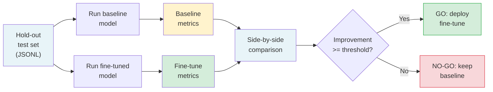

> A fine-tune that is not evaluated against a baseline is just an expensive guess.

**Type:** Build
**Languages:** Python
**Prerequisites:** Lesson 09-03 (Supervised Fine-Tuning via Managed APIs), Lesson 09-04 (LoRA and QLoRA)
**Time:** ~75 min
**Phase:** 09 - Fine-Tuning

---

## Learning Objectives

- Build a reusable eval harness that runs any two models against the same test set
- Calculate exact match accuracy, format validity rate, and cost-per-correct-output
- Produce a go/no-go recommendation from configurable improvement thresholds
- Understand why the hold-out test set must never overlap with training data
- Integrate the harness with Braintrust or LangSmith for continuous tracking

---

## The Problem

A team fine-tuned a model for structured JSON extraction (the task from Lesson 09-03). The fine-tuned model "seems better" based on 5 manual tests. But they cannot answer:

- Is it consistently better, or just better on those 5 examples?
- Does it regress on edge cases the base model previously handled?
- Is it better enough to justify maintaining a separate fine-tuned model in production?
- How does the cost picture change when you account for wrong outputs that need re-runs?

"Seems better" on 5 tests is not a deployable signal. It is a guess. A production deployment needs a number: the fine-tuned model is X% better on a representative test set of N examples, with no significant regressions on edge cases. Without that number, you are shipping on intuition.

The team also has a deadline. They do not have time to build a custom eval framework from scratch. They need a harness they can run in under an hour that gives them a defensible go/no-go answer.

---

## The Concept

### The Fine-Tune Evaluation Framework

A fine-tune eval has three phases: prepare the test data, run the models, compare the results.



### The Three Core Metrics

**Exact match accuracy:** For structured output tasks (JSON extraction, classification, slot filling), exact match is the ground truth metric. If the output matches the expected output character-for-character (after normalization), it is correct. Fuzzy matching hides real errors.

**Format validity rate:** Even if the content is wrong, the output must be parseable. A JSON extraction model that returns invalid JSON 5% of the time has a 5% hard failure rate in production, regardless of content quality. Track this separately.

**Cost per correct output:** Not cost per call. A call that returns wrong output is not free - it still costs tokens and adds latency. At scale, a 15% accuracy improvement may cut your effective cost by more than 15% if wrong outputs trigger retries.

### The Hold-Out Test Set Requirement

The test set must meet three criteria:

```
CRITERION             REQUIREMENT             WHY IT MATTERS
---------------------------------------------------------------------
No overlap           Zero examples from      Overlap inflates accuracy -
with training        training data           model memorizes, not learns
Representativeness   Same distribution       If test is easy, improvement
                     as production traffic   looks bigger than it is
Size                 Minimum 200 examples    <100 examples: +-10% error bars
                     (500+ preferred)        make results meaningless
```

Collect the test set before you build the training set. If you built the training set first, hold out at least 20% explicitly and verify zero overlap by hashing example inputs.

### The Go/No-Go Decision Framework

The minimum improvement threshold accounts for deployment cost:

```
DEPLOYMENT COST              MINIMUM IMPROVEMENT NEEDED
-------------------------------------------------------
No new infrastructure        5% relative improvement
Hosted adapter (same serve)  10% relative improvement
New model server              15% relative improvement
Separate service/container   20% relative improvement
```

These thresholds reflect the operational overhead of maintaining a separate fine-tuned model over time: monitoring, retraining as base models update, debugging regressions. A 3% improvement does not justify that overhead for most teams.

---

## Build It

### The Eval Harness

Run the demo to see a simulated evaluation without API keys:

```bash
python main.py --demo
```

With real API keys, compare two models on your test set:

```bash
export ANTHROPIC_API_KEY=...
python main.py \
  --baseline claude-3-5-haiku-20241022 \
  --fine-tuned ft:gpt-4o-mini-2024-07-18:your-org::abc123 \
  --test-set test.jsonl \
  --threshold 0.15
```

The harness loads a JSONL test file where each line has `input` and `expected_output` fields, runs both models with the same prompt, and compares outputs:

```python
import json
import time
from dataclasses import dataclass, field
from pathlib import Path
from typing import Optional


@dataclass
class EvalResult:
    model_id: str
    total: int
    exact_match: int
    format_valid: int
    errors: int
    total_latency_ms: float
    total_cost_usd: float

    @property
    def accuracy(self) -> float:
        return self.exact_match / self.total if self.total > 0 else 0.0

    @property
    def validity_rate(self) -> float:
        return self.format_valid / self.total if self.total > 0 else 0.0

    @property
    def cost_per_correct(self) -> float:
        if self.exact_match == 0:
            return float("inf")
        return self.total_cost_usd / self.exact_match

    @property
    def avg_latency_ms(self) -> float:
        return self.total_latency_ms / self.total if self.total > 0 else 0.0


def normalize(text: str) -> str:
    """Normalize output for comparison: parse JSON if possible, else strip whitespace."""
    text = text.strip()
    try:
        parsed = json.loads(text)
        return json.dumps(parsed, sort_keys=True)
    except json.JSONDecodeError:
        return text


def is_valid_json(text: str) -> bool:
    try:
        json.loads(text.strip())
        return True
    except json.JSONDecodeError:
        return False
```

The comparison table is printed after both runs complete:

```
MODEL                          ACCURACY   VALID JSON   AVG LATENCY   COST/CORRECT
-----------------------------------------------------------------------------------
claude-3-5-haiku-20241022       62.0%       91.5%        342ms         $0.000032
ft:gpt-4o-mini:abc123           74.0%       97.0%        289ms         $0.000019

Relative improvement: +19.4% accuracy, +5.5pp format validity, -40.6% cost/correct
Threshold: 15.0%  |  Result: GO - deploy the fine-tuned model
```

> **Real-world check:** Your eval harness shows the fine-tuned model is 18% better on your 300-example test set. A stakeholder asks: "Is 300 examples enough to trust this number?" What is the right answer?
>
> 300 examples gives roughly +-5.8% confidence interval at 95% confidence (using normal approximation for proportions). An 18% improvement is well outside that margin - the signal is real. For improvements of 5-10%, you would need 1,000+ examples to distinguish signal from noise. The rule: if your improvement is less than 3x the confidence interval, collect more data before deciding. For this case, 18% >> 5.8%, so 300 examples is sufficient.

---

## Use It

### Continuous Eval with Braintrust

The harness above is a one-off script. For continuous eval - tracking across fine-tuning runs over time - use Braintrust:

```python
import braintrust

# Initialize the project (creates or connects to existing)
project = braintrust.init_project("json-extraction-finetune-eval")

# Run an eval experiment
experiment = braintrust.Experiment(
    project=project,
    name="qlora-r16-epoch3",
    model="ft:your-model-id",
    description="LoRA r=16 after 3 epochs on clinical-qa-v2 dataset",
)

for example in test_examples:
    output = run_model(example["input"], model_id)
    experiment.log(
        input=example["input"],
        output=output,
        expected=example["expected_output"],
        scores={
            "exact_match": int(normalize(output) == normalize(example["expected_output"])),
            "format_valid": int(is_valid_json(output)),
        },
        metadata={
            "input_tokens": example.get("input_token_count"),
            "output_tokens": len(output.split()),
        },
    )

experiment.summarize()
```

For LangSmith, the pattern is equivalent: create a dataset, run an evaluation, log scores per example. Both platforms persist the results and let you compare runs side-by-side in a web UI.

The key value of continuous eval: you see whether your fine-tune degrades over time as the base model updates, and you catch regressions before they reach users.

> **Perspective shift:** Braintrust and LangSmith make tracking easy. Why not skip the local harness and just use the platform from the start?
>
> The local harness gives you something the platform cannot: the go/no-go number before you have a platform account, before the team has agreed on a tool, and before you have network access on a secured inference box. The platform is for long-term tracking and team visibility. The local harness is for the decision. Both serve different purposes and you need both.

---

## Ship It

The artifact for this lesson is a reusable eval harness template.

**`outputs/skill-finetune-eval-harness.md`** contains:
- Test set requirements (size, diversity, hold-out verification)
- Metric definitions for structured output, classification, and generation tasks
- The go/no-go decision framework with thresholds
- CI integration pattern for running eval on every training run

---

## Evaluate It

### Validating the Evaluator Itself

An eval harness can be wrong. The three failure modes:

**Metric gaming:** A model learns to produce outputs that score well on exact match without being correct. For JSON extraction, this means matching the key structure and data types while returning plausible-but-wrong values. Catch this with a human review of a random 5% sample.

**Evaluator miscalibration:** Your normalization logic differs from what users care about. If you normalize by sorting JSON keys but users care about key order (e.g., for streaming display), a model that scores 100% exact match is still wrong for the use case. Validate your normalization against 20 examples manually before running the full harness.

**Test set drift:** Over time, production inputs evolve while the test set stays static. A fine-tune that scores well on an 18-month-old test set may perform poorly on current traffic. Refresh at least 20% of the test set with recent production examples before each major eval cycle.

### Checking Agreement with Human Judgment

For 50 randomly sampled examples, run both the harness and a human evaluator. Compute agreement rate:

```
Agreement > 90%: harness is reliable
Agreement 75-90%: review disagreements, adjust normalization
Agreement < 75%: harness metric does not reflect what matters - fix before using
```

The human takes 1-2 hours for 50 examples. This calibration step is worth doing once before committing to a metric definition.

### CI Integration

Run the eval as a step in your training CI. Fail the pipeline if the fine-tune does not meet threshold:

```bash
python eval/main.py \
  --baseline $BASE_MODEL_ID \
  --fine-tuned $FINE_TUNED_MODEL_ID \
  --test-set data/test.jsonl \
  --threshold 0.15 \
  --output-json eval-results.json \
  --fail-below-threshold  # exits with code 1 if GO not reached

# CI reads exit code: 0 = GO, 1 = NO-GO
```

This prevents deploying a fine-tune that does not meet the quality bar without a human override.
