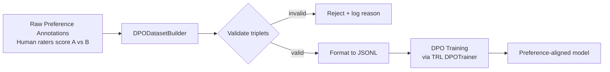

# ضبط التفضيلات باستخدام DPO

> تعليم النموذج ما الذي يُفضّله أصعب من تعليمه ما الذي يفعله - لكنه قابل للتوسّع.

**النوع:** تعلّم
**اللغات:** Python
**المتطلبات:** 05-evaluating-fine-tune، فهم أساسي لـ SFT
**الوقت:** ~45 دقيقة
**أهداف التعلّم:**
- شرح كيف يختلف DPO عن SFT ومتى يُستخدم كل منهما
- تحديد المكوّنات الثلاثة لثلاثية تدريب DPO
- بناء DPODatasetBuilder يُحوّل تعليقات التفضيل البشرية إلى DPO JSONL
- التحقق من صحة مجموعات بيانات DPO من حيث سلامة الصيغة والسلامة الإحصائية
- وصف خط أنابيب SFT-ثم-DPO المُستخدم في الإنتاج

---

## المشكلة

ضبطت نموذجًا (fine-tuned) على أمثلة دعم العملاء، وأصبح يكتب ردودًا صحيحة. لكن النبرة خاطئة. مقتضبة أكثر من اللازم، حادّة أحيانًا، ورسمية بشكل مفرط حين يحتاج العميل إلى دفء.

يمكنك كتابة دليل أسلوب ومحاولة ترميزه في كل مثال تدريبي. لكن النبرة صعبة الكتابة من الصفر. من السهل أن تقول "هذا الرد أفضل من ذاك". يمكن لمُقيّم بشري أن ينظر إلى ردّين على الرسالة نفسها ويقول فورًا أيهما يُفضّل. أما كتابة الرد "الصحيح" من صفحة بيضاء فأصعب بكثير.

هذه هي الفجوة التي لا يستطيع SFT سدّها. يُعلّم SFT النموذج ماذا يُنتج. وهو يتطلّب أن تكون لديك الإجابة الصحيحة. أما DPO فيُعلّم النموذج أيّ الإجابتين أفضل، باستخدام أزواج التفضيل البشرية. إن كانت مشكلتك في المواءمة (alignment) أو النبرة أو حواجز الأمان (safety guardrails) أو أسلوب المخرجات، فإن DPO هو الأداة الصحيحة. وإن لم تكن لديك الإجابة الصحيحة لكنك تستطيع التعرّف عليها، فإن DPO هو الأداة الصحيحة.

المأخذ: تطبيق DPO على نموذج أساسي غير مُدرّب عادةً ما يزيد الأمور سوءًا. خط الأنابيب الإنتاجي المعتاد هو SFT أولًا، ثم DPO ثانيًا. يغطّي هذا الدرس نصف DPO وصيغة مجموعة البيانات التي تجعله يعمل.

---

## المفهوم

### SFT مقابل DPO: إشارتا تعليم مختلفتان

يستخدم SFT و DPO إشارتي تدريب مختلفتين جوهريًا:

```
SFT FORMAT (prompt + single completion)
-----------------------------------------
Each example teaches: "given this input, produce this output"

  prompt: "Summarize this contract clause."
  completion: "The vendor must deliver within 30 days of PO receipt."

DPO FORMAT (prompt + chosen + rejected)
-----------------------------------------
Each example teaches: "given this input, prefer this output over that one"

  prompt: "How do I reset my password?"
  chosen:  "Click 'Forgot password' on the login page. You'll get
            an email within 2 minutes."
  rejected: "Use the forgot password link."
```

يتعلّم النموذج ترتيب تفضيل (preference ordering)، لا مجرد مخرجة هدف. هذا يتيح لك المواءمة على صفات ذاتية: الدفء، الإيجاز، الأمان، الرسمية.

### خط أنابيب بيانات DPO



يجب أن تتضمّن كل ثلاثية: الـ prompt نفسه في كل من chosen و rejected، وأن يكون chosen و rejected غير فارغين، وأن يكون النصّان المُكمِّلان مختلفين. الأزواج المتدهورة (degenerate) حيث يكون الخياران متطابقين تقريبًا تُهدر إشارة التدريب.

### متى DPO، ومتى SFT، ومتى كلاهما

```
Goal                          Tool        Why
----------------------------  ----------  ----------------------------------
Teach domain knowledge        SFT         You have correct answers
Teach output format           SFT         Format is objective
Align tone or style           DPO         Style is subjective, rankable
Apply safety guardrails       DPO         Easier to rank than to write safe
Reduce verbosity              DPO         Easy to rank, hard to specify
Production pipeline           SFT + DPO   SFT first, DPO to align
```

ترتيب SFT-ثم-DPO مهم. يحتاج DPO إلى نموذج يفهم المهمة أصلًا. فهو يوجّه نموذجًا قادرًا نحو السلوك المُفضّل. ولا يستطيع تعليم النموذج المهمة من الصفر.

---

## البناء

ابنِ `DPODatasetBuilder` يستوعب تعليقات التفضيل الخام ويُخرج JSONL بصيغة DPO للتدريب.

تُحاكي صيغة الإدخال ما تحصل عليه من منصّات التعليق (annotation): prompt، ردّان مرشّحان (A و B)، وإشارة تفضيل بشرية (أيهما أفضل، أو تعادل).

```python
from dataclasses import dataclass
from typing import Optional
import json
import re

@dataclass
class PreferenceAnnotation:
    """Raw human annotation: two candidates, one preferred."""
    prompt: str
    response_a: str
    response_b: str
    preferred: str  # "A", "B", or "tie"
    annotator_id: Optional[str] = None

@dataclass
class DPOExample:
    """DPO training triplet."""
    prompt: str
    chosen: str
    rejected: str
```

يتحقّق الباني من صحة كل تعليق، ويحوّله إلى ثلاثية، ويُبلّغ بالإحصائيات:

```python
class DPODatasetBuilder:
    def __init__(self, min_length: int = 20, max_length: int = 2000):
        self.min_length = min_length
        self.max_length = max_length
        self.stats = {"total": 0, "kept": 0, "rejected_tie": 0,
                      "rejected_invalid": 0, "rejected_length": 0}

    def validate(self, ann: PreferenceAnnotation) -> tuple[bool, str]:
        if ann.preferred == "tie":
            return False, "tie"
        if not ann.prompt.strip():
            return False, "empty_prompt"
        chosen = ann.response_a if ann.preferred == "A" else ann.response_b
        rejected = ann.response_b if ann.preferred == "A" else ann.response_a
        if chosen.strip() == rejected.strip():
            return False, "identical_responses"
        for text in [chosen, rejected]:
            if len(text.strip()) < self.min_length:
                return False, "too_short"
            if len(text.strip()) > self.max_length:
                return False, "too_long"
        return True, "ok"

    def convert(self, ann: PreferenceAnnotation) -> Optional[DPOExample]:
        valid, reason = self.validate(ann)
        self.stats["total"] += 1
        if not valid:
            if reason == "tie":
                self.stats["rejected_tie"] += 1
            elif reason in ("too_short", "too_long"):
                self.stats["rejected_length"] += 1
            else:
                self.stats["rejected_invalid"] += 1
            return None
        self.stats["kept"] += 1
        chosen = ann.response_a if ann.preferred == "A" else ann.response_b
        rejected = ann.response_b if ann.preferred == "A" else ann.response_a
        return DPOExample(prompt=ann.prompt, chosen=chosen, rejected=rejected)

    def build(self, annotations: list[PreferenceAnnotation],
              output_path: str) -> dict:
        examples = []
        for ann in annotations:
            ex = self.convert(ann)
            if ex:
                examples.append({
                    "prompt": ex.prompt,
                    "chosen": ex.chosen,
                    "rejected": ex.rejected,
                })
        with open(output_path, "w") as f:
            for ex in examples:
                f.write(json.dumps(ex) + "\n")
        keep_rate = self.stats["kept"] / max(self.stats["total"], 1) * 100
        return {**self.stats, "keep_rate_pct": round(keep_rate, 1),
                "output_path": output_path}
```

> **اختبار من الواقع:** لديك 1,200 تعليق تفضيل من سباق تعليق استمرّ 3 أسابيع. يُبلّغ الباني عن معدّل رفض 34%، معظمه تعادلات. هل تُعيد التعليق لتقليل التعادلات، أم تمضي بالـ 790 ثلاثية الصالحة؟
>
> امضِ بالـ 790. معدّل رفض 34% صحّي. تحدث التعادلات حين يكون الردّان متشابهين فعلًا في الجودة - إجبار المُعلّقين على الاختيار يُنتج إشارة مشوّشة. ستُدرّب 790 ثلاثية عالية الإشارة بشكل أفضل من 1,200 ثلاثية كان 400 منها مجرد رمي عملة.

---

## الاستخدام

يوفّر TRL (Transformer Reinforcement Learning، من Hugging Face) صنف `DPOTrainer`، الذي يستهلك بالضبط صيغة JSONL التي بُنيت أعلاه.

```python
from datasets import load_dataset
from trl import DPOTrainer, DPOConfig
from transformers import AutoModelForCausalLM, AutoTokenizer

# Load the JSONL produced by DPODatasetBuilder
dataset = load_dataset("json", data_files="dpo_dataset.jsonl", split="train")

model = AutoModelForCausalLM.from_pretrained("your-sft-checkpoint")
ref_model = AutoModelForCausalLM.from_pretrained("your-sft-checkpoint")
tokenizer = AutoTokenizer.from_pretrained("your-sft-checkpoint")

training_args = DPOConfig(
    output_dir="./dpo-output",
    num_train_epochs=1,
    per_device_train_batch_size=4,
    beta=0.1,  # KL penalty coefficient - higher = closer to reference
)

trainer = DPOTrainer(
    model=model,
    ref_model=ref_model,
    args=training_args,
    train_dataset=dataset,
    processing_class=tokenizer,
)

trainer.train()
```

معاملان أساسيان: `ref_model` هو نقطة التحقّق (checkpoint) من SFT التي يُنظَّم نموذج DPO بالنسبة إليها. ويتحكّم `beta` في مدى ابتعاد نموذج DPO عن المرجع. كلما ارتفع beta بقي النموذج أقرب إلى سلوك SFT؛ وكلما انخفض beta سمح بتحسين تفضيل أكثر جرأة.

لن تُشغّل هذا على مهمّة تدريب GPU كاملة في هذا الدرس. صيغة مجموعة البيانات التي بنيتها أعلاه هي المخرجة الحرجة. أما عملية التدريب نفسها فمباشرة بمجرّد أن تكون البيانات صحيحة.

> **نقلة في المنظور:** يبدو DPOTrainer في TRL بسيطًا - بضعة أسطر إعداد واستدعاء train(). التعقيد كله في مجموعة البيانات. مجموعة مُنسّقة جيدًا من 500 ثلاثية بإشارة تفضيل متّسقة ستتفوّق على 5,000 ثلاثية بتعليقات مشوّشة. DPO مشكلة تنسيق بيانات (data curation) صادف أنها تستخدم حلقة تدريب.

---

## التسليم

مُخرَج هذا الدرس هو `outputs/skill-dpo-dataset-format.md`، وهو مواصفة صيغة قابلة لإعادة الاستخدام وقائمة تحقّق للتحقق من مجموعات بيانات DPO.

استخدمه كمرجع عند تحضير بيانات التفضيل لأي عملية تدريب DPO.

---

## التقييم

تكون مجموعة بيانات DPO صحّية حين:

1. **معدّل الاحتفاظ فوق 60%.** أقل من 60% يعني أن عملية التعليق تُنتج تعادلات كثيرة جدًا أو أزواجًا منخفضة الجودة. أصلِح إرشادات التعليق قبل التدريب.

2. **توزيع الطول متوازن.** إن كانت الردود المختارة (chosen) أطول باستمرار بثلاثة أضعاف من المرفوضة (rejected)، فقد يتعلّم النموذج "كن مُسهبًا" بدلًا من "كن مفيدًا". تحقّق من `mean(len(chosen))` مقابل `mean(len(rejected))` في إحصائياتك.

3. **تنوّع الـ prompts كافٍ.** إن كانت 80% من الـ prompts تغطّي النوع نفسه من السيناريوهات، سيفرط النموذج في الملاءمة (over-fit) لذلك السيناريو. اجمع الـ prompts في عناقيد حسب الموضوع وتحقّق من التغطية قبل التدريب.

4. **معدّل الفوز بعد التدريب يتفوّق على خط أساس SFT.** شغّل مجموعة التقييم من الدرس 05 على: نقطة تحقّق SFT، ونقطة تحقّق DPO. إن لم تفز نقطة تحقّق DPO على مقياس المواءمة لديك (درجات النبرة، معدّل اجتياز الأمان، معيار الأسلوب)، فإن إشارة التفضيل كانت ضعيفة جدًا أو مشوّشة جدًا.

5. **نقطة تحقّق DPO لا تتراجع في دقّة المهمة.** دُرّب نموذج SFT لأداء المهمة. ينبغي أن يحسّن DPO المواءمة دون إضعافها. إن انخفضت دقّة المهمة أكثر من 5%، فإن قيمة beta لديك منخفضة جدًا أو أن التدريب استمرّ طويلًا جدًا.
