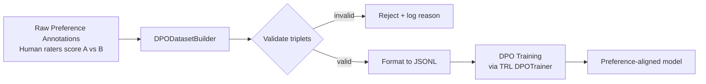

# Preference Tuning with DPO

> Teaching a model what to prefer is harder than teaching it what to do - but it scales.

**Type:** Learn
**Languages:** Python
**Prerequisites:** 05-evaluating-fine-tune, basic understanding of SFT
**Time:** ~45 min
**Learning Objectives:**
- Explain how DPO differs from SFT and when each applies
- Identify the three components of a DPO training triplet
- Build a DPODatasetBuilder that converts human preference annotations to DPO JSONL
- Validate DPO datasets for format correctness and statistical health
- Describe the SFT-then-DPO pipeline used in production

---

## The Problem

You've fine-tuned a model on customer support examples and it writes correct responses. But the tone is wrong. It's too terse, occasionally curt, sometimes overly formal when the customer needs warmth.

You could write a style guide and try to encode it in every training example. But tone is hard to write from scratch. It's easy to say "this response is better than that one." A human rater can look at two responses to the same message and immediately say which they prefer. Writing the "correct" response from a blank slate is much harder.

This is the gap SFT cannot close. SFT teaches the model what to produce. It requires you to have the right answer. DPO teaches the model which of two answers is better, using human preference pairs. If your problem is alignment, tone, safety guardrails, or output style, DPO is the right tool. If you don't have the right answer but you can recognize it, DPO is the right tool.

The catch: DPO on an untrained base model usually makes things worse. The standard production pipeline is SFT first, DPO second. This lesson covers the DPO half and the dataset format that makes it work.

---

## The Concept

### SFT vs. DPO: Two Different Teaching Signals

SFT and DPO use fundamentally different training signals:

```
SFT FORMAT (prompt + single completion)
-----------------------------------------
Each example teaches: "given this input, produce this output"

  prompt: "Summarize this contract clause."
  completion: "The vendor must deliver within 30 days of PO receipt."

DPO FORMAT (prompt + chosen + rejected)
-----------------------------------------
Each example teaches: "given this input, prefer this output over that one"

  prompt: "How do I reset my password?"
  chosen:  "Click 'Forgot password' on the login page. You'll get
            an email within 2 minutes."
  rejected: "Use the forgot password link."
```

The model learns a preference ordering, not just a target output. This lets you align on subjective qualities: warmth, brevity, safety, formality.

### The DPO Data Pipeline



Each triplet must have: the same prompt in both chosen and rejected, non-empty chosen and rejected, and the two completions must be different. Degenerate pairs where both options are nearly identical waste training signal.

### When DPO, When SFT, When Both

```
Goal                          Tool        Why
----------------------------  ----------  ----------------------------------
Teach domain knowledge        SFT         You have correct answers
Teach output format           SFT         Format is objective
Align tone or style           DPO         Style is subjective, rankable
Apply safety guardrails       DPO         Easier to rank than to write safe
Reduce verbosity              DPO         Easy to rank, hard to specify
Production pipeline           SFT + DPO   SFT first, DPO to align
```

The SFT-then-DPO order matters. DPO needs a model that already understands the task. It nudges a capable model toward preferred behavior. It cannot teach a model the task from scratch.

---

## Build It

Build a `DPODatasetBuilder` that ingests raw preference annotations and outputs DPO-formatted JSONL for training.

The input format mirrors what you get from annotation platforms: a prompt, two candidate responses (A and B), and a human preference signal (which is better, or a tie).

```python
from dataclasses import dataclass
from typing import Optional
import json
import re

@dataclass
class PreferenceAnnotation:
    """Raw human annotation: two candidates, one preferred."""
    prompt: str
    response_a: str
    response_b: str
    preferred: str  # "A", "B", or "tie"
    annotator_id: Optional[str] = None

@dataclass
class DPOExample:
    """DPO training triplet."""
    prompt: str
    chosen: str
    rejected: str
```

The builder validates each annotation, converts it to a triplet, and reports statistics:

```python
class DPODatasetBuilder:
    def __init__(self, min_length: int = 20, max_length: int = 2000):
        self.min_length = min_length
        self.max_length = max_length
        self.stats = {"total": 0, "kept": 0, "rejected_tie": 0,
                      "rejected_invalid": 0, "rejected_length": 0}

    def validate(self, ann: PreferenceAnnotation) -> tuple[bool, str]:
        if ann.preferred == "tie":
            return False, "tie"
        if not ann.prompt.strip():
            return False, "empty_prompt"
        chosen = ann.response_a if ann.preferred == "A" else ann.response_b
        rejected = ann.response_b if ann.preferred == "A" else ann.response_a
        if chosen.strip() == rejected.strip():
            return False, "identical_responses"
        for text in [chosen, rejected]:
            if len(text.strip()) < self.min_length:
                return False, "too_short"
            if len(text.strip()) > self.max_length:
                return False, "too_long"
        return True, "ok"

    def convert(self, ann: PreferenceAnnotation) -> Optional[DPOExample]:
        valid, reason = self.validate(ann)
        self.stats["total"] += 1
        if not valid:
            if reason == "tie":
                self.stats["rejected_tie"] += 1
            elif reason in ("too_short", "too_long"):
                self.stats["rejected_length"] += 1
            else:
                self.stats["rejected_invalid"] += 1
            return None
        self.stats["kept"] += 1
        chosen = ann.response_a if ann.preferred == "A" else ann.response_b
        rejected = ann.response_b if ann.preferred == "A" else ann.response_a
        return DPOExample(prompt=ann.prompt, chosen=chosen, rejected=rejected)

    def build(self, annotations: list[PreferenceAnnotation],
              output_path: str) -> dict:
        examples = []
        for ann in annotations:
            ex = self.convert(ann)
            if ex:
                examples.append({
                    "prompt": ex.prompt,
                    "chosen": ex.chosen,
                    "rejected": ex.rejected,
                })
        with open(output_path, "w") as f:
            for ex in examples:
                f.write(json.dumps(ex) + "\n")
        keep_rate = self.stats["kept"] / max(self.stats["total"], 1) * 100
        return {**self.stats, "keep_rate_pct": round(keep_rate, 1),
                "output_path": output_path}
```

> **Real-world check:** You have 1,200 preference annotations from a 3-week annotation sprint. The builder reports a 34% rejection rate, mostly ties. Should you re-annotate to reduce ties, or proceed with the 790 valid triplets?
>
> Proceed with the 790. A 34% rejection rate is healthy. Ties happen when two responses are genuinely similar in quality - forcing annotators to choose produces noisy signal. 790 high-signal triplets will train better than 1,200 triplets where 400 were coin flips.

---

## Use It

TRL (Transformer Reinforcement Learning, from Hugging Face) provides `DPOTrainer`, which consumes exactly the JSONL format built above.

```python
from datasets import load_dataset
from trl import DPOTrainer, DPOConfig
from transformers import AutoModelForCausalLM, AutoTokenizer

# Load the JSONL produced by DPODatasetBuilder
dataset = load_dataset("json", data_files="dpo_dataset.jsonl", split="train")

model = AutoModelForCausalLM.from_pretrained("your-sft-checkpoint")
ref_model = AutoModelForCausalLM.from_pretrained("your-sft-checkpoint")
tokenizer = AutoTokenizer.from_pretrained("your-sft-checkpoint")

training_args = DPOConfig(
    output_dir="./dpo-output",
    num_train_epochs=1,
    per_device_train_batch_size=4,
    beta=0.1,  # KL penalty coefficient - higher = closer to reference
)

trainer = DPOTrainer(
    model=model,
    ref_model=ref_model,
    args=training_args,
    train_dataset=dataset,
    processing_class=tokenizer,
)

trainer.train()
```

Two key parameters: the `ref_model` is the SFT checkpoint the DPO model is regularized against. The `beta` controls how far the DPO model can drift from the reference. Higher beta keeps the model closer to its SFT behavior; lower beta allows more aggressive preference optimization.

You won't run this against a full GPU training job in this lesson. The dataset format you built above is the critical output. The training run itself is straightforward once the data is right.

> **Perspective shift:** TRL's DPOTrainer looks simple - a few config lines and a train() call. The complexity is entirely in the dataset. A well-curated set of 500 triplets with consistent preference signal will outperform 5,000 triplets with noisy annotations. DPO is a data curation problem that happens to use a training loop.

---

## Ship It

The artifact for this lesson is `outputs/skill-dpo-dataset-format.md`, a reusable format spec and validation checklist for DPO datasets.

Use it as a reference when preparing preference data for any DPO training run.

---

## Evaluate It

A DPO dataset is healthy when:

1. **Keep rate is above 60%.** Below 60% means your annotation process is producing too many ties or too many low-quality pairs. Fix the annotation guidelines before training.

2. **Length distribution is balanced.** If chosen responses are consistently 3x longer than rejected, the model may learn "be verbose" rather than "be helpful." Check `mean(len(chosen))` vs `mean(len(rejected))` in your stats.

3. **Prompt diversity is sufficient.** If 80% of your prompts cover the same scenario type, the model will over-fit to that scenario. Cluster prompts by topic and verify coverage before training.

4. **Post-training win rate beats the SFT baseline.** Run your evaluation suite from Lesson 05 on: SFT checkpoint, DPO checkpoint. If the DPO checkpoint does not win on your alignment metric (tone scores, safety pass rate, style rubric), the preference signal was too weak or too noisy.

5. **DPO checkpoint does not regress on task accuracy.** The SFT model was trained for task performance. DPO should improve alignment without degrading it. If task accuracy drops more than 5%, your beta is too low or your training ran too long.
