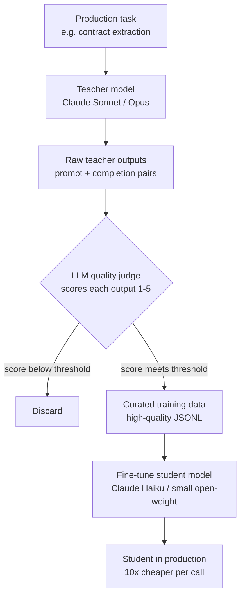

# التقطير من أجل التكلفة

> استخدم عبقريًا ليُعلّم متدرّبًا، ثم أحِل العبقري إلى التقاعد.

**النوع:** بناء
**اللغات:** Python
**المتطلبات:** 03-supervised-fine-tuning-managed، 05-evaluating-fine-tune
**الوقت:** ~45 دقيقة
**أهداف التعلّم:**
- شرح نمط التقطير معلّم-طالب (teacher-student distillation) وأين يخفّض التكلفة
- بناء DistillationPipeline يُولّد بيانات التدريب ويُقيّمها ويُرشّحها
- تطبيق حَكَم LLM (LLM judge) لضبط جودة مخرجات المعلّم قبل استخدامها كبيانات تدريب
- حساب التكلفة لكل 1000 استدعاء قبل نشر التقطير وبعده
- تحديد متى يكون عائد الاستثمار (ROI) للتقطير موجبًا مقابل سالبًا

---

## المشكلة

بنيت خط أنابيب استخراج بنيوي (structured extraction) يسحب المصطلحات الأساسية والتواريخ وأسماء الأطراف من العقود القانونية. يستخدم Claude Sonnet. يعمل جيدًا. درجات التقييم متينة.

ثم تفحص الفاتورة.

عند 500 مستند يوميًا، كل منها بمتوسّط 3,000 توكن داخل و400 توكن خارج، أنت تنفق 180 دولارًا يوميًا على هذا الخط وحده. 5,400 دولار شهريًا. لمهمة استخراج واحدة.

لا يمكنك التحوّل إلى نموذج أرخص جاهز. جرّبت Claude Haiku فانخفضت جودة الاستخراج من 94% إلى 78%. هذه مقايضة غير مقبولة.

لكن إليك ما يمكنك فعله: استخدم Claude Sonnet لتوليد 2,000 مثال استخراج عالي الجودة، شغّل مُرشّح جودة للإبقاء على الأفضل فقط، ثم اضبط Claude Haiku (fine-tune) على تلك الأمثلة. بعد الضبط، فإن نموذجًا أصغر يؤدّي مهمة محدّدة دُرّب عليها كثيرًا ما يضاهي النموذج الأكبر أو يتفوّق عليه في تلك المهمة بينما يكلّف أقل بعشرة أضعاف لكل استدلال (inference).

هذا هو تقطير المعرفة (knowledge distillation) في الإنتاج: استخدم النموذج الكبير ليُعلّم، ثم استبدله بالصغير.

---

## المفهوم

### خط أنابيب المعلّم-الطالب



مُرشّح الجودة هو الخطوة الحرجة. إن تجاوزته ودرّبت على كل مخرجات المعلّم، فستُدرّب على أخطاء المعلّم أيضًا. معدّل تجاهُل 50% ليس فشلًا؛ بل هو ضبط جودة.

### نموذج التكلفة

```
                    BEFORE              AFTER
                    ------------------  -----------------
Model               Claude Sonnet       Claude Haiku FT
Cost per 1M tokens  $3.00 / $15.00      $0.25 / $1.25
Daily calls         500                 500
Avg input tokens    3,000               3,000
Avg output tokens   400                 400
Daily cost          $24.75              $2.06
Monthly cost        $742                $62
Fine-tune cost      -                   ~$50 one-time
Payback period      -                   < 1 month
```

هذه الأرقام توضيحية. النمط ثابت: عند الحجم الكبير، يُسدّد نموذج صغير مُقطّر جيدًا تكلفة الضبط خلال أسابيع.

### متى ينجح التقطير ومتى يفشل

```
WORKS WELL                          FAILS OR UNDERPERFORMS
----------------------------------  ----------------------------------
Narrow, repeatable task             Open-ended creative tasks
Stable input distribution           Highly variable or novel inputs
Quality of teacher output is high   Teacher itself makes frequent errors
Volume is high enough to justify    Low volume (< 100 calls/day)
Task is well-defined enough to      Task requires broad world knowledge
  judge output quality              the small model lacks
```

---

## البناء

ابنِ `DistillationPipeline` يُمرّر مهمة عبر نموذج معلّم، ويُقيّم جودة كل مخرجة، ويحفظ الأمثلة عالية الجودة فقط كبيانات تدريب.

```python
import anthropic
import json
import time
from dataclasses import dataclass, field
from typing import Optional

client = anthropic.Anthropic()

TEACHER_MODEL = "claude-opus-4-5"
JUDGE_MODEL = "claude-3-5-haiku-20241022"
STUDENT_MODEL = "claude-3-5-haiku-20241022"  # target for fine-tuning

@dataclass
class DistillationExample:
    prompt: str
    completion: str
    quality_score: Optional[float] = None
    kept: bool = False
```

يعمل خط الأنابيب الأساسي على ثلاث مراحل: التوليد، التقييم، الترشيح:

```python
class DistillationPipeline:
    def __init__(self, quality_threshold: float = 3.5,
                 teacher: str = TEACHER_MODEL,
                 judge: str = JUDGE_MODEL):
        self.quality_threshold = quality_threshold
        self.teacher = teacher
        self.judge = judge
        self.stats = {
            "generated": 0, "judged": 0,
            "kept": 0, "discarded": 0
        }

    def generate(self, prompt: str, system: str = "") -> str:
        """Run the teacher model on one prompt."""
        messages = [{"role": "user", "content": prompt}]
        kwargs = {"model": self.teacher, "max_tokens": 1024, "messages": messages}
        if system:
            kwargs["system"] = system
        response = client.messages.create(**kwargs)
        return response.content[0].text

    def judge_quality(self, prompt: str, completion: str,
                      task_description: str) -> float:
        """Score the completion 1-5 using an LLM judge."""
        judge_prompt = f"""You are a quality evaluator for AI training data.

Task the model was asked to do: {task_description}

User prompt: {prompt}

Model completion: {completion}

Score this completion from 1 to 5:
1 = Wrong, incomplete, or harmful
2 = Partially correct, missing key information
3 = Correct but could be cleaner or more complete
4 = Good quality, accurate, well-formatted
5 = Excellent - exactly what a human expert would produce

Respond with ONLY a number 1-5. No explanation."""

        response = client.messages.create(
            model=self.judge,
            max_tokens=10,
            messages=[{"role": "user", "content": judge_prompt}]
        )
        try:
            return float(response.content[0].text.strip())
        except ValueError:
            return 1.0  # default low score on parse failure

    def run(self, prompts: list[str], task_description: str,
            system: str = "", output_path: str = "distilled.jsonl") -> dict:
        examples = []
        for i, prompt in enumerate(prompts):
            print(f"  Generating {i+1}/{len(prompts)}...")
            completion = self.generate(prompt, system=system)
            self.stats["generated"] += 1

            score = self.judge_quality(prompt, completion, task_description)
            self.stats["judged"] += 1

            ex = DistillationExample(
                prompt=prompt,
                completion=completion,
                quality_score=score,
                kept=score >= self.quality_threshold
            )
            examples.append(ex)

            if ex.kept:
                self.stats["kept"] += 1
            else:
                self.stats["discarded"] += 1

            # Respect rate limits
            time.sleep(0.5)

        # Write only kept examples to JSONL
        kept = [e for e in examples if e.kept]
        with open(output_path, "w") as f:
            for ex in kept:
                record = {
                    "messages": [
                        {"role": "user", "content": ex.prompt},
                        {"role": "assistant", "content": ex.completion}
                    ]
                }
                f.write(json.dumps(record) + "\n")

        keep_rate = self.stats["kept"] / max(self.stats["generated"], 1) * 100
        return {**self.stats, "keep_rate_pct": round(keep_rate, 1),
                "output_path": output_path}
```

> **اختبار من الواقع:** يُولّد خط التقطير لديك 500 مثال. يتجاهل الحَكَم 280 منها - معدّل تجاهُل 56%. يقول زميلك إن العتبة صارمة جدًا وعليك خفضها إلى 2.5 للإبقاء على بيانات أكثر. ماذا تفعل؟
>
> أبقِ العتبة أو ارفعها. الـ 220 مثالًا التي سجّلت 3.5+ هي إشارة التدريب الفعلية لديك. إضافة 280 مثالًا متوسّطًا سيُخفّف الجودة وقد يُدخل أنماطًا لا تريدها. إن كانت 220 مثالًا قليلة جدًا، فمرّر prompts أكثر عبر المعلّم - ولا تخفض معايير الجودة لحشو العدد.

---

## الاستخدام

طبّق خط الأنابيب على مهمة استخراج بنيوي وقِس فرق التكلفة.

```python
import re

SYSTEM_PROMPT = """You are a legal contract parser. Extract structured data
from contract clauses. Always respond in valid JSON."""

TASK_DESCRIPTION = "Extract party names, effective date, and obligation from contract clauses"

# Sample contract clauses (in practice, these come from your document corpus)
SAMPLE_CLAUSES = [
    "This Agreement is entered into as of January 15, 2025, between Acme Corp ('Vendor') and Beta LLC ('Client'). Vendor shall deliver software within 30 days.",
    "Effective March 1, 2025, DataSystems Inc and CloudHost Partners agree that CloudHost will provide 99.9% uptime SLA.",
    # ... more examples from your actual corpus
]

PROMPTS = [
    f"Extract the party names, effective date, and primary obligation from this clause:\n\n{clause}"
    for clause in SAMPLE_CLAUSES
]

pipeline = DistillationPipeline(quality_threshold=3.5)
result = pipeline.run(
    prompts=PROMPTS,
    task_description=TASK_DESCRIPTION,
    system=SYSTEM_PROMPT,
    output_path="contract_extraction_training.jsonl"
)

print(f"Generated: {result['generated']}")
print(f"Kept: {result['kept']} ({result['keep_rate_pct']}%)")
print(f"Training data saved to: {result['output_path']}")

# Cost comparison
TEACHER_COST_PER_1K = 0.015   # Sonnet-level per 1K output tokens (approximate)
STUDENT_COST_PER_1K = 0.00125  # Haiku-level per 1K output tokens (approximate)
daily_calls = 500
avg_output_tokens = 400

daily_cost_before = (daily_calls * avg_output_tokens / 1000) * TEACHER_COST_PER_1K
daily_cost_after = (daily_calls * avg_output_tokens / 1000) * STUDENT_COST_PER_1K
monthly_savings = (daily_cost_before - daily_cost_after) * 30

print(f"\nCost before distillation: ${daily_cost_before:.2f}/day")
print(f"Cost after distillation: ${daily_cost_after:.2f}/day")
print(f"Monthly savings: ${monthly_savings:.0f}")
```

> **نقلة في المنظور:** يبدو التقطير كحيلة تدريب. لكنه في الإنتاج قرار هندسة تكلفة. أنت تشتري تكلفة ضبط لمرة واحدة لتُلغي تكلفة استدلال متكرّرة. مُرشّح الجودة ليس ضمان جودة - بل هو حماية لعائد الاستثمار. كل مثال منخفض الجودة يدخل بيانات التدريب يُقلّل أداء الطالب ويُآكل وفورات التكلفة التي بُرّر بها المشروع كله.

---

## التسليم

مُخرَج هذا الدرس هو `outputs/skill-distillation-pipeline.md`، وهو مواصفة نمط قابلة لإعادة الاستخدام لبناء خطوط تقطير معلّم-طالب مع ترشيح الجودة.

---

## التقييم

قِس نجاح التقطير على ثلاثة محاور:

**1. الاحتفاظ بالجودة.** شغّل مجموعة تقييم المهمة (من الدرس 05) على كل من نموذج المعلّم والطالب المضبوط. الهدف: أن يحقّق الطالب 90% على الأقل من درجة المعلّم. أقل من 85% يعني إما أن بيانات التدريب كانت صغيرة جدًا، أو أن مُرشّح الجودة كان متساهلًا جدًا، أو أن المهمة تتطلّب قدرات لا يملكها نموذج الطالب.

**2. تخفيض التكلفة.** احسب التكلفة الفعلية لكل 1000 استدعاء في الإنتاج لكلا النموذجين. النسبة المستهدفة 5:1 أو أفضل. إن كانت النسبة أقل من 3:1، فتحقّق ممّا إذا كان نموذج الطالب يُنتج مخرجات أطول (حشو، تكرار) تُضخّم عدد التوكنات.

**3. مراقبة الانحراف (drift).** دُرّب نموذج الطالب على لقطة من مهمتك الإنتاجية. إن تغيّر توزيع المدخلات لديك (صيغ عقود جديدة، أنواع بنود جديدة)، فسيتدهور الطالب بينما لن يتدهور المعلّم. راقب الدقّة أسبوعيًا في الشهر الأول، ثم شهريًا. حين تنخفض الدقّة دون عتبتك، أعِد تشغيل خط التقطير بأمثلة جديدة من التوزيع الحالي.
