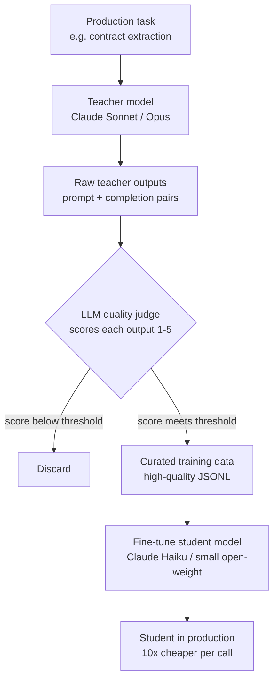

# Distillation for Cost

> Use a genius to teach an apprentice, then retire the genius.

**Type:** Build
**Languages:** Python
**Prerequisites:** 03-supervised-fine-tuning-managed, 05-evaluating-fine-tune
**Time:** ~45 min
**Learning Objectives:**
- Explain the teacher-student distillation pattern and where it cuts cost
- Build a DistillationPipeline that generates, scores, and filters training data
- Apply an LLM judge to quality-gate teacher outputs before using them as training data
- Calculate cost-per-1000-calls before and after distillation deployment
- Identify when distillation ROI is positive vs. negative

---

## The Problem

You built a structured extraction pipeline that pulls key terms, dates, and party names from legal contracts. It uses Claude Sonnet. It works well. The eval scores are solid.

Then you check the bill.

At 500 documents per day, each averaging 3,000 tokens in and 400 tokens out, you are running $180 per day just on this one pipeline. $5,400 per month. For a single extraction task.

You cannot switch to a cheaper model off the shelf. You tried Claude Haiku and the extraction quality dropped from 94% to 78%. That is not an acceptable trade.

But here is what you can do: use Claude Sonnet to generate 2,000 high-quality extraction examples, run a quality filter to keep only the best ones, and fine-tune Claude Haiku on those examples. After fine-tuning, a smaller model doing a specific task it was trained on often matches or beats the larger model on that task while costing 10x less per inference.

This is knowledge distillation in production: use the large model to teach, then replace the large model with the small one.

---

## The Concept

### The Teacher-Student Pipeline



The quality filter is the critical step. If you skip it and train on all teacher outputs, you train on the teacher's mistakes too. A 50% discard rate is not failure; it is quality control.

### Cost Model

```
                    BEFORE              AFTER
                    ------------------  -----------------
Model               Claude Sonnet       Claude Haiku FT
Cost per 1M tokens  $3.00 / $15.00      $0.25 / $1.25
Daily calls         500                 500
Avg input tokens    3,000               3,000
Avg output tokens   400                 400
Daily cost          $24.75              $2.06
Monthly cost        $742                $62
Fine-tune cost      -                   ~$50 one-time
Payback period      -                   < 1 month
```

These numbers are illustrative. The pattern holds: at high volume, a well-distilled small model pays for the fine-tune cost within weeks.

### When Distillation Works vs. When It Fails

```
WORKS WELL                          FAILS OR UNDERPERFORMS
----------------------------------  ----------------------------------
Narrow, repeatable task             Open-ended creative tasks
Stable input distribution           Highly variable or novel inputs
Quality of teacher output is high   Teacher itself makes frequent errors
Volume is high enough to justify    Low volume (< 100 calls/day)
Task is well-defined enough to      Task requires broad world knowledge
  judge output quality              the small model lacks
```

---

## Build It

Build a `DistillationPipeline` that runs a task through a teacher model, judges the quality of each output, and saves only the high-quality examples as training data.

```python
import anthropic
import json
import time
from dataclasses import dataclass, field
from typing import Optional

client = anthropic.Anthropic()

TEACHER_MODEL = "claude-opus-4-5"
JUDGE_MODEL = "claude-3-5-haiku-20241022"
STUDENT_MODEL = "claude-3-5-haiku-20241022"  # target for fine-tuning

@dataclass
class DistillationExample:
    prompt: str
    completion: str
    quality_score: Optional[float] = None
    kept: bool = False
```

The core pipeline runs in three stages: generate, judge, filter:

```python
class DistillationPipeline:
    def __init__(self, quality_threshold: float = 3.5,
                 teacher: str = TEACHER_MODEL,
                 judge: str = JUDGE_MODEL):
        self.quality_threshold = quality_threshold
        self.teacher = teacher
        self.judge = judge
        self.stats = {
            "generated": 0, "judged": 0,
            "kept": 0, "discarded": 0
        }

    def generate(self, prompt: str, system: str = "") -> str:
        """Run the teacher model on one prompt."""
        messages = [{"role": "user", "content": prompt}]
        kwargs = {"model": self.teacher, "max_tokens": 1024, "messages": messages}
        if system:
            kwargs["system"] = system
        response = client.messages.create(**kwargs)
        return response.content[0].text

    def judge_quality(self, prompt: str, completion: str,
                      task_description: str) -> float:
        """Score the completion 1-5 using an LLM judge."""
        judge_prompt = f"""You are a quality evaluator for AI training data.

Task the model was asked to do: {task_description}

User prompt: {prompt}

Model completion: {completion}

Score this completion from 1 to 5:
1 = Wrong, incomplete, or harmful
2 = Partially correct, missing key information
3 = Correct but could be cleaner or more complete
4 = Good quality, accurate, well-formatted
5 = Excellent - exactly what a human expert would produce

Respond with ONLY a number 1-5. No explanation."""

        response = client.messages.create(
            model=self.judge,
            max_tokens=10,
            messages=[{"role": "user", "content": judge_prompt}]
        )
        try:
            return float(response.content[0].text.strip())
        except ValueError:
            return 1.0  # default low score on parse failure

    def run(self, prompts: list[str], task_description: str,
            system: str = "", output_path: str = "distilled.jsonl") -> dict:
        examples = []
        for i, prompt in enumerate(prompts):
            print(f"  Generating {i+1}/{len(prompts)}...")
            completion = self.generate(prompt, system=system)
            self.stats["generated"] += 1

            score = self.judge_quality(prompt, completion, task_description)
            self.stats["judged"] += 1

            ex = DistillationExample(
                prompt=prompt,
                completion=completion,
                quality_score=score,
                kept=score >= self.quality_threshold
            )
            examples.append(ex)

            if ex.kept:
                self.stats["kept"] += 1
            else:
                self.stats["discarded"] += 1

            # Respect rate limits
            time.sleep(0.5)

        # Write only kept examples to JSONL
        kept = [e for e in examples if e.kept]
        with open(output_path, "w") as f:
            for ex in kept:
                record = {
                    "messages": [
                        {"role": "user", "content": ex.prompt},
                        {"role": "assistant", "content": ex.completion}
                    ]
                }
                f.write(json.dumps(record) + "\n")

        keep_rate = self.stats["kept"] / max(self.stats["generated"], 1) * 100
        return {**self.stats, "keep_rate_pct": round(keep_rate, 1),
                "output_path": output_path}
```

> **Real-world check:** Your distillation pipeline generates 500 examples. The judge discards 280 of them - a 56% discard rate. Your colleague says the threshold is too strict and you should lower it to 2.5 to keep more data. What do you do?
>
> Keep the threshold or raise it. The 220 examples that scored 3.5+ are your actual training signal. Adding 280 mediocre examples will dilute the quality and may introduce patterns you don't want. If 220 examples are too few, run more prompts through the teacher - do not lower quality standards to pad the count.

---

## Use It

Apply the pipeline to a structured extraction task and measure the cost difference.

```python
import re

SYSTEM_PROMPT = """You are a legal contract parser. Extract structured data
from contract clauses. Always respond in valid JSON."""

TASK_DESCRIPTION = "Extract party names, effective date, and obligation from contract clauses"

# Sample contract clauses (in practice, these come from your document corpus)
SAMPLE_CLAUSES = [
    "This Agreement is entered into as of January 15, 2025, between Acme Corp ('Vendor') and Beta LLC ('Client'). Vendor shall deliver software within 30 days.",
    "Effective March 1, 2025, DataSystems Inc and CloudHost Partners agree that CloudHost will provide 99.9% uptime SLA.",
    # ... more examples from your actual corpus
]

PROMPTS = [
    f"Extract the party names, effective date, and primary obligation from this clause:\n\n{clause}"
    for clause in SAMPLE_CLAUSES
]

pipeline = DistillationPipeline(quality_threshold=3.5)
result = pipeline.run(
    prompts=PROMPTS,
    task_description=TASK_DESCRIPTION,
    system=SYSTEM_PROMPT,
    output_path="contract_extraction_training.jsonl"
)

print(f"Generated: {result['generated']}")
print(f"Kept: {result['kept']} ({result['keep_rate_pct']}%)")
print(f"Training data saved to: {result['output_path']}")

# Cost comparison
TEACHER_COST_PER_1K = 0.015   # Sonnet-level per 1K output tokens (approximate)
STUDENT_COST_PER_1K = 0.00125  # Haiku-level per 1K output tokens (approximate)
daily_calls = 500
avg_output_tokens = 400

daily_cost_before = (daily_calls * avg_output_tokens / 1000) * TEACHER_COST_PER_1K
daily_cost_after = (daily_calls * avg_output_tokens / 1000) * STUDENT_COST_PER_1K
monthly_savings = (daily_cost_before - daily_cost_after) * 30

print(f"\nCost before distillation: ${daily_cost_before:.2f}/day")
print(f"Cost after distillation: ${daily_cost_after:.2f}/day")
print(f"Monthly savings: ${monthly_savings:.0f}")
```

> **Perspective shift:** Distillation looks like a training trick. In production it is a cost engineering decision. You are buying a one-time fine-tuning cost to eliminate a recurring inference cost. The quality filter is not quality assurance - it is ROI protection. Every low-quality example that gets into training data reduces the student's performance and erodes the cost savings that justified the whole project.

---

## Ship It

The artifact for this lesson is `outputs/skill-distillation-pipeline.md`, a reusable pattern spec for building teacher-student distillation pipelines with quality filtering.

---

## Evaluate It

Measure distillation success on three axes:

**1. Quality retention.** Run your task evaluation suite (from Lesson 05) on both the teacher model and the fine-tuned student. Target: student achieves at least 90% of the teacher's score. Below 85% means either the training data was too small, the quality filter was too loose, or the task requires capabilities the student model does not have.

**2. Cost reduction.** Calculate actual cost-per-1000-calls in production for both models. The target ratio is 5:1 or better. If the ratio is less than 3:1, check whether the student model produces longer outputs (padding, repetition) that inflate token counts.

**3. Drift monitoring.** The student model was trained on a snapshot of your production task. If your input distribution shifts (new contract formats, new clause types), the student will degrade while the teacher would not. Monitor accuracy weekly for the first month, then monthly. When accuracy drops below your threshold, re-run the distillation pipeline with new examples from the current distribution.
