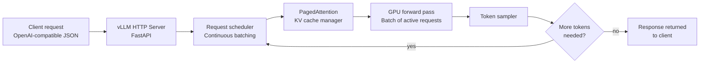

# خدمة نموذج مفتوح الأوزان باستخدام vLLM

> امتلاك طبقة الاستدلال يعني امتلاك منحنى التكلفة وحدود البيانات.

**النوع:** بناء
**اللغات:** Python
**المتطلبات:** 07-distillation-for-cost، أساسيات Docker
**الوقت:** ~60 دقيقة
**أهداف التعلّم:**
- شرح لماذا تمنح التجميع المستمر (continuous batching) في vLLM إنتاجية أعلى بـ 10-20 ضعفًا من الخدمة التسلسلية الساذجة
- تشغيل خادم vLLM محليًا باستخدام Docker
- بناء غلاف عميل (client wrapper) لـ vLLM باستخدام الـ API المتوافق مع OpenAI
- قياس فروق زمن الاستجابة (latency) والإنتاجية (throughput) بين vLLM والـ API المباشر
- تحديد متى تكون الاستضافة الذاتية لنموذج مفتوح الأوزان القرار الاقتصادي والامتثالي الصحيح

---

## المشكلة

قطّرت نقطة تحقّق (checkpoint) مضبوطة من Llama أو Qwen، وهي تؤدّي جيدًا في مهمتك. الآن تحتاج إلى خدمتها (serve).

لا يمكنك دفع نموذج مخصّص مفتوح الأوزان إلى API الخاص بـ Claude أو OpenAI - فهما يخدمان نماذجهما فقط. أنت بحاجة إلى خادم استدلال خاص بك.

النهج الساذج هو تحميل النموذج، معالجة طلب واحد، إرجاع النتيجة، تحميل التالي. هذا يصلح للتطوير. لكن في الإنتاج، مع 50 طلبًا متزامنًا، ينتظر كل طلب انتهاء جميع الطلبات السابقة. تنهار الإنتاجية.

يحلّ vLLM هذا بآليتين. تُدير PagedAttention ذاكرة الـ KV cache بالطريقة التي يُدير بها نظام التشغيل الذاكرة الافتراضية - دون إهدار لذاكرة الـ GPU من الحشو الزائد. وتُعالج التجميع المستمر (continuous batching) التوكنات الجديدة للطلبات المنتظرة أثناء التمريرات الأمامية (forward passes) للطلبات الحالية - فلا يتوقّف الخادم أبدًا منتظرًا انتهاء طلب واحد.

النتيجة: إنتاجية أعلى بـ 10-20 ضعفًا بنفس تكلفة العتاد، مع API متوافق مع OpenAI يندرج في الشيفرة الحالية بتغيير سطر واحد.

---

## المفهوم

### التجميع التسلسلي مقابل التجميع المستمر

```
NAIVE SEQUENTIAL SERVING
-----------------------------------------
Time:  t1   t2   t3   t4   t5   t6   t7
Req A: ████████████ (12 tokens)
Req B:             ████████ (8 tokens)
Req C:                     ████████████ (12 tokens)
GPU idle during transitions between requests
Throughput: ~32 tokens / t7 = low

CONTINUOUS BATCHING (vLLM)
-----------------------------------------
Time:  t1   t2   t3   t4   t5   t6   t7
Req A: ████████████ (12 tokens, arrives t1)
Req B:      ████████ (8 tokens, arrives t2 - batched in)
Req C:           ████████████ (12 tokens, arrives t3 - batched in)
All requests processed in overlapping passes
Throughput: ~32 tokens / t5 = 1.4x, compound over many requests
```

مع حمل متزامن حقيقي (50+ طلبًا)، يمنح التجميع المستمر إنتاجية أفضل بـ 10-20 ضعفًا. يُعالج الـ GPU توكنات من طلبات متعدّدة في كل تمريرة أمامية. لا وقت خمول.

### معمارية vLLM



### متى تستضيف ذاتيًا ومتى تستخدم API

```
USE API                             SELF-HOST WITH vLLM
----------------------------------  ----------------------------------
Data can leave your network         Data must stay on-premises
Standard models suffice             Custom fine-tuned checkpoint
Volume is low-to-moderate           Very high volume (cost breakeven)
No GPU budget                       GPU budget available
Rapid iteration needed              Stable, production workload
Compliance allows third-party       Strict data residency requirements
```

نقطة التعادل (breakeven) هي تقريبًا حين تتجاوز تكاليف الـ API التكلفة السنوية لمثيل الـ GPU الذي يخدم الحجم نفسه. لجهاز A100 مخصّص، يكون هذا غالبًا فوق 50-100 ألف دولار سنويًا في إنفاق الـ API.

---

## البناء

ابنِ غلاف عميل لـ vLLM يستخدم الـ API المتوافق مع OpenAI. يعمل هذا العميل سواء كنت تُشير إلى خادم vLLM محلي أو بعيد - ويمكن استبداله باستدعاءات API مباشرة لـ OpenAI أو Anthropic بتغيير الـ base URL.

```python
import os
import time
from dataclasses import dataclass
from typing import Optional, Iterator
from openai import OpenAI

@dataclass
class VLLMConfig:
    base_url: str = "http://localhost:8000/v1"
    api_key: str = "dummy"  # vLLM doesn't require a real key locally
    model: str = "Qwen/Qwen2.5-1.5B-Instruct"
    max_tokens: int = 512
    temperature: float = 0.1

class VLLMClient:
    """OpenAI-compatible client for vLLM servers."""

    def __init__(self, config: Optional[VLLMConfig] = None):
        self.config = config or VLLMConfig()
        self.client = OpenAI(
            base_url=self.config.base_url,
            api_key=self.config.api_key
        )

    def complete(self, prompt: str, system: str = "") -> str:
        """Single completion, blocking."""
        messages = []
        if system:
            messages.append({"role": "system", "content": system})
        messages.append({"role": "user", "content": prompt})

        response = self.client.chat.completions.create(
            model=self.config.model,
            messages=messages,
            max_tokens=self.config.max_tokens,
            temperature=self.config.temperature,
        )
        return response.choices[0].message.content

    def stream(self, prompt: str, system: str = "") -> Iterator[str]:
        """Streaming completion, yields tokens as they arrive."""
        messages = []
        if system:
            messages.append({"role": "system", "content": system})
        messages.append({"role": "user", "content": prompt})

        stream = self.client.chat.completions.create(
            model=self.config.model,
            messages=messages,
            max_tokens=self.config.max_tokens,
            temperature=self.config.temperature,
            stream=True,
        )
        for chunk in stream:
            delta = chunk.choices[0].delta.content
            if delta:
                yield delta

    def batch_complete(self, prompts: list[str],
                       system: str = "") -> list[dict]:
        """
        Run multiple prompts and collect latency stats.
        In production, use async + asyncio.gather for true concurrency.
        """
        results = []
        for prompt in prompts:
            start = time.perf_counter()
            try:
                output = self.complete(prompt, system=system)
                latency = time.perf_counter() - start
                results.append({
                    "prompt": prompt[:80],
                    "output": output,
                    "latency_s": round(latency, 3),
                    "status": "ok"
                })
            except Exception as e:
                results.append({
                    "prompt": prompt[:80],
                    "output": "",
                    "latency_s": -1,
                    "status": f"error: {e}"
                })
        return results
```

أوامر بدء تشغيل خادم vLLM محلي موجودة في `code/docker-compose.yml`. لاختبار العميل قبل تشغيل إعداد Docker، أشِر به إلى أي نقطة نهاية (endpoint) متوافقة مع OpenAI بتغيير `base_url`.

> **اختبار من الواقع:** تُشير بخط الاستخراج الحالي لديك إلى خادم vLLM بتغيير سطر واحد: `base_url="http://localhost:8000/v1"`. الطلب الأول يعمل. الطلب العاشر يبدأ بإرجاع سلاسل فارغة. ما السبب الأرجح؟
>
> نافذة سياق النموذج (context window) ممتلئة. يُنهي vLLM التوليد حين يُبلَغ `max_tokens` أو حين يظهر توكن EOS، لكن إن كانت prompts طويلة وتصطدم بحد سياق النموذج، فقد تكون المخرجات مقطوعة أو فارغة. تحقّق من سجلّات خادم vLLM - ستُظهر تحذيرات تجاوز السياق (context overflow). قلّل طول الـ prompt أو انتقل إلى نموذج بنافذة سياق أكبر.

---

## الاستخدام

قارِن إنتاجية vLLM مقابل استدعاء API مباشر لدفعة من 20 prompt استخراج. هذه مقارنة تسلسلية؛ يتطلّب قياس الإنتاجية المتزامنة الحقيقية عملاء غير متزامنين (async).

```python
import anthropic
import statistics

# --- vLLM client (local server) ---
vllm_client = VLLMClient(VLLMConfig(
    base_url="http://localhost:8000/v1",
    model="Qwen/Qwen2.5-1.5B-Instruct"
))

# --- Direct API client (Anthropic) ---
anthropic_client = anthropic.Anthropic()

SYSTEM = "Extract the date, amount, and party names from this invoice text. Respond in JSON."

PROMPTS = [
    f"Invoice #{i}: Acme Corp billed Beta LLC $1,{i*50:03d} on 2025-01-{i+1:02d} for consulting."
    for i in range(1, 21)
]

# Run vLLM batch
print("Running vLLM batch...")
vllm_results = vllm_client.batch_complete(PROMPTS, system=SYSTEM)
vllm_latencies = [r["latency_s"] for r in vllm_results if r["status"] == "ok"]

# Run Anthropic batch
print("Running Anthropic API batch...")
anthropic_results = []
for prompt in PROMPTS:
    start = time.perf_counter()
    resp = anthropic_client.messages.create(
        model="claude-3-5-haiku-20241022",
        max_tokens=200,
        system=SYSTEM,
        messages=[{"role": "user", "content": prompt}]
    )
    latency = time.perf_counter() - start
    anthropic_results.append({"latency_s": round(latency, 3)})

anthropic_latencies = [r["latency_s"] for r in anthropic_results]

print(f"\nvLLM median latency:      {statistics.median(vllm_latencies):.3f}s")
print(f"Anthropic median latency: {statistics.median(anthropic_latencies):.3f}s")
print(f"\nNote: vLLM throughput advantage appears at concurrent load, not sequential.")
```

> **نقلة في المنظور:** على الطلبات التسلسلية، قد لا يبدو vLLM أسرع من API مُدار - فالـ API يعمل على بنية تحتية أكبر ومُحسّنة. ميزة vLLM هي التزامن (concurrency). تحت 50 طلبًا متزامنًا، يمنح التجميع المستمر إنتاجية أفضل بـ 10-20 ضعفًا من الخدمة التسلسلية الساذجة على العتاد نفسه. لترى الفرق الحقيقي، شغّل اختبار حمل غير متزامن باستخدام `asyncio.gather` على 50 طلبًا متزامنًا.

---

## التسليم

مُخرَج هذا الدرس هو `outputs/skill-vllm-deployment-config.md`، وهو إعداد مرجعي لنشر خادم vLLM في الإنتاج، يشمل Docker ومتطلّبات الـ GPU ونمط دمج العميل.

---

## التقييم

قِس سلامة خدمة vLLM على أربعة مقاييس:

**1. الإنتاجية تحت الحمل.** قِس عدد التوكنات في الثانية عند عدد الطلبات المتزامنة المتوقّع في الذروة. استخدم `locust` أو اختبار حمل بسيط بـ `asyncio.gather`. الهدف: ينبغي أن تتوسّع الإنتاجية تحت-خطّيًا (sub-linearly) مع عدد الطلبات (لا أن تنخفض إلى 1/N من إنتاجية الطلب الواحد).

**2. زمن الاستجابة P99.** زمن الاستجابة في الذيل (tail latency) أهم من المتوسّط في الميزات الموجّهة للمستخدم. متوسّط 300ms مع P99 يبلغ 4 ثوانٍ يعني أن 1% من المستخدمين ينتظرون أطول 13 ضعفًا من المتوقّع. راقب P99، لا المتوسّط فقط.

**3. استغلال ذاكرة الـ GPU.** ينبغي أن تُبقي PagedAttention في vLLM استغلال ذاكرة الـ GPU فوق 80% تحت الحمل. إن كان الاستغلال أقل من 50%، فأنت تُهدر العتاد؛ زِد `--max-model-len` أو اخدم نموذجًا أكبر. إن بلغ 100%، فقلّل `--max-num-seqs`.

**4. تكافؤ جودة المخرجات.** شغّل مجموعة تقييم من 50 سؤالًا على نموذجك المخدوم عبر vLLM ونموذج الـ API المرجعي. إن انخفضت الجودة أكثر من 5%، فتحقّق من أنك تستخدم قالب المحادثة (chat template) الصحيح للنموذج. القوالب الخاطئة تُسبّب تدهور جودة منهجيًا يبدو كفشل ضبط (fine-tuning) بينما هو خطأ في إعداد الخدمة.
