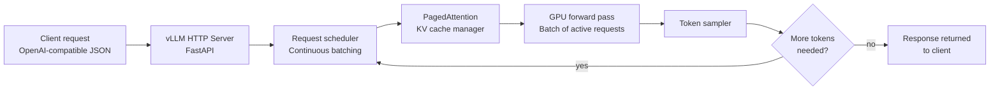

# Serving an Open-Weight Model with vLLM

> Owning the inference layer means owning the cost curve and the data boundary.

**Type:** Build
**Languages:** Python
**Prerequisites:** 07-distillation-for-cost, Docker basics
**Time:** ~60 min
**Learning Objectives:**
- Explain why vLLM's continuous batching gives 10-20x higher throughput than naive sequential serving
- Run a vLLM server locally using Docker
- Build a vLLM client wrapper using the OpenAI-compatible API
- Measure latency and throughput differences between vLLM and direct API
- Identify when self-hosting an open-weight model is the right economic and compliance decision

---

## The Problem

You distilled a fine-tuned Llama or Qwen checkpoint and it performs well on your task. Now you need to serve it.

You can't push a custom open-weight model to Claude or OpenAI's API - they only serve their own models. You need your own inference server.

The naive approach is to load the model, process one request, return the result, load the next. This works for development. In production, with 50 concurrent requests, each request waits for all prior requests to finish. Throughput collapses.

vLLM solves this with two mechanisms. PagedAttention manages the KV cache the way an OS manages virtual memory - no wasted GPU memory from over-allocated padding. Continuous batching processes new tokens for waiting requests during the forward passes of current requests - the server never goes idle waiting for a single request to finish.

The result: 10-20x higher throughput at the same hardware cost, with an OpenAI-compatible API that drops into existing code with a one-line change.

---

## The Concept

### Sequential Batching vs. Continuous Batching

```
NAIVE SEQUENTIAL SERVING
-----------------------------------------
Time:  t1   t2   t3   t4   t5   t6   t7
Req A: ████████████ (12 tokens)
Req B:             ████████ (8 tokens)
Req C:                     ████████████ (12 tokens)
GPU idle during transitions between requests
Throughput: ~32 tokens / t7 = low

CONTINUOUS BATCHING (vLLM)
-----------------------------------------
Time:  t1   t2   t3   t4   t5   t6   t7
Req A: ████████████ (12 tokens, arrives t1)
Req B:      ████████ (8 tokens, arrives t2 - batched in)
Req C:           ████████████ (12 tokens, arrives t3 - batched in)
All requests processed in overlapping passes
Throughput: ~32 tokens / t5 = 1.4x, compound over many requests
```

With real concurrent load (50+ requests), continuous batching gives 10-20x better throughput. The GPU processes tokens from multiple requests in each forward pass. No idle time.

### vLLM Architecture



### When to Self-Host vs. Use an API

```
USE API                             SELF-HOST WITH vLLM
----------------------------------  ----------------------------------
Data can leave your network         Data must stay on-premises
Standard models suffice             Custom fine-tuned checkpoint
Volume is low-to-moderate           Very high volume (cost breakeven)
No GPU budget                       GPU budget available
Rapid iteration needed              Stable, production workload
Compliance allows third-party       Strict data residency requirements
```

The breakeven point is roughly when API costs exceed the annualized cost of the GPU instance serving the same volume. For a dedicated A100, this is often above $50-100K/year in API spend.

---

## Build It

Build a vLLM client wrapper that uses the OpenAI-compatible API. This client works whether you are pointing at a local vLLM server or a remote one - and can be swapped with direct OpenAI or Anthropic API calls by changing the base URL.

```python
import os
import time
from dataclasses import dataclass
from typing import Optional, Iterator
from openai import OpenAI

@dataclass
class VLLMConfig:
    base_url: str = "http://localhost:8000/v1"
    api_key: str = "dummy"  # vLLM doesn't require a real key locally
    model: str = "Qwen/Qwen2.5-1.5B-Instruct"
    max_tokens: int = 512
    temperature: float = 0.1

class VLLMClient:
    """OpenAI-compatible client for vLLM servers."""

    def __init__(self, config: Optional[VLLMConfig] = None):
        self.config = config or VLLMConfig()
        self.client = OpenAI(
            base_url=self.config.base_url,
            api_key=self.config.api_key
        )

    def complete(self, prompt: str, system: str = "") -> str:
        """Single completion, blocking."""
        messages = []
        if system:
            messages.append({"role": "system", "content": system})
        messages.append({"role": "user", "content": prompt})

        response = self.client.chat.completions.create(
            model=self.config.model,
            messages=messages,
            max_tokens=self.config.max_tokens,
            temperature=self.config.temperature,
        )
        return response.choices[0].message.content

    def stream(self, prompt: str, system: str = "") -> Iterator[str]:
        """Streaming completion, yields tokens as they arrive."""
        messages = []
        if system:
            messages.append({"role": "system", "content": system})
        messages.append({"role": "user", "content": prompt})

        stream = self.client.chat.completions.create(
            model=self.config.model,
            messages=messages,
            max_tokens=self.config.max_tokens,
            temperature=self.config.temperature,
            stream=True,
        )
        for chunk in stream:
            delta = chunk.choices[0].delta.content
            if delta:
                yield delta

    def batch_complete(self, prompts: list[str],
                       system: str = "") -> list[dict]:
        """
        Run multiple prompts and collect latency stats.
        In production, use async + asyncio.gather for true concurrency.
        """
        results = []
        for prompt in prompts:
            start = time.perf_counter()
            try:
                output = self.complete(prompt, system=system)
                latency = time.perf_counter() - start
                results.append({
                    "prompt": prompt[:80],
                    "output": output,
                    "latency_s": round(latency, 3),
                    "status": "ok"
                })
            except Exception as e:
                results.append({
                    "prompt": prompt[:80],
                    "output": "",
                    "latency_s": -1,
                    "status": f"error: {e}"
                })
        return results
```

The startup commands for a local vLLM server are in `code/docker-compose.yml`. To test the client before the Docker setup is running, point it at any OpenAI-compatible endpoint by changing `base_url`.

> **Real-world check:** You point your existing extraction pipeline at the vLLM server by changing one line: `base_url="http://localhost:8000/v1"`. The first request works. The 10th request starts returning empty strings. What is the most likely cause?
>
> The model's context window is full. vLLM terminates generation when `max_tokens` is reached or the EOS token appears, but if your prompts are long and you are hitting the model's context limit, the outputs may be truncated or empty. Check the vLLM server logs - they will show context overflow warnings. Reduce prompt length or switch to a model with a larger context window.

---

## Use It

Compare vLLM throughput against a direct API call for a batch of 20 extraction prompts. This is a sequential comparison; true concurrent throughput measurement requires async clients.

```python
import anthropic
import statistics

# --- vLLM client (local server) ---
vllm_client = VLLMClient(VLLMConfig(
    base_url="http://localhost:8000/v1",
    model="Qwen/Qwen2.5-1.5B-Instruct"
))

# --- Direct API client (Anthropic) ---
anthropic_client = anthropic.Anthropic()

SYSTEM = "Extract the date, amount, and party names from this invoice text. Respond in JSON."

PROMPTS = [
    f"Invoice #{i}: Acme Corp billed Beta LLC $1,{i*50:03d} on 2025-01-{i+1:02d} for consulting."
    for i in range(1, 21)
]

# Run vLLM batch
print("Running vLLM batch...")
vllm_results = vllm_client.batch_complete(PROMPTS, system=SYSTEM)
vllm_latencies = [r["latency_s"] for r in vllm_results if r["status"] == "ok"]

# Run Anthropic batch
print("Running Anthropic API batch...")
anthropic_results = []
for prompt in PROMPTS:
    start = time.perf_counter()
    resp = anthropic_client.messages.create(
        model="claude-3-5-haiku-20241022",
        max_tokens=200,
        system=SYSTEM,
        messages=[{"role": "user", "content": prompt}]
    )
    latency = time.perf_counter() - start
    anthropic_results.append({"latency_s": round(latency, 3)})

anthropic_latencies = [r["latency_s"] for r in anthropic_results]

print(f"\nvLLM median latency:      {statistics.median(vllm_latencies):.3f}s")
print(f"Anthropic median latency: {statistics.median(anthropic_latencies):.3f}s")
print(f"\nNote: vLLM throughput advantage appears at concurrent load, not sequential.")
```

> **Perspective shift:** On sequential requests, vLLM may not look faster than a managed API - the API runs on larger, optimized infrastructure. The vLLM advantage is concurrency. Under 50 simultaneous requests, continuous batching gives 10-20x better throughput than naive sequential serving on the same hardware. To see the real difference, run an async load test with `asyncio.gather` on 50 concurrent requests.

---

## Ship It

The artifact for this lesson is `outputs/skill-vllm-deployment-config.md`, a reference configuration for deploying a vLLM server in production, including Docker, GPU requirements, and the client integration pattern.

---

## Evaluate It

Measure vLLM serving health on four metrics:

**1. Throughput under load.** Measure tokens per second at your expected peak concurrent request count. Use `locust` or a simple `asyncio.gather` load test. Target: throughput should scale sub-linearly with request count (not drop to 1/N of single-request throughput).

**2. P99 latency.** Tail latency matters more than mean latency for user-facing features. A mean of 300ms with a P99 of 4 seconds means 1% of users wait 13x longer than expected. Monitor P99, not just mean.

**3. GPU memory utilization.** vLLM's PagedAttention should keep GPU memory utilization above 80% under load. If utilization is below 50%, you are under-utilizing the hardware; increase `--max-model-len` or serve a larger model. If it hits 100%, reduce `--max-num-seqs`.

**4. Output quality parity.** Run the same 50-question eval suite on your vLLM-served model and your reference API model. If quality drops more than 5%, check that you are using the correct chat template for the model. Wrong chat templates cause systematic quality degradation that looks like a fine-tuning failure but is a serving configuration error.
