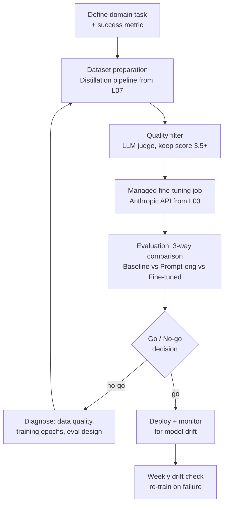

# المشروع الختامي: اضبط نموذجًا لمهمة في مجال محدّد، وأثبت عائد الاستثمار بالتقييمات

> الضبط (fine-tune) لا يكتمل حتى تقول الحسابات إنه كان يستحق العناء.

**النوع:** بناء
**اللغات:** Python
**المتطلبات:** كل دروس P09 (من 01 إلى 08)
**الوقت:** ~90 دقيقة
**أهداف التعلّم:**
- تجميع خط أنابيب P09 الكامل: تحضير مجموعة البيانات، مهمة التدريب، التقييم، حساب عائد الاستثمار (ROI)
- تطبيق خط التقطير من الدرس L07 لتوليد بيانات تدريب لمهمة في مجال محدّد
- إرسال ومراقبة مهمة ضبط مُدارة (managed fine-tuning) باستخدام Anthropic API
- مقارنة جودة النموذج المضبوط مقابل خط أساس قائم على الـ prompt فقط باستخدام إطار التقييم من الدرس L05
- حساب فترة الاسترداد (payback period) ومعايير المضي/عدم المضي لنشر النموذج المضبوط

---

## المشكلة

علّمك كل درس في هذه المرحلة جزءًا من حلقة الضبط (fine-tuning). الآن تحتاج إلى إغلاق الحلقة.

النموذج المضبوط الذي يؤدّي أفضل بمعزل عن غيره لا يكفي. تحتاج إلى الإجابة عن ثلاثة أسئلة قبل نشره في الإنتاج:

1. هل هو فعلًا أفضل؟ مقارنةً بأي خط أساس؟ وبأي قدر؟
2. هل التحسّن يستحق التكلفة؟ كم يستغرق حتى يُسدّد الضبط تكلفته؟
3. هل سيبقى جيدًا؟ ما الإشارات التي ستُخبرك بأنه يتدهور؟

الفريق الذي يتجاوز هذه الأسئلة يطلق نموذجًا لا يستطيع تبريره لأصحاب المصلحة، ولا يستطيع مراقبته في الإنتاج، ولا يستطيع الدفاع عنه حين يحدث خطأ. يسير هذا المشروع الختامي عبر الحلقة الكاملة: مجموعة البيانات، التدريب، التقييم، عائد الاستثمار، معايير النشر، ومراقبة الانحراف (drift).

المهمة في هذا المجال هي التعرّف على الكيانات المُسمّاة الطبية (medical named entity recognition): استخراج أسماء الأدوية والجرعات والحالات من الملاحظات السريرية. إنها مهمة ضيّقة وجيدة التعريف وعالية الحجم - المرشّح المثالي للضبط.

---

## المفهوم

### دورة حياة مشروع الضبط



### إطار عائد الاستثمار

```
FINE-TUNE ROI CALCULATION
-----------------------------------------

Cost inputs:
  Teacher generation cost   = N_examples * avg_tokens * teacher_price
  Fine-tune training cost   = (total_training_tokens / 1M) * ft_price
  Evaluation cost           = eval_calls * avg_tokens * judge_price

Cost savings (monthly):
  baseline_cost_monthly     = daily_calls * avg_tokens * baseline_price * 30
  finetuned_cost_monthly    = daily_calls * avg_tokens * finetuned_price * 30
  monthly_savings           = baseline_cost_monthly - finetuned_cost_monthly

Payback period:
  total_project_cost        = teacher_cost + training_cost + eval_cost
  payback_months            = total_project_cost / monthly_savings

GO if:
  - Quality improvement >= 10 percentage points over prompt baseline
  - Payback period <= 3 months
  - No regression on safety/guardrail tests

NO-GO if:
  - Quality improvement < 5 percentage points (prompt engineering is cheaper)
  - Payback period > 6 months (volume too low to justify)
  - Any regression on safety tests
```

### معايير المضي / عدم المضي

```
DIMENSION         GO                    NO-GO               ACTION
----------------  --------------------  ------------------  --------------------
Task accuracy     >= 90%, +10pp gain    < 85% or < 5pp gain More data / epochs
Latency           Within 20% of base    > 2x baseline       Check model size
Safety            No new violations     Any new violation   Review training data
Cost payback      <= 3 months           > 6 months          Reduce scope
Drift signal      < 2% weekly drop      > 5% drop in week   Re-distill
```

---

## البناء

جمّع مشروع الضبط الكامل كخط أنابيب واحد قابل للتشغيل. تدمج الشيفرة خط التقطير من L07 وواجهة الضبط المُدارة (managed fine-tuning API) من L03.

```python
import anthropic
import json
import time
from dataclasses import dataclass, field
from typing import Optional

client = anthropic.Anthropic()

# --- Task definition ---
DOMAIN_TASK = "medical_ner"
TASK_DESCRIPTION = """Extract medical named entities from clinical notes.
Return a JSON object with keys: drugs (list), dosages (list), conditions (list).
Be precise - only extract entities explicitly mentioned."""

SYSTEM_PROMPT = """You are a clinical NLP specialist. Extract drug names,
dosages, and medical conditions from clinical notes. Respond only with
valid JSON in the format: {"drugs": [], "dosages": [], "conditions": []}"""

# --- Sample clinical notes for distillation ---
SAMPLE_NOTES = [
    "Patient prescribed metformin 500mg twice daily for type 2 diabetes. Monitoring HbA1c.",
    "Started lisinopril 10mg QD for hypertension. Patient reports mild dry cough.",
    "Atorvastatin 20mg nightly for hyperlipidemia. LFTs ordered at 3 months.",
    "Amoxicillin 875mg BID x10 days for streptococcal pharyngitis.",
    "Sertraline 50mg daily initiated for major depressive disorder. Follow up in 4 weeks.",
    "Metoprolol 25mg BID for atrial fibrillation rate control. HR target 60-80.",
    "Prednisone 40mg daily tapering course for acute exacerbation of COPD.",
    "Levothyroxine 88mcg daily for hypothyroidism. TSH target 0.5-2.5.",
]
```

المرحلة 1 - توليد بيانات تدريب مُقطّرة:

```python
@dataclass
class DistillationStats:
    generated: int = 0
    kept: int = 0
    discarded: int = 0
    teacher_cost_usd: float = 0.0

def generate_training_data(notes: list[str],
                            output_path: str = "medical_ner_training.jsonl",
                            quality_threshold: float = 3.5) -> DistillationStats:
    stats = DistillationStats()
    examples = []

    for note in notes:
        prompt = f"Extract medical named entities from this clinical note:\n\n{note}"

        # Teacher generation
        response = client.messages.create(
            model="claude-opus-4-5",
            max_tokens=256,
            system=SYSTEM_PROMPT,
            messages=[{"role": "user", "content": prompt}]
        )
        completion = response.content[0].text
        stats.generated += 1

        # Quality judge
        judge_prompt = f"""Rate this medical NER extraction 1-5.

Note: {note}
Extraction: {completion}

5=Perfect JSON, all entities extracted
4=Good, minor omissions
3=Acceptable but incomplete
2=Wrong format or missed entities
1=Incorrect or malformed

Respond with ONLY a number."""

        judge_response = client.messages.create(
            model="claude-3-5-haiku-20241022",
            max_tokens=5,
            messages=[{"role": "user", "content": judge_prompt}]
        )
        try:
            score = float(judge_response.content[0].text.strip())
        except ValueError:
            score = 1.0

        if score >= quality_threshold:
            stats.kept += 1
            examples.append({
                "messages": [
                    {"role": "user", "content": prompt},
                    {"role": "assistant", "content": completion}
                ]
            })
        else:
            stats.discarded += 1

        time.sleep(0.3)

    with open(output_path, "w") as f:
        for ex in examples:
            f.write(json.dumps(ex) + "\n")

    return stats
```

المرحلة 2 - إرسال مهمة الضبط:

```python
def submit_finetune_job(training_file: str,
                        model: str = "claude-haiku-20250307") -> str:
    """Upload training data and submit a managed fine-tuning job."""
    import os

    # Upload the training file
    with open(training_file, "rb") as f:
        file_response = client.beta.files.upload(
            file=(os.path.basename(training_file), f, "application/jsonl"),
        )
    file_id = file_response.id
    print(f"Training file uploaded: {file_id}")

    # Create the fine-tuning job
    job_response = client.beta.fine_tuning.jobs.create(
        model=model,
        training_file=file_id,
        hyperparameters={
            "n_epochs": 3,
        }
    )
    job_id = job_response.id
    print(f"Fine-tuning job created: {job_id}")
    return job_id

def poll_job(job_id: str, poll_interval: int = 60) -> dict:
    """Poll until the fine-tuning job completes."""
    while True:
        job = client.beta.fine_tuning.jobs.retrieve(job_id)
        status = job.status
        print(f"  Job {job_id}: {status}")
        if status in ("succeeded", "failed", "cancelled"):
            return {"job_id": job_id, "status": status,
                    "fine_tuned_model": getattr(job, "fine_tuned_model", None)}
        time.sleep(poll_interval)
```

> **اختبار من الواقع:** تكتمل مهمة الضبط وتحصل على معرّف نموذج (model ID). تشغّل prompt اختبار واحدًا فيستجيب بإتقان. يسألك مديرك إن كنت جاهزًا للنشر. ماذا تقول؟
>
> ليس بعد. prompt واحد حكاية، لا دليل. تحتاج إلى تشغيل مجموعة التقييم الكاملة لمقارنة خط الأساس، وخط الأساس المُهندَس بالـ prompt، والنموذج المضبوط عبر 100 مثال متنوّع على الأقل قبل أن تتمكّن من اتخاذ قرار نشر. عبارة "يبدو جيدًا في اختبار واحد" هي الطريقة التي تصل بها النماذج غير المُختبَرة إلى الإنتاج.

المرحلة 3 - تقييم ثلاثي:

```python
def evaluate_three_way(test_notes: list[str],
                       ft_model_id: str) -> dict:
    """Compare baseline, prompt-engineered, and fine-tuned on the same test set."""
    results = {"baseline": [], "prompt_eng": [], "fine_tuned": []}

    for note in test_notes:
        prompt = f"Extract medical named entities from this clinical note:\n\n{note}"

        # Baseline: no system prompt, direct question
        baseline_resp = client.messages.create(
            model="claude-3-5-haiku-20241022",
            max_tokens=256,
            messages=[{"role": "user", "content": prompt}]
        )

        # Prompt-engineered: with system prompt and few-shot
        pe_resp = client.messages.create(
            model="claude-3-5-haiku-20241022",
            max_tokens=256,
            system=SYSTEM_PROMPT,
            messages=[{"role": "user", "content": prompt}]
        )

        # Fine-tuned model
        ft_resp = client.messages.create(
            model=ft_model_id,
            max_tokens=256,
            messages=[{"role": "user", "content": prompt}]
        )

        for key, resp in [("baseline", baseline_resp),
                          ("prompt_eng", pe_resp),
                          ("fine_tuned", ft_resp)]:
            text = resp.content[0].text
            try:
                parsed = json.loads(text)
                valid_json = True
                entity_count = (len(parsed.get("drugs", [])) +
                                len(parsed.get("dosages", [])) +
                                len(parsed.get("conditions", [])))
            except json.JSONDecodeError:
                valid_json = False
                entity_count = 0
            results[key].append({"valid_json": valid_json,
                                  "entity_count": entity_count})

    # Compute summary metrics
    summary = {}
    for condition, data in results.items():
        valid_rate = sum(1 for d in data if d["valid_json"]) / len(data) * 100
        avg_entities = sum(d["entity_count"] for d in data) / len(data)
        summary[condition] = {
            "valid_json_rate": round(valid_rate, 1),
            "avg_entities_extracted": round(avg_entities, 2)
        }
    return summary
```

المرحلة 4 - حساب عائد الاستثمار وقرار المضي/عدم المضي:

```python
def compute_roi(stats: DistillationStats,
                training_cost_usd: float,
                daily_calls: int,
                avg_output_tokens: int) -> dict:
    """Calculate payback period and go/no-go recommendation."""
    # Approximate token costs (illustrative, check current pricing)
    HAIKU_PRICE_PER_1M_OUTPUT = 1.25
    OPUS_PRICE_PER_1M_OUTPUT = 75.00

    total_project_cost = (
        stats.teacher_cost_usd +
        training_cost_usd
    )

    baseline_monthly = (daily_calls * avg_output_tokens / 1_000_000) * OPUS_PRICE_PER_1M_OUTPUT * 30
    finetuned_monthly = (daily_calls * avg_output_tokens / 1_000_000) * HAIKU_PRICE_PER_1M_OUTPUT * 30
    monthly_savings = baseline_monthly - finetuned_monthly

    if monthly_savings <= 0:
        payback_months = float("inf")
    else:
        payback_months = total_project_cost / monthly_savings

    return {
        "total_project_cost_usd": round(total_project_cost, 2),
        "baseline_monthly_cost_usd": round(baseline_monthly, 2),
        "finetuned_monthly_cost_usd": round(finetuned_monthly, 2),
        "monthly_savings_usd": round(monthly_savings, 2),
        "payback_months": round(payback_months, 1),
        "recommendation": "GO" if payback_months <= 3 else "NO-GO",
    }
```

---

## الاستخدام

شغّل خط الأنابيب الكامل من البداية إلى النهاية:

```python
if __name__ == "__main__":
    print("=== Stage 1: Generate distilled training data ===")
    stats = generate_training_data(
        SAMPLE_NOTES,
        output_path="medical_ner_training.jsonl"
    )
    print(f"Generated: {stats.generated}, Kept: {stats.kept}, "
          f"Discarded: {stats.discarded}")

    print("\n=== Stage 2: Submit fine-tuning job ===")
    # Uncomment to run a real job (costs money and time):
    # job_id = submit_finetune_job("medical_ner_training.jsonl")
    # job_result = poll_job(job_id)
    # ft_model_id = job_result["fine_tuned_model"]
    # print(f"Fine-tuned model: {ft_model_id}")

    # For demonstration, use the base Haiku model as a stand-in
    ft_model_id = "claude-3-5-haiku-20241022"

    print("\n=== Stage 3: Three-way evaluation ===")
    # Use held-out notes not in the training set
    test_notes = [
        "Warfarin 5mg daily for DVT prophylaxis post-surgery. INR goal 2-3.",
        "Albuterol inhaler PRN for asthma. Prescribed ICS for daily control.",
        "Furosemide 40mg QD for congestive heart failure with peripheral edema.",
    ]
    eval_results = evaluate_three_way(test_notes, ft_model_id)
    for model_name, metrics in eval_results.items():
        print(f"  {model_name:15s}: valid JSON {metrics['valid_json_rate']}%, "
              f"avg entities {metrics['avg_entities_extracted']}")

    print("\n=== Stage 4: ROI calculation ===")
    roi = compute_roi(
        stats=stats,
        training_cost_usd=25.0,  # estimate; actual from Anthropic invoice
        daily_calls=500,
        avg_output_tokens=150,
    )
    for key, value in roi.items():
        print(f"  {key}: {value}")
```

> **نقلة في المنظور:** استغرق بناء خط الأنابيب هذا يومين وكلّف بضعة دولارات لتشغيله. حساب عائد الاستثمار في النهاية ليس عملًا روتينيًا - بل هو المُخرَج الذي يتيح لك عرض هذا العمل على مدير منتج أو قائد هندسي وقول "يُسدّد هذا تكلفته خلال N أشهر". بدون ذلك الرقم، لديك نتيجة تقنية. ومعه، لديك حالة عمل (business case).

---

## التسليم

مُخرَج هذا الدرس هو `outputs/runbook-finetune-project.md`، وهو دليل تشغيل (runbook) كامل لتنفيذ مشروع ضبط: تحضير مجموعة البيانات، التدريب، التقييم، قرار المضي/عدم المضي، النشر، ومراقبة الانحراف.

---

## التقييم

يكتمل المشروع الختامي عندما تجتاز كل الفحوص الخمسة:

**1. فحص جودة مجموعة البيانات.** معدّل الاحتفاظ فوق 60%. ملف التدريب JSONL يتبع صيغة messages الصالحة (أزواج user/assistant). كل مكمّلات الـ assistant هي JSON صالح يطابق المخطّط (schema) المستهدف.

**2. خط أساس التقييم مُؤسَّس.** لديك درجات رقمية للحالات الثلاث (خط الأساس، المُهندَس بالـ prompt، المضبوط) على 50 مثالًا محجوزًا (held-out) على الأقل. يتفوّق النموذج المضبوط على هندسة الـ prompt بـ 5 نقاط مئوية على الأقل في مقياسك الأساسي.

**3. عائد الاستثمار موجب.** فترة الاسترداد أقل من 6 أشهر. إن لم تكن كذلك، فوثّق السبب (الحجم منخفض جدًا، فرق التكلفة صغير جدًا) ودوّن ما الذي يجب أن يتغيّر ليُصبح موجبًا.

**4. قرار المضي/عدم المضي صريح.** ليس "يبدو جيدًا" - بل قرار مكتوب بمعايير رقمية. ارجع إلى جدول المضي/عدم المضي من قسم المفهوم.

**5. خطة مراقبة الانحراف موجودة.** لديك مهمة تقييم أسبوعية (ولو كانت مجرد سكربت cron) تشغّل 20 prompt اختبار على النموذج المضبوط وتُنبّه إن انخفض معدّل JSON الصالح دون عتبتك. النماذج المضبوطة لا تتدهور من تلقاء نفسها، لكن توزيعات المدخلات تتغيّر. راقب أو فاجَأ.
