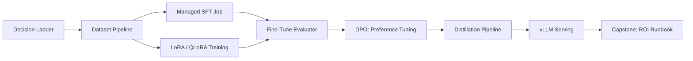

# Phase 09: Fine-Tuning and Customization

9 lessons. ~10 hours. When prompting and RAG are not enough: the decision ladder, dataset engineering, training workflows, and proving ROI with evals.

## The through-line

Fine-tuning is rung four on the decision ladder, not rung one. 95% of use cases are solved with better prompts or RAG. But for the 5% where format consistency, latency, cost, or private data requirements make fine-tuning the right call, this phase covers the complete workflow: qualifying the problem, engineering the dataset (the durable moat), running training via managed APIs and LoRA, evaluating the result against a baseline, and proving ROI before deployment.

## What you build

## Lessons

| # | Lesson | Artifact | Time |
|---|--------|----------|------|
| 01 | The Decision Ladder: Prompt, RAG, or Fine-Tune? | `prompt-finetune-decision-guide.md` | ~45 min |
| 02 | Dataset Engineering: The Durable Moat | `skill-dataset-pipeline.md` | ~60 min |
| 03 | Supervised Fine-Tuning via Managed APIs | `skill-managed-finetune-workflow.md` | ~60 min |
| 04 | LoRA and QLoRA: Intuition and Hands-On | `skill-lora-training-script.md` | ~75 min |
| 05 | Evaluating a Fine-Tune vs Baseline | `skill-finetune-eval-harness.md` | ~60 min |
| 06 | Preference Tuning: DPO | `skill-dpo-dataset-format.md` | ~45 min |
| 07 | Distillation for Cost | `skill-distillation-pipeline.md` | ~45 min |
| 08 | Serving an Open-Weight Model with vLLM | `skill-vllm-deployment-config.md` | ~60 min |
| 09 | Capstone: Fine-Tune for a Domain Task, Prove ROI | `runbook-finetune-project.md` | ~90 min |

## Prerequisites

Phase 01 (Prompt Engineering) and Phase 02 (RAG) - you need to have ruled out simpler solutions before reaching for fine-tuning. Phase 05 (Evaluation) for the eval harness patterns used in L05.

## Stack

- Python + `anthropic` SDK + `openai` SDK (managed fine-tuning API)
- `peft` + `transformers` + `bitsandbytes` for LoRA/QLoRA (L04)
- `trl` SFTTrainer for the production training path (L04)
- `vllm` for serving open-weight and fine-tuned models (L08)
- Docker Compose for the vLLM deployment (L08)
- No GPU required for most lessons - demo mode covers all concepts
