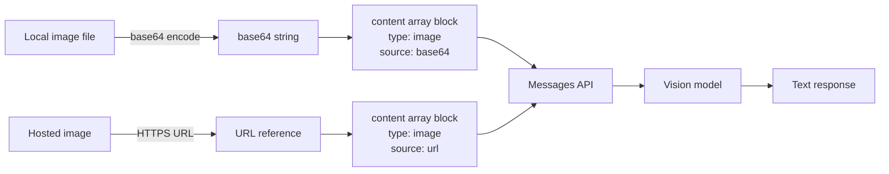

# نماذج Vision-Language (الرؤية واللغة) في التطبيقات

> النص والصور تدخل. الإجابات المنظّمة تخرج. الـ API نفسه؛ ما يختلف هو ترميز المدخلات.

**النوع:** بناء
**اللغات:** Python
**المتطلبات:** الدرس 01-01 (الإعداد)، المرحلة 01 (أساسيات Prompt Engineering)
**الوقت:** ~60 دقيقة
**المرحلة:** 10 · Multimodal and Voice

---

## أهداف التعلّم

- ترميز صورة محلية كـ base64 وتضمينها في طلب Anthropic API
- شرح صيغة حساب تكلفة tokens الرؤية وتطبيقها لتقدير التكاليف قبل الطلب
- تحديد صيغ المدخلات الأربع المدعومة وحدود حجمها
- وصف ما تجيده نماذج الرؤية وأين تفشل باستمرار
- بناء تقييم بسيط بمجموعة golden set لمخرجات الرؤية

---

## المشكلة

فريق منتج لديه تكامل نصّي فقط مع Claude يعمل بنجاح ويشغّل محادثة دعم فني. مدير المنتج يريد إضافة "حلّل لقطة الشاشة هذه" حتى يتمكّن المستخدمون من رفع صورة والسؤال عن الخلل. يفتح الفريق الهندسي وثائق Anthropic ويصطدم فورًا بأربعة أسئلة لا يستطيع الإجابة عليها:

1. كيف تُرسَل الصور فعليًا إلى الـ API؟ صيغة الرسائل تقبل نصوصًا، لا كائنات ملفات.
2. كم تكلّف الصورة من tokens؟ هم أصلًا قريبون من حدود الميزانية.
3. ما أنواع الملفات وأحجامها المقبولة؟ المستخدمون سيرفعون ما تنتجه هواتفهم مهما كان.
4. ما استراتيجيات الـ prompting التي تنجح للمهام البصرية؟ نمط zero-shot الذي يستخدمونه للنص لا يبدو مناسبًا للصور.

يعرف الفريق أن نماذج الرؤية موجودة. لكنه لا يعرف كيف يربط واحدًا منها بتكامله الحالي دون كسر ما يعمل أصلًا أو التسبّب بتجاوزات تكلفة غير متوقعة.

---

## المفهوم

### كيف تنتقل الصور عبر الـ API

تستخدم Anthropic Messages API مصفوفة `content` بدلًا من نص `content` واحد. كل عنصر في المصفوفة هو block: إما text block أو image block. هذا هو التغيير البنيوي الوحيد مقارنةً بطلب نصّي فقط. يستقبل النموذج كلا الـ blocks معًا ويستنتج عبرهما.

تصل الصور إلى الـ API بإحدى طريقتين:

- **ترميز Base64**: تُرمَّز بايتات الصورة كنص base64 وتُرسَل مباشرةً في جسم الطلب. مطلوب للصور غير المتاحة علنًا عبر URL.
- **مرجع URL**: رابط HTTPS متاح علنًا. يجلب الـ API الصورة من جانب الخادم. أبسط للصور المستضافة مسبقًا على CDN.



### صيغة تكلفة الـ tokens

تحتسب نماذج الرؤية تكلفة الصور باستخدام حساب قائم على البلاطات (tiles). يقسّم الـ API الصورة إلى بلاطات بحجم 32x32 بكسل ويحتسب التكلفة لكل بلاطة. الصيغة:

```
tiles_wide  = ceil(width  / 32)
tiles_tall  = ceil(height / 32)
image_tokens = tiles_wide * tiles_tall * 65
```

صورة 512x512: ‏16 x 16 = 256 بلاطة = 16,640 token. صورة 1920x1080: ‏60 x 34 = 2,040 بلاطة = 132,600 token. صغّر الصور الكبيرة قبل إرسالها. لمعظم حالات استخدام المنتجات، يُعدّ 768px على الحافة الأطول السقف العملي قبل أن تنمو التكلفة دون مكسب جودة ذي معنى.

### الصيغ والحدود المدعومة

| Format | Notes |
|--------|-------|
| JPEG | الأفضل للصور الفوتوغرافية؛ الضغط مع الفقد مقبول |
| PNG | الأفضل للقطات الشاشة والمخططات؛ بلا فقد |
| GIF | الإطار الأول فقط |
| WebP | مدعوم؛ شائع في عمليات الرفع من المتصفح |

حدود الحجم: حد أقصى 5MB لكل صورة، وحد أقصى 20 صورة لكل طلب. الصور الأصغر من 200x200 بكسل قد تنتج نتائج متدنّية.

### ما تجيده نماذج الرؤية وأين تفشل

تجيد:
- الـ OCR على النص المطبوع النظيف (دقة مماثلة لـ OCR المخصّص للمستندات الرقمية الأصل)
- وصف تخطيط واجهة المستخدم ("زر الإرسال في الركن السفلي الأيمن")
- كشف وجود الكائنات ("هل تحتوي هذه الصورة على مخطط بياني؟")
- قراءة رسائل الأخطاء وآثار التتبّع (stack traces) من لقطات الشاشة

تفشل في:
- إحداثيات البكسل الدقيقة ("الزر عند x=432, y=208" غير موثوق)
- عدّ الكميات بدقّة حين تتجاوز 8-10 عناصر
- قراءة النص في الخلفيات المعقّدة، أو النص منخفض التباين، أو خط اليد
- الاستدلال المكاني بدقّة البكسل ("هل الكائن A يبعد 50px تمامًا إلى يسار B؟")

---

## البناء

يحمّل السكربت صورة محلية، ويرمّزها، ويرسلها إلى Claude مع prompt منظّم، ويطبع تحليل JSON. وضع العرض (demo) يولّد PNG اصطناعيًا باستخدام stdlib فقط، فيعمل الدرس دون الحاجة إلى ملف صورة خارجي.

```python
# code/main.py
"""
Lesson 10-01: Vision-Language Models in Apps
Sends an image to Claude and returns structured analysis as JSON.
Demo mode generates a synthetic PNG so no external image file is required.
"""

import anthropic
import base64
import json
import struct
import zlib
from pathlib import Path


# --------------------------------------------------------------------------- #
# Demo image generator (stdlib only, no Pillow required)                      #
# --------------------------------------------------------------------------- #

def _make_minimal_png(width: int = 64, height: int = 64) -> bytes:
    """Generate a minimal valid PNG in memory using only stdlib."""

    def png_chunk(chunk_type: bytes, data: bytes) -> bytes:
        length = len(data)
        crc = zlib.crc32(chunk_type + data) & 0xFFFFFFFF
        return (
            struct.pack(">I", length)
            + chunk_type
            + data
            + struct.pack(">I", crc)
        )

    # IHDR: width, height, bit depth=8, color type=2 (RGB), compression=0, filter=0, interlace=0
    ihdr_data = struct.pack(">IIBBBBB", width, height, 8, 2, 0, 0, 0)

    # Build raw image data: each row has a filter byte (0 = None) + RGB pixels
    # Simple gradient: R increases with x, G increases with y, B=128
    rows = bytearray()
    for y in range(height):
        rows.append(0)  # filter byte
        for x in range(width):
            rows.append(int(x * 255 / (width - 1)))   # R
            rows.append(int(y * 255 / (height - 1)))  # G
            rows.append(128)                           # B

    compressed = zlib.compress(bytes(rows))

    png = (
        b"\x89PNG\r\n\x1a\n"          # PNG signature
        + png_chunk(b"IHDR", ihdr_data)
        + png_chunk(b"IDAT", compressed)
        + png_chunk(b"IEND", b"")
    )
    return png


# --------------------------------------------------------------------------- #
# Core vision function                                                         #
# --------------------------------------------------------------------------- #

def analyze_image(
    image_bytes: bytes,
    media_type: str = "image/png",
    prompt: str = "Analyze this image. Return JSON with keys: description, dominant_colors, detected_text, notable_elements.",
    model: str = "claude-3-5-haiku-20241022",
) -> dict:
    """
    Send an image to Claude as a base64-encoded block.
    Returns the parsed JSON response from the model.
    """
    client = anthropic.Anthropic()

    # Encode image bytes to base64 string
    b64_image = base64.standard_b64encode(image_bytes).decode("utf-8")

    # Estimate token cost before sending
    # (rough approximation: real tile calculation requires width/height)
    estimated_tokens = len(image_bytes) // 150  # very rough heuristic
    print(f"  Image size: {len(image_bytes):,} bytes")
    print(f"  Estimated image tokens (rough): ~{estimated_tokens:,}")

    message = client.messages.create(
        model=model,
        max_tokens=512,
        messages=[
            {
                "role": "user",
                "content": [
                    {
                        "type": "image",
                        "source": {
                            "type": "base64",
                            "media_type": media_type,
                            "data": b64_image,
                        },
                    },
                    {
                        "type": "text",
                        "text": prompt,
                    },
                ],
            }
        ],
    )

    raw_text = message.content[0].text

    # Parse JSON from response (model may wrap it in markdown code fences)
    if "```" in raw_text:
        # Extract content between first and last triple-backtick blocks
        parts = raw_text.split("```")
        # parts[1] is the content block (possibly prefixed with 'json\n')
        raw_text = parts[1].lstrip("json").strip()

    try:
        result = json.loads(raw_text)
    except json.JSONDecodeError:
        # Return raw text in a wrapper dict if JSON parse fails
        result = {"raw_response": raw_text}

    return {
        "analysis": result,
        "usage": {
            "input_tokens": message.usage.input_tokens,
            "output_tokens": message.usage.output_tokens,
        },
        "model": message.model,
    }


# --------------------------------------------------------------------------- #
# Token cost formula (exact, given dimensions)                                #
# --------------------------------------------------------------------------- #

def estimate_vision_tokens(width: int, height: int) -> int:
    """
    Exact Anthropic vision token formula.
    tiles_wide * tiles_tall * 65 (approximate base cost per tile).
    """
    import math
    tiles_wide = math.ceil(width / 32)
    tiles_tall = math.ceil(height / 32)
    return tiles_wide * tiles_tall * 65


# --------------------------------------------------------------------------- #
# Main                                                                        #
# --------------------------------------------------------------------------- #

def main():
    print("=== Lesson 10-01: Vision-Language Models in Apps ===\n")

    # Check for a local image file; fall back to demo synthetic PNG
    local_candidates = ["sample.jpg", "sample.png", "screenshot.png"]
    image_path = None
    for candidate in local_candidates:
        path = Path(candidate)
        if path.exists():
            image_path = path
            break

    if image_path is not None:
        print(f"Using local image: {image_path}")
        image_bytes = image_path.read_bytes()
        media_type = "image/jpeg" if image_path.suffix.lower() == ".jpg" else "image/png"
    else:
        print("No local image found. Generating synthetic demo PNG (64x64 gradient).")
        image_bytes = _make_minimal_png(64, 64)
        media_type = "image/png"

    print()

    # Show exact token estimate for known dimensions
    exact_tokens = estimate_vision_tokens(64, 64)
    print(f"Exact vision tokens for 64x64: {exact_tokens}")
    print(f"Exact vision tokens for 768x768: {estimate_vision_tokens(768, 768)}")
    print(f"Exact vision tokens for 1920x1080: {estimate_vision_tokens(1920, 1080)}")
    print()

    print("Sending image to Claude for structured analysis...")
    result = analyze_image(image_bytes, media_type=media_type)

    print("\n--- Analysis Result ---")
    print(json.dumps(result["analysis"], indent=2))
    print(f"\n--- Token Usage ---")
    print(f"  Input tokens:  {result['usage']['input_tokens']:,}")
    print(f"  Output tokens: {result['usage']['output_tokens']:,}")
    print(f"  Model:         {result['model']}")

    total_input_cost = result["usage"]["input_tokens"] * 0.00000025  # $0.25/1M for Haiku
    print(f"  Estimated input cost: ${total_input_cost:.6f}")


if __name__ == "__main__":
    main()
```

> **اختبار من الواقع:** لديك تذكرة دعم أرفق فيها المستخدم لقطة شاشة بدقة 4K ‏(3840x2160). قبل إرسالها إلى Claude، هل ينبغي تصغيرها؟ شغّل `estimate_vision_tokens(3840, 2160)` مقابل `estimate_vision_tokens(768, 432)`. تكلّف صورة الـ 4K نحو 25 ضعفًا من الـ tokens. وبالنسبة للقطة شاشة تعرض نافذة خطأ قابلة للقراءة بعرض 768px، فإن نسخة الـ 4K لا تضيف أي معلومة لكنها تضاعف تكلفتك. صغّرها قبل الإرسال.

---

## الاستخدام

حين تكون الصور مستضافة مسبقًا، تجاوز base64 كليًا واستخدم مرجع URL. يجلب الـ API الصورة من جانب الخادم:

```python
import anthropic

client = anthropic.Anthropic()

message = client.messages.create(
    model="claude-3-5-haiku-20241022",
    max_tokens=512,
    messages=[
        {
            "role": "user",
            "content": [
                {
                    "type": "image",
                    "source": {
                        "type": "url",
                        "url": "https://example.com/screenshot.png",
                    },
                },
                {
                    "type": "text",
                    "text": "Describe the UI elements in this screenshot.",
                },
            ],
        }
    ],
)
print(message.content[0].text)
```

في سير العمل الذي تُحلَّل فيه الصورة نفسها عدة مرات عبر طلبات مختلفة، استخدم **Anthropic Files API**. ارفع مرة واحدة، واحصل على file ID، وأشِر إلى الـ ID في الطلبات اللاحقة. يتجنّب هذا إعادة الترميز وإعادة نقل البايتات نفسها في كل استدعاء:

```python
# Upload once
with open("diagram.png", "rb") as f:
    file_response = client.beta.files.upload(
        file=("diagram.png", f, "image/png"),
    )
file_id = file_response.id

# Reference in requests (no base64 re-encoding)
message = client.messages.create(
    model="claude-3-5-haiku-20241022",
    max_tokens=256,
    messages=[
        {
            "role": "user",
            "content": [
                {
                    "type": "image",
                    "source": {"type": "file", "file_id": file_id},
                },
                {"type": "text", "text": "What does this diagram show?"},
            ],
        }
    ],
)
```

الـ Files API هو النمط الصحيح للمعالجة الدفعية للمستندات حيث تُحلَّل كل صفحة بعدة صيغ prompt.

> **نقلة في المنظور:** يبدو ترميز base64 وكأنه التفاف على المشكلة، لكنه البدائية (primitive) الصحيحة للصور الخاصة التي لا يمكن كشفها عبر URL عام. نمط الـ URL أنظف لكنه يتطلّب أن تكون صورتك متاحة علنًا، وهو ما يكون غالبًا غير مقبول للقطات شاشة دعم العملاء أو المستندات الداخلية. اختر بناءً على مكان وجود صورك، لا على أي نمط يبدو أبسط في الكود.

---

## التسليم

الأداة الناتجة في `outputs/skill-vision-api-integration.md` هي بطاقة مرجعية لإضافة الرؤية إلى تكامل نصّي قائم مع الـ API.

---

## التقييم

يتطلّب قياس جودة الرؤية مجموعة golden set من الصور بمخرجاتها المتوقّعة المعروفة. العملية:

1. **بناء الـ golden set**: اجمع 20-30 صورة ممثّلة من حالة استخدامك الفعلية (لقطات شاشة دعم، صور منتجات، مستندات). اكتب يدويًا المخرَج المنظّم المتوقّع لكل واحدة.

2. **المقاييس بحسب نوع المخرَج**:
   - استخراج الحقول المنظّمة (مفاتيح JSON بقيم منفصلة): معدّل المطابقة التامة لكل حقل
   - كشف النص (جودة OCR): معدّل خطأ الأحرف (CER) مقابل النص المرجعي
   - تصنيف الوجود/الغياب: precision وrecall وF1

3. **تتبّع التكلفة**: سجّل `usage.input_tokens` لكل طلب. احسب التكلفة لكل صورة محلَّلة. اضبط تنبيهًا إذا تجاوز متوسط التكلفة لكل صورة ميزانيتك.

4. **زمن الاستجابة بحسب حجم الصورة**: سجّل أبعاد الصورة وزمن الوصول إلى أول token. ارسم زمن الاستجابة مقابل عدد tokens الصورة. ستجد عادةً علاقة خطية. استخدم ذلك لضبط سياسة بحدّ أقصى لأبعاد الصورة.

5. **تدقيق أنماط الفشل**: راجع يدويًا الردود التي فشل فيها تحليل JSON أو غابت فيها الحقول المنظّمة. صنّف حالات الفشل: رفض النموذج (سياسة محتوى)، أو JSON مشوّه، أو حقل مُهلوَس، أو صورة غير قابلة للقراءة فعلًا. لكل فئة إصلاح مختلف.

شغّل تقييم الـ golden set عند كل ترقية لإصدار النموذج قبل النشر إلى الإنتاج.
