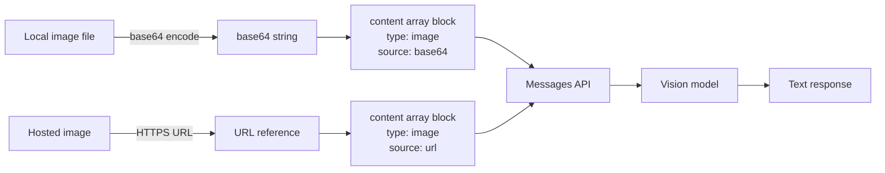

# Vision-Language Models in Apps

> Text and images go in. Structured answers come out. The API is the same; the input encoding is different.

**Type:** Build
**Languages:** Python
**Prerequisites:** Lesson 01-01 (Setup), Phase 01 (Prompt Engineering basics)
**Time:** ~60 min
**Phase:** 10 · Multimodal and Voice

---

## Learning Objectives

- Encode a local image as base64 and include it in an Anthropic API request
- Explain the vision token cost formula and apply it to estimate costs before a request
- Identify the four supported input formats and their size limits
- Describe what vision models do well and where they consistently fail
- Build a minimal golden-set evaluation for vision outputs

---

## The Problem

A product team has a working text-only Claude integration powering a support chat. The PM wants to add "analyze this screenshot" so users can upload an image and ask what is wrong. The engineering team opens the Anthropic docs and immediately hits four questions they cannot answer:

1. How do images actually get sent to the API? The messages format accepts strings, not file objects.
2. What does an image cost in tokens? They are already close to budget limits.
3. What file types and sizes are accepted? Users will upload whatever their phone produces.
4. What prompting strategies work for visual tasks? The zero-shot pattern they use for text does not feel right for images.

The team knows vision models exist. They do not know how to wire one into their existing integration without breaking what already works or triggering unexpected cost overruns.

---

## The Concept

### How images travel through the API

The Anthropic Messages API uses a `content` array instead of a single `content` string. Each element in the array is a block: either a text block or an image block. That is the only structural change from a text-only request. The model receives both blocks together and reasons across them.

Images reach the API in one of two ways:

- **Base64 encoding**: the image bytes are encoded as a base64 string and sent directly in the request body. Required for images that are not publicly accessible via URL.
- **URL reference**: a publicly reachable HTTPS URL. The API fetches the image server-side. Simpler for images already hosted on a CDN.



### Token cost formula

Vision models charge for images using a tile-based calculation. The API divides the image into 32x32 pixel tiles and charges per tile. The formula:

```
tiles_wide  = ceil(width  / 32)
tiles_tall  = ceil(height / 32)
image_tokens = tiles_wide * tiles_tall * 65
```

A 512x512 image: 16 x 16 = 256 tiles = 16,640 tokens. A 1920x1080 image: 60 x 34 = 2,040 tiles = 132,600 tokens. Resize large images before sending them. For most product use cases, 768px on the longest edge is the practical ceiling before cost grows without meaningful quality gain.

### Supported formats and limits

| Format | Notes |
|--------|-------|
| JPEG | Best for photos; lossy compression acceptable |
| PNG | Best for screenshots and diagrams; lossless |
| GIF | First frame only |
| WebP | Supported; common in browser uploads |

Size limits: maximum 5MB per image, maximum 20 images per request. Images below 200x200 pixels may produce degraded results.

### What vision models do well and where they fail

Good at:
- OCR on clean printed text (accuracy comparable to dedicated OCR for born-digital documents)
- UI layout description ("the submit button is in the lower right corner")
- Object presence detection ("does this image contain a chart?")
- Reading error messages and stack traces from screenshots

Fail at:
- Precise pixel coordinates ("the button is at x=432, y=208" is unreliable)
- Counting exact quantities when there are more than 8-10 items
- Reading text in complex backgrounds, low-contrast text, or handwriting
- Spatial reasoning at pixel precision ("is object A exactly 50px to the left of B?")

---

## Build It

The script loads a local image, encodes it, sends it to Claude with a structured prompt, and prints the JSON analysis. The demo mode generates a synthetic PNG using only stdlib so the lesson runs without needing an external image file.

```python
# code/main.py
"""
Lesson 10-01: Vision-Language Models in Apps
Sends an image to Claude and returns structured analysis as JSON.
Demo mode generates a synthetic PNG so no external image file is required.
"""

import anthropic
import base64
import json
import struct
import zlib
from pathlib import Path


# --------------------------------------------------------------------------- #
# Demo image generator (stdlib only, no Pillow required)                      #
# --------------------------------------------------------------------------- #

def _make_minimal_png(width: int = 64, height: int = 64) -> bytes:
    """Generate a minimal valid PNG in memory using only stdlib."""

    def png_chunk(chunk_type: bytes, data: bytes) -> bytes:
        length = len(data)
        crc = zlib.crc32(chunk_type + data) & 0xFFFFFFFF
        return (
            struct.pack(">I", length)
            + chunk_type
            + data
            + struct.pack(">I", crc)
        )

    # IHDR: width, height, bit depth=8, color type=2 (RGB), compression=0, filter=0, interlace=0
    ihdr_data = struct.pack(">IIBBBBB", width, height, 8, 2, 0, 0, 0)

    # Build raw image data: each row has a filter byte (0 = None) + RGB pixels
    # Simple gradient: R increases with x, G increases with y, B=128
    rows = bytearray()
    for y in range(height):
        rows.append(0)  # filter byte
        for x in range(width):
            rows.append(int(x * 255 / (width - 1)))   # R
            rows.append(int(y * 255 / (height - 1)))  # G
            rows.append(128)                           # B

    compressed = zlib.compress(bytes(rows))

    png = (
        b"\x89PNG\r\n\x1a\n"          # PNG signature
        + png_chunk(b"IHDR", ihdr_data)
        + png_chunk(b"IDAT", compressed)
        + png_chunk(b"IEND", b"")
    )
    return png


# --------------------------------------------------------------------------- #
# Core vision function                                                         #
# --------------------------------------------------------------------------- #

def analyze_image(
    image_bytes: bytes,
    media_type: str = "image/png",
    prompt: str = "Analyze this image. Return JSON with keys: description, dominant_colors, detected_text, notable_elements.",
    model: str = "claude-3-5-haiku-20241022",
) -> dict:
    """
    Send an image to Claude as a base64-encoded block.
    Returns the parsed JSON response from the model.
    """
    client = anthropic.Anthropic()

    # Encode image bytes to base64 string
    b64_image = base64.standard_b64encode(image_bytes).decode("utf-8")

    # Estimate token cost before sending
    # (rough approximation: real tile calculation requires width/height)
    estimated_tokens = len(image_bytes) // 150  # very rough heuristic
    print(f"  Image size: {len(image_bytes):,} bytes")
    print(f"  Estimated image tokens (rough): ~{estimated_tokens:,}")

    message = client.messages.create(
        model=model,
        max_tokens=512,
        messages=[
            {
                "role": "user",
                "content": [
                    {
                        "type": "image",
                        "source": {
                            "type": "base64",
                            "media_type": media_type,
                            "data": b64_image,
                        },
                    },
                    {
                        "type": "text",
                        "text": prompt,
                    },
                ],
            }
        ],
    )

    raw_text = message.content[0].text

    # Parse JSON from response (model may wrap it in markdown code fences)
    if "```" in raw_text:
        # Extract content between first and last triple-backtick blocks
        parts = raw_text.split("```")
        # parts[1] is the content block (possibly prefixed with 'json\n')
        raw_text = parts[1].lstrip("json").strip()

    try:
        result = json.loads(raw_text)
    except json.JSONDecodeError:
        # Return raw text in a wrapper dict if JSON parse fails
        result = {"raw_response": raw_text}

    return {
        "analysis": result,
        "usage": {
            "input_tokens": message.usage.input_tokens,
            "output_tokens": message.usage.output_tokens,
        },
        "model": message.model,
    }


# --------------------------------------------------------------------------- #
# Token cost formula (exact, given dimensions)                                #
# --------------------------------------------------------------------------- #

def estimate_vision_tokens(width: int, height: int) -> int:
    """
    Exact Anthropic vision token formula.
    tiles_wide * tiles_tall * 65 (approximate base cost per tile).
    """
    import math
    tiles_wide = math.ceil(width / 32)
    tiles_tall = math.ceil(height / 32)
    return tiles_wide * tiles_tall * 65


# --------------------------------------------------------------------------- #
# Main                                                                        #
# --------------------------------------------------------------------------- #

def main():
    print("=== Lesson 10-01: Vision-Language Models in Apps ===\n")

    # Check for a local image file; fall back to demo synthetic PNG
    local_candidates = ["sample.jpg", "sample.png", "screenshot.png"]
    image_path = None
    for candidate in local_candidates:
        path = Path(candidate)
        if path.exists():
            image_path = path
            break

    if image_path is not None:
        print(f"Using local image: {image_path}")
        image_bytes = image_path.read_bytes()
        media_type = "image/jpeg" if image_path.suffix.lower() == ".jpg" else "image/png"
    else:
        print("No local image found. Generating synthetic demo PNG (64x64 gradient).")
        image_bytes = _make_minimal_png(64, 64)
        media_type = "image/png"

    print()

    # Show exact token estimate for known dimensions
    exact_tokens = estimate_vision_tokens(64, 64)
    print(f"Exact vision tokens for 64x64: {exact_tokens}")
    print(f"Exact vision tokens for 768x768: {estimate_vision_tokens(768, 768)}")
    print(f"Exact vision tokens for 1920x1080: {estimate_vision_tokens(1920, 1080)}")
    print()

    print("Sending image to Claude for structured analysis...")
    result = analyze_image(image_bytes, media_type=media_type)

    print("\n--- Analysis Result ---")
    print(json.dumps(result["analysis"], indent=2))
    print(f"\n--- Token Usage ---")
    print(f"  Input tokens:  {result['usage']['input_tokens']:,}")
    print(f"  Output tokens: {result['usage']['output_tokens']:,}")
    print(f"  Model:         {result['model']}")

    total_input_cost = result["usage"]["input_tokens"] * 0.00000025  # $0.25/1M for Haiku
    print(f"  Estimated input cost: ${total_input_cost:.6f}")


if __name__ == "__main__":
    main()
```

> **Real-world check:** You have a support ticket where the user attached a 4K screenshot (3840x2160). Before sending it to Claude, should you resize it? Run `estimate_vision_tokens(3840, 2160)` versus `estimate_vision_tokens(768, 432)`. The 4K image costs roughly 25x more tokens. For a screenshot showing an error dialog that is readable at 768px wide, the 4K version adds zero information but multiplies your cost. Resize before sending.

---

## Use It

When images are already hosted, skip base64 entirely and use a URL reference. The API fetches the image server-side:

```python
import anthropic

client = anthropic.Anthropic()

message = client.messages.create(
    model="claude-3-5-haiku-20241022",
    max_tokens=512,
    messages=[
        {
            "role": "user",
            "content": [
                {
                    "type": "image",
                    "source": {
                        "type": "url",
                        "url": "https://example.com/screenshot.png",
                    },
                },
                {
                    "type": "text",
                    "text": "Describe the UI elements in this screenshot.",
                },
            ],
        }
    ],
)
print(message.content[0].text)
```

For workflows where the same image is analyzed multiple times across requests, use the **Anthropic Files API**. Upload once, get a file ID, reference the ID in subsequent requests. This avoids re-encoding and re-transmitting the same bytes on every call:

```python
# Upload once
with open("diagram.png", "rb") as f:
    file_response = client.beta.files.upload(
        file=("diagram.png", f, "image/png"),
    )
file_id = file_response.id

# Reference in requests (no base64 re-encoding)
message = client.messages.create(
    model="claude-3-5-haiku-20241022",
    max_tokens=256,
    messages=[
        {
            "role": "user",
            "content": [
                {
                    "type": "image",
                    "source": {"type": "file", "file_id": file_id},
                },
                {"type": "text", "text": "What does this diagram show?"},
            ],
        }
    ],
)
```

The Files API is the right pattern for batch document processing where each page is analyzed by multiple prompt variations.

> **Perspective shift:** Base64 encoding feels like a workaround, but it is the right primitive for private images that cannot be exposed via a public URL. The URL pattern is cleaner but requires your image to be publicly reachable, which is often a non-starter for customer support screenshots or internal documents. Choose based on where your images live, not on which pattern looks simpler in the code.

---

## Ship It

The artifact in `outputs/skill-vision-api-integration.md` is a reference card for adding vision to an existing text API integration.

---

## Evaluate It

Measuring vision quality requires a golden set of images with known expected outputs. The process:

1. **Build the golden set**: collect 20-30 representative images from your actual use case (support screenshots, product photos, documents). Manually write the expected structured output for each.

2. **Metrics by output type**:
   - Structured field extraction (JSON keys with discrete values): exact match rate per field
   - Text detection (OCR quality): character error rate (CER) against ground-truth text
   - Presence/absence classification: precision, recall, F1

3. **Cost tracking**: log `usage.input_tokens` per request. Compute cost per image analyzed. Set an alert if average cost per image exceeds your budget.

4. **Latency by image size**: log image dimensions and time-to-first-token. Plot latency vs. image token count. You will typically find a linear relationship. Use this to set a maximum image dimension policy.

5. **Failure mode audit**: manually review responses where JSON parsing failed or structured fields were missing. Categorize failures: model refused (content policy), JSON malformed, field hallucinated, or image genuinely unreadable. Each category has a different fix.

Run the golden set evaluation on every model version upgrade before deploying to production.
