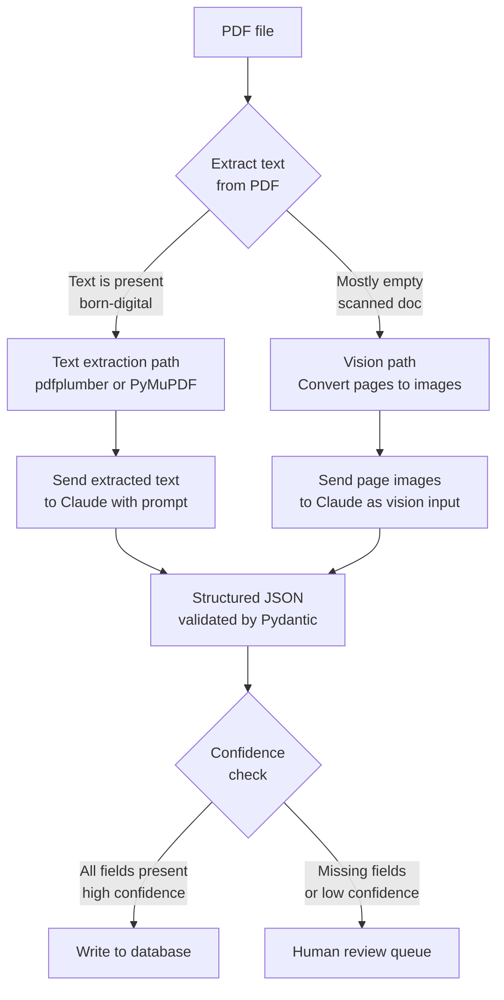

# Document AI ومسارات الاستخراج المنظّم

> الـ PDF مجرّد صورة حتى تحوّله إلى بيانات منظّمة.

**النوع:** بناء
**اللغات:** Python
**المتطلبات:** الدرس 10-01 (نماذج Vision-Language)، المرحلة 01 (Prompt Engineering)
**الوقت:** ~75 دقيقة
**المرحلة:** 10 · Multimodal and Voice

---

## أهداف التعلّم

- التمييز بين ملفات PDF الرقمية الأصل (born-digital) والممسوحة ضوئيًا (scanned) وشرح سبب تغيير هذا التمييز لأسلوب الاستخراج
- تنفيذ كاشف لمسار الـ PDF يختار بين استخراج النص واستخراج الرؤية تلقائيًا
- كتابة prompt استخراج منظّم يعيد مخرَج Pydantic موثّقًا (validated)
- ذكر توقّعات دقّة واقعية لأنواع المستندات المختلفة
- تصميم طابور توجيه قائم على الثقة (confidence) للمراجعة البشرية

---

## المشكلة

فريق قانوني يستقبل 50 عقدًا يوميًا على هيئة ملفات PDF. يقرأ الزملاء المبتدئون كل عقد وينسخون الحقول الرئيسية إلى جدول بيانات: أسماء الأطراف، وتاريخ السريان، وبند الإنهاء، والقانون الحاكم. يستغرق ذلك 15 دقيقة لكل عقد. يريد الفريق أتمتة ذلك.

يبدأ الفريق الهندسي الاستكشاف. يصطدم فورًا بأربعة أسئلة:

1. هل نستخدم OCR ثم نرسل النص إلى Claude، أم نرسل كل صفحة PDF كصورة مباشرة؟
2. كيف نتعامل مع عقد من 40 صفحة؟ لا نستطيع إرسال 40 صورة في استدعاء API واحد ضمن الميزانية.
3. ما الدقّة التي يمكننا أن نعد بها الفريق القانوني واقعيًا؟ إذا فات النظام تاريخ إنهاء في عقد ما، فهناك عواقب حقيقية.
4. بعض العقود نسخ ورقية ممسوحة ضوئيًا وبعضها رقمي الأصل. هل يغيّر ذلك من الأسلوب؟

الإجابة الخاطئة هي اختيار مسار واحد وتطبيقه على كل المستندات. ملف PDF رقمي الأصل بنص مضمّن يمكن استخراجه بجزء بسيط من تكلفة إرساله كصور. أما الـ PDF الممسوح ضوئيًا فلا نص مضمّن فيه إطلاقًا. اختيار المسار الخاطئ إمّا يهدر المال أو ينتج مخرَجًا فارغًا.

---

## المفهوم

### مساران لـ Document AI

القرار الجوهري هو هل نستخرج النص أولًا (أرخص وأسرع) أم نتعامل مع الصفحة كصورة (مطلوب للمستندات الممسوحة ضوئيًا، وأفضل لتخطيطات النماذج).



**مسار استخراج النص (ملفات PDF الرقمية الأصل):**
- استخدم `pdfplumber` أو `PyMuPDF` لاستخراج النص الخام من كل صفحة
- أرسل النص المستخرَج إلى Claude كـ prompt نصّي قياسي
- التكلفة: ~2,000-5,000 token لكل صفحة عقد مقابل ~37,000 token للصفحة نفسها كصورة بدقة 768px
- الدقّة: ~97% لحقول العقود القياسية حين يُستخرَج النص نظيفًا

**مسار الرؤية (ملفات PDF الممسوحة ضوئيًا أو الكثيفة بالنماذج):**
- حوّل كل صفحة PDF إلى صورة (عادةً 150-200 DPI كافية لوضوح النص)
- أرسل صورة كل صفحة إلى Claude باستخدام image block بترميز base64
- التكلفة: أعلى بـ 5-15 ضعفًا من استخراج النص لكل صفحة
- مطلوب لـ: المستندات الورقية الممسوحة ضوئيًا، وملفات PDF بتخطيطات نماذج معقّدة حيث ترتبط تسميات الحقول وقيمها بصريًا لا تسلسليًا نصّيًا

### استراتيجيات التقسيم (chunking) للمستندات متعدّدة الصفحات

عقد من 40 صفحة يتجاوز ما يمكنك إرساله في استدعاء API واحد بتكلفة معقولة. ثلاث استراتيجيات:

**الاستراتيجية 1 - الاستخراج الانتقائي للصفحات**: حدّد أي الصفحات يُرجَّح أن تحتوي على الحقول المستهدفة (الصفحة 1 للأطراف والتاريخ، آخر 5 صفحات للتوقيعات والقانون الحاكم) وأرسل تلك فقط.

**الاستراتيجية 2 - المعالجة المتسلسلة للصفحات مع التراكم**: عالج الصفحات بالترتيب، وراكم الحقول التي عُثر عليها حتى الآن، وتوقّف حين تُملأ كل الحقول المطلوبة.

**الاستراتيجية 3 - دمج كامل نص المستند**: للمستندات الرقمية الأصل، ادمج كل النص المستخرَج وأرسله كـ prompt نصّي طويل واحد. ينجح جيدًا للعقود دون 100 صفحة (~150k token من النص).

### توقّعات الدقّة بحسب نوع المستند

| Document type | Field accuracy | Notes |
|---------------|---------------|-------|
| عقد رقمي الأصل (قياسي) | 95-98% | عالية، خصوصًا للحقول المؤرَّخة/المسمّاة |
| نموذج رقمي الأصل (نموذج PDF) | 90-95% | يعتمد على تعقيد النموذج |
| عقد ممسوح ضوئيًا، مسح نظيف | 88-94% | ضوضاء مستوى الـ OCR تؤثّر على النتائج |
| نموذج ممسوح ضوئيًا، حقول بخط اليد | 70-85% | خط اليد هو المصدر الرئيسي للخطأ |
| مستند مصوّر (هاتف) | 65-82% | تشوّه المنظور، الإضاءة |

هذه أرقام دقّة على مستوى الحقل، لا على مستوى المستند. مستند بـ 10 حقول بدقّة 95% لديه احتمال ~40% أن يكون حقل واحد على الأقل خاطئًا. خطّط للمراجعة البشرية للحقول عالية المخاطر.

---

## البناء

يكشف السكربت هل الـ PDF رقمي الأصل أم ممسوح ضوئيًا، ويختار مسار الاستخراج المناسب، ويستدعي Claude، ويوثّق المخرَج بـ Pydantic.

```python
# code/main.py
"""
Lesson 10-02: Document AI and Structured Extraction Pipelines
Detects PDF type, chooses extraction path, returns validated structured data.
Demo mode works without a real PDF file.
"""

import anthropic
import base64
import json
import sys
from pathlib import Path
from typing import Optional

try:
    from pydantic import BaseModel, Field
except ImportError:
    raise SystemExit("Install pydantic: pip install pydantic")


# --------------------------------------------------------------------------- #
# Output schema                                                                #
# --------------------------------------------------------------------------- #

class ContractExtraction(BaseModel):
    party_a: Optional[str] = Field(None, description="First party name")
    party_b: Optional[str] = Field(None, description="Second party name")
    effective_date: Optional[str] = Field(None, description="Contract effective date (ISO 8601 if possible)")
    termination_clause: Optional[str] = Field(None, description="Summary of termination conditions")
    governing_law: Optional[str] = Field(None, description="Governing law jurisdiction")
    confidence: str = Field("low", description="Confidence: high / medium / low")
    extraction_notes: list[str] = Field(default_factory=list, description="Any caveats about the extraction")


# --------------------------------------------------------------------------- #
# PDF type detection                                                           #
# --------------------------------------------------------------------------- #

def is_born_digital(pdf_bytes: bytes, min_text_chars: int = 100) -> bool:
    """
    Returns True if the PDF has enough embedded text to use text extraction.
    Uses PyMuPDF if available, otherwise falls back to a heuristic byte scan.
    """
    try:
        import fitz  # PyMuPDF
        doc = fitz.open(stream=pdf_bytes, filetype="pdf")
        total_text = ""
        for page in doc:
            total_text += page.get_text()
            if len(total_text) >= min_text_chars:
                doc.close()
                return True
        doc.close()
        return len(total_text) >= min_text_chars
    except ImportError:
        pass

    try:
        import pdfplumber, io
        with pdfplumber.open(io.BytesIO(pdf_bytes)) as pdf:
            total_text = ""
            for page in pdf.pages:
                text = page.extract_text() or ""
                total_text += text
                if len(total_text) >= min_text_chars:
                    return True
            return len(total_text) >= min_text_chars
    except ImportError:
        pass

    # Heuristic fallback: look for /Font entries in the PDF byte stream
    # Born-digital PDFs usually reference fonts; scanned image PDFs do not
    return b"/Font" in pdf_bytes and b"/Text" in pdf_bytes


def extract_text_from_pdf(pdf_bytes: bytes) -> str:
    """Extract all text from a born-digital PDF."""
    try:
        import fitz
        doc = fitz.open(stream=pdf_bytes, filetype="pdf")
        pages_text = [page.get_text() for page in doc]
        doc.close()
        return "\n\n--- PAGE BREAK ---\n\n".join(pages_text)
    except ImportError:
        pass

    try:
        import pdfplumber, io
        with pdfplumber.open(io.BytesIO(pdf_bytes)) as pdf:
            pages_text = [page.extract_text() or "" for page in pdf.pages]
        return "\n\n--- PAGE BREAK ---\n\n".join(pages_text)
    except ImportError:
        pass

    raise RuntimeError("Install PyMuPDF (pip install pymupdf) or pdfplumber (pip install pdfplumber) for text extraction.")


def pdf_pages_to_images(pdf_bytes: bytes, dpi: int = 150) -> list[bytes]:
    """
    Convert PDF pages to PNG images.
    Requires PyMuPDF (pip install pymupdf).
    """
    try:
        import fitz
        doc = fitz.open(stream=pdf_bytes, filetype="pdf")
        images = []
        mat = fitz.Matrix(dpi / 72, dpi / 72)
        for page in doc:
            pix = page.get_pixmap(matrix=mat)
            images.append(pix.tobytes("png"))
        doc.close()
        return images
    except ImportError:
        raise RuntimeError("Install PyMuPDF (pip install pymupdf) for image-based extraction.")


# --------------------------------------------------------------------------- #
# Extraction prompts                                                           #
# --------------------------------------------------------------------------- #

EXTRACTION_PROMPT = """
Extract the following fields from this contract document.
Return valid JSON only - no markdown, no explanation, just JSON.

Required JSON structure:
{
  "party_a": "First party name or null",
  "party_b": "Second party name or null",
  "effective_date": "Date in ISO 8601 format or original text or null",
  "termination_clause": "Brief summary of termination conditions or null",
  "governing_law": "Jurisdiction or null",
  "confidence": "high or medium or low",
  "extraction_notes": ["any caveats about missing or ambiguous fields"]
}

Set confidence to:
- high: all five main fields found with clear values
- medium: 3-4 fields found, or one is ambiguous
- low: fewer than 3 fields found or document does not appear to be a contract
"""


# --------------------------------------------------------------------------- #
# Core extraction functions                                                    #
# --------------------------------------------------------------------------- #

def extract_from_text(text: str, model: str = "claude-3-5-haiku-20241022") -> ContractExtraction:
    """Text path: send extracted text to Claude."""
    client = anthropic.Anthropic()

    # Truncate to avoid exceeding context limits (~150k chars is safe for Haiku)
    if len(text) > 150_000:
        text = text[:150_000] + "\n\n[DOCUMENT TRUNCATED]"

    message = client.messages.create(
        model=model,
        max_tokens=512,
        messages=[
            {
                "role": "user",
                "content": f"{EXTRACTION_PROMPT}\n\nDOCUMENT TEXT:\n{text}",
            }
        ],
    )

    raw = message.content[0].text.strip()
    if raw.startswith("```"):
        raw = raw.split("```")[1].lstrip("json").strip()

    data = json.loads(raw)
    return ContractExtraction(**data)


def extract_from_images(
    page_images: list[bytes],
    model: str = "claude-3-5-haiku-20241022",
    max_pages: int = 5,
) -> ContractExtraction:
    """Vision path: send first N pages as images to Claude."""
    client = anthropic.Anthropic()

    # Only send the first max_pages pages to control cost
    pages_to_send = page_images[:max_pages]

    content = []
    for i, img_bytes in enumerate(pages_to_send):
        b64 = base64.standard_b64encode(img_bytes).decode("utf-8")
        content.append({
            "type": "image",
            "source": {"type": "base64", "media_type": "image/png", "data": b64},
        })
        content.append({
            "type": "text",
            "text": f"[Above is page {i + 1} of {len(page_images)}]",
        })

    content.append({"type": "text", "text": EXTRACTION_PROMPT})

    message = client.messages.create(
        model=model,
        max_tokens=512,
        messages=[{"role": "user", "content": content}],
    )

    raw = message.content[0].text.strip()
    if raw.startswith("```"):
        raw = raw.split("```")[1].lstrip("json").strip()

    data = json.loads(raw)
    return ContractExtraction(**data)


# --------------------------------------------------------------------------- #
# Demo PDF                                                                     #
# --------------------------------------------------------------------------- #

# A minimal born-digital PDF with contract text (pre-generated, base64-encoded)
# This is a real valid PDF so pdfplumber/PyMuPDF can extract text from it.
DEMO_CONTRACT_TEXT = """
SERVICE AGREEMENT

This Service Agreement ("Agreement") is entered into as of January 15, 2025 ("Effective Date")
between Acme Corporation, a Delaware corporation ("Party A"), and BuildRight LLC,
a California limited liability company ("Party B").

1. SERVICES. Party B agrees to provide software development services as described in Exhibit A.

2. TERM AND TERMINATION. This Agreement commences on the Effective Date and continues for
twelve (12) months. Either party may terminate this Agreement upon thirty (30) days written notice.
Party A may terminate immediately for cause if Party B materially breaches this Agreement.

3. GOVERNING LAW. This Agreement shall be governed by the laws of the State of Delaware,
without regard to its conflict of law provisions.

4. SIGNATURES. Executed as of the date first written above.
"""


# --------------------------------------------------------------------------- #
# Main                                                                         #
# --------------------------------------------------------------------------- #

def main():
    print("=== Lesson 10-02: Document AI and Structured Extraction Pipelines ===\n")

    if len(sys.argv) > 1:
        pdf_path = Path(sys.argv[1])
        if not pdf_path.exists():
            print(f"Error: file not found: {pdf_path}")
            sys.exit(1)
        print(f"Processing PDF: {pdf_path}")
        pdf_bytes = pdf_path.read_bytes()

        print("Detecting PDF type...")
        born_digital = is_born_digital(pdf_bytes)
        print(f"  Born-digital: {born_digital}")

        if born_digital:
            print("\nPath: text extraction")
            text = extract_text_from_pdf(pdf_bytes)
            print(f"  Extracted {len(text):,} characters")
            result = extract_from_text(text)
        else:
            print("\nPath: vision (image-based)")
            pages = pdf_pages_to_images(pdf_bytes)
            print(f"  Converted {len(pages)} pages to images")
            result = extract_from_images(pages)
    else:
        print("No PDF file provided. Using demo contract text (born-digital path).")
        print()
        result = extract_from_text(DEMO_CONTRACT_TEXT)

    print("\n--- Extraction Result ---")
    print(json.dumps(result.model_dump(), indent=2))

    print("\n--- Routing Decision ---")
    if result.confidence == "high":
        print("  -> Write to database (all fields extracted)")
    elif result.confidence == "medium":
        print("  -> Flag for human review (some fields uncertain)")
    else:
        print("  -> Send to human review queue (low confidence)")

    if result.extraction_notes:
        print("\n--- Extraction Notes ---")
        for note in result.extraction_notes:
            print(f"  - {note}")


if __name__ == "__main__":
    main()
```

> **اختبار من الواقع:** يسأل الفريق القانوني: "ماذا يحدث حين يستخرج النظام تاريخ إنهاء خاطئ ونفوّت نافذة إشعار؟" الإجابة الصحيحة ليست "سنجعله أكثر دقّة". بل هي: "أي حقل بثقة متوسطة أو منخفضة يذهب إلى طابور مراجعة بشرية. يراجع الزميل المبتدئ الحقول المعلَّمة فقط بدلًا من العقد بأكمله، وهو ما يوفّر 80% من وقته مع الحفاظ على الدقّة للحقول عالية المخاطر." الدقّة والأتمتة طيف، لا ثنائية. صمّم التوجيه قبل أن تبني النموذج.

---

## الاستخدام

للفرق التي تستخدم LlamaIndex أصلًا، يتولّى `SimpleDirectoryReader` خطوة كشف المسار والتحليل (parsing):

```python
from llama_index.core import SimpleDirectoryReader
from llama_index.llms.anthropic import Anthropic

# SimpleDirectoryReader detects PDF type and extracts text or images accordingly
documents = SimpleDirectoryReader("./contracts/").load_data()

llm = Anthropic(model="claude-3-5-haiku-20241022")

for doc in documents:
    response = llm.complete(
        f"{EXTRACTION_PROMPT}\n\nDOCUMENT:\n{doc.text[:50000]}"
    )
    print(response.text)
```

لبنى المستندات الأكثر تعقيدًا (جداول، تخطيطات متعدّدة الأعمدة، مخططات مضمّنة)، فكّر في **Docling** من IBM. ينتج Markdown منظّمًا من ملفات PDF يحافظ على بنية الجداول أفضل بكثير من استخراج النص الخام:

```bash
pip install docling
```

```python
from docling.document_converter import DocumentConverter

converter = DocumentConverter()
result = converter.convert("contract.pdf")
# result.document.export_to_markdown() gives structured markdown
# with table cells preserved as markdown tables
structured_text = result.document.export_to_markdown()
```

يكون Docling قيّمًا بشكل خاص حين تحتوي العقود على جداول تسعير أو جداول SLA حيث يهمّ محاذاة الخلايا لدقّة الاستخراج.

> **نقلة في المنظور:** الغريزة هي إرسال كل شيء كصور لأن "النموذج يمكنه أن يرى تمامًا ما يراه الإنسان". هذا المنطق صحيح لكنه مكلف. استخراج النص من ملفات PDF الرقمية الأصل ليس تنازلًا، بل ينتج دقّة استخراج أفضل من مسار الرؤية لمعظم نص العقود لأنه لا توجد خطوة OCR تُدخِل الضوضاء. استخدم الرؤية حين يتعذّر استخراج النص، لا كخيار افتراضي.

---

## التسليم

الأداة الناتجة في `outputs/skill-document-extraction-pipeline.md` هي مرجع إنتاجي لمسارات Document AI يشمل أشجار القرار، وتقديرات التكلفة، وتصميم طابور المراجعة البشرية.

---

## التقييم

**بناء الـ golden set**: علّم 30-50 مستندًا حقيقيًا من نصّ الإنتاج (corpus) يدويًا. ضمّن مزيجًا من أنواع المستندات (رقمي الأصل، ممسوح ضوئيًا، نماذج معقّدة). لكل مستند، سجّل القيمة المتوقّعة لكل حقل مستخرَج.

**مقاييس الدقّة لكل حقل**:
```
accuracy_field_X = correct_extractions_X / total_documents
```

تتبّع كل حقل على حدة. اسم الطرف والقانون الحاكم أسهل عادةً من بند الإنهاء (الذي يتطلّب غالبًا استدلالًا عبر عدة جمل). رقم دقّة إجمالي واحد يخفي هذا.

**معايرة الثقة (confidence calibration)**: قِس هل تسمياتك للثقة تتنبّأ فعلًا بالدقّة:
```
high confidence docs  -> should have >95% field accuracy
medium confidence docs -> should have 75-94% field accuracy
low confidence docs   -> below 75%, all go to human review
```

إذا كانت مستندات الثقة العالية دقيقة بنسبة 85% فقط، فإن الـ prompt لا يولّد إشارات ثقة ذات معنى. اضبط الـ prompt ليكون أكثر تحفّظًا.

**التكلفة لكل مستند**: سجّل عدد الـ tokens لكل مستند. احسب:
- مسار النص: tokens لكل مستند (عادةً 2,000-8,000 input token لكل عقد)
- مسار الرؤية: tokens لكل صفحة * عدد الصفحات المرسَلة (عادةً 37,000-150,000 لكل صفحة بدقة 768px)

**إنتاجية المراجعة البشرية**: قِس كم تستغرق المراجعة البشرية لكل مستند معلَّم. إذا كان المراجعون لا يزالون يقضون 10 دقائق لكل مستند بثقة متوسطة، فإن عتبة التوجيه تحتاج ضبطًا.
