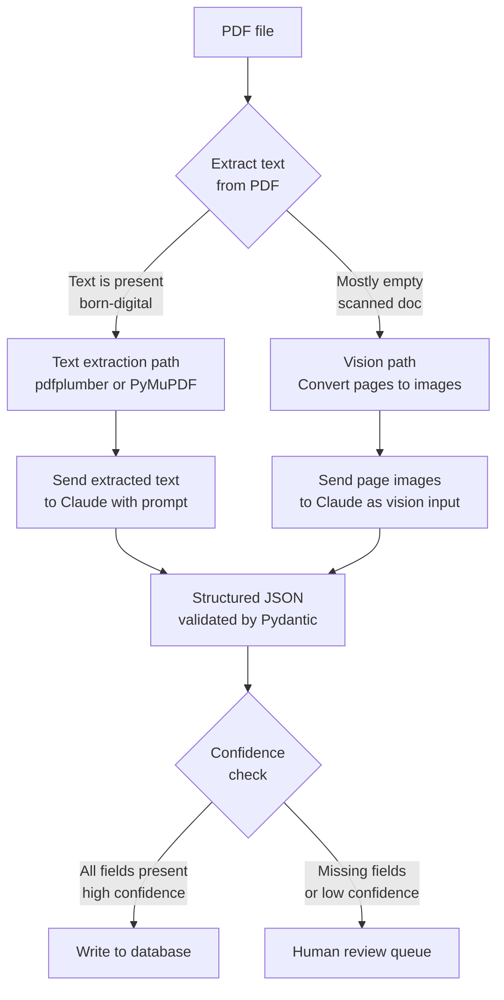

# Document AI and Structured Extraction Pipelines

> A PDF is just an image until you make it structured data.

**Type:** Build
**Languages:** Python
**Prerequisites:** Lesson 10-01 (Vision-Language Models), Phase 01 (Prompt Engineering)
**Time:** ~75 min
**Phase:** 10 · Multimodal and Voice

---

## Learning Objectives

- Distinguish born-digital PDFs from scanned PDFs and explain why the distinction changes the extraction approach
- Implement a PDF path detector that chooses text extraction vs vision extraction automatically
- Write a structured extraction prompt that returns validated Pydantic output
- State realistic accuracy expectations for different document types
- Design a confidence-based routing queue for human review

---

## The Problem

A legal team receives 50 contracts per day as PDFs. Junior associates read each one and copy the key fields into a spreadsheet: party names, effective date, termination clause, governing law. It takes 15 minutes per contract. The team wants to automate it.

The engineering team starts exploring. They immediately hit four questions:

1. Should we use OCR and then send the text to Claude, or send each PDF page as an image directly?
2. How do we handle a 40-page contract? We cannot send 40 images in one API call within budget.
3. What accuracy can we realistically promise the legal team? If the system misses a termination date in a contract, there are real consequences.
4. Some contracts are scanned paper copies and some are born-digital. Does that change the approach?

The wrong answer is to pick one path and apply it to all documents. A born-digital PDF with embedded text can be extracted for a fraction of the cost of sending it as images. A scanned PDF has no embedded text at all. Getting the path selection wrong either wastes money or produces empty output.

---

## The Concept

### Two paths for document AI

The core decision is whether to extract text first (cheaper, faster) or treat the page as an image (required for scanned documents, better for form layouts).



**Text extraction path (born-digital PDFs):**
- Use `pdfplumber` or `PyMuPDF` to extract the raw text from each page
- Send the extracted text to Claude as a standard text prompt
- Cost: ~2,000-5,000 tokens per contract page vs ~37,000 tokens for the same page as an image at 768px
- Accuracy: ~97% for standard contract fields when the text is cleanly extracted

**Vision path (scanned or form-heavy PDFs):**
- Convert each PDF page to an image (typically 150-200 DPI is enough for text legibility)
- Send each page image to Claude using the base64 image block
- Cost: 5-15x more than text extraction per page
- Required for: scanned paper documents, PDFs with complex form layouts where field labels and values are visually associated rather than textually sequential

### Chunking strategies for multi-page documents

A 40-page contract exceeds what you can send in a single API call at reasonable cost. Three strategies:

**Strategy 1 - Selective page extraction**: identify which pages are likely to contain the target fields (page 1 for parties and date, last 5 pages for signatures and governing law) and only send those.

**Strategy 2 - Sequential page processing with accumulation**: process pages in order, accumulate fields found so far, stop when all required fields are populated.

**Strategy 3 - Full document text concatenation**: for born-digital documents, concatenate all extracted text and send it as one long text prompt. Works well for contracts under 100 pages (~150k tokens of text).

### Accuracy expectations by document type

| Document type | Field accuracy | Notes |
|---------------|---------------|-------|
| Born-digital contract (standard) | 95-98% | High, especially for dated/named fields |
| Born-digital form (PDF form) | 90-95% | Depends on form complexity |
| Scanned contract, clean scan | 88-94% | OCR-level noise affects results |
| Scanned form, handwritten fields | 70-85% | Handwriting is the main source of error |
| Photographed document (phone) | 65-82% | Perspective distortion, lighting |

These are field-level accuracy numbers, not document-level. A document with 10 fields at 95% accuracy has a ~40% chance of at least one field being wrong. Plan for human review for high-stakes fields.

---

## Build It

The script detects whether a PDF is born-digital or scanned, chooses the appropriate extraction path, calls Claude, and validates the output with Pydantic.

```python
# code/main.py
"""
Lesson 10-02: Document AI and Structured Extraction Pipelines
Detects PDF type, chooses extraction path, returns validated structured data.
Demo mode works without a real PDF file.
"""

import anthropic
import base64
import json
import sys
from pathlib import Path
from typing import Optional

try:
    from pydantic import BaseModel, Field
except ImportError:
    raise SystemExit("Install pydantic: pip install pydantic")


# --------------------------------------------------------------------------- #
# Output schema                                                                #
# --------------------------------------------------------------------------- #

class ContractExtraction(BaseModel):
    party_a: Optional[str] = Field(None, description="First party name")
    party_b: Optional[str] = Field(None, description="Second party name")
    effective_date: Optional[str] = Field(None, description="Contract effective date (ISO 8601 if possible)")
    termination_clause: Optional[str] = Field(None, description="Summary of termination conditions")
    governing_law: Optional[str] = Field(None, description="Governing law jurisdiction")
    confidence: str = Field("low", description="Confidence: high / medium / low")
    extraction_notes: list[str] = Field(default_factory=list, description="Any caveats about the extraction")


# --------------------------------------------------------------------------- #
# PDF type detection                                                           #
# --------------------------------------------------------------------------- #

def is_born_digital(pdf_bytes: bytes, min_text_chars: int = 100) -> bool:
    """
    Returns True if the PDF has enough embedded text to use text extraction.
    Uses PyMuPDF if available, otherwise falls back to a heuristic byte scan.
    """
    try:
        import fitz  # PyMuPDF
        doc = fitz.open(stream=pdf_bytes, filetype="pdf")
        total_text = ""
        for page in doc:
            total_text += page.get_text()
            if len(total_text) >= min_text_chars:
                doc.close()
                return True
        doc.close()
        return len(total_text) >= min_text_chars
    except ImportError:
        pass

    try:
        import pdfplumber, io
        with pdfplumber.open(io.BytesIO(pdf_bytes)) as pdf:
            total_text = ""
            for page in pdf.pages:
                text = page.extract_text() or ""
                total_text += text
                if len(total_text) >= min_text_chars:
                    return True
            return len(total_text) >= min_text_chars
    except ImportError:
        pass

    # Heuristic fallback: look for /Font entries in the PDF byte stream
    # Born-digital PDFs usually reference fonts; scanned image PDFs do not
    return b"/Font" in pdf_bytes and b"/Text" in pdf_bytes


def extract_text_from_pdf(pdf_bytes: bytes) -> str:
    """Extract all text from a born-digital PDF."""
    try:
        import fitz
        doc = fitz.open(stream=pdf_bytes, filetype="pdf")
        pages_text = [page.get_text() for page in doc]
        doc.close()
        return "\n\n--- PAGE BREAK ---\n\n".join(pages_text)
    except ImportError:
        pass

    try:
        import pdfplumber, io
        with pdfplumber.open(io.BytesIO(pdf_bytes)) as pdf:
            pages_text = [page.extract_text() or "" for page in pdf.pages]
        return "\n\n--- PAGE BREAK ---\n\n".join(pages_text)
    except ImportError:
        pass

    raise RuntimeError("Install PyMuPDF (pip install pymupdf) or pdfplumber (pip install pdfplumber) for text extraction.")


def pdf_pages_to_images(pdf_bytes: bytes, dpi: int = 150) -> list[bytes]:
    """
    Convert PDF pages to PNG images.
    Requires PyMuPDF (pip install pymupdf).
    """
    try:
        import fitz
        doc = fitz.open(stream=pdf_bytes, filetype="pdf")
        images = []
        mat = fitz.Matrix(dpi / 72, dpi / 72)
        for page in doc:
            pix = page.get_pixmap(matrix=mat)
            images.append(pix.tobytes("png"))
        doc.close()
        return images
    except ImportError:
        raise RuntimeError("Install PyMuPDF (pip install pymupdf) for image-based extraction.")


# --------------------------------------------------------------------------- #
# Extraction prompts                                                           #
# --------------------------------------------------------------------------- #

EXTRACTION_PROMPT = """
Extract the following fields from this contract document.
Return valid JSON only - no markdown, no explanation, just JSON.

Required JSON structure:
{
  "party_a": "First party name or null",
  "party_b": "Second party name or null",
  "effective_date": "Date in ISO 8601 format or original text or null",
  "termination_clause": "Brief summary of termination conditions or null",
  "governing_law": "Jurisdiction or null",
  "confidence": "high or medium or low",
  "extraction_notes": ["any caveats about missing or ambiguous fields"]
}

Set confidence to:
- high: all five main fields found with clear values
- medium: 3-4 fields found, or one is ambiguous
- low: fewer than 3 fields found or document does not appear to be a contract
"""


# --------------------------------------------------------------------------- #
# Core extraction functions                                                    #
# --------------------------------------------------------------------------- #

def extract_from_text(text: str, model: str = "claude-3-5-haiku-20241022") -> ContractExtraction:
    """Text path: send extracted text to Claude."""
    client = anthropic.Anthropic()

    # Truncate to avoid exceeding context limits (~150k chars is safe for Haiku)
    if len(text) > 150_000:
        text = text[:150_000] + "\n\n[DOCUMENT TRUNCATED]"

    message = client.messages.create(
        model=model,
        max_tokens=512,
        messages=[
            {
                "role": "user",
                "content": f"{EXTRACTION_PROMPT}\n\nDOCUMENT TEXT:\n{text}",
            }
        ],
    )

    raw = message.content[0].text.strip()
    if raw.startswith("```"):
        raw = raw.split("```")[1].lstrip("json").strip()

    data = json.loads(raw)
    return ContractExtraction(**data)


def extract_from_images(
    page_images: list[bytes],
    model: str = "claude-3-5-haiku-20241022",
    max_pages: int = 5,
) -> ContractExtraction:
    """Vision path: send first N pages as images to Claude."""
    client = anthropic.Anthropic()

    # Only send the first max_pages pages to control cost
    pages_to_send = page_images[:max_pages]

    content = []
    for i, img_bytes in enumerate(pages_to_send):
        b64 = base64.standard_b64encode(img_bytes).decode("utf-8")
        content.append({
            "type": "image",
            "source": {"type": "base64", "media_type": "image/png", "data": b64},
        })
        content.append({
            "type": "text",
            "text": f"[Above is page {i + 1} of {len(page_images)}]",
        })

    content.append({"type": "text", "text": EXTRACTION_PROMPT})

    message = client.messages.create(
        model=model,
        max_tokens=512,
        messages=[{"role": "user", "content": content}],
    )

    raw = message.content[0].text.strip()
    if raw.startswith("```"):
        raw = raw.split("```")[1].lstrip("json").strip()

    data = json.loads(raw)
    return ContractExtraction(**data)


# --------------------------------------------------------------------------- #
# Demo PDF                                                                     #
# --------------------------------------------------------------------------- #

# A minimal born-digital PDF with contract text (pre-generated, base64-encoded)
# This is a real valid PDF so pdfplumber/PyMuPDF can extract text from it.
DEMO_CONTRACT_TEXT = """
SERVICE AGREEMENT

This Service Agreement ("Agreement") is entered into as of January 15, 2025 ("Effective Date")
between Acme Corporation, a Delaware corporation ("Party A"), and BuildRight LLC,
a California limited liability company ("Party B").

1. SERVICES. Party B agrees to provide software development services as described in Exhibit A.

2. TERM AND TERMINATION. This Agreement commences on the Effective Date and continues for
twelve (12) months. Either party may terminate this Agreement upon thirty (30) days written notice.
Party A may terminate immediately for cause if Party B materially breaches this Agreement.

3. GOVERNING LAW. This Agreement shall be governed by the laws of the State of Delaware,
without regard to its conflict of law provisions.

4. SIGNATURES. Executed as of the date first written above.
"""


# --------------------------------------------------------------------------- #
# Main                                                                         #
# --------------------------------------------------------------------------- #

def main():
    print("=== Lesson 10-02: Document AI and Structured Extraction Pipelines ===\n")

    if len(sys.argv) > 1:
        pdf_path = Path(sys.argv[1])
        if not pdf_path.exists():
            print(f"Error: file not found: {pdf_path}")
            sys.exit(1)
        print(f"Processing PDF: {pdf_path}")
        pdf_bytes = pdf_path.read_bytes()

        print("Detecting PDF type...")
        born_digital = is_born_digital(pdf_bytes)
        print(f"  Born-digital: {born_digital}")

        if born_digital:
            print("\nPath: text extraction")
            text = extract_text_from_pdf(pdf_bytes)
            print(f"  Extracted {len(text):,} characters")
            result = extract_from_text(text)
        else:
            print("\nPath: vision (image-based)")
            pages = pdf_pages_to_images(pdf_bytes)
            print(f"  Converted {len(pages)} pages to images")
            result = extract_from_images(pages)
    else:
        print("No PDF file provided. Using demo contract text (born-digital path).")
        print()
        result = extract_from_text(DEMO_CONTRACT_TEXT)

    print("\n--- Extraction Result ---")
    print(json.dumps(result.model_dump(), indent=2))

    print("\n--- Routing Decision ---")
    if result.confidence == "high":
        print("  -> Write to database (all fields extracted)")
    elif result.confidence == "medium":
        print("  -> Flag for human review (some fields uncertain)")
    else:
        print("  -> Send to human review queue (low confidence)")

    if result.extraction_notes:
        print("\n--- Extraction Notes ---")
        for note in result.extraction_notes:
            print(f"  - {note}")


if __name__ == "__main__":
    main()
```

> **Real-world check:** The legal team asks: "What happens when the system extracts the wrong termination date and we miss a notice window?" The correct answer is not "we will make it more accurate." It is: "Any field with medium or low confidence goes to a human review queue. A junior associate reviews only the flagged fields rather than the whole contract, which still saves 80% of their time while maintaining accuracy for high-stakes fields." Accuracy and automation are a spectrum, not a binary. Design the routing before you build the model.

---

## Use It

For teams already using LlamaIndex, `SimpleDirectoryReader` handles the path detection and parsing step:

```python
from llama_index.core import SimpleDirectoryReader
from llama_index.llms.anthropic import Anthropic

# SimpleDirectoryReader detects PDF type and extracts text or images accordingly
documents = SimpleDirectoryReader("./contracts/").load_data()

llm = Anthropic(model="claude-3-5-haiku-20241022")

for doc in documents:
    response = llm.complete(
        f"{EXTRACTION_PROMPT}\n\nDOCUMENT:\n{doc.text[:50000]}"
    )
    print(response.text)
```

For more complex document structures (tables, multi-column layouts, embedded charts), consider **Docling** from IBM. It produces structured Markdown from PDFs that preserves table structure much better than raw text extraction:

```bash
pip install docling
```

```python
from docling.document_converter import DocumentConverter

converter = DocumentConverter()
result = converter.convert("contract.pdf")
# result.document.export_to_markdown() gives structured markdown
# with table cells preserved as markdown tables
structured_text = result.document.export_to_markdown()
```

Docling is particularly valuable when contracts contain pricing schedules or SLA tables where cell alignment matters for extraction accuracy.

> **Perspective shift:** The instinct is to send everything as images because "the model can see exactly what a human sees." That reasoning is correct but expensive. Text extraction from born-digital PDFs is not a compromise - it produces better extraction accuracy than the vision path for most contract text because there is no OCR step introducing noise. Use vision when text extraction is unavailable, not as the default.

---

## Ship It

The artifact in `outputs/skill-document-extraction-pipeline.md` is a production reference for document AI pipelines including decision trees, cost estimates, and human review queue design.

---

## Evaluate It

**Golden set construction**: label 30-50 real documents from your production corpus manually. Include a mix of document types (born-digital, scanned, complex forms). For each document, record the expected value of each extracted field.

**Per-field accuracy metrics**:
```
accuracy_field_X = correct_extractions_X / total_documents
```

Track per-field separately. Party name and governing law are typically easier than termination clause (which often requires multi-sentence reasoning). A single overall accuracy number hides this.

**Confidence calibration**: measure whether your confidence labels actually predict accuracy:
```
high confidence docs  -> should have >95% field accuracy
medium confidence docs -> should have 75-94% field accuracy
low confidence docs   -> below 75%, all go to human review
```

If high-confidence docs are only 85% accurate, your prompt is not generating meaningful confidence signals. Adjust the prompt to be more conservative.

**Cost per document**: log token counts per document. Compute:
- Text path: tokens per document (typically 2,000-8,000 input tokens per contract)
- Vision path: tokens per page * pages sent (typically 37,000-150,000 per page at 768px)

**Human review throughput**: measure how long human review takes per flagged document. If reviewers are still spending 10 minutes per medium-confidence document, the routing threshold needs tuning.
