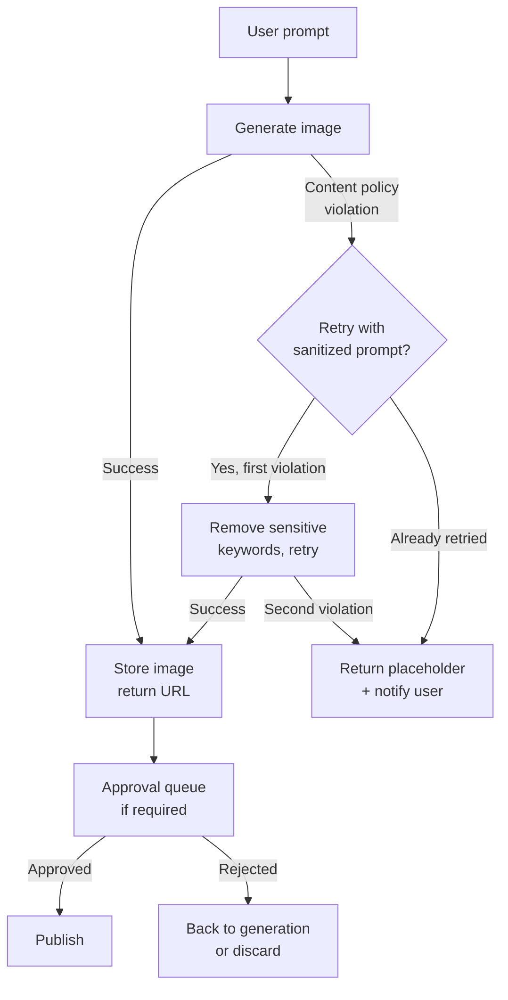

# توليد الصور في المنتجات

> توليد الصور في المنتجات مشكلة prompt engineering وسياسة محتوى، لا مشكلة نظرية diffusion.

**النوع:** بناء
**اللغات:** Python
**المتطلبات:** الدرس 10-01 (نماذج Vision-Language)، المرحلة 01 (Prompt Engineering)
**الوقت:** ~60 دقيقة
**المرحلة:** 10 · Multimodal and Voice

---

## أهداف التعلّم

- مقارنة مزوّدي API توليد الصور الكبار من حيث التكلفة وزمن الاستجابة وقيود المحتوى
- التعامل مع انتهاكات سياسة المحتوى بسلاسة عبر إعادة محاولة بـ prompt مُنقّى
- تنفيذ نمط خدمة التوليد غير المتزامن (async) لحالات الاستخدام التي يتجاوز فيها زمن الاستجابة 5 ثوانٍ
- تصميم سير عمل من التوليد إلى الموافقة لمسارات محتوى الإنتاج
- تحديد المقاييس المهمّة لتوليد الصور في الإنتاج

---

## المشكلة

مدير منتج يريد إضافة توليد صور بالـ AI إلى منصّة تسويق. سيصف المستخدمون فكرة حملة نصّيًا فيستلمون صورة مولَّدة لاستخدامها في المنشورات الاجتماعية. لدى الفريق الهندسي بعد ظهر واحد لاستكشافها (spike).

يصطدمون بخمسة قرارات فورًا:

1. أي API؟ ‏DALL-E 3 ‏(OpenAI)، أو Stable Diffusion عبر Replicate، أو Midjourney عبر API. هذه منتجات مختلفة بمفاضلات مختلفة.
2. انتهاكات سياسة المحتوى. النصوص التسويقية قد تصف شراكات علامات تجارية، وكحول، ومنتجات منافسة. بعض هذه سيثير رفضًا. ماذا يحدث لتجربة المستخدم حين يقع رفض؟
3. يستغرق التوليد 5-20 ثانية. استدعاء API متزامن يتعلّق لمدة 15 ثانية داخل طلب ويب ليس جاهزًا للإنتاج. كيف يبنون المعمارية؟
4. أين تعيش الصور المولَّدة؟ لا يستطيعون تقديمها مباشرةً من رابط استجابة OpenAI (لأنه ينتهي).
5. تتطلّب إرشادات العلامة التجارية موافقة بشرية قبل نشر أي صورة مولَّدة بالـ AI. كيف يندرج هذا في سير العمل؟

الفريق الذي يتجاوز هذه الأسئلة يطلق نموذجًا أوليًا لا يصمد أمام مستخدمين حقيقيين.

---

## المفهوم

### مشهد المزوّدين

```
Provider comparison: image generation APIs

+------------------+----------+-----------+--------------------+------------------+
| Provider         | Cost/img | P95       | Content policy     | Best for         |
|                  |          | latency   |                    |                  |
+------------------+----------+-----------+--------------------+------------------+
| DALL-E 3         | $0.040   | 12-20s    | Strict, auto-safe  | Product UX,      |
| (OpenAI)         | (1024px) |           | filter built in    | brand safety     |
+------------------+----------+-----------+--------------------+------------------+
| DALL-E 2         | $0.020   | 5-10s     | Strict             | Lower cost,      |
| (OpenAI)         | (1024px) |           |                    | faster           |
+------------------+----------+-----------+--------------------+------------------+
| SD via Replicate | $0.0023  | 3-8s      | Configurable;      | High volume,     |
| (SDXL)           | per img  |           | model-dependent    | cost sensitive   |
+------------------+----------+-----------+--------------------+------------------+
| Ideogram v2      | $0.080   | 15-25s    | Moderate           | Text-in-images,  |
|                  | per img  |           |                    | logos            |
+------------------+----------+-----------+--------------------+------------------+
| Flux (Replicate) | $0.003   | 4-10s     | Configurable       | Quality + speed  |
|                  | per img  |           |                    | balance          |
+------------------+----------+-----------+--------------------+------------------+
```

### Prompt engineering للتوليد

تختلف prompts توليد الصور عن prompts النص في أمرين: تستجيب لكلمات الأسلوب المفتاحية، وسيعيد DALL-E 3 كتابة الـ prompt داخليًا قبل التوليد.

**بنية تنجح مع DALL-E 3:**
```
[Subject description], [environment/setting], [lighting style], [artistic style], [quality markers]
```

مثال: `A confident product manager presenting at a whiteboard, modern open office, soft natural window light, professional photography style, sharp focus`

**الـ Negative prompts (في Stable Diffusion فقط)**: تقبل نماذج SD ‏negative prompt لقمع العناصر غير المرغوبة. لا يملك DALL-E 3 هذا المعامل.

**إعادة كتابة prompt في DALL-E 3**: يعيد OpenAI كتابة الـ prompt قبل التوليد. يعيد الـ API حقل `revised_prompt` الذي يُظهر ما استُخدم فعلًا. سجّله، فهو مفيد لتصحيح أخطاء المخرجات غير المتوقّعة.

### سياسة المحتوى والتدهور السلِس (graceful degradation)



إصابات سياسة المحتوى ليست أخطاءً، بل أحداثًا متوقّعة في أي مسار توليد صور إنتاجي. صمّم لها صراحةً.

### نمط خدمة التوليد غير المتزامن (async)

يستغرق التوليد 5-20 ثانية. لا تضع هذا أبدًا داخل معالِج HTTP متزامن. النمط الإنتاجي:

1. يرسل المستخدم prompt ← يعيد الـ API ‏`generation_id` فورًا (< 100ms)
2. يستدعي عامل خلفي (background worker) ‏API توليد الصور
3. يخزّن العامل النتيجة ويحدّث حالة التوليد
4. يستطلع العميل نقطة نهاية حالة، أو يستقبل callback عبر webhook
5. عند الاكتمال، يجلب العميل رابط الصورة المخزَّنة

يفصل هذا النمط واجهة المستخدم عن زمن استجابة التوليد ويتعامل مع إعادة المحاولات دون أعطال يراها المستخدم.

---

## البناء

يولّد السكربت صورة باستخدام DALL-E 3، ويتعامل مع أخطاء سياسة المحتوى بسلاسة عبر إعادة محاولة مُنقّاة، ويحفظ النتيجة. وضع العرض (demo) يعيد placeholder دون إجراء استدعاء API حقيقي.

```python
# code/main.py
"""
Lesson 10-03: Image Generation in Products
Generates images via DALL-E 3 with content policy error handling.
Also shows the Replicate pattern for Stable Diffusion as an alternative.
Demo mode works without API calls.
"""

import json
import os
import sys
import time
import urllib.request
from pathlib import Path
from typing import Optional


# --------------------------------------------------------------------------- #
# Content policy keyword sanitizer                                             #
# --------------------------------------------------------------------------- #

SENSITIVE_KEYWORDS = [
    "violent", "nude", "explicit", "blood", "weapon",
    "realistic person", "real person", "celebrity",
]

def sanitize_prompt(prompt: str) -> str:
    """Remove known sensitive keywords and add safety guidance."""
    cleaned = prompt
    for kw in SENSITIVE_KEYWORDS:
        cleaned = cleaned.replace(kw, "").replace(kw.title(), "")
    # Clean up double spaces
    while "  " in cleaned:
        cleaned = cleaned.replace("  ", " ")
    cleaned = cleaned.strip()
    # Add safety suffix
    cleaned += ", professional context, brand-safe"
    return cleaned


# --------------------------------------------------------------------------- #
# DALL-E 3 generation                                                          #
# --------------------------------------------------------------------------- #

def generate_dalle3(
    prompt: str,
    size: str = "1024x1024",
    quality: str = "standard",
    output_path: Optional[Path] = None,
    demo_mode: bool = False,
) -> dict:
    """
    Generate an image with DALL-E 3.
    Returns a result dict with: status, image_url, revised_prompt, cost_estimate.
    """
    if demo_mode:
        return {
            "status": "success",
            "image_url": "https://example.com/placeholder.png",
            "revised_prompt": f"[DEMO] {prompt}",
            "cost_estimate": 0.040,
            "latency_seconds": 0.0,
            "provider": "dalle3-demo",
        }

    try:
        from openai import OpenAI
    except ImportError:
        raise SystemExit("Install openai: pip install openai")

    client = OpenAI()
    start = time.time()

    try:
        response = client.images.generate(
            model="dall-e-3",
            prompt=prompt,
            size=size,       # "1024x1024", "1792x1024", or "1024x1792"
            quality=quality, # "standard" or "hd"
            n=1,
        )
        latency = time.time() - start
        image_url = response.data[0].url
        revised_prompt = getattr(response.data[0], "revised_prompt", prompt)

        # Cost estimates (standard quality)
        cost_map = {"1024x1024": 0.040, "1792x1024": 0.080, "1024x1792": 0.080}
        cost = cost_map.get(size, 0.040)
        if quality == "hd":
            cost *= 2

        # Download and save if output_path provided
        if output_path:
            urllib.request.urlretrieve(image_url, output_path)
            print(f"  Saved to: {output_path}")

        return {
            "status": "success",
            "image_url": image_url,
            "revised_prompt": revised_prompt,
            "cost_estimate": cost,
            "latency_seconds": round(latency, 2),
            "provider": "dalle3",
        }

    except Exception as e:
        error_str = str(e)
        if "content_policy_violation" in error_str or "safety system" in error_str.lower():
            return {
                "status": "content_policy_violation",
                "error": error_str,
                "original_prompt": prompt,
            }
        raise


def generate_with_retry(
    prompt: str,
    output_path: Optional[Path] = None,
    demo_mode: bool = False,
) -> dict:
    """
    Generate with automatic sanitized-prompt retry on content policy violations.
    """
    result = generate_dalle3(prompt, output_path=output_path, demo_mode=demo_mode)

    if result["status"] == "content_policy_violation":
        print(f"  Content policy violation. Retrying with sanitized prompt...")
        sanitized = sanitize_prompt(prompt)
        print(f"  Sanitized prompt: {sanitized[:80]}...")
        result = generate_dalle3(sanitized, output_path=output_path, demo_mode=demo_mode)
        result["was_sanitized"] = True
        result["original_prompt"] = prompt
        result["sanitized_prompt"] = sanitized

        if result["status"] == "content_policy_violation":
            print("  Second violation. Returning placeholder.")
            return {
                "status": "failed_content_policy",
                "error": "Prompt could not be made safe after sanitization",
                "original_prompt": prompt,
                "image_url": None,
            }

    return result


# --------------------------------------------------------------------------- #
# Replicate (Stable Diffusion) pattern                                         #
# --------------------------------------------------------------------------- #

def generate_replicate_sd(
    prompt: str,
    negative_prompt: str = "blurry, low quality, distorted",
    demo_mode: bool = False,
) -> dict:
    """
    Generate via Replicate using Stable Diffusion XL.
    Shows the alternative open-weight provider pattern.
    """
    if demo_mode:
        return {
            "status": "success",
            "image_url": "https://example.com/sd-placeholder.png",
            "cost_estimate": 0.0023,
            "provider": "replicate-sdxl-demo",
        }

    try:
        import replicate
    except ImportError:
        raise SystemExit("Install replicate: pip install replicate")

    output = replicate.run(
        "stability-ai/sdxl:39ed52f2a78e934b3ba6e2a89f5b1c712de7dfea535525255b1aa35c5565e08b",
        input={
            "prompt": prompt,
            "negative_prompt": negative_prompt,
            "num_outputs": 1,
            "width": 1024,
            "height": 1024,
        },
    )
    return {
        "status": "success",
        "image_url": output[0],
        "cost_estimate": 0.0023,
        "provider": "replicate-sdxl",
    }


# --------------------------------------------------------------------------- #
# Async generation service stub                                                #
# --------------------------------------------------------------------------- #

import threading
import uuid

_generation_store: dict[str, dict] = {}

def submit_generation(prompt: str, demo_mode: bool = False) -> str:
    """
    Async pattern: return a generation_id immediately.
    Background thread runs the actual generation.
    In production, this would be a task queue worker (Celery, ARQ, etc.).
    """
    generation_id = str(uuid.uuid4())[:8]
    _generation_store[generation_id] = {"status": "pending", "prompt": prompt}

    def _run():
        _generation_store[generation_id]["status"] = "generating"
        result = generate_with_retry(prompt, demo_mode=demo_mode)
        _generation_store[generation_id].update(result)
        _generation_store[generation_id]["status"] = result.get("status", "failed")

    thread = threading.Thread(target=_run, daemon=True)
    thread.start()
    return generation_id


def poll_generation(generation_id: str) -> dict:
    """Poll generation status. In production: GET /generations/{id}"""
    return _generation_store.get(generation_id, {"status": "not_found"})


# --------------------------------------------------------------------------- #
# Main                                                                         #
# --------------------------------------------------------------------------- #

def main():
    print("=== Lesson 10-03: Image Generation in Products ===\n")

    demo_mode = "--demo" in sys.argv or "OPENAI_API_KEY" not in os.environ

    if demo_mode:
        print("Running in demo mode (no API key found or --demo flag set)\n")

    prompt = " ".join(a for a in sys.argv[1:] if not a.startswith("--")) or (
        "A confident product manager presenting quarterly results, "
        "modern open office, natural window light, professional photography style"
    )

    print(f"Prompt: {prompt}\n")

    # --- Direct generation with retry ---
    print("--- Direct generation (with content policy retry) ---")
    result = generate_with_retry(prompt, demo_mode=demo_mode)
    print(json.dumps(result, indent=2))

    # --- Async pattern demonstration ---
    print("\n--- Async generation service pattern ---")
    gen_id = submit_generation(prompt, demo_mode=demo_mode)
    print(f"Submitted. generation_id: {gen_id}")
    print("(In production: return 202 Accepted with generation_id to client)")

    # Poll until complete (in production: client polls GET /generations/{id})
    for _ in range(10):
        status = poll_generation(gen_id)
        print(f"  Status: {status.get('status', 'unknown')}")
        if status.get("status") not in ("pending", "generating"):
            break
        time.sleep(0.5 if demo_mode else 2.0)

    final = poll_generation(gen_id)
    print(f"\nFinal result: {json.dumps(final, indent=2)}")

    # --- Replicate SD alternative ---
    print("\n--- Replicate (Stable Diffusion) alternative ---")
    sd_result = generate_replicate_sd(prompt, demo_mode=True)
    print(json.dumps(sd_result, indent=2))


if __name__ == "__main__":
    main()
```

> **اختبار من الواقع:** عرضك التوضيحي يعمل بخير محليًا. تدفع إلى staging فيكتب مستخدم اختبار "أرني شخصًا واقعيًا يشرب بيرة منافسنا في حفلة". يرفض DALL-E 3. ماذا يحدث في واجهة المستخدم؟ إن لم تصمّم لهذا، فسيرى المستخدم خطأ 500 أو دائرة تحميل لا تنتهي أبدًا. صمّم مسار سياسة المحتوى أولًا، قبل أول عرض توضيحي، لأن انتهاكات سياسة المحتوى ليست حالات هامشية في أدوات التسويق، بل أحداث شائعة.

---

## الاستخدام

النمط الإنتاجي يغلّف توليد الصور خلف خدمة async نحيفة. وهذه البنية باستخدام FastAPI:

```python
from fastapi import FastAPI, BackgroundTasks
from pydantic import BaseModel
import uuid

app = FastAPI()
store: dict[str, dict] = {}  # use Redis in production

class GenerationRequest(BaseModel):
    prompt: str

@app.post("/generations", status_code=202)
async def create_generation(req: GenerationRequest, tasks: BackgroundTasks):
    gen_id = str(uuid.uuid4())
    store[gen_id] = {"status": "pending", "prompt": req.prompt}
    tasks.add_background_task(_run_generation, gen_id, req.prompt)
    return {"generation_id": gen_id, "status_url": f"/generations/{gen_id}"}

@app.get("/generations/{gen_id}")
async def get_generation(gen_id: str):
    return store.get(gen_id, {"status": "not_found"})

async def _run_generation(gen_id: str, prompt: str):
    store[gen_id]["status"] = "generating"
    result = generate_with_retry(prompt)
    store[gen_id].update(result)
    # In production: upload image to S3/GCS, store permanent URL
    # Trigger webhook callback if configured
```

رابط `url` في استجابة OpenAI مؤقّت (ينتهي خلال ~ساعة). نزّل الصورة دائمًا وخزّنها في تخزين الكائنات الخاص بك قبل إعادتها للمستخدمين.

> **نقلة في المنظور:** يجب ألّا يبدو انتهاك سياسة المحتوى كخطأ نظام للمستخدم. إنه قرار منتج: هل تخبر المستخدم بأن prompt قد عُلِّم؟ هل تقترح بدائل تلقائيًا؟ هل تعيد المحاولة بصمت بنسخة مُنقّاة؟ التنفيذ الهندسي لـ "التدهور السلِس" لا يجيب عن هذه الأسئلة. قرّر سلوك المنتج أولًا، ثم نفّذه.

---

## التسليم

الأداة الناتجة في `outputs/skill-image-generation-patterns.md` هي مرجع إنتاجي يغطّي اختيار المزوّد، وأنماط سياسة المحتوى، وتصميم خدمة الـ async، وسير عمل الموافقة.

---

## التقييم

جودة توليد الصور أصعب في القياس آليًا من توليد النص لأنه لا توجد حقيقة مرجعية موضوعية. الحزمة العملية للقياس:

**ملاءمة الـ prompt للصورة (تتطلّب تقييمًا بشريًا)**: اجعل 3-5 مقيّمين يقيّمون الصور المولَّدة على مقياس 1-5 لـ: الملاءمة للـ prompt، والجودة الجمالية، وملاءمة العلامة التجارية. احسب اتفاق المقيّمين (Fleiss' kappa). درجة فوق 0.4 تشير إلى أن المقيّمين يتفقون بشكل ذي معنى.

**معدّل إصابة سياسة المحتوى**: ‏`policy_violations / total_requests`. تتبّعه عبر الزمن وبحسب فئة الـ prompt. إذا أصابت النصوص التسويقية لعلامات الكحول 40% انتهاكات، فأنت بحاجة إمّا إلى توجيه prompt engineering أو مزوّد مختلف.

**زمن استجابة التوليد P95**: قِس من إرسال الـ prompt إلى توفّر رابط الصورة. اضبط تنبيهًا إذا تجاوز P95 ثلاثين ثانية.

**التكلفة لكل توليد ناجح**: احسب حساب حالات الفشل وإعادة المحاولات. ‏`total_api_cost / successful_generations`. معدّل إعادة محاولة مرتفع يضخّم هذا الرقم.

**مقاييس المنتج اللاحقة**: لمنصّة تسويق، تتبّع هل الحملات التي تستخدم صورًا مولَّدة بالـ AI لديها CTR أعلى أم أقل من الحملات التي تستخدم صورًا جاهزة (stock). هذا هو المقياس الذي يهتمّ به مدير المنتج فعلًا.
