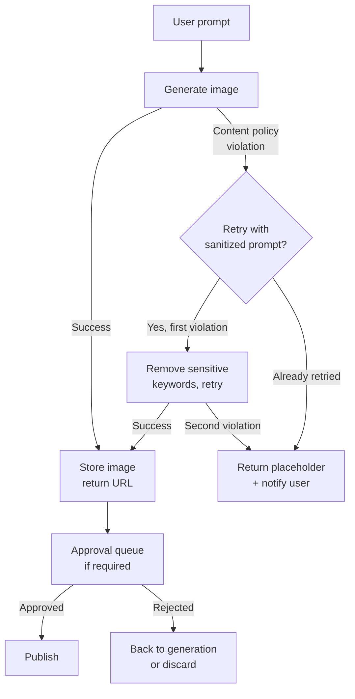

# Image Generation in Products

> Image generation in products is a prompt engineering and content policy problem, not a diffusion theory problem.

**Type:** Build
**Languages:** Python
**Prerequisites:** Lesson 10-01 (Vision-Language Models), Phase 01 (Prompt Engineering)
**Time:** ~60 min
**Phase:** 10 · Multimodal and Voice

---

## Learning Objectives

- Compare the major image generation API providers on cost, latency, and content restrictions
- Handle content policy violations gracefully with a sanitized prompt retry
- Implement the async generation service pattern for use cases with latency above 5 seconds
- Design a generation-to-approval workflow for production content pipelines
- Define the metrics that matter for production image generation

---

## The Problem

A product manager wants to add AI image generation to a marketing platform. Users will describe a campaign concept in text and receive a generated image to use in social posts. The engineering team has one afternoon to spike it.

They hit five decisions immediately:

1. Which API? DALL-E 3 (OpenAI), Stable Diffusion via Replicate, Midjourney via API. These are different products with different trade-offs.
2. Content policy violations. Marketing copy can describe brand partnerships, alcohol, competitive products. Some of these will trigger refusals. What happens to the user experience when a refusal occurs?
3. Generation takes 5-20 seconds. A synchronous API call that hangs for 15 seconds in a web request is not production-ready. How do they structure the architecture?
4. Where do generated images live? They cannot serve them directly from the OpenAI response URL (it expires).
5. Brand guidelines require human approval before any AI-generated image goes live. How does this fit into the workflow?

The team that skips these questions ships a prototype that cannot survive real users.

---

## The Concept

### Provider landscape

```
Provider comparison: image generation APIs

+------------------+----------+-----------+--------------------+------------------+
| Provider         | Cost/img | P95       | Content policy     | Best for         |
|                  |          | latency   |                    |                  |
+------------------+----------+-----------+--------------------+------------------+
| DALL-E 3         | $0.040   | 12-20s    | Strict, auto-safe  | Product UX,      |
| (OpenAI)         | (1024px) |           | filter built in    | brand safety     |
+------------------+----------+-----------+--------------------+------------------+
| DALL-E 2         | $0.020   | 5-10s     | Strict             | Lower cost,      |
| (OpenAI)         | (1024px) |           |                    | faster           |
+------------------+----------+-----------+--------------------+------------------+
| SD via Replicate | $0.0023  | 3-8s      | Configurable;      | High volume,     |
| (SDXL)           | per img  |           | model-dependent    | cost sensitive   |
+------------------+----------+-----------+--------------------+------------------+
| Ideogram v2      | $0.080   | 15-25s    | Moderate           | Text-in-images,  |
|                  | per img  |           |                    | logos            |
+------------------+----------+-----------+--------------------+------------------+
| Flux (Replicate) | $0.003   | 4-10s     | Configurable       | Quality + speed  |
|                  | per img  |           |                    | balance          |
+------------------+----------+-----------+--------------------+------------------+
```

### Prompt engineering for generation

Image generation prompts differ from text prompts in two ways: they respond to style keywords, and DALL-E 3 will rewrite your prompt internally before generation.

**Structure that works for DALL-E 3:**
```
[Subject description], [environment/setting], [lighting style], [artistic style], [quality markers]
```

Example: `A confident product manager presenting at a whiteboard, modern open office, soft natural window light, professional photography style, sharp focus`

**Negative prompts (Stable Diffusion only)**: SD models accept a negative prompt to suppress unwanted elements. DALL-E 3 does not have this parameter.

**DALL-E 3 prompt rewriting**: OpenAI rewrites your prompt before generation. The API returns the `revised_prompt` field showing what was actually used. Log this - it is useful for debugging unexpected outputs.

### Content policy and graceful degradation



Content policy hits are not errors - they are expected events in any production image pipeline. Design for them explicitly.

### The async generation service pattern

Generation takes 5-20 seconds. Never put this in a synchronous HTTP handler. The production pattern:

1. User submits prompt → API returns a `generation_id` immediately (< 100ms)
2. Background worker calls the image generation API
3. Worker stores the result and updates generation status
4. Client polls a status endpoint or receives a webhook callback
5. On completion, client fetches the stored image URL

This pattern decouples the UI from generation latency and handles retries without user-visible failures.

---

## Build It

The script generates an image using DALL-E 3, handles content policy errors gracefully with a sanitized retry, and saves the result. Demo mode returns a placeholder without making a real API call.

```python
# code/main.py
"""
Lesson 10-03: Image Generation in Products
Generates images via DALL-E 3 with content policy error handling.
Also shows the Replicate pattern for Stable Diffusion as an alternative.
Demo mode works without API calls.
"""

import json
import os
import sys
import time
import urllib.request
from pathlib import Path
from typing import Optional


# --------------------------------------------------------------------------- #
# Content policy keyword sanitizer                                             #
# --------------------------------------------------------------------------- #

SENSITIVE_KEYWORDS = [
    "violent", "nude", "explicit", "blood", "weapon",
    "realistic person", "real person", "celebrity",
]

def sanitize_prompt(prompt: str) -> str:
    """Remove known sensitive keywords and add safety guidance."""
    cleaned = prompt
    for kw in SENSITIVE_KEYWORDS:
        cleaned = cleaned.replace(kw, "").replace(kw.title(), "")
    # Clean up double spaces
    while "  " in cleaned:
        cleaned = cleaned.replace("  ", " ")
    cleaned = cleaned.strip()
    # Add safety suffix
    cleaned += ", professional context, brand-safe"
    return cleaned


# --------------------------------------------------------------------------- #
# DALL-E 3 generation                                                          #
# --------------------------------------------------------------------------- #

def generate_dalle3(
    prompt: str,
    size: str = "1024x1024",
    quality: str = "standard",
    output_path: Optional[Path] = None,
    demo_mode: bool = False,
) -> dict:
    """
    Generate an image with DALL-E 3.
    Returns a result dict with: status, image_url, revised_prompt, cost_estimate.
    """
    if demo_mode:
        return {
            "status": "success",
            "image_url": "https://example.com/placeholder.png",
            "revised_prompt": f"[DEMO] {prompt}",
            "cost_estimate": 0.040,
            "latency_seconds": 0.0,
            "provider": "dalle3-demo",
        }

    try:
        from openai import OpenAI
    except ImportError:
        raise SystemExit("Install openai: pip install openai")

    client = OpenAI()
    start = time.time()

    try:
        response = client.images.generate(
            model="dall-e-3",
            prompt=prompt,
            size=size,       # "1024x1024", "1792x1024", or "1024x1792"
            quality=quality, # "standard" or "hd"
            n=1,
        )
        latency = time.time() - start
        image_url = response.data[0].url
        revised_prompt = getattr(response.data[0], "revised_prompt", prompt)

        # Cost estimates (standard quality)
        cost_map = {"1024x1024": 0.040, "1792x1024": 0.080, "1024x1792": 0.080}
        cost = cost_map.get(size, 0.040)
        if quality == "hd":
            cost *= 2

        # Download and save if output_path provided
        if output_path:
            urllib.request.urlretrieve(image_url, output_path)
            print(f"  Saved to: {output_path}")

        return {
            "status": "success",
            "image_url": image_url,
            "revised_prompt": revised_prompt,
            "cost_estimate": cost,
            "latency_seconds": round(latency, 2),
            "provider": "dalle3",
        }

    except Exception as e:
        error_str = str(e)
        if "content_policy_violation" in error_str or "safety system" in error_str.lower():
            return {
                "status": "content_policy_violation",
                "error": error_str,
                "original_prompt": prompt,
            }
        raise


def generate_with_retry(
    prompt: str,
    output_path: Optional[Path] = None,
    demo_mode: bool = False,
) -> dict:
    """
    Generate with automatic sanitized-prompt retry on content policy violations.
    """
    result = generate_dalle3(prompt, output_path=output_path, demo_mode=demo_mode)

    if result["status"] == "content_policy_violation":
        print(f"  Content policy violation. Retrying with sanitized prompt...")
        sanitized = sanitize_prompt(prompt)
        print(f"  Sanitized prompt: {sanitized[:80]}...")
        result = generate_dalle3(sanitized, output_path=output_path, demo_mode=demo_mode)
        result["was_sanitized"] = True
        result["original_prompt"] = prompt
        result["sanitized_prompt"] = sanitized

        if result["status"] == "content_policy_violation":
            print("  Second violation. Returning placeholder.")
            return {
                "status": "failed_content_policy",
                "error": "Prompt could not be made safe after sanitization",
                "original_prompt": prompt,
                "image_url": None,
            }

    return result


# --------------------------------------------------------------------------- #
# Replicate (Stable Diffusion) pattern                                         #
# --------------------------------------------------------------------------- #

def generate_replicate_sd(
    prompt: str,
    negative_prompt: str = "blurry, low quality, distorted",
    demo_mode: bool = False,
) -> dict:
    """
    Generate via Replicate using Stable Diffusion XL.
    Shows the alternative open-weight provider pattern.
    """
    if demo_mode:
        return {
            "status": "success",
            "image_url": "https://example.com/sd-placeholder.png",
            "cost_estimate": 0.0023,
            "provider": "replicate-sdxl-demo",
        }

    try:
        import replicate
    except ImportError:
        raise SystemExit("Install replicate: pip install replicate")

    output = replicate.run(
        "stability-ai/sdxl:39ed52f2a78e934b3ba6e2a89f5b1c712de7dfea535525255b1aa35c5565e08b",
        input={
            "prompt": prompt,
            "negative_prompt": negative_prompt,
            "num_outputs": 1,
            "width": 1024,
            "height": 1024,
        },
    )
    return {
        "status": "success",
        "image_url": output[0],
        "cost_estimate": 0.0023,
        "provider": "replicate-sdxl",
    }


# --------------------------------------------------------------------------- #
# Async generation service stub                                                #
# --------------------------------------------------------------------------- #

import threading
import uuid

_generation_store: dict[str, dict] = {}

def submit_generation(prompt: str, demo_mode: bool = False) -> str:
    """
    Async pattern: return a generation_id immediately.
    Background thread runs the actual generation.
    In production, this would be a task queue worker (Celery, ARQ, etc.).
    """
    generation_id = str(uuid.uuid4())[:8]
    _generation_store[generation_id] = {"status": "pending", "prompt": prompt}

    def _run():
        _generation_store[generation_id]["status"] = "generating"
        result = generate_with_retry(prompt, demo_mode=demo_mode)
        _generation_store[generation_id].update(result)
        _generation_store[generation_id]["status"] = result.get("status", "failed")

    thread = threading.Thread(target=_run, daemon=True)
    thread.start()
    return generation_id


def poll_generation(generation_id: str) -> dict:
    """Poll generation status. In production: GET /generations/{id}"""
    return _generation_store.get(generation_id, {"status": "not_found"})


# --------------------------------------------------------------------------- #
# Main                                                                         #
# --------------------------------------------------------------------------- #

def main():
    print("=== Lesson 10-03: Image Generation in Products ===\n")

    demo_mode = "--demo" in sys.argv or "OPENAI_API_KEY" not in os.environ

    if demo_mode:
        print("Running in demo mode (no API key found or --demo flag set)\n")

    prompt = " ".join(a for a in sys.argv[1:] if not a.startswith("--")) or (
        "A confident product manager presenting quarterly results, "
        "modern open office, natural window light, professional photography style"
    )

    print(f"Prompt: {prompt}\n")

    # --- Direct generation with retry ---
    print("--- Direct generation (with content policy retry) ---")
    result = generate_with_retry(prompt, demo_mode=demo_mode)
    print(json.dumps(result, indent=2))

    # --- Async pattern demonstration ---
    print("\n--- Async generation service pattern ---")
    gen_id = submit_generation(prompt, demo_mode=demo_mode)
    print(f"Submitted. generation_id: {gen_id}")
    print("(In production: return 202 Accepted with generation_id to client)")

    # Poll until complete (in production: client polls GET /generations/{id})
    for _ in range(10):
        status = poll_generation(gen_id)
        print(f"  Status: {status.get('status', 'unknown')}")
        if status.get("status") not in ("pending", "generating"):
            break
        time.sleep(0.5 if demo_mode else 2.0)

    final = poll_generation(gen_id)
    print(f"\nFinal result: {json.dumps(final, indent=2)}")

    # --- Replicate SD alternative ---
    print("\n--- Replicate (Stable Diffusion) alternative ---")
    sd_result = generate_replicate_sd(prompt, demo_mode=True)
    print(json.dumps(sd_result, indent=2))


if __name__ == "__main__":
    main()
```

> **Real-world check:** Your demo works fine locally. You push to staging and a test user types "show me a realistic person drinking our competitor's beer at a party." DALL-E 3 refuses. What happens in the UI? If you did not design for this, the user sees a 500 error or a spinner that never resolves. Design the content policy path first - before your first demo - because content policy violations are not edge cases in marketing tools. They are common events.

---

## Use It

The production pattern wraps image generation behind a thin async service. Here is the structure using FastAPI:

```python
from fastapi import FastAPI, BackgroundTasks
from pydantic import BaseModel
import uuid

app = FastAPI()
store: dict[str, dict] = {}  # use Redis in production

class GenerationRequest(BaseModel):
    prompt: str

@app.post("/generations", status_code=202)
async def create_generation(req: GenerationRequest, tasks: BackgroundTasks):
    gen_id = str(uuid.uuid4())
    store[gen_id] = {"status": "pending", "prompt": req.prompt}
    tasks.add_background_task(_run_generation, gen_id, req.prompt)
    return {"generation_id": gen_id, "status_url": f"/generations/{gen_id}"}

@app.get("/generations/{gen_id}")
async def get_generation(gen_id: str):
    return store.get(gen_id, {"status": "not_found"})

async def _run_generation(gen_id: str, prompt: str):
    store[gen_id]["status"] = "generating"
    result = generate_with_retry(prompt)
    store[gen_id].update(result)
    # In production: upload image to S3/GCS, store permanent URL
    # Trigger webhook callback if configured
```

The OpenAI response `url` is temporary (expires in ~1 hour). Always download and store the image in your own object storage before returning it to users.

> **Perspective shift:** A content policy violation should not look like a system error to the user. It is a product decision - do you tell the user their prompt was flagged? Do you auto-suggest alternatives? Do you silently retry with a sanitized version? The engineering implementation of "graceful degradation" does not answer these questions. Decide the product behavior first, then implement it.

---

## Ship It

The artifact in `outputs/skill-image-generation-patterns.md` is a production reference covering provider selection, content policy patterns, the async service design, and approval workflow.

---

## Evaluate It

Image generation quality is harder to measure automatically than text generation because there is no objective ground truth. The practical measurement stack:

**Prompt-to-image relevance (requires human eval)**: have 3-5 raters score generated images on a 1-5 scale for: relevance to prompt, aesthetic quality, brand-appropriateness. Compute inter-rater agreement (Fleiss' kappa). A score above 0.4 indicates raters are agreeing meaningfully.

**Content policy hit rate**: `policy_violations / total_requests`. Track this over time and by prompt category. If marketing copy for alcohol brands hits 40% violations, you need either prompt engineering guidance or a different provider.

**Generation latency P95**: measure from prompt submission to image URL available. Set an alert if P95 exceeds 30 seconds.

**Cost per successful generation**: account for failures and retries. `total_api_cost / successful_generations`. A high retry rate inflates this.

**Downstream product metrics**: for a marketing platform, track whether campaigns using AI-generated images have higher or lower CTR than campaigns using stock photos. This is the metric the PM actually cares about.
