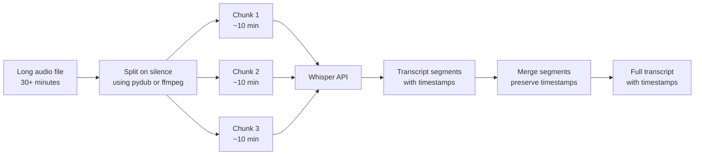

# Speech-to-Text وText-to-Speech (تحويل الكلام إلى نص والعكس)

> صوت يدخل، صوت يخرج: صارت واجهات النسخ (transcription) والتركيب (synthesis) رخيصة بما يكفي لاستخدامها في كل تطبيق.

**النوع:** بناء
**اللغات:** Python
**المتطلبات:** الدرس 10-01 (أساسيات نماذج Vision-Language)، المرحلة 01 (Prompt Engineering)
**الوقت:** ~60 دقيقة
**المرحلة:** 10 · Multimodal and Voice

---

## أهداف التعلّم

- مقارنة مزوّدي STT وTTS من حيث الدقّة والتكلفة والقدرات
- تقسيم (chunk) ملفات الصوت الطويلة للعمل ضمن حدود حجم الـ API
- بناء مسار ينسخ الصوت، ويلخّص بـ Claude، ويركّب ردًا
- تعريف معدّل خطأ الكلمات (WER) وشرح كيفية قياسه
- اختيار المزوّد الصحيح لحالات الـ realtime مقابل الدفعية (batch)

---

## المشكلة

منصّة خدمة عملاء تريد إضافة قدرتين: (1) نسخ مكالمات الدعم حتى يستطيع الموظفون البحث فيها لاحقًا، و(2) إرسال رسائل صوتية متابعة تلقائية للعملاء بعد حلّ التذكرة. يبدأ الفريق الهندسي التحقيق ويصطدم فورًا بخمسة أسئلة:

1. طول المكالمات 10-45 دقيقة. لدى Whisper API حدّ حجم ملف قدره 25MB. كيف يتعاملون مع التسجيلات الطويلة؟
2. يحتاجون أن يعرفوا من قال ماذا. ينبغي أن يميّز النسخ بين العميل والموظف. لا تشرح أيٌّ من وثائق الـ STT التي قرأوها فصل المتحدّثين (speaker diarization) بوضوح.
3. بعض المستخدمين يستعملون تطبيق الويب ويسجّلون الصوت عبر المتصفح. ما الصيغة التي ينتجها تسجيل وسائط المتصفح؟ وهل يقبلها Whisper؟
4. بالنسبة للـ text-to-speech، كيف يختارون صوتًا يبدو احترافيًا دون أن يقع في "الوادي الغريب" (uncanny valley)؟
5. ماذا يعني النسخ "في الزمن الحقيقي" (realtime) تقنيًا، وهل يحتاجونه لحالتهم؟

الفريق الذي لا يجيب عن هذه الأسئلة قبل البناء يطلق مسار نسخ ينهار عند أي مكالمة تتجاوز 10 دقائق وينتج نسخًا تُنسَب فيه كل جملة إلى "Speaker A".

---

## المفهوم

### مقارنة مزوّدي STT

```
STT provider comparison

+------------------+----------+--------+--------------+------------------+
| Provider         | WER      | Cost   | Diarization  | Streaming        |
|                  | (en)     |        |              |                  |
+------------------+----------+--------+--------------+------------------+
| Whisper large-v3 | ~5-8%    | $0.006 | No (base)    | Batch only       |
| (OpenAI API)     |          | /min   | Pyannote     | (local: faster-  |
|                  |          |        | needed       | whisper streams) |
+------------------+----------+--------+--------------+------------------+
| Deepgram Nova-2  | ~5-7%    | $0.004 | Yes, built-in| Yes (WebSocket)  |
|                  |          | /min   |              |                  |
+------------------+----------+--------+--------------+------------------+
| AssemblyAI       | ~5-7%    | $0.012 | Best-in-class| Yes              |
|                  |          | /min   | diarization  |                  |
+------------------+----------+--------+--------------+------------------+
| Google STT v2    | ~5-8%    | $0.016 | Yes          | Yes              |
|                  |          | /min   |              |                  |
+------------------+----------+--------+--------------+------------------+
```

**WER (معدّل خطأ الكلمات)**: نسبة الكلمات التي يخطئ فيها النموذج. تُحسَب كـ `(substitutions + deletions + insertions) / total_reference_words`. ‏WER بنسبة 5% على نسخ من 200 كلمة يعني أن نحو 10 كلمات خاطئة. لفهرسة البحث، 5% WER مقبول. للسجلات القانونية، ليس كذلك.

### مقارنة مزوّدي TTS

```
TTS provider comparison

+------------------+----------+---------+------------------+------------------+
| Provider         | Quality  | Cost    | Latency (TTFA)   | Best for         |
|                  |          |         |                  |                  |
+------------------+----------+---------+------------------+------------------+
| OpenAI TTS       | Good     | $0.015  | 200-400ms        | Most apps;       |
|                  |          | /1k     |                  | fast, simple API |
|                  |          | chars   |                  |                  |
+------------------+----------+---------+------------------+------------------+
| ElevenLabs       | Best     | $0.18   | 300-600ms        | Customer-facing  |
|                  |          | /1k     |                  | voice; voice     |
|                  |          | chars   |                  | cloning          |
+------------------+----------+---------+------------------+------------------+
| Google Cloud TTS | Good     | $0.004  | 300-700ms        | SSML control,    |
|                  |          | /1k     |                  | high-volume      |
|                  |          | chars   |                  | batch            |
+------------------+----------+---------+------------------+------------------+
| Azure Neural TTS | Good     | $0.008  | 300-600ms        | Microsoft stack  |
|                  |          | /1k     |                  | integration      |
|                  |          | chars   |                  |                  |
+------------------+----------+---------+------------------+------------------+
```

TTFA = الزمن حتى أول بايت صوتي. مهمّ لزمن استجابة المحادثة.

### استراتيجية التقسيم (chunking) للصوت الطويل

يقبل Whisper API ملفات حتى 25MB. مكالمة نموذجية بترميز MP3 بـ 128kbps تبلغ نحو 1MB/دقيقة. مكالمة 30 دقيقة تبلغ ~30MB، وهو ما يتجاوز الحد.



قسّم عند الصمت بدلًا من فواصل زمنية ثابتة لتجنّب قطع الكلمات في منتصف الجملة. استخدم مدّة صمت دنيا قدرها 500ms وعتبة ‎-40dBFS. أضف تداخلًا صغيرًا بين المقاطع (آخر 5 ثوانٍ من المقطع N = أول 5 ثوانٍ من المقطع N+1) لالتقاط الكلمات عند الحدود.

### التعامل مع صيغة الصوت

ينتج MediaRecorder في المتصفح صيغة WebM/Opus افتراضيًا على Chrome وFirefox. يقبل Whisper API: ‏mp3 وmp4 وmpeg وmpga وm4a وwav وwebm. ‏WebM مقبول مباشرةً. للمسارات التي تحتاج صيغة موحّدة، حوّل إلى MP3 أو WAV باستخدام ffmpeg.

---

## البناء

ينسخ السكربت الصوت باستخدام Whisper (مع التقسيم للملفات الطويلة)، ويلخّص النسخ بـ Claude، ويركّب الملخّص كلامًا باستخدام OpenAI TTS. وضع العرض (demo) يحاكي كل استدعاءات الـ API ويكتب ملف صوت placeholder.

```python
# code/main.py
"""
Lesson 10-04: Speech-to-Text and Text-to-Speech
Transcribes audio with Whisper, summarizes with Claude, synthesizes with TTS.
Demo mode mocks API responses and works without audio files or API keys.
"""

import anthropic
import json
import os
import sys
import time
from pathlib import Path
from typing import Optional


# --------------------------------------------------------------------------- #
# Audio chunking                                                               #
# --------------------------------------------------------------------------- #

MAX_FILE_BYTES = 24 * 1024 * 1024  # 24MB (leave margin under 25MB limit)


def chunk_audio_file(audio_path: Path, chunk_duration_ms: int = 600_000) -> list[Path]:
    """
    Split audio into chunks using pydub.
    Falls back to returning [audio_path] if pydub is not installed.
    chunk_duration_ms: max chunk duration in milliseconds (default: 10 minutes)
    """
    # Check if file is already small enough
    if audio_path.stat().st_size <= MAX_FILE_BYTES:
        return [audio_path]

    try:
        from pydub import AudioSegment
        from pydub.silence import split_on_silence
    except ImportError:
        print("  pydub not installed. Sending file as-is (may fail if > 25MB).")
        print("  Install: pip install pydub")
        return [audio_path]

    audio = AudioSegment.from_file(audio_path)
    print(f"  Audio duration: {len(audio) / 1000:.1f}s")

    # Split on silence to avoid cutting mid-word
    chunks = split_on_silence(
        audio,
        min_silence_len=500,       # 500ms minimum silence
        silence_thresh=-40,         # dBFS threshold
        keep_silence=200,           # keep 200ms buffer around speech
    )

    # Merge small chunks into ~10-minute segments
    merged_chunks: list[AudioSegment] = []
    current: Optional[AudioSegment] = None
    for chunk in chunks:
        if current is None:
            current = chunk
        elif len(current) + len(chunk) < chunk_duration_ms:
            current = current + chunk
        else:
            merged_chunks.append(current)
            current = chunk
    if current:
        merged_chunks.append(current)

    # Export chunks to temp files
    chunk_paths = []
    for i, chunk in enumerate(merged_chunks):
        chunk_path = audio_path.parent / f"{audio_path.stem}_chunk{i:02d}.mp3"
        chunk.export(chunk_path, format="mp3")
        chunk_paths.append(chunk_path)
        print(f"  Chunk {i}: {len(chunk) / 1000:.1f}s, {chunk_path.stat().st_size:,} bytes")

    return chunk_paths


# --------------------------------------------------------------------------- #
# Transcription (Whisper)                                                      #
# --------------------------------------------------------------------------- #

def transcribe_file(audio_path: Path, demo_mode: bool = False) -> dict:
    """
    Transcribe a single audio file using Whisper.
    Returns: {"text": "...", "duration_seconds": N}
    """
    if demo_mode:
        return {
            "text": (
                "Thank you for calling customer support. "
                "My name is Alex. How can I help you today? "
                "Hi Alex, I have a problem with my recent order. "
                "The package arrived damaged and I need a replacement. "
                "I'm sorry to hear that. I'll process a replacement order for you right away. "
                "Great, thank you so much for your help."
            ),
            "duration_seconds": 45.0,
        }

    try:
        from openai import OpenAI
    except ImportError:
        raise SystemExit("Install openai: pip install openai")

    client = OpenAI()

    with open(audio_path, "rb") as f:
        response = client.audio.transcriptions.create(
            model="whisper-1",
            file=f,
            response_format="verbose_json",  # includes timestamps
        )

    return {
        "text": response.text,
        "duration_seconds": getattr(response, "duration", 0.0),
    }


def transcribe_audio(
    audio_path: Path,
    demo_mode: bool = False,
) -> dict:
    """
    Transcribe audio with automatic chunking for large files.
    Returns merged transcript with total duration.
    """
    if not demo_mode and not audio_path.exists():
        raise FileNotFoundError(f"Audio file not found: {audio_path}")

    if demo_mode:
        return transcribe_file(audio_path, demo_mode=True)

    chunks = chunk_audio_file(audio_path)
    print(f"  Processing {len(chunks)} chunk(s)...")

    transcripts = []
    total_duration = 0.0

    for chunk_path in chunks:
        result = transcribe_file(chunk_path, demo_mode=False)
        transcripts.append(result["text"])
        total_duration += result.get("duration_seconds", 0.0)
        # Clean up temp chunk files (but not the original)
        if chunk_path != audio_path:
            chunk_path.unlink(missing_ok=True)

    return {
        "text": " ".join(transcripts),
        "duration_seconds": total_duration,
    }


# --------------------------------------------------------------------------- #
# Summarization (Claude)                                                       #
# --------------------------------------------------------------------------- #

def summarize_transcript(
    transcript: str,
    model: str = "claude-3-5-haiku-20241022",
) -> str:
    """Summarize a call transcript and generate a follow-up message."""
    client = anthropic.Anthropic()

    message = client.messages.create(
        model=model,
        max_tokens=256,
        messages=[
            {
                "role": "user",
                "content": (
                    f"You are a customer service assistant. "
                    f"Summarize this call transcript in 2-3 sentences and write "
                    f"a brief follow-up message the customer should receive after the call. "
                    f"Keep the follow-up message under 60 words, warm and professional.\n\n"
                    f"TRANSCRIPT:\n{transcript}"
                ),
            }
        ],
    )
    return message.content[0].text


# --------------------------------------------------------------------------- #
# Text-to-Speech (OpenAI TTS)                                                  #
# --------------------------------------------------------------------------- #

AVAILABLE_VOICES = ["alloy", "echo", "fable", "onyx", "nova", "shimmer"]


def synthesize_speech(
    text: str,
    voice: str = "nova",
    output_path: Path = Path("output_message.mp3"),
    demo_mode: bool = False,
) -> Path:
    """
    Synthesize text to speech using OpenAI TTS.
    Returns path to the output audio file.
    """
    if demo_mode:
        # Write a minimal placeholder MP3 (valid enough for demos)
        output_path.write_bytes(b"\xff\xfb\x10\x00" + b"\x00" * 100)
        print(f"  Demo: placeholder audio written to {output_path}")
        return output_path

    try:
        from openai import OpenAI
    except ImportError:
        raise SystemExit("Install openai: pip install openai")

    if voice not in AVAILABLE_VOICES:
        print(f"  Unknown voice '{voice}'. Using 'nova'.")
        voice = "nova"

    client = OpenAI()
    start = time.time()

    response = client.audio.speech.create(
        model="tts-1",
        voice=voice,
        input=text,
    )

    response.stream_to_file(output_path)
    latency = time.time() - start

    char_cost = len(text) * 0.000015  # $0.015 per 1,000 chars
    print(f"  TTS latency: {latency:.2f}s, cost: ${char_cost:.5f}")
    return output_path


# --------------------------------------------------------------------------- #
# WER calculation                                                              #
# --------------------------------------------------------------------------- #

def word_error_rate(reference: str, hypothesis: str) -> float:
    """
    Compute Word Error Rate (WER).
    WER = (S + D + I) / N
    where S=substitutions, D=deletions, I=insertions, N=reference word count.
    Uses dynamic programming (edit distance on word lists).
    """
    ref = reference.lower().split()
    hyp = hypothesis.lower().split()
    n = len(ref)
    if n == 0:
        return 0.0

    # Build edit distance matrix
    dp = [[0] * (len(hyp) + 1) for _ in range(len(ref) + 1)]
    for i in range(len(ref) + 1):
        dp[i][0] = i
    for j in range(len(hyp) + 1):
        dp[0][j] = j

    for i in range(1, len(ref) + 1):
        for j in range(1, len(hyp) + 1):
            if ref[i - 1] == hyp[j - 1]:
                dp[i][j] = dp[i - 1][j - 1]
            else:
                dp[i][j] = 1 + min(dp[i - 1][j], dp[i][j - 1], dp[i - 1][j - 1])

    return dp[len(ref)][len(hyp)] / n


# --------------------------------------------------------------------------- #
# Main                                                                         #
# --------------------------------------------------------------------------- #

def main():
    print("=== Lesson 10-04: Speech-to-Text and Text-to-Speech ===\n")

    demo_mode = "--demo" in sys.argv or (
        "OPENAI_API_KEY" not in os.environ and "ANTHROPIC_API_KEY" not in os.environ
    )

    audio_args = [a for a in sys.argv[1:] if not a.startswith("--") and not a.startswith("-")]
    audio_path = Path(audio_args[0]) if audio_args else None

    if audio_path is None or not audio_path.exists():
        if audio_path:
            print(f"Audio file not found: {audio_path}. Using demo mode.")
        else:
            print("No audio file provided. Running in demo mode.")
        demo_mode = True
        audio_path = Path("demo_call.mp3")  # used as label only in demo mode

    print(f"Audio: {audio_path}")
    print(f"Demo mode: {demo_mode}\n")

    # --- Step 1: Transcribe ---
    print("Step 1: Transcribing audio...")
    start = time.time()
    transcript_result = transcribe_audio(audio_path, demo_mode=demo_mode)
    transcription_time = time.time() - start

    transcript = transcript_result["text"]
    duration_sec = transcript_result.get("duration_seconds", 0.0)

    print(f"  Done in {transcription_time:.2f}s")
    print(f"  Audio duration: {duration_sec:.1f}s")
    print(f"  Transcript ({len(transcript.split())} words):")
    print(f"  {transcript[:200]}{'...' if len(transcript) > 200 else ''}\n")

    # STT cost estimate
    cost_per_min = 0.006
    stt_cost = (duration_sec / 60) * cost_per_min
    print(f"  STT cost estimate: ${stt_cost:.4f} ({duration_sec:.0f}s at ${cost_per_min}/min)\n")

    # --- Step 2: Summarize with Claude ---
    print("Step 2: Summarizing transcript with Claude...")
    if demo_mode:
        summary = (
            "A customer reported a damaged package and requested a replacement order. "
            "The agent resolved the issue promptly.\n\n"
            "Follow-up message: 'Hi, thank you for contacting us today. "
            "Your replacement order has been confirmed and will arrive within 3-5 business days. "
            "We apologize for the inconvenience and appreciate your patience.'"
        )
        print(f"  [Demo] Summary generated.\n")
    else:
        summary = summarize_transcript(transcript)
        print(f"  Summary generated.\n")

    print(f"  Summary:\n  {summary}\n")

    # --- Step 3: Synthesize follow-up message ---
    print("Step 3: Synthesizing follow-up message with TTS...")
    output_path = Path("follow_up_message.mp3")
    synthesize_speech(summary, voice="nova", output_path=output_path, demo_mode=demo_mode)
    print(f"  Output: {output_path}\n")

    # --- WER demonstration ---
    print("=== WER demonstration ===")
    reference = "The customer reported a damaged package and requested a replacement."
    hypothesis_good = "The customer reported a damaged package and requested a replacement."
    hypothesis_bad  = "The customer report a damage package and request replacement."

    print(f"  Reference:     '{reference}'")
    print(f"  Good hyp WER:  {word_error_rate(reference, hypothesis_good):.2%}")
    print(f"  Bad hyp WER:   {word_error_rate(reference, hypothesis_bad):.2%}")

    # --- Provider cost comparison ---
    print("\n=== Provider cost comparison (1 hour of audio) ===")
    providers = [
        ("Whisper (OpenAI)", 0.006),
        ("Deepgram Nova-2", 0.004),
        ("AssemblyAI", 0.012),
        ("Google STT v2", 0.016),
    ]
    for name, rate in providers:
        cost_per_hour = 60 * rate
        print(f"  {name:<25} ${rate:.3f}/min  ${cost_per_hour:.2f}/hour")


if __name__ == "__main__":
    main()
```

> **اختبار من الواقع:** لديك مكالمة بطول 45 دقيقة بين موظف دعم وعميل. كلاهما يتكلّم بسرعة وأحيانًا يتحدّثان معًا. تنسخها بـ Whisper فتستردّ كتلة نصّية طويلة واحدة بلا تسميات للمتحدّثين. يطلب منك الفريق القانوني إنتاج نسخ يبيّن أي الجمل قالها الموظف مقابل العميل. ‏Whisper وحده لا يحلّ هذا. تحتاج فصل المتحدّثين (speaker diarization)، الذي يتطلّب إمّا نموذج فصل منفصل (pyannote.audio) أو مزوّدًا مثل Deepgram أو AssemblyAI يتضمّنه. اعرف ما تشتريه قبل أن تبدأ البناء.

---

## الاستخدام

للنسخ في الزمن الحقيقي، يوفّر WebSocket API الخاص بـ Deepgram نسخًا جزئيًا أثناء كلام المستخدم، مع فصل متحدّثين مدمج:

```python
import asyncio
import websockets
import json

async def stream_transcribe(audio_source):
    """
    Deepgram real-time streaming transcription with speaker diarization.
    audio_source: async generator yielding audio chunks (bytes)
    """
    api_key = os.environ["DEEPGRAM_API_KEY"]
    url = (
        "wss://api.deepgram.com/v1/listen"
        "?model=nova-2"
        "&diarize=true"         # speaker identification
        "&punctuate=true"
        "&interim_results=true" # get partial transcripts during speech
        "&encoding=linear16"
        "&sample_rate=16000"
    )

    async with websockets.connect(url, extra_headers={"Authorization": f"Token {api_key}"}) as ws:
        async def send_audio():
            async for chunk in audio_source:
                await ws.send(chunk)
            await ws.send(json.dumps({"type": "CloseStream"}))

        async def receive_transcripts():
            async for message in ws:
                result = json.loads(message)
                if result.get("type") == "Results":
                    alt = result["channel"]["alternatives"][0]
                    for word in alt.get("words", []):
                        speaker = word.get("speaker", 0)
                        print(f"Speaker {speaker}: {word['word']}")

        await asyncio.gather(send_audio(), receive_transcripts())
```

للحصول على أفضل جودة فصل متحدّثين (مهمّ لنسخ مراكز الاتصال والمقابلات)، ينتج AssemblyAI فصلًا أنظف للمتحدّثين من المزوّدين الآخرين، مقابل تسعير أعلى لكل دقيقة.

> **نقلة في المنظور:** الغريزة هي التعامل مع STT كمشكلة سلعية محلولة واختيار الأرخص. أرقام الـ WER عبر المزوّدين متقاربة للكلام الإنجليزي النظيف. لكن "WER متقارب" يخفي اختلافات مهمّة: ‏Deepgram يتعامل مع اللهجات أفضل، وAssemblyAI يتعامل مع الكلام المتداخل أفضل، وWhisper يتعامل مع المصطلحات التقنية أفضل. اختبر عيّناتك الصوتية الفعلية، لا مجموعات الـ benchmark، قبل الالتزام بمزوّد.

---

## التسليم

الأداة الناتجة في `outputs/skill-audio-pipeline.md` هي مرجع إنتاجي لمسارات الصوت يغطّي اختيار المزوّد، والتقسيم (chunking)، ومعايير WER، والتعامل مع الصيغ، وتقديرات التكلفة.

---

## التقييم

**WER على مجموعة اختبار golden set**: اجمع 10-20 عيّنة صوتية ممثّلة من حالة استخدامك الفعلية (مكالمات دعم حقيقية، تسجيلات اجتماعات، ملاحظات صوتية). انسخ كل واحدة يدويًا. شغّل مسار الـ STT واحسب WER لكل عيّنة. تتبّع:
- متوسط WER عبر كل العيّنات
- WER بحسب فئة جودة الصوت (نظيف، صاخب، متعدّد المتحدّثين)
- WER على المصطلحات الخاصة بالمجال (أسماء المنتجات، المصطلحات التقنية)

**قياس جودة TTS**: تسجيل جودة TTS آليًا بالكامل يتطلّب منهجية MUSHRA (مقيّمون بشريون). بديل عملي: أعد نسخ مخرَج الـ TTS بـ Whisper واحسب معدّل خطأ الأحرف بين النص الأصلي وإعادة النسخ. ‏CER فوق 3% يشير إلى أن الـ TTS يشوّه الكلمات.

**دقّة التقسيم (chunking)**: تحقّق من أن النسخ من الصوت المقسَّم يطابق النسخ من الصوت الكامل. افحص مناطق الحدود (أول وآخر 5 ثوانٍ من كل مقطع) بحثًا عن كلمات مكرّرة أو مفقودة.

**زمن الاستجابة بحسب طول الصوت**: ارسم زمن الـ STT حتى النسخ مقابل مدّة الصوت. ينبغي أن تكون هذه العلاقة خطية تقريبًا. النموّ غير الخطي يشير إلى مشكلة معمارية.

**التكلفة لكل دقيقة صوت في الإنتاج**: ضمّن عبء التقسيم (إن أُجريت أي استدعاءات API إضافية). قارن التكلفة الفعلية بالتقدير. اضبط تنبيه ميزانية شهرية.
