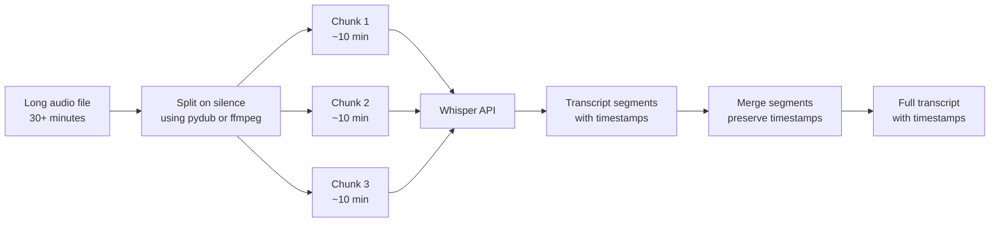

# Speech-to-Text and Text-to-Speech

> Audio in, audio out: the transcription and synthesis APIs are now cheap enough to use in every app.

**Type:** Build
**Languages:** Python
**Prerequisites:** Lesson 10-01 (Vision-Language Models basics), Phase 01 (Prompt Engineering)
**Time:** ~60 min
**Phase:** 10 · Multimodal and Voice

---

## Learning Objectives

- Compare STT and TTS providers on accuracy, cost, and capability
- Chunk long audio files to work within API size limits
- Build a pipeline that transcribes audio, summarizes with Claude, and synthesizes a response
- Define Word Error Rate (WER) and explain how to measure it
- Select the right provider for real-time vs batch use cases

---

## The Problem

A customer service platform wants to add two capabilities: (1) transcribe support calls so agents can search them later, and (2) send automated voice follow-up messages to customers after ticket resolution. The engineering team starts investigating and immediately hits five questions:

1. Calls are 10-45 minutes long. The Whisper API has a 25MB file size limit. How do they handle long recordings?
2. They need to know who said what. The transcript should distinguish between the customer and the agent. None of the STT docs they read explain speaker diarization clearly.
3. Some users are using the web app and recording audio through the browser. What format does browser media recording produce? Does Whisper accept it?
4. For text-to-speech, how do they pick a voice that sounds professional without being uncanny valley?
5. What does "real-time" transcription actually mean technically, and do they need it for their use case?

The team that does not answer these questions before building ships a transcription pipeline that falls over on any call longer than 10 minutes and produces transcripts where every sentence is attributed to "Speaker A."

---

## The Concept

### STT provider comparison

```
STT provider comparison

+------------------+----------+--------+--------------+------------------+
| Provider         | WER      | Cost   | Diarization  | Streaming        |
|                  | (en)     |        |              |                  |
+------------------+----------+--------+--------------+------------------+
| Whisper large-v3 | ~5-8%    | $0.006 | No (base)    | Batch only       |
| (OpenAI API)     |          | /min   | Pyannote     | (local: faster-  |
|                  |          |        | needed       | whisper streams) |
+------------------+----------+--------+--------------+------------------+
| Deepgram Nova-2  | ~5-7%    | $0.004 | Yes, built-in| Yes (WebSocket)  |
|                  |          | /min   |              |                  |
+------------------+----------+--------+--------------+------------------+
| AssemblyAI       | ~5-7%    | $0.012 | Best-in-class| Yes              |
|                  |          | /min   | diarization  |                  |
+------------------+----------+--------+--------------+------------------+
| Google STT v2    | ~5-8%    | $0.016 | Yes          | Yes              |
|                  |          | /min   |              |                  |
+------------------+----------+--------+--------------+------------------+
```

**WER (Word Error Rate)**: the percentage of words the model gets wrong. Calculated as `(substitutions + deletions + insertions) / total_reference_words`. A WER of 5% on a 200-word transcript means about 10 words are wrong. For search indexing, 5% WER is acceptable. For legal records, it is not.

### TTS provider comparison

```
TTS provider comparison

+------------------+----------+---------+------------------+------------------+
| Provider         | Quality  | Cost    | Latency (TTFA)   | Best for         |
|                  |          |         |                  |                  |
+------------------+----------+---------+------------------+------------------+
| OpenAI TTS       | Good     | $0.015  | 200-400ms        | Most apps;       |
|                  |          | /1k     |                  | fast, simple API |
|                  |          | chars   |                  |                  |
+------------------+----------+---------+------------------+------------------+
| ElevenLabs       | Best     | $0.18   | 300-600ms        | Customer-facing  |
|                  |          | /1k     |                  | voice; voice     |
|                  |          | chars   |                  | cloning          |
+------------------+----------+---------+------------------+------------------+
| Google Cloud TTS | Good     | $0.004  | 300-700ms        | SSML control,    |
|                  |          | /1k     |                  | high-volume      |
|                  |          | chars   |                  | batch            |
+------------------+----------+---------+------------------+------------------+
| Azure Neural TTS | Good     | $0.008  | 300-600ms        | Microsoft stack  |
|                  |          | /1k     |                  | integration      |
|                  |          | chars   |                  |                  |
+------------------+----------+---------+------------------+------------------+
```

TTFA = time to first audio byte. Important for conversational latency.

### Chunking strategy for long audio

The Whisper API accepts files up to 25MB. A typical call at 128kbps MP3 encoding runs ~1MB/minute. A 30-minute call is ~30MB, which exceeds the limit.



Split on silence rather than fixed time intervals to avoid cutting words mid-sentence. Use a 500ms minimum silence duration and a -40dBFS threshold. Add a small overlap between chunks (last 5 seconds of chunk N = first 5 seconds of chunk N+1) to catch words at boundaries.

### Audio format handling

Browser MediaRecorder produces WebM/Opus by default on Chrome and Firefox. The Whisper API accepts: mp3, mp4, mpeg, mpga, m4a, wav, webm. WebM is accepted directly. For pipelines that need standardized format, transcode to MP3 or WAV using ffmpeg.

---

## Build It

The script transcribes audio using Whisper (with chunking for long files), summarizes the transcript with Claude, and synthesizes the summary as speech using OpenAI TTS. Demo mode mocks all API calls and writes a placeholder audio file.

```python
# code/main.py
"""
Lesson 10-04: Speech-to-Text and Text-to-Speech
Transcribes audio with Whisper, summarizes with Claude, synthesizes with TTS.
Demo mode mocks API responses and works without audio files or API keys.
"""

import anthropic
import json
import os
import sys
import time
from pathlib import Path
from typing import Optional


# --------------------------------------------------------------------------- #
# Audio chunking                                                               #
# --------------------------------------------------------------------------- #

MAX_FILE_BYTES = 24 * 1024 * 1024  # 24MB (leave margin under 25MB limit)


def chunk_audio_file(audio_path: Path, chunk_duration_ms: int = 600_000) -> list[Path]:
    """
    Split audio into chunks using pydub.
    Falls back to returning [audio_path] if pydub is not installed.
    chunk_duration_ms: max chunk duration in milliseconds (default: 10 minutes)
    """
    # Check if file is already small enough
    if audio_path.stat().st_size <= MAX_FILE_BYTES:
        return [audio_path]

    try:
        from pydub import AudioSegment
        from pydub.silence import split_on_silence
    except ImportError:
        print("  pydub not installed. Sending file as-is (may fail if > 25MB).")
        print("  Install: pip install pydub")
        return [audio_path]

    audio = AudioSegment.from_file(audio_path)
    print(f"  Audio duration: {len(audio) / 1000:.1f}s")

    # Split on silence to avoid cutting mid-word
    chunks = split_on_silence(
        audio,
        min_silence_len=500,       # 500ms minimum silence
        silence_thresh=-40,         # dBFS threshold
        keep_silence=200,           # keep 200ms buffer around speech
    )

    # Merge small chunks into ~10-minute segments
    merged_chunks: list[AudioSegment] = []
    current: Optional[AudioSegment] = None
    for chunk in chunks:
        if current is None:
            current = chunk
        elif len(current) + len(chunk) < chunk_duration_ms:
            current = current + chunk
        else:
            merged_chunks.append(current)
            current = chunk
    if current:
        merged_chunks.append(current)

    # Export chunks to temp files
    chunk_paths = []
    for i, chunk in enumerate(merged_chunks):
        chunk_path = audio_path.parent / f"{audio_path.stem}_chunk{i:02d}.mp3"
        chunk.export(chunk_path, format="mp3")
        chunk_paths.append(chunk_path)
        print(f"  Chunk {i}: {len(chunk) / 1000:.1f}s, {chunk_path.stat().st_size:,} bytes")

    return chunk_paths


# --------------------------------------------------------------------------- #
# Transcription (Whisper)                                                      #
# --------------------------------------------------------------------------- #

def transcribe_file(audio_path: Path, demo_mode: bool = False) -> dict:
    """
    Transcribe a single audio file using Whisper.
    Returns: {"text": "...", "duration_seconds": N}
    """
    if demo_mode:
        return {
            "text": (
                "Thank you for calling customer support. "
                "My name is Alex. How can I help you today? "
                "Hi Alex, I have a problem with my recent order. "
                "The package arrived damaged and I need a replacement. "
                "I'm sorry to hear that. I'll process a replacement order for you right away. "
                "Great, thank you so much for your help."
            ),
            "duration_seconds": 45.0,
        }

    try:
        from openai import OpenAI
    except ImportError:
        raise SystemExit("Install openai: pip install openai")

    client = OpenAI()

    with open(audio_path, "rb") as f:
        response = client.audio.transcriptions.create(
            model="whisper-1",
            file=f,
            response_format="verbose_json",  # includes timestamps
        )

    return {
        "text": response.text,
        "duration_seconds": getattr(response, "duration", 0.0),
    }


def transcribe_audio(
    audio_path: Path,
    demo_mode: bool = False,
) -> dict:
    """
    Transcribe audio with automatic chunking for large files.
    Returns merged transcript with total duration.
    """
    if not demo_mode and not audio_path.exists():
        raise FileNotFoundError(f"Audio file not found: {audio_path}")

    if demo_mode:
        return transcribe_file(audio_path, demo_mode=True)

    chunks = chunk_audio_file(audio_path)
    print(f"  Processing {len(chunks)} chunk(s)...")

    transcripts = []
    total_duration = 0.0

    for chunk_path in chunks:
        result = transcribe_file(chunk_path, demo_mode=False)
        transcripts.append(result["text"])
        total_duration += result.get("duration_seconds", 0.0)
        # Clean up temp chunk files (but not the original)
        if chunk_path != audio_path:
            chunk_path.unlink(missing_ok=True)

    return {
        "text": " ".join(transcripts),
        "duration_seconds": total_duration,
    }


# --------------------------------------------------------------------------- #
# Summarization (Claude)                                                       #
# --------------------------------------------------------------------------- #

def summarize_transcript(
    transcript: str,
    model: str = "claude-3-5-haiku-20241022",
) -> str:
    """Summarize a call transcript and generate a follow-up message."""
    client = anthropic.Anthropic()

    message = client.messages.create(
        model=model,
        max_tokens=256,
        messages=[
            {
                "role": "user",
                "content": (
                    f"You are a customer service assistant. "
                    f"Summarize this call transcript in 2-3 sentences and write "
                    f"a brief follow-up message the customer should receive after the call. "
                    f"Keep the follow-up message under 60 words, warm and professional.\n\n"
                    f"TRANSCRIPT:\n{transcript}"
                ),
            }
        ],
    )
    return message.content[0].text


# --------------------------------------------------------------------------- #
# Text-to-Speech (OpenAI TTS)                                                  #
# --------------------------------------------------------------------------- #

AVAILABLE_VOICES = ["alloy", "echo", "fable", "onyx", "nova", "shimmer"]


def synthesize_speech(
    text: str,
    voice: str = "nova",
    output_path: Path = Path("output_message.mp3"),
    demo_mode: bool = False,
) -> Path:
    """
    Synthesize text to speech using OpenAI TTS.
    Returns path to the output audio file.
    """
    if demo_mode:
        # Write a minimal placeholder MP3 (valid enough for demos)
        output_path.write_bytes(b"\xff\xfb\x10\x00" + b"\x00" * 100)
        print(f"  Demo: placeholder audio written to {output_path}")
        return output_path

    try:
        from openai import OpenAI
    except ImportError:
        raise SystemExit("Install openai: pip install openai")

    if voice not in AVAILABLE_VOICES:
        print(f"  Unknown voice '{voice}'. Using 'nova'.")
        voice = "nova"

    client = OpenAI()
    start = time.time()

    response = client.audio.speech.create(
        model="tts-1",
        voice=voice,
        input=text,
    )

    response.stream_to_file(output_path)
    latency = time.time() - start

    char_cost = len(text) * 0.000015  # $0.015 per 1,000 chars
    print(f"  TTS latency: {latency:.2f}s, cost: ${char_cost:.5f}")
    return output_path


# --------------------------------------------------------------------------- #
# WER calculation                                                              #
# --------------------------------------------------------------------------- #

def word_error_rate(reference: str, hypothesis: str) -> float:
    """
    Compute Word Error Rate (WER).
    WER = (S + D + I) / N
    where S=substitutions, D=deletions, I=insertions, N=reference word count.
    Uses dynamic programming (edit distance on word lists).
    """
    ref = reference.lower().split()
    hyp = hypothesis.lower().split()
    n = len(ref)
    if n == 0:
        return 0.0

    # Build edit distance matrix
    dp = [[0] * (len(hyp) + 1) for _ in range(len(ref) + 1)]
    for i in range(len(ref) + 1):
        dp[i][0] = i
    for j in range(len(hyp) + 1):
        dp[0][j] = j

    for i in range(1, len(ref) + 1):
        for j in range(1, len(hyp) + 1):
            if ref[i - 1] == hyp[j - 1]:
                dp[i][j] = dp[i - 1][j - 1]
            else:
                dp[i][j] = 1 + min(dp[i - 1][j], dp[i][j - 1], dp[i - 1][j - 1])

    return dp[len(ref)][len(hyp)] / n


# --------------------------------------------------------------------------- #
# Main                                                                         #
# --------------------------------------------------------------------------- #

def main():
    print("=== Lesson 10-04: Speech-to-Text and Text-to-Speech ===\n")

    demo_mode = "--demo" in sys.argv or (
        "OPENAI_API_KEY" not in os.environ and "ANTHROPIC_API_KEY" not in os.environ
    )

    audio_args = [a for a in sys.argv[1:] if not a.startswith("--") and not a.startswith("-")]
    audio_path = Path(audio_args[0]) if audio_args else None

    if audio_path is None or not audio_path.exists():
        if audio_path:
            print(f"Audio file not found: {audio_path}. Using demo mode.")
        else:
            print("No audio file provided. Running in demo mode.")
        demo_mode = True
        audio_path = Path("demo_call.mp3")  # used as label only in demo mode

    print(f"Audio: {audio_path}")
    print(f"Demo mode: {demo_mode}\n")

    # --- Step 1: Transcribe ---
    print("Step 1: Transcribing audio...")
    start = time.time()
    transcript_result = transcribe_audio(audio_path, demo_mode=demo_mode)
    transcription_time = time.time() - start

    transcript = transcript_result["text"]
    duration_sec = transcript_result.get("duration_seconds", 0.0)

    print(f"  Done in {transcription_time:.2f}s")
    print(f"  Audio duration: {duration_sec:.1f}s")
    print(f"  Transcript ({len(transcript.split())} words):")
    print(f"  {transcript[:200]}{'...' if len(transcript) > 200 else ''}\n")

    # STT cost estimate
    cost_per_min = 0.006
    stt_cost = (duration_sec / 60) * cost_per_min
    print(f"  STT cost estimate: ${stt_cost:.4f} ({duration_sec:.0f}s at ${cost_per_min}/min)\n")

    # --- Step 2: Summarize with Claude ---
    print("Step 2: Summarizing transcript with Claude...")
    if demo_mode:
        summary = (
            "A customer reported a damaged package and requested a replacement order. "
            "The agent resolved the issue promptly.\n\n"
            "Follow-up message: 'Hi, thank you for contacting us today. "
            "Your replacement order has been confirmed and will arrive within 3-5 business days. "
            "We apologize for the inconvenience and appreciate your patience.'"
        )
        print(f"  [Demo] Summary generated.\n")
    else:
        summary = summarize_transcript(transcript)
        print(f"  Summary generated.\n")

    print(f"  Summary:\n  {summary}\n")

    # --- Step 3: Synthesize follow-up message ---
    print("Step 3: Synthesizing follow-up message with TTS...")
    output_path = Path("follow_up_message.mp3")
    synthesize_speech(summary, voice="nova", output_path=output_path, demo_mode=demo_mode)
    print(f"  Output: {output_path}\n")

    # --- WER demonstration ---
    print("=== WER demonstration ===")
    reference = "The customer reported a damaged package and requested a replacement."
    hypothesis_good = "The customer reported a damaged package and requested a replacement."
    hypothesis_bad  = "The customer report a damage package and request replacement."

    print(f"  Reference:     '{reference}'")
    print(f"  Good hyp WER:  {word_error_rate(reference, hypothesis_good):.2%}")
    print(f"  Bad hyp WER:   {word_error_rate(reference, hypothesis_bad):.2%}")

    # --- Provider cost comparison ---
    print("\n=== Provider cost comparison (1 hour of audio) ===")
    providers = [
        ("Whisper (OpenAI)", 0.006),
        ("Deepgram Nova-2", 0.004),
        ("AssemblyAI", 0.012),
        ("Google STT v2", 0.016),
    ]
    for name, rate in providers:
        cost_per_hour = 60 * rate
        print(f"  {name:<25} ${rate:.3f}/min  ${cost_per_hour:.2f}/hour")


if __name__ == "__main__":
    main()
```

> **Real-world check:** You have a 45-minute call between a support agent and a customer. Both speak quickly and occasionally talk over each other. You transcribe it with Whisper and get back one long block of text with no speaker labels. The legal team asks you to produce a transcript that shows which sentences the agent said vs the customer. Whisper alone does not solve this. You need speaker diarization, which requires either a separate diarization model (pyannote.audio) or a provider like Deepgram or AssemblyAI that includes it. Know what you are buying before you start building.

---

## Use It

For real-time transcription, Deepgram's WebSocket API provides partial transcripts as the user speaks, with built-in speaker diarization:

```python
import asyncio
import websockets
import json

async def stream_transcribe(audio_source):
    """
    Deepgram real-time streaming transcription with speaker diarization.
    audio_source: async generator yielding audio chunks (bytes)
    """
    api_key = os.environ["DEEPGRAM_API_KEY"]
    url = (
        "wss://api.deepgram.com/v1/listen"
        "?model=nova-2"
        "&diarize=true"         # speaker identification
        "&punctuate=true"
        "&interim_results=true" # get partial transcripts during speech
        "&encoding=linear16"
        "&sample_rate=16000"
    )

    async with websockets.connect(url, extra_headers={"Authorization": f"Token {api_key}"}) as ws:
        async def send_audio():
            async for chunk in audio_source:
                await ws.send(chunk)
            await ws.send(json.dumps({"type": "CloseStream"}))

        async def receive_transcripts():
            async for message in ws:
                result = json.loads(message)
                if result.get("type") == "Results":
                    alt = result["channel"]["alternatives"][0]
                    for word in alt.get("words", []):
                        speaker = word.get("speaker", 0)
                        print(f"Speaker {speaker}: {word['word']}")

        await asyncio.gather(send_audio(), receive_transcripts())
```

For the best speaker diarization quality (important for call center and interview transcription), AssemblyAI produces cleaner speaker separation than other providers, at the cost of higher per-minute pricing.

> **Perspective shift:** The instinct is to treat STT as a commodity solved problem and choose the cheapest option. WER numbers across providers are similar for clean English speech. But "similar WER" hides important differences: Deepgram handles accents better, AssemblyAI handles overlapping speech better, Whisper handles technical terminology better. Test your actual audio samples, not benchmark datasets, before committing to a provider.

---

## Ship It

The artifact in `outputs/skill-audio-pipeline.md` is a production reference for audio pipelines covering provider selection, chunking, WER benchmarks, format handling, and cost estimates.

---

## Evaluate It

**WER on a golden test set**: collect 10-20 representative audio samples from your actual use case (real support calls, meeting recordings, voice notes). Manually transcribe each one. Run your STT pipeline and compute WER per sample. Track:
- Mean WER across all samples
- WER by audio quality category (clean, noisy, multi-speaker)
- WER on domain-specific terminology (product names, technical terms)

**TTS quality measurement**: fully automated TTS quality scoring requires the MUSHRA methodology (human raters). A practical proxy: re-transcribe the TTS output with Whisper and compute character error rate between the original text and the re-transcription. A CER above 3% suggests the TTS is distorting words.

**Chunking accuracy**: verify that transcripts from chunked audio match transcripts from the full audio. Check the boundary regions (first and last 5 seconds of each chunk) for duplicated or missing words.

**Latency by audio length**: plot STT time-to-transcript vs audio duration. This relationship should be roughly linear. Non-linear growth indicates an architectural problem.

**Cost per audio minute in production**: include chunking overhead (if any extra API calls are made). Compare actual cost vs estimate. Set a monthly budget alert.
