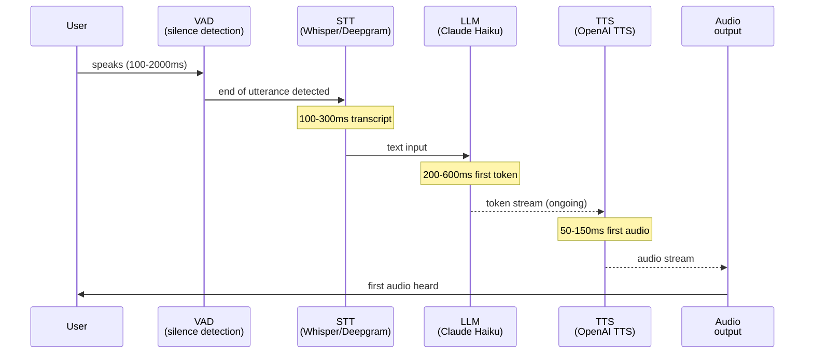

# بناء حلقة Voice Agent (وكيل صوتي)

> الـ voice agent هو text agent بواجهة صوتية. الحلقة نفسها؛ ما يختلف هو ميزانية زمن الاستجابة.

**النوع:** بناء
**اللغات:** Python
**المتطلبات:** الدرس 10-04 (STT وTTS)، المرحلة 04 (Agents)
**الوقت:** ~90 دقيقة
**المرحلة:** 10 · Multimodal and Voice

---

## أهداف التعلّم

- رسم مراحل مسار STT-LLM-TTS وتحديد أين يتراكم زمن الاستجابة
- تنفيذ حلقة voice agent بسيطة تقرأ مدخلًا نصّيًا وتنطق ردًا
- شرح المقاطعة (barge-in) ووصف آلة الحالات (state machine) المطلوبة للتعامل معها
- وصف إطار Pipecat وما يضيفه فوق المسار الخام
- تحديد المقاييس الثلاثة المهمّة لجودة الـ voice agent في الإنتاج

---

## المشكلة

فريق منتج يريد استبدال نظام IVR (الاستجابة الصوتية التفاعلية) الهاتفي القديم بـ voice agent بالـ AI. النظام القديم يشغّل خيارات قوائم مسجّلة مسبقًا ("اضغط 1 للفوترة، اضغط 2 للدعم"). ينبغي للوكيل الجديد أن يتعامل مع محادثة طبيعية.

المتطلبات من فريق المنتج:
- أقل من 500ms من لحظة توقّف المستخدم عن الكلام إلى لحظة بدء الوكيل بالكلام
- الحفاظ على سياق المحادثة عبر عدة أدوار في الجلسة
- التعامل مع المقاطعات: إذا بدأ المستخدم بالكلام أثناء كلام الوكيل، أوقف الوكيل واستمع
- توفير خيار تسليم لإنسان عند الطلب
- يعمل عبر الهاتف (PSTN)، لا متصفحات الويب فقط

بنى الفريق الهندسي text agents من قبل. يظنون أن هذا "مجرّد إضافة صوت". هم مخطئون في تقدير صعوبة متطلّب زمن الاستجابة، ولم يفكّروا قطّ في المقاطعة.

متطلّب الـ 500ms طموح. مسار ساذج ينتظر STT كاملًا، ثم يرسل إلى الـ LLM، ثم ينتظر تركيب TTS كاملًا، ثم يشغّل الصوت، يستغرق 1,500-3,000ms كحدّ أدنى. الوصول إلى 500ms يتطلّب streaming متوازيًا في كل مرحلة. فهم أين يذهب الوقت شرط مسبق لمعرفة أين تُحسّن.

---

## المفهوم

### أين يذهب الوقت

لحلقة الـ voice agent أربعة مساهمين متمايزين في زمن الاستجابة. التحسين دون قياسهم كلٌّ على حدة تخمين.



الزمن الإجمالي من توقّف المستخدم عن الكلام إلى سماع أول صوت: **STT latency + LLM TTFT + TTS first-audio latency**. مع خيارات مُحسَّنة (Deepgram streaming + Haiku + streaming TTS): ‏100 + 250 + 100 = ~450ms. مع خيارات ساذجة (Whisper batch + GPT-4o + انتظار التركيب الكامل): ‏300 + 800 + 300 = ~1,400ms.

### آلة حالات المقاطعة (barge-in)

المقاطعة تعني: يبدأ المستخدم بالكلام بينما الوكيل لا يزال يتكلّم. الـ voice agent بلا مقاطعة يبدو آليًا، فيشعر المستخدمون بأنهم محاصرون منتظرين انتهاء الوكيل. يتطلّب تنفيذ المقاطعة آلة حالات:

```
States: IDLE, LISTENING, PROCESSING, SPEAKING

IDLE
  -> user audio detected (VAD) -> LISTENING

LISTENING
  -> silence detected (VAD, > 500ms) -> PROCESSING
  -> [no speech for 10s] -> IDLE (timeout)

PROCESSING
  -> first LLM token received + TTS streaming started -> SPEAKING
  -> [error] -> IDLE

SPEAKING
  -> user audio detected (VAD) -> BARGE_IN (cancel TTS, go to LISTENING)
  -> TTS complete -> IDLE
  -> user requests human -> HANDOFF
```

تتطلّب المقاطعة:
1. عملية VAD (كشف نشاط الصوت) تعمل باستمرار، حتى أثناء تشغيل الـ TTS
2. القدرة على إلغاء stream الـ TTS الجاري فورًا
3. القدرة على تجاهل توليد الـ LLM الجاري (إلغاء الاستدعاء الـ streaming)

### أين تعيش تحسينات زمن الاستجابة

| Stage | Naive (batch) | Optimized (streaming) | Savings |
|-------|--------------|----------------------|---------|
| STT | 200-400ms (Whisper batch) | 80-150ms (Deepgram streaming) | ~200ms |
| LLM TTFT | 400-800ms (large model) | 150-350ms (Haiku) | ~300ms |
| TTS | 300-600ms (wait for full text) | 50-120ms (stream first chunk) | ~350ms |
| Audio | 100-200ms (buffer full response) | 20-50ms (stream chunks) | ~150ms |

الـ streaming TTS هو أكبر تحسين منفرد: بدلًا من انتظار رد الـ LLM الكامل قبل التركيب، مرّر tokens مخرَج الـ LLM مباشرةً إلى الـ TTS مع اكتمال كل جملة. يقلّل هذا زمن أول صوت بمقدار 200-400ms.

### أطر الإنتاج

**Pipecat** ‏(pipecat.ai): إطار مفتوح المصدر ينفّذ المسار الصوتي كمسار قابل للتركيب من المعالِجات (processors). يتولّى: ‏VAD ‏(Silero VAD)، وstreaming STT، وstreaming LLM، وstreaming TTS، والمقاطعة، ونقل WebRTC. نحو 30 سطرًا للوصول إلى voice agent يعمل.

**LiveKit Agents**: إطار الوكلاء من LiveKit مبني على بنيتها التحتية لـ WebRTC. أفضل خيار حين يحتاج الـ voice agent أن يكون جزءًا من غرفة فيديو/صوت (الرعاية الصحية عن بُعد، الاجتماعات الافتراضية). بنية تحتية للإعداد أكثر من Pipecat.

---

## البناء

ينفّذ السكربت حلقة voice agent بسيطة. في وضع العرض (demo) يقرأ من قائمة مدخلات نصّية (محاكيًا منطوقات الكلام) بدلًا من ملفات الصوت. في الوضع الحقيقي يستخدم Whisper للـ STT، وClaude Haiku لدور الـ LLM، وOpenAI TTS للتركيب.

نمط الـ streaming TTS مُبيَّن: tokens من Claude تُخزَّن في buffer حتى حدّ جملة، ثم تُرسَل إلى الـ TTS، فيصبح أول مقطع صوتي جاهزًا قبل أن ينهي الـ LLM التوليد.

```python
# code/main.py
"""
Lesson 10-05: Building a Voice Agent Loop
Minimal STT-LLM-TTS voice agent loop with streaming TTS pattern.
Demo mode reads from text input list and prints responses (no audio files needed).

Usage:
    python main.py          # demo mode (text I/O, no API calls)
    python main.py --real   # real mode (requires OPENAI_API_KEY + ANTHROPIC_API_KEY)
"""

import anthropic
import os
import sys
import time
import threading
from dataclasses import dataclass, field
from enum import Enum, auto
from pathlib import Path
from typing import Optional


# --------------------------------------------------------------------------- #
# State machine                                                                #
# --------------------------------------------------------------------------- #

class AgentState(Enum):
    IDLE = auto()
    LISTENING = auto()
    PROCESSING = auto()
    SPEAKING = auto()
    HANDOFF = auto()


@dataclass
class ConversationTurn:
    role: str   # "user" or "assistant"
    text: str


@dataclass
class VoiceAgentSession:
    state: AgentState = AgentState.IDLE
    history: list[ConversationTurn] = field(default_factory=list)
    turn_count: int = 0
    total_latency_ms: list[float] = field(default_factory=list)

    def add_turn(self, role: str, text: str):
        self.history.append(ConversationTurn(role=role, text=text))
        self.turn_count += 1

    def to_messages(self) -> list[dict]:
        return [{"role": t.role, "content": t.text} for t in self.history]


# --------------------------------------------------------------------------- #
# Streaming TTS helper                                                         #
# --------------------------------------------------------------------------- #

class SentenceBuffer:
    """
    Accumulates LLM tokens and emits complete sentences for TTS synthesis.
    This is the key optimization: first audio chunk is ready before LLM finishes.
    """
    SENTENCE_ENDS = {".", "!", "?", ":", "\n"}

    def __init__(self):
        self._buffer = ""
        self._sentences: list[str] = []

    def push(self, token: str) -> list[str]:
        """Add a token. Returns list of complete sentences ready for TTS."""
        self._buffer += token
        ready = []
        # Check if we have a sentence boundary
        if any(self._buffer.rstrip().endswith(end) for end in self.SENTENCE_ENDS):
            sentence = self._buffer.strip()
            if len(sentence) > 5:  # avoid tiny fragments
                ready.append(sentence)
                self._buffer = ""
        return ready

    def flush(self) -> list[str]:
        """Return any remaining buffer content."""
        if self._buffer.strip():
            return [self._buffer.strip()]
        return []


# --------------------------------------------------------------------------- #
# STT                                                                          #
# --------------------------------------------------------------------------- #

def transcribe_utterance(audio_path: Path, demo_mode: bool = True) -> str:
    """Transcribe a single utterance (one turn of speech)."""
    if demo_mode:
        return ""  # demo mode uses pre-provided text

    from openai import OpenAI
    client = OpenAI()
    with open(audio_path, "rb") as f:
        response = client.audio.transcriptions.create(
            model="whisper-1",
            file=f,
        )
    return response.text


# --------------------------------------------------------------------------- #
# LLM turn with streaming TTS                                                  #
# --------------------------------------------------------------------------- #

SYSTEM_PROMPT = """You are a helpful customer service voice agent. 
Keep responses concise and conversational - under 3 sentences per turn.
If the user asks to speak to a human, respond only with: HANDOFF_REQUESTED
Do not use markdown, bullet points, or formatting. Speak naturally."""


def generate_response_streaming(
    session: VoiceAgentSession,
    user_text: str,
    model: str = "claude-3-5-haiku-20241022",
    on_sentence: Optional[callable] = None,
    demo_mode: bool = True,
) -> str:
    """
    Generate agent response with streaming.
    Calls on_sentence(sentence_text) as complete sentences accumulate.
    This is the streaming TTS pattern: TTS can start before LLM finishes.
    Returns the full response text.
    """
    session.add_turn("user", user_text)

    if demo_mode:
        demo_responses = {
            "hello": "Hello! Thanks for calling. How can I help you today?",
            "help": "Of course. Could you tell me more about what you need help with?",
            "billing": "I can help with billing questions. What would you like to know?",
            "human": "HANDOFF_REQUESTED",
            "bye": "Thank you for calling. Have a great day!",
        }
        # Match keywords in user text
        user_lower = user_text.lower()
        response = "I understand. How can I help you further?"
        for keyword, resp in demo_responses.items():
            if keyword in user_lower:
                response = resp
                break
        # Simulate sentence streaming
        if on_sentence:
            on_sentence(response)
        session.add_turn("assistant", response)
        return response

    client = anthropic.Anthropic()
    buf = SentenceBuffer()
    full_response = ""

    with client.messages.stream(
        model=model,
        max_tokens=150,
        system=SYSTEM_PROMPT,
        messages=session.to_messages(),
    ) as stream:
        for text in stream.text_stream:
            full_response += text
            ready_sentences = buf.push(text)
            if on_sentence:
                for sentence in ready_sentences:
                    on_sentence(sentence)

        # Flush any remaining buffer
        remaining = buf.flush()
        if on_sentence:
            for sentence in remaining:
                on_sentence(sentence)

    session.add_turn("assistant", full_response)
    return full_response


# --------------------------------------------------------------------------- #
# TTS synthesis                                                                #
# --------------------------------------------------------------------------- #

def synthesize_and_play(
    text: str,
    voice: str = "nova",
    demo_mode: bool = True,
) -> None:
    """Synthesize text to speech and play it (or print in demo mode)."""
    if demo_mode:
        print(f"    [TTS] Speaking: {text[:80]}{'...' if len(text) > 80 else ''}")
        return

    from openai import OpenAI
    import tempfile

    client = OpenAI()
    response = client.audio.speech.create(
        model="tts-1",
        voice=voice,
        input=text,
    )

    # Stream to a temp file and play
    with tempfile.NamedTemporaryFile(suffix=".mp3", delete=False) as f:
        tmp_path = Path(f.name)
        response.stream_to_file(tmp_path)

    # Platform-specific playback
    import subprocess
    import platform
    if platform.system() == "Darwin":
        subprocess.run(["afplay", str(tmp_path)], check=False)
    elif platform.system() == "Linux":
        subprocess.run(["mpg123", str(tmp_path)], check=False)
    else:
        print(f"  [TTS output saved to {tmp_path}]")

    tmp_path.unlink(missing_ok=True)


# --------------------------------------------------------------------------- #
# Voice agent loop                                                             #
# --------------------------------------------------------------------------- #

def run_voice_agent(
    demo_inputs: Optional[list[str]] = None,
    demo_mode: bool = True,
    max_turns: int = 10,
) -> VoiceAgentSession:
    """
    Main voice agent loop.

    In demo mode: iterates through demo_inputs as pre-set "utterances".
    In real mode: reads audio files or uses a microphone (integration point).
    """
    session = VoiceAgentSession()
    print("\n" + "=" * 60)
    print("Voice Agent Session Started")
    print("=" * 60)

    inputs = iter(demo_inputs or [])

    for turn_num in range(max_turns):
        print(f"\n[Turn {turn_num + 1}] State: {session.state.name}")
        session.state = AgentState.LISTENING

        # --- Get user utterance ---
        if demo_mode:
            try:
                user_text = next(inputs).strip()
            except StopIteration:
                print("  [Demo inputs exhausted. Session ending.]")
                break

            if not user_text:
                continue

            print(f"  User: {user_text}")
        else:
            # Real mode: transcribe from audio file or microphone
            # (Integration point for microphone recording or audio file input)
            audio_path = Path(f"turn_{turn_num:02d}.mp3")
            if not audio_path.exists():
                print(f"  No audio file {audio_path} found. Ending session.")
                break
            user_text = transcribe_utterance(audio_path, demo_mode=False)
            print(f"  User (transcribed): {user_text}")

        # --- Check for end of conversation ---
        if not user_text or user_text.lower() in ("bye", "goodbye", "exit", "quit"):
            print("  [User ended conversation]")
            session.state = AgentState.IDLE
            break

        # --- Generate response ---
        session.state = AgentState.PROCESSING
        t_start = time.time()

        # on_sentence callback enables streaming TTS: TTS starts before LLM finishes
        def on_sentence(sentence: str):
            synthesize_and_play(sentence, demo_mode=demo_mode)

        response = generate_response_streaming(
            session,
            user_text,
            on_sentence=on_sentence,
            demo_mode=demo_mode,
        )

        latency_ms = (time.time() - t_start) * 1000
        session.total_latency_ms.append(latency_ms)

        print(f"  Agent: {response}")
        print(f"  Latency: {latency_ms:.0f}ms")

        # Check for handoff
        if "HANDOFF_REQUESTED" in response:
            session.state = AgentState.HANDOFF
            print("\n  [HANDOFF] Connecting to human agent...")
            print("  [In production: transfer call, pass session history to agent]")
            break

        session.state = AgentState.IDLE

    # --- Session summary ---
    print("\n" + "=" * 60)
    print("Session Summary")
    print("=" * 60)
    print(f"  Turns:    {session.turn_count}")
    if session.total_latency_ms:
        avg_latency = sum(session.total_latency_ms) / len(session.total_latency_ms)
        max_latency = max(session.total_latency_ms)
        print(f"  Avg latency: {avg_latency:.0f}ms")
        print(f"  Max latency: {max_latency:.0f}ms")
    print(f"  Final state: {session.state.name}")

    return session


# --------------------------------------------------------------------------- #
# Latency budget illustration                                                  #
# --------------------------------------------------------------------------- #

def print_latency_budget():
    print("\n=== STT-LLM-TTS Latency Budget ===\n")
    print("Naive pipeline (batch at each stage):")
    print("  STT (Whisper batch):     300ms")
    print("  LLM TTFT (large model):  700ms")
    print("  TTS (wait for full text):400ms")
    print("  Audio buffering:         150ms")
    print("  TOTAL:                  ~1550ms  [over 500ms target]\n")

    print("Optimized pipeline (streaming):")
    print("  STT (Deepgram streaming): 100ms")
    print("  LLM TTFT (Haiku):         250ms")
    print("  TTS (first sentence):      80ms")
    print("  Audio start:               30ms")
    print("  TOTAL:                    ~460ms  [under 500ms target]")


# --------------------------------------------------------------------------- #
# Main                                                                         #
# --------------------------------------------------------------------------- #

def main():
    print("=== Lesson 10-05: Building a Voice Agent Loop ===")

    demo_mode = "--real" not in sys.argv or (
        "OPENAI_API_KEY" not in os.environ or "ANTHROPIC_API_KEY" not in os.environ
    )

    if not demo_mode and (
        "OPENAI_API_KEY" not in os.environ or "ANTHROPIC_API_KEY" not in os.environ
    ):
        print("Warning: API keys not found. Falling back to demo mode.")
        demo_mode = True

    print(f"\nMode: {'demo (text I/O)' if demo_mode else 'real (audio I/O)'}")

    print_latency_budget()

    # Demo conversation inputs
    demo_inputs = [
        "Hello, I need some help with my account.",
        "I have a billing question about my last invoice.",
        "The charge looks wrong, it's higher than expected.",
        "Can I speak to a human agent please?",
    ]

    print(f"\n\nRunning demo conversation ({len(demo_inputs)} turns)...")
    session = run_voice_agent(
        demo_inputs=demo_inputs,
        demo_mode=demo_mode,
    )

    # Barge-in state machine illustration
    print("\n=== Barge-in State Machine ===\n")
    states = [
        ("IDLE", "User audio detected (VAD)", "LISTENING"),
        ("LISTENING", "Silence > 500ms", "PROCESSING"),
        ("PROCESSING", "First audio chunk ready", "SPEAKING"),
        ("SPEAKING", "New user audio (VAD)", "LISTENING (cancel TTS + LLM)"),
        ("SPEAKING", "TTS complete", "IDLE"),
        ("any state", "User says 'human'", "HANDOFF"),
    ]
    print(f"  {'From state':<20} {'Event':<40} {'To state'}")
    print("  " + "-" * 75)
    for from_state, event, to_state in states:
        print(f"  {from_state:<20} {event:<40} {to_state}")


if __name__ == "__main__":
    main()
```

> **اختبار من الواقع:** الـ voice agent في عرضك التوضيحي يبلغ زمن استجابته 450ms في الاختبار، تحت هدف الـ 500ms. في الإنتاج على مكالمات هاتفية حقيقية، يشتكي المستخدمون من بطئه. تقيس مجدّدًا فتجد أن زمن الاستجابة P95 يبلغ 1,100ms، لا متوسط الـ 450ms الذي اختبرته. زمن الذيل (tail latency) هو ما يختبره المستخدمون، لا المتوسط. بالنسبة للـ voice agent، يعني هدف الـ 500ms قيمة P95، لا P50. قِس وحسّن زمن الذيل، لا زمن المتوسط. أسباب شائعة لارتفاعات الذيل: تباين توليد tokens الـ LLM، وانتظار طابور TTS API، وتذبذب الشبكة (jitter) إلى نقطة نهاية الـ STT.

---

## الاستخدام

الحلقة نفسها مُنفَّذة في Pipecat تأخذ نحو 30 سطرًا وتتولّى الـ VAD، وآلة حالات المقاطعة، والنقل الـ streaming تلقائيًا:

```python
import asyncio
from pipecat.pipeline.pipeline import Pipeline
from pipecat.pipeline.runner import PipelineRunner
from pipecat.pipeline.task import PipelineTask
from pipecat.processors.aggregators.openai_llm_context import OpenAILLMContextAggregator
from pipecat.services.anthropic import AnthropicLLMService
from pipecat.services.deepgram import DeepgramSTTService
from pipecat.services.openai import OpenAITTSService
from pipecat.transports.network.fastapi_websocket import FastAPIWebsocketTransport
from pipecat.vad.silero import SileroVADAnalyzer

async def main():
    transport = FastAPIWebsocketTransport(params=FastAPIWebsocketParams(
        audio_in_enabled=True,
        audio_out_enabled=True,
        vad_enabled=True,
        vad_analyzer=SileroVADAnalyzer(),  # barge-in detection
    ))

    stt = DeepgramSTTService(api_key=os.environ["DEEPGRAM_API_KEY"])
    llm = AnthropicLLMService(
        api_key=os.environ["ANTHROPIC_API_KEY"],
        model="claude-3-5-haiku-20241022",
    )
    tts = OpenAITTSService(api_key=os.environ["OPENAI_API_KEY"], voice="nova")

    context = OpenAILLMContext(messages=[{
        "role": "system",
        "content": "You are a helpful voice agent. Keep responses under 3 sentences.",
    }])
    context_aggregator = llm.create_context_aggregator(context)

    pipeline = Pipeline([
        transport.input(),
        stt,
        context_aggregator.user(),
        llm,
        tts,
        transport.output(),
        context_aggregator.assistant(),
    ])

    await PipelineRunner().run(PipelineTask(pipeline))
```

يتولّى Pipecat المقاطعة (عبر VAD)، والـ streaming في كل مرحلة، وسجلّ المحادثة تلقائيًا. استخدمه لـ voice agents الإنتاج. ابنِ الحلقة الخام أولًا (كما في البناء) لتفهم ما يجرّده Pipecat.

لـ voice agents المبنية على WebRTC المدمجة في مكالمات الفيديو أو الاجتماعات، يستخدم LiveKit Agents نمط مسار مشابهًا لكنه مبني على خادم وسائط LiveKit، فيعطي جودة مكالمة أفضل وتحكّمًا أكثر في توجيه الصوت.

> **نقلة في المنظور:** "voice agent" يبدو فئة منتج مختلفة كليًا عن text chatbot، لكن حلقة الاستدلال الجوهرية متطابقة: احفظ سجلّ المحادثة، واستدعِ الـ LLM بـ system prompt + السجلّ + رسالة المستخدم الجديدة، واحصل على رد، وأضِفه إلى السجلّ، وكرّر. تضيف الواجهة الصوتية ثلاث مشكلات هندسية (زمن الاستجابة، المقاطعة، تكامل الهاتف) لا علاقة لها بقدرة الـ LLM على الاستدلال. أتقِن الـ text agent أولًا. الغلاف الصوتي مشكلة هندسية قابلة للحل.

---

## التسليم

الأداة الناتجة في `outputs/skill-voice-agent-architecture.md` هي مرجع معماري لـ voice agents الإنتاج يغطّي ميزانية زمن استجابة STT-LLM-TTS، وآلة حالات المقاطعة، وأنماط تكامل الهاتف/WebRTC، والاختبار دون خط هاتف.

---

## التقييم

**زمن الاستجابة من طرف إلى طرف (المقياس الأساسي)**: زوّد المسار بأدوات قياس من "كشف VAD لنهاية كلام المستخدم" إلى "تشغيل أول بايت صوتي". تتبّع P50 وP95 كلًّا على حدة. اضبط تنبيه ميزانية إذا تجاوز P95 هدفك (500ms للهاتف، 700ms للويب).

**معدّل اكتمال الدور (turn completion rate)**: نسبة أدوار الوكيل التي ينهي فيها الوكيل كلامه دون مقاطعة من المستخدم (barge-in). معدّل اكتمال دور منخفض جدًا يعني أن الوكيل يتكلّم طويلًا. حسّن طول الرد. معدّل مرتفع جدًا قد يعني أن كشف المقاطعة معطّل.

**انتشار خطأ الـ ASR**: قِس كم مرة يتسبّب خطأ نسخ STT في إعطاء الوكيل ردًا خاطئًا أو مشوّشًا. يتطلّب هذا مراجعة بشرية لعيّنة من النسخ. صنّف حالات الفشل: خطأ STT انتشر إلى رد LLM خاطئ مقابل LLM ارتكب خطأً منطقيًا على نسخ صحيح.

**معدّل اكتمال الجلسة (session completion rate)**: نسبة الجلسات التي تحقّق فيها هدف المستخدم دون طلب تسليم لإنسان. هذا مكافئ معدّل اكتمال المهمّة لـ text agents. اكتمال جلسة منخفض يشير إلى أن استدلال الـ LLM أو إدارة المحادثة يحتاج تحسينًا.

**سيناريوهات اختبار اصطناعية**: اختبر الـ voice agent دون خط هاتف حقيقي بحقن النص مباشرةً في خطوة الـ LLM (متجاوزًا STT) ومقارنة المخرَج الصوتي (تجاوز TTS، قارن النص). يتيح هذا اختبار الانحدار (regression) على 100 سيناريو خلال دقائق بدلًا من إجراء مكالمات حية.
