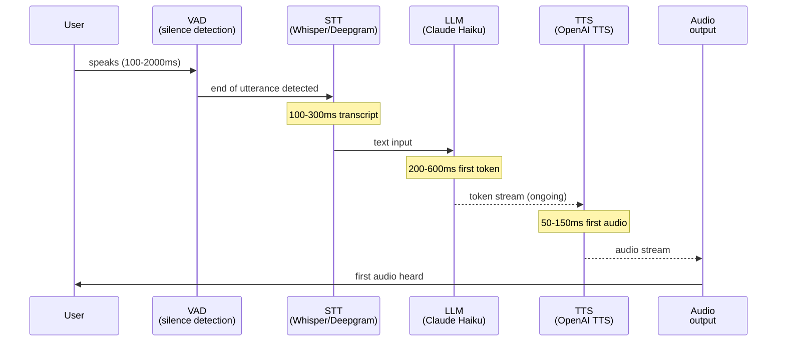

# Building a Voice Agent Loop

> A voice agent is a text agent with an audio interface. The loop is the same; the latency budget is different.

**Type:** Build
**Languages:** Python
**Prerequisites:** Lesson 10-04 (STT and TTS), Phase 04 (Agents)
**Time:** ~90 min
**Phase:** 10 · Multimodal and Voice

---

## Learning Objectives

- Map the STT-LLM-TTS pipeline stages and identify where latency accumulates
- Implement a minimal voice agent loop that reads text input and speaks a response
- Explain barge-in and describe the state machine required to handle it
- Describe the Pipecat framework and what it adds over a raw pipeline
- Define the three metrics that matter for production voice agent quality

---

## The Problem

A product team wants to replace a legacy phone IVR (Interactive Voice Response) system with an AI voice agent. The old IVR plays pre-recorded menu options ("Press 1 for billing, press 2 for support"). The new agent should handle natural conversation.

The requirements from the product team:
- Under 500ms from when the user stops talking to when the agent starts speaking
- Maintain conversation context across multiple turns in a session
- Handle interruptions: if the user starts speaking while the agent is talking, stop the agent and listen
- Offer a human handoff option on request
- Works over the phone (PSTN), not just web browsers

The engineering team has built text agents before. They think this is "just add audio." They are wrong about the difficulty of the latency requirement, and they have never thought about barge-in.

The 500ms requirement is aggressive. A naive pipeline that waits for full STT, then sends to the LLM, then waits for full TTS synthesis, then plays the audio takes 1,500-3,000ms minimum. Meeting 500ms requires parallel streaming at every stage. Understanding where time goes is prerequisite to knowing where to optimize.

---

## The Concept

### Where the time goes

The voice agent loop has four distinct latency contributors. Optimizing without measuring them individually is guesswork.



Total time from user stops speaking to first audio heard: **STT latency + LLM TTFT + TTS first-audio latency**. With optimized choices (Deepgram streaming + Haiku + streaming TTS): 100 + 250 + 100 = ~450ms. With naive choices (Whisper batch + GPT-4o + full synthesis wait): 300 + 800 + 300 = ~1,400ms.

### The barge-in state machine

Barge-in means: the user starts talking while the agent is still speaking. A voice agent without barge-in feels robotic - users feel trapped waiting for the agent to finish. Implementing barge-in requires a state machine:

```
States: IDLE, LISTENING, PROCESSING, SPEAKING

IDLE
  -> user audio detected (VAD) -> LISTENING

LISTENING
  -> silence detected (VAD, > 500ms) -> PROCESSING
  -> [no speech for 10s] -> IDLE (timeout)

PROCESSING
  -> first LLM token received + TTS streaming started -> SPEAKING
  -> [error] -> IDLE

SPEAKING
  -> user audio detected (VAD) -> BARGE_IN (cancel TTS, go to LISTENING)
  -> TTS complete -> IDLE
  -> user requests human -> HANDOFF
```

Barge-in requires:
1. A VAD (Voice Activity Detection) process running continuously, even during TTS playback
2. The ability to cancel an in-progress TTS stream immediately
3. The ability to discard the in-progress LLM generation (cancel the streaming call)

### Where latency optimizations live

| Stage | Naive (batch) | Optimized (streaming) | Savings |
|-------|--------------|----------------------|---------|
| STT | 200-400ms (Whisper batch) | 80-150ms (Deepgram streaming) | ~200ms |
| LLM TTFT | 400-800ms (large model) | 150-350ms (Haiku) | ~300ms |
| TTS | 300-600ms (wait for full text) | 50-120ms (stream first chunk) | ~350ms |
| Audio | 100-200ms (buffer full response) | 20-50ms (stream chunks) | ~150ms |

Streaming TTS is the biggest single optimization: instead of waiting for the full LLM response before synthesizing, pipe LLM output tokens directly into TTS as sentences complete. This reduces first-audio latency by 200-400ms.

### Production frameworks

**Pipecat** (pipecat.ai): an open-source framework that implements the voice pipeline as a composable pipeline of processors. Handles: VAD (Silero VAD), streaming STT, streaming LLM, streaming TTS, barge-in, WebRTC transport. About 30 lines to a working voice agent.

**LiveKit Agents**: LiveKit's agent framework built on their WebRTC infrastructure. Best choice when the voice agent needs to be part of a video/audio room (telehealth, virtual meetings). More infrastructure to set up than Pipecat.

---

## Build It

The script implements a minimal voice agent loop. In demo mode it reads from a list of text inputs (simulating spoken utterances) instead of audio files. In real mode it uses Whisper for STT, Claude Haiku for the LLM turn, and OpenAI TTS for synthesis.

The streaming TTS pattern is demonstrated: tokens from Claude are buffered until a sentence boundary, then sent to TTS, so the first audio chunk is ready before the LLM finishes generating.

```python
# code/main.py
"""
Lesson 10-05: Building a Voice Agent Loop
Minimal STT-LLM-TTS voice agent loop with streaming TTS pattern.
Demo mode reads from text input list and prints responses (no audio files needed).

Usage:
    python main.py          # demo mode (text I/O, no API calls)
    python main.py --real   # real mode (requires OPENAI_API_KEY + ANTHROPIC_API_KEY)
"""

import anthropic
import os
import sys
import time
import threading
from dataclasses import dataclass, field
from enum import Enum, auto
from pathlib import Path
from typing import Optional


# --------------------------------------------------------------------------- #
# State machine                                                                #
# --------------------------------------------------------------------------- #

class AgentState(Enum):
    IDLE = auto()
    LISTENING = auto()
    PROCESSING = auto()
    SPEAKING = auto()
    HANDOFF = auto()


@dataclass
class ConversationTurn:
    role: str   # "user" or "assistant"
    text: str


@dataclass
class VoiceAgentSession:
    state: AgentState = AgentState.IDLE
    history: list[ConversationTurn] = field(default_factory=list)
    turn_count: int = 0
    total_latency_ms: list[float] = field(default_factory=list)

    def add_turn(self, role: str, text: str):
        self.history.append(ConversationTurn(role=role, text=text))
        self.turn_count += 1

    def to_messages(self) -> list[dict]:
        return [{"role": t.role, "content": t.text} for t in self.history]


# --------------------------------------------------------------------------- #
# Streaming TTS helper                                                         #
# --------------------------------------------------------------------------- #

class SentenceBuffer:
    """
    Accumulates LLM tokens and emits complete sentences for TTS synthesis.
    This is the key optimization: first audio chunk is ready before LLM finishes.
    """
    SENTENCE_ENDS = {".", "!", "?", ":", "\n"}

    def __init__(self):
        self._buffer = ""
        self._sentences: list[str] = []

    def push(self, token: str) -> list[str]:
        """Add a token. Returns list of complete sentences ready for TTS."""
        self._buffer += token
        ready = []
        # Check if we have a sentence boundary
        if any(self._buffer.rstrip().endswith(end) for end in self.SENTENCE_ENDS):
            sentence = self._buffer.strip()
            if len(sentence) > 5:  # avoid tiny fragments
                ready.append(sentence)
                self._buffer = ""
        return ready

    def flush(self) -> list[str]:
        """Return any remaining buffer content."""
        if self._buffer.strip():
            return [self._buffer.strip()]
        return []


# --------------------------------------------------------------------------- #
# STT                                                                          #
# --------------------------------------------------------------------------- #

def transcribe_utterance(audio_path: Path, demo_mode: bool = True) -> str:
    """Transcribe a single utterance (one turn of speech)."""
    if demo_mode:
        return ""  # demo mode uses pre-provided text

    from openai import OpenAI
    client = OpenAI()
    with open(audio_path, "rb") as f:
        response = client.audio.transcriptions.create(
            model="whisper-1",
            file=f,
        )
    return response.text


# --------------------------------------------------------------------------- #
# LLM turn with streaming TTS                                                  #
# --------------------------------------------------------------------------- #

SYSTEM_PROMPT = """You are a helpful customer service voice agent. 
Keep responses concise and conversational - under 3 sentences per turn.
If the user asks to speak to a human, respond only with: HANDOFF_REQUESTED
Do not use markdown, bullet points, or formatting. Speak naturally."""


def generate_response_streaming(
    session: VoiceAgentSession,
    user_text: str,
    model: str = "claude-3-5-haiku-20241022",
    on_sentence: Optional[callable] = None,
    demo_mode: bool = True,
) -> str:
    """
    Generate agent response with streaming.
    Calls on_sentence(sentence_text) as complete sentences accumulate.
    This is the streaming TTS pattern: TTS can start before LLM finishes.
    Returns the full response text.
    """
    session.add_turn("user", user_text)

    if demo_mode:
        demo_responses = {
            "hello": "Hello! Thanks for calling. How can I help you today?",
            "help": "Of course. Could you tell me more about what you need help with?",
            "billing": "I can help with billing questions. What would you like to know?",
            "human": "HANDOFF_REQUESTED",
            "bye": "Thank you for calling. Have a great day!",
        }
        # Match keywords in user text
        user_lower = user_text.lower()
        response = "I understand. How can I help you further?"
        for keyword, resp in demo_responses.items():
            if keyword in user_lower:
                response = resp
                break
        # Simulate sentence streaming
        if on_sentence:
            on_sentence(response)
        session.add_turn("assistant", response)
        return response

    client = anthropic.Anthropic()
    buf = SentenceBuffer()
    full_response = ""

    with client.messages.stream(
        model=model,
        max_tokens=150,
        system=SYSTEM_PROMPT,
        messages=session.to_messages(),
    ) as stream:
        for text in stream.text_stream:
            full_response += text
            ready_sentences = buf.push(text)
            if on_sentence:
                for sentence in ready_sentences:
                    on_sentence(sentence)

        # Flush any remaining buffer
        remaining = buf.flush()
        if on_sentence:
            for sentence in remaining:
                on_sentence(sentence)

    session.add_turn("assistant", full_response)
    return full_response


# --------------------------------------------------------------------------- #
# TTS synthesis                                                                #
# --------------------------------------------------------------------------- #

def synthesize_and_play(
    text: str,
    voice: str = "nova",
    demo_mode: bool = True,
) -> None:
    """Synthesize text to speech and play it (or print in demo mode)."""
    if demo_mode:
        print(f"    [TTS] Speaking: {text[:80]}{'...' if len(text) > 80 else ''}")
        return

    from openai import OpenAI
    import tempfile

    client = OpenAI()
    response = client.audio.speech.create(
        model="tts-1",
        voice=voice,
        input=text,
    )

    # Stream to a temp file and play
    with tempfile.NamedTemporaryFile(suffix=".mp3", delete=False) as f:
        tmp_path = Path(f.name)
        response.stream_to_file(tmp_path)

    # Platform-specific playback
    import subprocess
    import platform
    if platform.system() == "Darwin":
        subprocess.run(["afplay", str(tmp_path)], check=False)
    elif platform.system() == "Linux":
        subprocess.run(["mpg123", str(tmp_path)], check=False)
    else:
        print(f"  [TTS output saved to {tmp_path}]")

    tmp_path.unlink(missing_ok=True)


# --------------------------------------------------------------------------- #
# Voice agent loop                                                             #
# --------------------------------------------------------------------------- #

def run_voice_agent(
    demo_inputs: Optional[list[str]] = None,
    demo_mode: bool = True,
    max_turns: int = 10,
) -> VoiceAgentSession:
    """
    Main voice agent loop.

    In demo mode: iterates through demo_inputs as pre-set "utterances".
    In real mode: reads audio files or uses a microphone (integration point).
    """
    session = VoiceAgentSession()
    print("\n" + "=" * 60)
    print("Voice Agent Session Started")
    print("=" * 60)

    inputs = iter(demo_inputs or [])

    for turn_num in range(max_turns):
        print(f"\n[Turn {turn_num + 1}] State: {session.state.name}")
        session.state = AgentState.LISTENING

        # --- Get user utterance ---
        if demo_mode:
            try:
                user_text = next(inputs).strip()
            except StopIteration:
                print("  [Demo inputs exhausted. Session ending.]")
                break

            if not user_text:
                continue

            print(f"  User: {user_text}")
        else:
            # Real mode: transcribe from audio file or microphone
            # (Integration point for microphone recording or audio file input)
            audio_path = Path(f"turn_{turn_num:02d}.mp3")
            if not audio_path.exists():
                print(f"  No audio file {audio_path} found. Ending session.")
                break
            user_text = transcribe_utterance(audio_path, demo_mode=False)
            print(f"  User (transcribed): {user_text}")

        # --- Check for end of conversation ---
        if not user_text or user_text.lower() in ("bye", "goodbye", "exit", "quit"):
            print("  [User ended conversation]")
            session.state = AgentState.IDLE
            break

        # --- Generate response ---
        session.state = AgentState.PROCESSING
        t_start = time.time()

        # on_sentence callback enables streaming TTS: TTS starts before LLM finishes
        def on_sentence(sentence: str):
            synthesize_and_play(sentence, demo_mode=demo_mode)

        response = generate_response_streaming(
            session,
            user_text,
            on_sentence=on_sentence,
            demo_mode=demo_mode,
        )

        latency_ms = (time.time() - t_start) * 1000
        session.total_latency_ms.append(latency_ms)

        print(f"  Agent: {response}")
        print(f"  Latency: {latency_ms:.0f}ms")

        # Check for handoff
        if "HANDOFF_REQUESTED" in response:
            session.state = AgentState.HANDOFF
            print("\n  [HANDOFF] Connecting to human agent...")
            print("  [In production: transfer call, pass session history to agent]")
            break

        session.state = AgentState.IDLE

    # --- Session summary ---
    print("\n" + "=" * 60)
    print("Session Summary")
    print("=" * 60)
    print(f"  Turns:    {session.turn_count}")
    if session.total_latency_ms:
        avg_latency = sum(session.total_latency_ms) / len(session.total_latency_ms)
        max_latency = max(session.total_latency_ms)
        print(f"  Avg latency: {avg_latency:.0f}ms")
        print(f"  Max latency: {max_latency:.0f}ms")
    print(f"  Final state: {session.state.name}")

    return session


# --------------------------------------------------------------------------- #
# Latency budget illustration                                                  #
# --------------------------------------------------------------------------- #

def print_latency_budget():
    print("\n=== STT-LLM-TTS Latency Budget ===\n")
    print("Naive pipeline (batch at each stage):")
    print("  STT (Whisper batch):     300ms")
    print("  LLM TTFT (large model):  700ms")
    print("  TTS (wait for full text):400ms")
    print("  Audio buffering:         150ms")
    print("  TOTAL:                  ~1550ms  [over 500ms target]\n")

    print("Optimized pipeline (streaming):")
    print("  STT (Deepgram streaming): 100ms")
    print("  LLM TTFT (Haiku):         250ms")
    print("  TTS (first sentence):      80ms")
    print("  Audio start:               30ms")
    print("  TOTAL:                    ~460ms  [under 500ms target]")


# --------------------------------------------------------------------------- #
# Main                                                                         #
# --------------------------------------------------------------------------- #

def main():
    print("=== Lesson 10-05: Building a Voice Agent Loop ===")

    demo_mode = "--real" not in sys.argv or (
        "OPENAI_API_KEY" not in os.environ or "ANTHROPIC_API_KEY" not in os.environ
    )

    if not demo_mode and (
        "OPENAI_API_KEY" not in os.environ or "ANTHROPIC_API_KEY" not in os.environ
    ):
        print("Warning: API keys not found. Falling back to demo mode.")
        demo_mode = True

    print(f"\nMode: {'demo (text I/O)' if demo_mode else 'real (audio I/O)'}")

    print_latency_budget()

    # Demo conversation inputs
    demo_inputs = [
        "Hello, I need some help with my account.",
        "I have a billing question about my last invoice.",
        "The charge looks wrong, it's higher than expected.",
        "Can I speak to a human agent please?",
    ]

    print(f"\n\nRunning demo conversation ({len(demo_inputs)} turns)...")
    session = run_voice_agent(
        demo_inputs=demo_inputs,
        demo_mode=demo_mode,
    )

    # Barge-in state machine illustration
    print("\n=== Barge-in State Machine ===\n")
    states = [
        ("IDLE", "User audio detected (VAD)", "LISTENING"),
        ("LISTENING", "Silence > 500ms", "PROCESSING"),
        ("PROCESSING", "First audio chunk ready", "SPEAKING"),
        ("SPEAKING", "New user audio (VAD)", "LISTENING (cancel TTS + LLM)"),
        ("SPEAKING", "TTS complete", "IDLE"),
        ("any state", "User says 'human'", "HANDOFF"),
    ]
    print(f"  {'From state':<20} {'Event':<40} {'To state'}")
    print("  " + "-" * 75)
    for from_state, event, to_state in states:
        print(f"  {from_state:<20} {event:<40} {to_state}")


if __name__ == "__main__":
    main()
```

> **Real-world check:** Your demo voice agent has a 450ms response latency in testing - under the 500ms target. In production on real phone calls, users complain it feels slow. You measure again and find P95 latency is 1,100ms, not the 450ms average you tested. The tail latency is what users experience, not the average. For a voice agent, a 500ms target means P95, not P50. Measure and optimize tail latency, not mean latency. Common causes of tail spikes: LLM token generation variance, TTS API queue wait, network jitter to the STT endpoint.

---

## Use It

The same loop implemented in Pipecat takes about 30 lines and handles the VAD, barge-in state machine, and streaming transport automatically:

```python
import asyncio
from pipecat.pipeline.pipeline import Pipeline
from pipecat.pipeline.runner import PipelineRunner
from pipecat.pipeline.task import PipelineTask
from pipecat.processors.aggregators.openai_llm_context import OpenAILLMContextAggregator
from pipecat.services.anthropic import AnthropicLLMService
from pipecat.services.deepgram import DeepgramSTTService
from pipecat.services.openai import OpenAITTSService
from pipecat.transports.network.fastapi_websocket import FastAPIWebsocketTransport
from pipecat.vad.silero import SileroVADAnalyzer

async def main():
    transport = FastAPIWebsocketTransport(params=FastAPIWebsocketParams(
        audio_in_enabled=True,
        audio_out_enabled=True,
        vad_enabled=True,
        vad_analyzer=SileroVADAnalyzer(),  # barge-in detection
    ))

    stt = DeepgramSTTService(api_key=os.environ["DEEPGRAM_API_KEY"])
    llm = AnthropicLLMService(
        api_key=os.environ["ANTHROPIC_API_KEY"],
        model="claude-3-5-haiku-20241022",
    )
    tts = OpenAITTSService(api_key=os.environ["OPENAI_API_KEY"], voice="nova")

    context = OpenAILLMContext(messages=[{
        "role": "system",
        "content": "You are a helpful voice agent. Keep responses under 3 sentences.",
    }])
    context_aggregator = llm.create_context_aggregator(context)

    pipeline = Pipeline([
        transport.input(),
        stt,
        context_aggregator.user(),
        llm,
        tts,
        transport.output(),
        context_aggregator.assistant(),
    ])

    await PipelineRunner().run(PipelineTask(pipeline))
```

Pipecat handles barge-in (via VAD), streaming at every stage, and conversation history automatically. Use it for production voice agents. Build the raw loop first (as in Build It) to understand what Pipecat abstracts.

For WebRTC-based voice agents integrated into video calls or meetings, LiveKit Agents uses a similar pipeline pattern but is built on LiveKit's media server, giving better call quality and more control over audio routing.

> **Perspective shift:** "Voice agent" sounds like a completely different product category from a text chatbot, but the core reasoning loop is identical: maintain conversation history, call the LLM with system prompt + history + new user message, get a response, append to history, repeat. The audio interface adds three engineering problems (latency, barge-in, phone integration) that have nothing to do with the LLM's reasoning ability. Nail the text agent first. The audio wrapper is a solvable engineering problem.

---

## Ship It

The artifact in `outputs/skill-voice-agent-architecture.md` is an architecture reference for production voice agents covering the STT-LLM-TTS latency budget, barge-in state machine, phone/WebRTC integration patterns, and testing without a phone line.

---

## Evaluate It

**End-to-end latency (the primary metric)**: instrument the pipeline to measure from "VAD detects end of user speech" to "first audio byte played." Track P50 and P95 separately. Set a budget alert if P95 exceeds your target (500ms for phone, 700ms for web).

**Turn completion rate**: the percentage of agent turns where the agent finishes speaking without the user interrupting (barge-in). A very low turn completion rate means the agent is speaking too long. Optimize response length. A very high rate might mean barge-in detection is broken.

**ASR error propagation**: measure how often an STT transcription error causes the agent to give a wrong or confused response. This requires human review of a transcript sample. Categorize failures: STT error propagated to wrong LLM response vs. LLM made a logical error on a correct transcript.

**Session completion rate**: the percentage of sessions where the user's goal was accomplished without requesting a human handoff. This is the equivalent of task completion rate for text agents. Low session completion indicates the LLM's reasoning or conversation management needs improvement.

**Synthetic test scenarios**: test the voice agent without a real phone line by injecting text directly into the LLM step (bypassing STT) and comparing the audio output (bypass TTS, compare text). This enables regression testing on 100 scenarios in minutes rather than conducting live calls.
