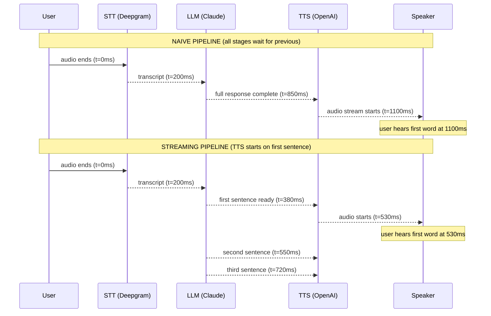

# واجهات Realtime APIs وزمن الاستجابة الصوتي

> في الصوت، الـ 300ms تبدو فورية. والـ 800ms تبدو معطوبة. زمن الاستجابة (latency) متطلب منتج، وليس تفصيلاً هندسياً.

**النوع:** بناء
**اللغات:** Python
**المتطلبات:** الدرس 05 (حلقة الوكيل الصوتي)، المرحلة 04 (الوكلاء)، المرحلة 07 (أساسيات الـ observability)
**الوقت:** ~75 دقيقة
**المرحلة:** 10 · الوسائط المتعددة والصوت

---

## أهداف التعلّم

- تفكيك زمن الاستجابة الصوتي الكامل (end-to-end) إلى مكوّنات قابلة للقياس لكل مرحلة
- تحديد المرحلة المُعيقة (bottleneck) انطلاقاً من ملف زمن استجابة بقيم P50/P95
- تطبيق بثّ الـ TTS على مستوى الجملة (sentence-level streaming) لإزالة انتظار الشلال (waterfall)
- تطبيق تخزين الـ prompt مؤقتاً (prompt caching) واختيار النموذج لتقليص زمن أول رمز من الـ LLM (TTFT)
- تعريف هدف مستوى خدمة (SLO) لزمن الاستجابة الصوتي مع هدف P95 وعتبة تنبيه

---

## المشكلة

الوكيل الصوتي من الدرس 05 يعمل. المستخدمون يتكلمون، والوكيل يردّ. لكن فريق المنتج رصد مشكلة في أول اختبار مع المستخدمين: "يحسّ بطيء. مثل ما تكلّم أحد عبر اتصال هاتفي رديء." زمن الاستجابة الكامل المقاس عند P50: ‏950ms.

الفريق يتجادل حول ما الذي يجب إصلاحه. مهندس يريد تبديل مزوّد الـ STT. وآخر يريد التحويل من Claude Sonnet إلى Haiku. وثالث يقترح التوجيه الجغرافي. كلهم يخمّنون. لا أحد قاس فعلاً أين تذهب الـ 950ms.

قبل أي تحسين (optimization)، تحتاج إلى ملف زمن استجابة مُفكّك: كم مليثانية تساهم بها كل مرحلة؟ وحتى تعرف ذلك، كل محاولة تحسين هي مجرد رمي عملة. وبمجرد أن يكون لديك الملف، تكون عدة مكاسب عالية القيمة متاحة دائماً تقريباً دون تبديل المزوّدين: بثّ الـ TTS قبل أن ينتهي الـ LLM، تخزين الـ system prompt مؤقتاً، اختيار نموذج أسرع للدورات منخفضة التعقيد. الحل لا يكون أبداً تقريباً "بدّل المزوّد". بل عادة "أزِل الشلال".

---

## المفهوم

### تشريح خط أنابيب الصوت

دورة الصوت الكاملة فيها ست مراحل تعمل بالتسلسل. كل واحدة تضيف زمن استجابة. معظم الفرق تقيس زمن الاستجابة الكامل فقط ولا تستطيع تحديد أي مرحلة تُصلَح.

```
Stage 1  STT endpoint detection    50-150ms   (VAD detects speech end)
Stage 2  STT model inference       80-250ms   (audio -> text)
Stage 3  Network RTT to LLM        20-80ms    (client -> API)
Stage 4  LLM TTFT                  150-600ms  (first token arrives)
Stage 5  TTS synthesis start       80-300ms   (text -> audio stream opens)
Stage 6  Audio playback start      20-60ms    (buffer fills, speaker plays)
         ─────────────────────────────────────
         Total P50 budget:         400-1440ms
```

مشكلة الشلال: في خط الأنابيب الساذج (naive)، تعمل المراحل بالتسلسل الصارم. المرحلة 5 (TTS) لا يمكن أن تبدأ حتى تنتهي المرحلة 4 (LLM) تماماً. لردّ من 200 رمز بمعدل 50 رمز/ثانية، هذه 4 ثوانٍ من الانتظار القابل للتفادي قبل أن يسمع المستخدم كلمة واحدة.

### مخطط تسلسلي: خط الأنابيب الساذج مقابل خط البثّ



خط أنابيب البثّ يرسل كل جملة كاملة إلى الـ TTS مع توليد الـ LLM لها. المستخدم يسمع الجملة الأولى بينما الـ LLM لا يزال يولّد الثانية. زمن الاستجابة الكامل ينخفض من 1100ms إلى 530ms دون أي تغيير في المزوّدين.

### تقنيات التحسين لكل مرحلة

| Stage | Technique | Typical Reduction |
|-------|-----------|-------------------|
| STT endpoint detection | Tune VAD sensitivity | 50-100ms |
| STT model | Use streaming recognition with partial results | 80-150ms |
| LLM TTFT | Prompt caching for system prompt | 100-200ms |
| LLM TTFT | Use Haiku for simple turns (vs Sonnet) | 200-400ms |
| LLM-to-TTS handoff | Sentence-level streaming | 300-800ms |
| Network RTT | Geographic co-location (same cloud region) | 20-60ms |
| TTS | Pre-buffer first chunk before playback starts | 20-40ms |

### ميزانيات زمن الاستجابة حسب حالة الاستخدام

```
Interactive voice (call center, realtime assistant)
  P50 target:  < 400ms
  P95 target:  < 600ms
  Alert:       P95 > 800ms

Voice search / query answering
  P50 target:  < 600ms
  P95 target:  < 900ms
  Alert:       P95 > 1200ms

Voice narration (non-interactive)
  P50 target:  < 1000ms
  P95 target:  < 1500ms  (buffering is acceptable)
```

---

## البناء

أداة تحليل لزمن الاستجابة (latency profiler) تقيس كل مرحلة، وتحسب P50/P95، وتحدّد المرحلة المُعيقة، وتعرض نمط تحسين بثّ الـ TTS. وضع العرض (Demo mode) يولّد بيانات توقيت اصطناعية بحيث تعمل الأداة دون مفاتيح API.

```python
# See code/main.py for full implementation.
# Key excerpts below.

from dataclasses import dataclass

@dataclass
class TurnTimings:
    stt_endpoint_ms: float = 0.0
    stt_model_ms: float = 0.0
    network_rtt_ms: float = 0.0
    llm_ttft_ms: float = 0.0
    tts_start_ms: float = 0.0
    playback_start_ms: float = 0.0
    total_naive_ms: float = 0.0
    total_streaming_ms: float = 0.0
```

في الإنتاج، تملأ `TurnTimings` باستخدام `time.perf_counter()` حول كل استدعاء API. أداة التحليل تحسب النسب المئوية وتحدّد المرحلة ذات أعلى قيمة P50:

```python
def profile_pipeline(turns: list) -> PipelineProfile:
    stage_p50s = {}
    for field_name, label in STAGE_FIELDS:
        values = [getattr(t, field_name) for t in turns]
        p50 = percentile(values, 50)
        p95 = percentile(values, 95)
        profile.p50[label] = p50
        profile.p95[label] = p95
        if "Total" not in label:
            stage_p50s[label] = p50
    profile.bottleneck = max(stage_p50s, key=lambda k: stage_p50s[k])
    return profile
```

شغّل وضع العرض:

```bash
python main.py --demo
python main.py --demo --cached-prompt    # compare with warm cache
python main.py --streaming-demo          # see sentence-streaming timing
```

المخرجات المتوقّعة (تقريبية):

```
  Stage                               P50 (ms)   P95 (ms)
  -----------------------------------------------------------------
  STT Endpoint Detection                   100        153
  STT Model Inference                      151        237
  Network RTT                               40         68
  LLM Time-to-First-Token                  381        592  << BOTTLENECK
  TTS Synthesis Start                      120        187
  Playback Start                            30         49
  -----------------------------------------------------------------
  Total (Naive / Waterfall)                822       1183
  Total (Sentence Streaming)               562        861

  Bottleneck stage:     LLM Time-to-First-Token
  Streaming saves:      260ms at P50

  SLO (P95 < 600ms): 861ms -> FAIL
  ACTION: Focus optimization on: LLM Time-to-First-Token
```

> **اختبار من الواقع:** أداة التحليل تُظهر أن TTFT الخاص بالـ LLM هو المرحلة المُعيقة عند 381ms. قبل تبديل النماذج، تجرّب تخزين الـ prompt مؤقتاً (`--cached-prompt`). تنخفض قيمة P50 إلى 180ms وتنتقل قيمة P95 للبثّ من 861ms إلى 510ms، فتجتاز الـ SLO. تبديل المزوّدين ما كان ليُحدث شيئاً: المرحلة المُعيقة كانت الـ system prompt غير المخزّن مؤقتاً، وليس سرعة النموذج.

---

## الاستخدام

### بثّ Deepgram للـ STT (WebSocket)

واجهة البثّ من Deepgram تستخدم WebSocket لإرجاع نصوص جزئية (partial transcripts) أثناء كلام المستخدم. هذا يلغي المرحلة 1 (تأخير اكتشاف نهاية الكلام) بالسماح لخط أنابيب الـ STT أن يبدأ على صوت جزئي:

```python
import asyncio
import websockets
import json

DEEPGRAM_URL = (
    "wss://api.deepgram.com/v1/listen"
    "?model=nova-2&smart_format=true&interim_results=true"
)

async def stream_stt(audio_chunks, api_key: str):
    headers = {"Authorization": f"Token {api_key}"}
    async with websockets.connect(DEEPGRAM_URL, extra_headers=headers) as ws:
        async def sender():
            for chunk in audio_chunks:
                await ws.send(chunk)
            await ws.send(json.dumps({"type": "CloseStream"}))

        async def receiver():
            async for message in ws:
                data = json.loads(message)
                if data.get("is_final"):
                    yield data["channel"]["alternatives"][0]["transcript"]

        await asyncio.gather(sender(), receiver())
```

### بثّ Claude + بثّ OpenAI TTS

خط الأنابيب ذو زمن الاستجابة الأدنى يربط المزوّدين الثلاثة في سلسلة بثّ:

```python
import anthropic
import openai

def voice_turn_streaming(transcript: str, system_prompt: str):
    """
    Stream Claude output sentence by sentence into OpenAI TTS streaming.
    Achieves first audio output before LLM finishes generating.
    """
    claude = anthropic.Anthropic()
    oai = openai.OpenAI()

    buffer = ""
    sentence_ends = {".", "!", "?"}

    with claude.messages.stream(
        model="claude-3-5-haiku-20241022",
        max_tokens=512,
        system=system_prompt,
        messages=[{"role": "user", "content": transcript}],
    ) as stream:
        for text in stream.text_stream:
            buffer += text
            # Dispatch to TTS when a sentence completes
            if any(buffer.rstrip().endswith(end) for end in sentence_ends):
                sentence = buffer.strip()
                buffer = ""
                # OpenAI TTS streaming
                with oai.audio.speech.with_streaming_response.create(
                    model="tts-1",
                    voice="alloy",
                    input=sentence,
                    response_format="pcm",
                ) as response:
                    for chunk in response.iter_bytes(chunk_size=4096):
                        yield chunk  # stream to audio playback
```

### التكامل مع LiveKit

يوفّر LiveKit مقاييس زمن استجابة مدمجة عبر نظام `RoomEvent` الخاص به. بعد تفعيل `metrics_collection: true` في `WorkerOptions`، يُصدر LiveKit تلقائياً قيم TTFT لكل دورة، وزمن استجابة الـ TTS، وزمن الاستجابة الكامل. راجع توثيق `livekit-agents`: ‏`AgentMetrics.ttft_ms`، ‏`AgentMetrics.tts_ttfb_ms`.

> **نقلة في المنظور:** نمط البثّ يبدو وكأنه تعقيد في السباكة (plumbing)، لكنه في الحقيقة تقليل في الاقتران (coupling). خط الأنابيب الساذج فيه اعتماد صلب بين اكتمال الـ LLM الكامل وبداية الـ TTS. خط أنابيب البثّ يستبدل ذلك الاعتماد التسلسلي بطابور (queue): كل جملة وحدة عمل مستقلة. الطوابير تفصل المنتجين عن المستهلكين، ولهذا يبدو البثّ أصعب في الكتابة لكنه أسهل في الاستدلال عنه تحت الحِمل.

---

## التسليم

راجع `outputs/skill-realtime-latency-tuning.md` للحصول على القطعة المرجعية القابلة لإعادة الاستخدام الخاصة بضبط زمن الاستجابة.

---

## التقييم

**تتبّع P50/P95 لكل مرحلة:** قِس كل دورة صوتية إنتاجية باستخدام `TurnTimings`. خزّنها في منصة الـ observability الخاصة بك (Langfuse أو Phoenix أو قاعدة بيانات سلاسل زمنية). أطلِق تنبيهاً عندما تتجاوز قيمة P95 حدّ 800ms للزمن الكامل.

**تعريف الـ SLO:**

```yaml
slo:
  name: voice_latency_interactive
  metric: voice_turn_p95_ms
  target: 600
  alert_threshold: 800
  window: 1h
  evaluation_period: 5m
```

**حارس الانحدار (Regression guard):** شغّل `python main.py --demo --n 500` في الـ CI عند كل نشر. إذا فشل فحص الـ SLO المحاكى في أداة التحليل مع معاملات توقيت الكود الجديد، فامنع النشر. للأنظمة الإنتاجية، أعد تشغيل 100 دورة حقيقية على خط الأنابيب الجديد قبل ترقيته.

**تناوب المرحلة المُعيقة:** بعد إصلاح TTFT الخاص بالـ LLM بتخزين الـ prompt مؤقتاً، تنتقل المرحلة المُعيقة إلى المرحلة التالية الأعلى (غالباً زمن استجابة نموذج الـ STT). أعد تشغيل أداة التحليل بعد كل تحسين لتتبّع أي مرحلة باتت هي القيد الآن.
