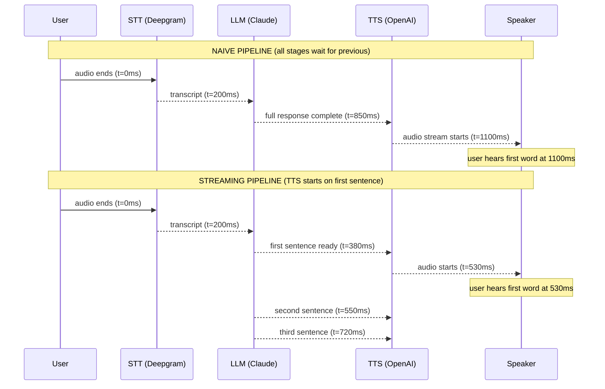

# Realtime APIs and Voice Latency

> In voice, 300ms feels instant. 800ms feels broken. Latency is a product requirement, not an engineering detail.

**Type:** Build
**Languages:** Python
**Prerequisites:** Lesson 05 (voice agent loop), Phase 04 (agents), Phase 07 (observability basics)
**Time:** ~75 min
**Phase:** 10 · Multimodal and Voice

---

## Learning Objectives

- Decompose end-to-end voice latency into measurable per-stage components
- Identify the bottleneck stage from a P50/P95 latency profile
- Implement sentence-level TTS streaming to eliminate the waterfall wait
- Apply prompt caching and model selection to cut LLM TTFT
- Define a voice latency SLO with P95 target and alert threshold

---

## The Problem

The voice agent from Lesson 05 works. Users can speak, the agent responds. But the product team flags it in the first user test: "It feels sluggish. Like talking to someone on a bad phone call." Measured P50 end-to-end latency: 950ms.

The team debates what to fix. One engineer wants to switch STT providers. Another wants to swap from Claude Sonnet to Haiku. A third suggests geographic routing. They are all guessing. Nobody has actually measured where the 950ms goes.

Before any optimization, you need a decomposed latency profile: how many milliseconds does each stage contribute? Until you know that, every optimization attempt is a coin flip. Once you have the profile, several high-value wins are almost always available without switching providers: stream TTS before the LLM finishes, cache the system prompt, choose a faster model for low-complexity turns. The fix is almost never "switch providers." It is usually "remove the waterfall."

---

## The Concept

### Voice Pipeline Anatomy

A full voice turn has six stages that run in sequence. Each adds latency. Most teams measure only end-to-end time and cannot tell which stage to fix.

```
Stage 1  STT endpoint detection    50-150ms   (VAD detects speech end)
Stage 2  STT model inference       80-250ms   (audio -> text)
Stage 3  Network RTT to LLM        20-80ms    (client -> API)
Stage 4  LLM TTFT                  150-600ms  (first token arrives)
Stage 5  TTS synthesis start       80-300ms   (text -> audio stream opens)
Stage 6  Audio playback start      20-60ms    (buffer fills, speaker plays)
         ─────────────────────────────────────
         Total P50 budget:         400-1440ms
```

The waterfall problem: in a naive pipeline, stages run strictly in sequence. Stage 5 (TTS) cannot start until Stage 4 (LLM) is fully done. For a 200-token response at 50 tokens/sec, that is 4 seconds of avoidable wait before the user hears a single word.

### Sequence Diagram: Naive vs Streaming Pipeline



The streaming pipeline dispatches each complete sentence to TTS as the LLM generates it. The user hears the first sentence while the LLM is still generating the second. End-to-end latency drops from 1100ms to 530ms with no provider changes.

### Per-Stage Optimization Techniques

| Stage | Technique | Typical Reduction |
|-------|-----------|-------------------|
| STT endpoint detection | Tune VAD sensitivity | 50-100ms |
| STT model | Use streaming recognition with partial results | 80-150ms |
| LLM TTFT | Prompt caching for system prompt | 100-200ms |
| LLM TTFT | Use Haiku for simple turns (vs Sonnet) | 200-400ms |
| LLM-to-TTS handoff | Sentence-level streaming | 300-800ms |
| Network RTT | Geographic co-location (same cloud region) | 20-60ms |
| TTS | Pre-buffer first chunk before playback starts | 20-40ms |

### Latency Budgets by Use Case

```
Interactive voice (call center, realtime assistant)
  P50 target:  < 400ms
  P95 target:  < 600ms
  Alert:       P95 > 800ms

Voice search / query answering
  P50 target:  < 600ms
  P95 target:  < 900ms
  Alert:       P95 > 1200ms

Voice narration (non-interactive)
  P50 target:  < 1000ms
  P95 target:  < 1500ms  (buffering is acceptable)
```

---

## Build It

A latency profiler that measures each stage, computes P50/P95, identifies the bottleneck, and demonstrates the streaming TTS optimization pattern. Demo mode generates synthetic timing data so the tool works without API keys.

```python
# See code/main.py for full implementation.
# Key excerpts below.

from dataclasses import dataclass

@dataclass
class TurnTimings:
    stt_endpoint_ms: float = 0.0
    stt_model_ms: float = 0.0
    network_rtt_ms: float = 0.0
    llm_ttft_ms: float = 0.0
    tts_start_ms: float = 0.0
    playback_start_ms: float = 0.0
    total_naive_ms: float = 0.0
    total_streaming_ms: float = 0.0
```

In production, you populate `TurnTimings` using `time.perf_counter()` around each API call. The profiler computes percentiles and identifies the stage with the highest P50:

```python
def profile_pipeline(turns: list) -> PipelineProfile:
    stage_p50s = {}
    for field_name, label in STAGE_FIELDS:
        values = [getattr(t, field_name) for t in turns]
        p50 = percentile(values, 50)
        p95 = percentile(values, 95)
        profile.p50[label] = p50
        profile.p95[label] = p95
        if "Total" not in label:
            stage_p50s[label] = p50
    profile.bottleneck = max(stage_p50s, key=lambda k: stage_p50s[k])
    return profile
```

Run demo mode:

```bash
python main.py --demo
python main.py --demo --cached-prompt    # compare with warm cache
python main.py --streaming-demo          # see sentence-streaming timing
```

Expected output (approximate):

```
  Stage                               P50 (ms)   P95 (ms)
  -----------------------------------------------------------------
  STT Endpoint Detection                   100        153
  STT Model Inference                      151        237
  Network RTT                               40         68
  LLM Time-to-First-Token                  381        592  << BOTTLENECK
  TTS Synthesis Start                      120        187
  Playback Start                            30         49
  -----------------------------------------------------------------
  Total (Naive / Waterfall)                822       1183
  Total (Sentence Streaming)               562        861

  Bottleneck stage:     LLM Time-to-First-Token
  Streaming saves:      260ms at P50

  SLO (P95 < 600ms): 861ms -> FAIL
  ACTION: Focus optimization on: LLM Time-to-First-Token
```

> **Real-world check:** The profiler shows LLM TTFT as the bottleneck at 381ms. Before switching models, you try prompt caching (`--cached-prompt`). The P50 drops to 180ms and streaming P95 goes from 861ms to 510ms, passing the SLO. Switching providers would have done nothing: the bottleneck was the uncached system prompt, not the model speed.

---

## Use It

### Deepgram Streaming STT (WebSocket)

Deepgram's streaming API uses a WebSocket to return partial transcripts as the user speaks. This eliminates Stage 1 (endpoint detection delay) by letting the STT pipeline start on partial audio:

```python
import asyncio
import websockets
import json

DEEPGRAM_URL = (
    "wss://api.deepgram.com/v1/listen"
    "?model=nova-2&smart_format=true&interim_results=true"
)

async def stream_stt(audio_chunks, api_key: str):
    headers = {"Authorization": f"Token {api_key}"}
    async with websockets.connect(DEEPGRAM_URL, extra_headers=headers) as ws:
        async def sender():
            for chunk in audio_chunks:
                await ws.send(chunk)
            await ws.send(json.dumps({"type": "CloseStream"}))

        async def receiver():
            async for message in ws:
                data = json.loads(message)
                if data.get("is_final"):
                    yield data["channel"]["alternatives"][0]["transcript"]

        await asyncio.gather(sender(), receiver())
```

### Claude Streaming + OpenAI TTS Streaming

The minimum-latency pipeline connects all three providers in a streaming chain:

```python
import anthropic
import openai

def voice_turn_streaming(transcript: str, system_prompt: str):
    """
    Stream Claude output sentence by sentence into OpenAI TTS streaming.
    Achieves first audio output before LLM finishes generating.
    """
    claude = anthropic.Anthropic()
    oai = openai.OpenAI()

    buffer = ""
    sentence_ends = {".", "!", "?"}

    with claude.messages.stream(
        model="claude-3-5-haiku-20241022",
        max_tokens=512,
        system=system_prompt,
        messages=[{"role": "user", "content": transcript}],
    ) as stream:
        for text in stream.text_stream:
            buffer += text
            # Dispatch to TTS when a sentence completes
            if any(buffer.rstrip().endswith(end) for end in sentence_ends):
                sentence = buffer.strip()
                buffer = ""
                # OpenAI TTS streaming
                with oai.audio.speech.with_streaming_response.create(
                    model="tts-1",
                    voice="alloy",
                    input=sentence,
                    response_format="pcm",
                ) as response:
                    for chunk in response.iter_bytes(chunk_size=4096):
                        yield chunk  # stream to audio playback
```

### LiveKit Integration

LiveKit provides built-in latency metrics via its `RoomEvent` system. After enabling `metrics_collection: true` in your `WorkerOptions`, LiveKit emits per-turn TTFT, TTS latency, and end-to-end latency automatically. See `livekit-agents` docs: `AgentMetrics.ttft_ms`, `AgentMetrics.tts_ttfb_ms`.

> **Perspective shift:** The streaming pattern feels like plumbing complexity, but it is actually a reduction in coupling. The naive pipeline has a hard dependency between full LLM completion and TTS start. The streaming pipeline replaces that sequential dependency with a queue: each sentence is an independent work unit. Queues decouple producers from consumers, which is why streaming feels harder to write but is easier to reason about under load.

---

## Ship It

See `outputs/skill-realtime-latency-tuning.md` for the reusable latency reference artifact.

---

## Evaluate It

**Per-stage P50/P95 tracking:** Instrument every production voice turn with `TurnTimings`. Store in your observability platform (Langfuse, Phoenix, or a time-series DB). Alert when P95 crosses 800ms end-to-end.

**SLO definition:**

```yaml
slo:
  name: voice_latency_interactive
  metric: voice_turn_p95_ms
  target: 600
  alert_threshold: 800
  window: 1h
  evaluation_period: 5m
```

**Regression guard:** Run `python main.py --demo --n 500` in CI on each deploy. If the profiler's simulated SLO check fails with the new code's timing parameters, block the deploy. For production systems, replay 100 real turns against the new pipeline before promoting.

**Bottleneck rotation:** After fixing LLM TTFT with prompt caching, the bottleneck shifts to the next-highest stage (often STT model latency). Re-run the profiler after each optimization to track which stage is now the constraint.
