# الـ RAG متعدد الوسائط (Multimodal RAG)

> استرجاع الصورة الصحيحة والنص الصحيح، ثم الاستدلال عليهما معاً.

**النوع:** بناء
**اللغات:** Python
**المتطلبات:** الدرس 01 (نماذج الرؤية واللغة)، المرحلة 02 (الاسترجاع والـ RAG)، المرحلة 03 (الأدوات والـ MCP)
**الوقت:** ~90 دقيقة
**المرحلة:** 10 · الوسائط المتعددة والصوت

---

## أهداف التعلّم

- وصف ثلاث معماريات لـ RAG متعدد الوسائط والمفاضلات (trade-offs) بينها
- تطبيق نهج الدمج المبكّر (early fusion): توليد أوصاف للصور وقت الفهرسة، وتضمين الصور الأصلية وقت الاستعلام
- تحديد المعمارية المناسبة لحالة استخدام معيّنة (حجم المستند، نوع الاستعلام، قيود البنية التحتية)
- قياس جودة الاسترجاع للاستعلامات البصرية باستخدام مجموعة ذهبية (golden set)
- تقدير تكلفة الفهرسة لمجموعة من الصور

---

## المشكلة

شركة تصنيع لديها 10,000 دليل تقني. كل دليل فيه مخططات، ورسوم تجميع، وجداول قطع، وصور فوتوغرافية مشروحة. بنى الفريق نظام RAG نصياً فقط في المرحلة 02. يسترجع القسم الصحيح عندما يكتب المهندس استعلاماً نصياً، لكنه يفقد كل السياق البصري. مهندس يبحث عن "كيف يبدو تجميع مقياس الضغط؟" يحصل على النص المحيط بالمخطط، لا المخطط نفسه. والأخطر، أن مكوّنين يبدوان متطابقين تقريباً لهما أرقام قطع مختلفة. النص يقول "انظر الشكل 4.3" لكن الشكل 4.3 ليس في السياق.

الفريق يتجادل حول ثلاثة نُهُج. هل يخزّنون الصور بشكل منفصل ويسترجعونها عبر التسمية التوضيحية (caption)؟ هل يستخرجون أوصاف الصور وقت الفهرسة ويضمّنونها كنص؟ أم يضمّنون محتوى الصورة مباشرة باستخدام نموذج تضمين (embedding) متعدد الوسائط؟ كل نهج له مفاضلات مختلفة في التكلفة والتعقيد وجودة الاسترجاع.

وحتى يفهموا خيارات المعمارية، لا يمكنهم اتخاذ قرار مستنير. والخيار الخاطئ يعني إمّا مجموعة تكلّف 40,000 دولار لإعادة فهرستها، أو نظام استرجاع لا يزال يفوّت الاستعلامات البصرية.

---

## المفهوم

### ثلاث معماريات لـ RAG متعدد الوسائط

```mermaid
graph TD
    subgraph A["Late Fusion (two-tower)"]
        A1[Text chunks] --> A2[Text embeddings]
        A3[Image captions] --> A4[Caption embeddings]
        A5[Query] --> A6[Query embedding]
        A6 --> A7{Retrieve from both}
        A2 --> A7
        A4 --> A7
        A7 --> A8[Assemble context]
        A8 --> A9[LLM + images]
    end

    subgraph B["Early Fusion (describe-then-embed)"]
        B1[Images] --> B2[VLM generates description]
        B2 --> B3[Text embedding]
        B4[Text chunks] --> B3
        B5[Query] --> B6[Text embedding]
        B6 --> B7{Retrieve text index}
        B3 --> B7
        B7 --> B8[Assemble: text + original images]
        B8 --> B9[LLM + images]
    end

    subgraph C["Native Multimodal Embedding (CLIP-style)"]
        C1[Images] --> C2[Image embedding model]
        C3[Text chunks] --> C4[Text embedding model]
        C5[Text query] --> C6[Shared embedding space]
        C2 --> C6
        C4 --> C6
        C6 --> C7{Cross-modal retrieval}
        C7 --> C8[LLM + images]
    end
```



### مقارنة المعماريات

| Approach | Index Cost | Query Quality | Infrastructure | Best For |
|----------|------------|---------------|----------------|----------|
| Late Fusion | Low (caption embeddings only) | Medium (depends on caption quality) | Two vector indexes | Large corpora, good existing captions |
| Early Fusion | Medium (VLM call per image) | High (rich descriptions + original images) | One text index + image store | Most production cases |
| Native Multimodal Embedding | Low (one embedding per image) | High for visual similarity queries | Multimodal vector index | Image-similarity retrieval, CLIP-compatible corpus |

### الدمج المبكّر: نقطة الانطلاق المُوصى بها

الدمج المبكّر (early fusion) هو النهج الأكثر عملية لمعظم الفرق لأنه:

1. يستخدم بنيتك التحتية الحالية للاسترجاع النصي (فهرس متّجهات واحد)
2. أوصاف الصور من الـ VLM أغنى من التسميات التوضيحية اليدوية
3. وقت الاستعلام، تمرّر الوصف (للاسترجاع) والصورة الأصلية (للتأريض/الـ grounding) معاً
4. يتدهور بلطف: إذا لم يكن للاستعلام مكوّن بصري، يعمل الاسترجاع النصي بشكل طبيعي

مفاضلة التكلفة: مجموعة من 10,000 صورة بسعر ~‏$0.003 لكل وصف صورة (Claude Haiku مع التخزين المؤقت) تكلّف نحو 30 دولاراً للفهرسة. وإعادة الفهرسة بعد تحديث دليل ما تكلّف فقط قيمة الصفحات المتغيّرة.

### نمط تجميع السياق

وقت الاستعلام، جمّع السياق كنص وصور متشابكين (interleaved):

```
[Page 12 - text]
The pressure gauge assembly consists of three components...

[Page 12 - diagram]
<image: page_12_figure_4.png>

[Page 13 - text]
Torque specifications for the gauge fitting are listed below...
```

هذه الصيغة المتشابكة تحفظ العلاقة المكانية بين النص والمخططات. يستطيع Claude الاستدلال على كليهما في آنٍ واحد.

---

## البناء

تطبيق RAG متعدد الوسائط بالدمج المبكّر. وقت الفهرسة: استخدم Claude لتوليد أوصاف غنية للصور. وقت الاستعلام: استرجِع عبر الوصف، وضمّن الصور الأصلية في السياق.

```python
# See code/main.py for full implementation.
# Key components below.
```

المُفهرِس (indexer) يعالج مجموعة مستندات ويولّد أوصافاً لكل صورة:

```python
import anthropic
import base64
import json
from pathlib import Path

client = anthropic.Anthropic()

def describe_image(image_b64: str, context_text: str = "") -> str:
    """
    Use Claude to generate a rich description of an image for indexing.
    context_text: surrounding text from the same page (optional, improves quality).
    """
    messages = [
        {
            "role": "user",
            "content": [
                {
                    "type": "image",
                    "source": {
                        "type": "base64",
                        "media_type": "image/png",
                        "data": image_b64,
                    },
                },
                {
                    "type": "text",
                    "text": (
                        "Describe this technical diagram in detail. "
                        "Include: what is shown, component names visible, "
                        "spatial relationships, any numbers or labels, "
                        "and what a technician would use this diagram for. "
                        + (f"Context from the surrounding page: {context_text}" if context_text else "")
                    ),
                },
            ],
        }
    ]
    response = client.messages.create(
        model="claude-3-5-haiku-20241022",
        max_tokens=400,
        messages=messages,
    )
    return response.content[0].text
```

المُسترجِع (retriever) يجد القطع ذات الصلة ويجمّع سياقاً مختلطاً من النص/الصورة:

```python
import numpy as np

def cosine_similarity(a: list, b: list) -> float:
    a, b = np.array(a), np.array(b)
    return float(np.dot(a, b) / (np.linalg.norm(a) * np.linalg.norm(b) + 1e-10))


def retrieve_multimodal(query: str, index: list, embed_fn, top_k: int = 5) -> list:
    """
    Retrieve top-K chunks by semantic similarity.
    Returns chunks sorted by score, each with text, image (if any), and score.
    """
    query_vec = embed_fn(query)
    scored = []
    for chunk in index:
        score = cosine_similarity(query_vec, chunk["embedding"])
        scored.append({**chunk, "score": score})
    return sorted(scored, key=lambda x: x["score"], reverse=True)[:top_k]


def assemble_context(chunks: list) -> list:
    """
    Build the content list for a Claude message from retrieved chunks.
    Interleaves text and images in page order.
    """
    content = []
    for chunk in chunks:
        content.append({
            "type": "text",
            "text": f"[{chunk['source']} - text]\n{chunk['text']}"
        })
        if chunk.get("image_b64"):
            content.append({
                "type": "text",
                "text": f"[{chunk['source']} - diagram]"
            })
            content.append({
                "type": "image",
                "source": {
                    "type": "base64",
                    "media_type": "image/png",
                    "data": chunk["image_b64"],
                }
            })
    return content
```

> **اختبار من الواقع:** خطوة وصف الصورة تكلّف نحو ‏$0.003 لكل صورة بتسعير Claude Haiku. لـ 10,000 صورة، هذه تكلفة فهرسة لمرة واحدة قدرها 30 دولاراً. لكنك لا تدفع مقابل الوصف فقط: أنت تحوّل شبكة بكسلات غامضة إلى تمثيل دلالي قابل للبحث. الوصف هو ما يستطيع نظام الاسترجاع لديك أن يستعلم عنه فعلاً. وبدونه، مستخدم يسأل عن "تجميع مقياس الضغط" لن يسترجع أبداً مخططاً موسوماً فقط بـ "الشكل 4.3".

---

## الاستخدام

### فهرس LlamaIndex متعدد الوسائط

يوفّر LlamaIndex الفئة `MultiModalVectorStoreIndex` التي تتعامل مع الدمج المبكّر تلقائياً:

```python
from llama_index.core import SimpleDirectoryReader
from llama_index.core.indices import MultiModalVectorStoreIndex
from llama_index.multi_modal_llms.anthropic import AnthropicMultiModal

# Load documents with embedded images
documents = SimpleDirectoryReader(
    "manuals/",
    required_exts=[".pdf"],
).load_data()

# Build index - LlamaIndex handles image extraction + description
index = MultiModalVectorStoreIndex.from_documents(
    documents,
    image_description_model=AnthropicMultiModal(
        model="claude-3-5-haiku-20241022"
    ),
)

# Query - retrieves text and images, assembles multimodal context
query_engine = index.as_query_engine(
    multi_modal_llm=AnthropicMultiModal(
        model="claude-3-5-haiku-20241022"
    )
)
response = query_engine.query("What does the pressure gauge assembly look like?")
```

### ColPali للتضمين متعدد الوسائط الأصلي (Native)

يستخدم ColPali نموذج رؤية ولغة (VLM) لتضمين صور الصفحات بالكامل مباشرة. لا حاجة إلى OCR أو استخراج نص. هذا هو نهج المعمارية C (التضمين متعدد الوسائط الأصلي):

```python
from colpali_engine.models import ColPali, ColPaliProcessor

model = ColPali.from_pretrained("vidore/colpali-v1.2")
processor = ColPaliProcessor.from_pretrained("vidore/colpali-v1.2")

# Index: embed page images directly (no OCR)
page_images = load_pdf_pages("manual.pdf")
page_embeddings = model.forward_images(page_images)

# Query: embed text query into same space as page images
query_embedding = model.forward_queries(["pressure gauge assembly diagram"])

# Retrieve: cosine similarity between query and page embeddings
scores = torch.matmul(query_embedding, page_embeddings.T)
top_pages = scores.topk(3).indices
```

يتفوّق ColPali في المجموعات التي يكون فيها استخراج النص غير موثوق (المستندات الممسوحة ضوئياً، التخطيطات المعقّدة، الجداول المعروضة كصور). ويتطلّب وحدة GPU للاستدلال.

> **نقلة في المنظور:** الدمج المبكّر يبدو وكأنه حيلة ملتوية (hack): أنت تصف الصور بالنص حتى يستطيع نظام الاسترجاع النصي إيجادها. لكن هذه ليست حيلة؛ إنها رؤية ترميز الاسترجاع. أي نظام استرجاع يحتاج إلى تمثيل مشترك بين الاستعلامات والمستندات. الدمج المبكّر يستخدم الـ LLM لترجمة الصور إلى ذلك التمثيل النصي المشترك. التضمين متعدد الوسائط الأصلي (ColPali) يُنشئ فضاءً بصرياً-نصياً مشتركاً مباشرة. كلاهما مشروع. الدمج المبكّر أرخص ويستخدم بنية تحتية لديك أصلاً. وColPali أفضل عندما يكون استخراج النص صعباً.

---

## التسليم

راجع `outputs/skill-multimodal-rag-pipeline.md` للحصول على القطعة المرجعية القابلة لإعادة الاستخدام.

---

## التقييم

**المجموعة الذهبية البصرية:** أنشئ مجموعة اختبار من 20-30 استعلاماً بصرياً مع صفحات صحيحة معروفة:
- "كيف يبدو المكوّن X؟" يُطابق الصفحة Y
- "كيف يُهيّأ التجميع Z؟" يُطابق المخطط في الصفحة W

قِس معدل الإصابة في الاسترجاع (hit rate): ما النسبة من الاستعلامات البصرية التي تسترجع الصفحة الصحيحة ضمن أفضل 3 نتائج؟

**تتبّع تكلفة الفهرسة:**

```python
# Log image description token usage
response = client.messages.create(...)
print(f"Image description tokens: {response.usage.input_tokens} in, "
      f"{response.usage.output_tokens} out")
# Aggregate across corpus to estimate total index cost
```

**مقارنة النص فقط مقابل متعدد الوسائط:**

```python
# For each visual query in the golden set:
# 1. Run text-only retrieval (no image descriptions)
# 2. Run multimodal retrieval (with image descriptions)
# Compare hit@3 (is the correct page in the top 3 results?)

text_only_hits = evaluate_retrieval(golden_set, text_only_index)
multimodal_hits = evaluate_retrieval(golden_set, multimodal_index)
print(f"Text-only hit@3: {text_only_hits:.1%}")
print(f"Multimodal hit@3: {multimodal_hits:.1%}")
```

**فحص جودة تجميع السياق:** بعد الاسترجاع، تحقّق من أن السياق المُمرَّر إلى Claude يتضمّن قطع النص وصور الصفحات معاً. سجّل عدد رموز الصور لكل استعلام لتتبّع استخدام نافذة السياق (context window).
