# Multimodal RAG

> Retrieving the right image and the right text, then reasoning over both together.

**Type:** Build
**Languages:** Python
**Prerequisites:** Lesson 01 (vision language models), Phase 02 (retrieval and RAG), Phase 03 (tools and MCP)
**Time:** ~90 min
**Phase:** 10 · Multimodal and Voice

---

## Learning Objectives

- Describe three multimodal RAG architectures and the trade-offs between them
- Implement the early fusion approach: generate image descriptions at index time, include original images at query time
- Identify which architecture fits a given use case (doc size, query type, infra constraints)
- Measure retrieval quality for visual queries using a golden set
- Estimate indexing cost for a corpus of images

---

## The Problem

A manufacturing company has 10,000 technical manuals. Each manual has diagrams, assembly illustrations, parts tables, and annotated photographs. The team built a text-only RAG system in Phase 02. It retrieves the right section when an engineer types a text query, but it loses all visual context. An engineer searching "what does the pressure gauge assembly look like?" gets the text surrounding the diagram, not the diagram itself. More critically, two components that look nearly identical have different part numbers. The text says "see Figure 4.3" but Figure 4.3 is not in the context.

The team debates three approaches. Should they store images separately and retrieve by caption? Should they extract image descriptions at index time and embed those as text? Or should they embed image content directly using a multimodal embedding model? Each approach has different tradeoffs in cost, complexity, and retrieval quality.

Until they understand the architecture options, they cannot make an informed choice. The wrong choice means either a corpus that costs $40,000 to re-index or a retrieval system that still misses visual queries.

---

## The Concept

### Three Multimodal RAG Architectures

```mermaid
graph TD
    subgraph A["Late Fusion (two-tower)"]
        A1[Text chunks] --> A2[Text embeddings]
        A3[Image captions] --> A4[Caption embeddings]
        A5[Query] --> A6[Query embedding]
        A6 --> A7{Retrieve from both}
        A2 --> A7
        A4 --> A7
        A7 --> A8[Assemble context]
        A8 --> A9[LLM + images]
    end

    subgraph B["Early Fusion (describe-then-embed)"]
        B1[Images] --> B2[VLM generates description]
        B2 --> B3[Text embedding]
        B4[Text chunks] --> B3
        B5[Query] --> B6[Text embedding]
        B6 --> B7{Retrieve text index}
        B3 --> B7
        B7 --> B8[Assemble: text + original images]
        B8 --> B9[LLM + images]
    end

    subgraph C["Native Multimodal Embedding (CLIP-style)"]
        C1[Images] --> C2[Image embedding model]
        C3[Text chunks] --> C4[Text embedding model]
        C5[Text query] --> C6[Shared embedding space]
        C2 --> C6
        C4 --> C6
        C6 --> C7{Cross-modal retrieval}
        C7 --> C8[LLM + images]
    end
```



### Architecture Comparison

| Approach | Index Cost | Query Quality | Infrastructure | Best For |
|----------|------------|---------------|----------------|----------|
| Late Fusion | Low (caption embeddings only) | Medium (depends on caption quality) | Two vector indexes | Large corpora, good existing captions |
| Early Fusion | Medium (VLM call per image) | High (rich descriptions + original images) | One text index + image store | Most production cases |
| Native Multimodal Embedding | Low (one embedding per image) | High for visual similarity queries | Multimodal vector index | Image-similarity retrieval, CLIP-compatible corpus |

### Early Fusion: The Recommended Starting Point

Early fusion is the most practical approach for most teams because:

1. It uses your existing text retrieval infrastructure (one vector index)
2. Image descriptions from a VLM are richer than manual captions
3. At query time, you pass both the description (for retrieval) and the original image (for grounding)
4. It degrades gracefully: if a query has no visual component, text retrieval works normally

The cost trade-off: a corpus of 10,000 images at ~$0.003 per image description (Claude Haiku with caching) costs approximately $30 to index. Re-indexing after a manual update costs only the changed pages.

### Context Assembly Pattern

At query time, assemble context as interleaved text and images:

```
[Page 12 - text]
The pressure gauge assembly consists of three components...

[Page 12 - diagram]
<image: page_12_figure_4.png>

[Page 13 - text]
Torque specifications for the gauge fitting are listed below...
```

This interleaved format preserves the spatial relationship between text and diagrams. Claude can reason about both simultaneously.

---

## Build It

Implementing early fusion multimodal RAG. At index time: use Claude to generate rich image descriptions. At query time: retrieve by description, include original images in context.

```python
# See code/main.py for full implementation.
# Key components below.
```

The indexer processes a document set and generates descriptions for each image:

```python
import anthropic
import base64
import json
from pathlib import Path

client = anthropic.Anthropic()

def describe_image(image_b64: str, context_text: str = "") -> str:
    """
    Use Claude to generate a rich description of an image for indexing.
    context_text: surrounding text from the same page (optional, improves quality).
    """
    messages = [
        {
            "role": "user",
            "content": [
                {
                    "type": "image",
                    "source": {
                        "type": "base64",
                        "media_type": "image/png",
                        "data": image_b64,
                    },
                },
                {
                    "type": "text",
                    "text": (
                        "Describe this technical diagram in detail. "
                        "Include: what is shown, component names visible, "
                        "spatial relationships, any numbers or labels, "
                        "and what a technician would use this diagram for. "
                        + (f"Context from the surrounding page: {context_text}" if context_text else "")
                    ),
                },
            ],
        }
    ]
    response = client.messages.create(
        model="claude-3-5-haiku-20241022",
        max_tokens=400,
        messages=messages,
    )
    return response.content[0].text
```

The retriever finds relevant chunks and assembles mixed text/image context:

```python
import numpy as np

def cosine_similarity(a: list, b: list) -> float:
    a, b = np.array(a), np.array(b)
    return float(np.dot(a, b) / (np.linalg.norm(a) * np.linalg.norm(b) + 1e-10))


def retrieve_multimodal(query: str, index: list, embed_fn, top_k: int = 5) -> list:
    """
    Retrieve top-K chunks by semantic similarity.
    Returns chunks sorted by score, each with text, image (if any), and score.
    """
    query_vec = embed_fn(query)
    scored = []
    for chunk in index:
        score = cosine_similarity(query_vec, chunk["embedding"])
        scored.append({**chunk, "score": score})
    return sorted(scored, key=lambda x: x["score"], reverse=True)[:top_k]


def assemble_context(chunks: list) -> list:
    """
    Build the content list for a Claude message from retrieved chunks.
    Interleaves text and images in page order.
    """
    content = []
    for chunk in chunks:
        content.append({
            "type": "text",
            "text": f"[{chunk['source']} - text]\n{chunk['text']}"
        })
        if chunk.get("image_b64"):
            content.append({
                "type": "text",
                "text": f"[{chunk['source']} - diagram]"
            })
            content.append({
                "type": "image",
                "source": {
                    "type": "base64",
                    "media_type": "image/png",
                    "data": chunk["image_b64"],
                }
            })
    return content
```

> **Real-world check:** The image description step costs about $0.003 per image at Claude Haiku pricing. For 10,000 images, that is a $30 one-time indexing cost. But you are not just paying for the description: you are converting an opaque pixel grid into a searchable, semantic representation. The description is what your retrieval system can actually query. Without it, a user asking "pressure gauge assembly" would never retrieve a diagram labeled only "Figure 4.3."

---

## Use It

### LlamaIndex Multimodal Index

LlamaIndex provides `MultiModalVectorStoreIndex` that handles early fusion automatically:

```python
from llama_index.core import SimpleDirectoryReader
from llama_index.core.indices import MultiModalVectorStoreIndex
from llama_index.multi_modal_llms.anthropic import AnthropicMultiModal

# Load documents with embedded images
documents = SimpleDirectoryReader(
    "manuals/",
    required_exts=[".pdf"],
).load_data()

# Build index - LlamaIndex handles image extraction + description
index = MultiModalVectorStoreIndex.from_documents(
    documents,
    image_description_model=AnthropicMultiModal(
        model="claude-3-5-haiku-20241022"
    ),
)

# Query - retrieves text and images, assembles multimodal context
query_engine = index.as_query_engine(
    multi_modal_llm=AnthropicMultiModal(
        model="claude-3-5-haiku-20241022"
    )
)
response = query_engine.query("What does the pressure gauge assembly look like?")
```

### ColPali for Native Multimodal Embedding

ColPali uses a visual language model to embed entire page images directly. No OCR or text extraction required. This is the Architecture C (native multimodal embedding) approach:

```python
from colpali_engine.models import ColPali, ColPaliProcessor

model = ColPali.from_pretrained("vidore/colpali-v1.2")
processor = ColPaliProcessor.from_pretrained("vidore/colpali-v1.2")

# Index: embed page images directly (no OCR)
page_images = load_pdf_pages("manual.pdf")
page_embeddings = model.forward_images(page_images)

# Query: embed text query into same space as page images
query_embedding = model.forward_queries(["pressure gauge assembly diagram"])

# Retrieve: cosine similarity between query and page embeddings
scores = torch.matmul(query_embedding, page_embeddings.T)
top_pages = scores.topk(3).indices
```

ColPali excels at corpora where text extraction is unreliable (scanned documents, complex layouts, tables rendered as images). It requires a GPU for inference.

> **Perspective shift:** Early fusion feels like a hack: you are describing images in text so your text retrieval system can find them. But this is not a hack; it is the retrieval encoding insight. Any retrieval system needs a shared representation between queries and documents. Early fusion uses the LLM to translate images into that shared text representation. Native multimodal embedding (ColPali) creates a shared visual-text space directly. Both are legitimate. Early fusion is cheaper and uses infrastructure you already have. ColPali is better when text extraction is hard.

---

## Ship It

See `outputs/skill-multimodal-rag-pipeline.md` for the reusable reference artifact.

---

## Evaluate It

**Visual golden set:** Create a test set of 20-30 visual queries with known correct pages:
- "What does component X look like?" maps to page Y
- "How is assembly Z configured?" maps to diagram on page W

Measure retrieval hit rate: what fraction of visual queries retrieve the correct page in top-3 results?

**Indexing cost tracking:**

```python
# Log image description token usage
response = client.messages.create(...)
print(f"Image description tokens: {response.usage.input_tokens} in, "
      f"{response.usage.output_tokens} out")
# Aggregate across corpus to estimate total index cost
```

**Text-only vs multimodal comparison:**

```python
# For each visual query in the golden set:
# 1. Run text-only retrieval (no image descriptions)
# 2. Run multimodal retrieval (with image descriptions)
# Compare hit@3 (is the correct page in the top 3 results?)

text_only_hits = evaluate_retrieval(golden_set, text_only_index)
multimodal_hits = evaluate_retrieval(golden_set, multimodal_index)
print(f"Text-only hit@3: {text_only_hits:.1%}")
print(f"Multimodal hit@3: {multimodal_hits:.1%}")
```

**Context assembly quality check:** After retrieval, verify the context passed to Claude includes both text chunks and page images. Log the number of image tokens per query to track context window usage.
