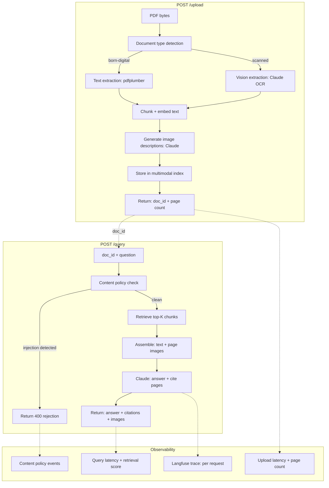

# المشروع الختامي: ميزة متعددة الوسائط

> الوسائط المتعددة ميزة، وليست منتجاً. الجزء الصعب هو دمجها بأمان في النظام الذي لديك أصلاً.

**النوع:** بناء
**اللغات:** Python
**المتطلبات:** الدروس 01-08 (كل دروس المرحلة 10)، المرحلة 06 (التسليم)، المرحلة 07 (الـ observability)، المرحلة 08 (الأمن)
**الوقت:** ~120 دقيقة
**المرحلة:** 10 · الوسائط المتعددة والصوت

---

## أهداف التعلّم

- تأليف قدرات المرحلة 10 في خدمة FastAPI قابلة للنشر
- تطبيق اكتشاف نوع المستند والتوجيه إلى خط الاستخراج الصحيح
- بناء نقطة نهاية (endpoint) استعلام متعددة الوسائط تُرجِع ردوداً منظّمة مع استشهادات بالصفحات (page citations)
- تطبيق طبقة سياسة المحتوى (content policy) من الدرس 08 على خدمة إنتاجية
- النشر باستخدام Docker مع دليل تشغيل كامل (runbook): متغيّرات البيئة، فحوصات السلامة (health checks)، المراقبة

---

## المشكلة

غطّت المرحلة 10 نماذج الرؤية واللغة، واستخراج المستندات، وتوليد الصور، وخطوط أنابيب الكلام، والوكلاء الصوتيين، وضبط زمن الاستجابة، والـ RAG متعدد الوسائط، والأمن متعدد الوسائط. كل درس أنتج مكوّناً عاملاً. لكن المكوّنات ليست منتجاً.

المشروع الختامي يدمجها. حالة الاستخدام: مساعد دعم مستندات. يرفع المستخدمون ملفات PDF، إمّا أصلية رقمية (born-digital) أو ممسوحة ضوئياً. يكتشف النظام نوع المستند، ويستخرج المحتوى باستخدام خط الأنابيب الصحيح، ويفهرسه مع أوصاف الصور، ويجيب على الاستعلامات باستشهادات تتضمّن صور الصفحات ذات الصلة. وطبقة سياسة المحتوى تحجب عمليات الحقن قبل أن تصل إلى الـ LLM. يعمل النظام بأكمله كخدمة FastAPI، قابلة للنشر مع Docker.

هذا هو النمط الذي يتكرّر في الإنتاج: ابنِ المكوّنات، ثم ابنِ التكامل. التكامل هو حيث تظهر هواجس الإنتاج: معالجة الأخطاء بين المراحل، والـ observability عبر خط الأنابيب الكامل، والأمن عند نقاط الدخول، وأتمتة النشر.

---

## المفهوم

### معمارية المشروع الختامي



### كيف تتألّف مكوّنات المراحل

| Phase | Component | Role in capstone |
|-------|-----------|-----------------|
| P10 L01 | Vision language models | Scanned document extraction |
| P10 L02 | Document AI | Document type detection, extraction routing |
| P10 L07 | Multimodal RAG | Index + retrieval pipeline |
| P10 L08 | Security | Content policy layer on query input |
| P06 | FastAPI patterns | Service structure, Pydantic models, error handling |
| P07 | Observability | Request tracing, latency logging |
| P08 | Security | Auth, input validation |

---

## البناء

خدمة FastAPI بنقطتي نهاية: POST /upload و POST /query.

منطق الاستخراج الأساسي من الدرس 02، والفهرس متعدد الوسائط من الدرس 07، وطبقة سياسة المحتوى من الدرس 08، كلها تتألّف كوحدات (modules).

```python
# See code/main.py for the full service.
# Key structure below.
```

**نقطة نهاية الرفع - اكتشاف نوع المستند:**

```python
from fastapi import FastAPI, UploadFile, HTTPException
from pydantic import BaseModel

app = FastAPI()

def detect_document_type(pdf_bytes: bytes) -> str:
    """
    Determine whether a PDF is born-digital (text layer present)
    or scanned (image-only, OCR required).
    Returns 'digital' or 'scanned'.
    """
    try:
        import pdfplumber
        import io
        with pdfplumber.open(io.BytesIO(pdf_bytes)) as pdf:
            text_chars = sum(
                len(page.extract_text() or "")
                for page in pdf.pages[:3]  # check first 3 pages
            )
        # Heuristic: < 50 chars per page = likely scanned
        return "digital" if text_chars > 150 else "scanned"
    except Exception:
        return "scanned"  # safe default
```

**نقطة نهاية الاستعلام - سياسة المحتوى + RAG:**

```python
class QueryRequest(BaseModel):
    doc_id: str
    question: str

class Citation(BaseModel):
    page: int
    relevance_score: float
    has_image: bool

class QueryResponse(BaseModel):
    answer: str
    citations: list[Citation]
    policy_checked: bool

@app.post("/query", response_model=QueryResponse)
async def query_document(req: QueryRequest):
    # Content policy check (Lesson 08)
    if policy_violation := check_content_policy(req.question):
        raise HTTPException(status_code=400, detail=policy_violation)

    # Retrieve from multimodal index (Lesson 07)
    chunks = retrieve(req.question, get_index(req.doc_id))

    # Assemble context + call Claude
    answer, citations = answer_with_citations(req.question, chunks)

    return QueryResponse(
        answer=answer,
        citations=citations,
        policy_checked=True,
    )
```

**وضع العرض (Demo mode):** عندما تكون `DEMO_MODE=true`، تُنشئ الخدمة مستنداً اصطناعياً عند بدء التشغيل، وتحمّله في فهرس داخل الذاكرة، وتعمل كل الاستعلامات دون رفع ملفات PDF أو مفاتيح API. مناسب لاختبار الدخان (smoke testing) لخط الأنابيب الكامل.

> **اختبار من الواقع:** خطوة اكتشاف نوع المستند تبدو تافهة: "فقط تحقّق إن كان هناك نص." لكن عملياً، يمكن لملفات PDF أن تحتوي على طبقة نصية أضافها مرور OCR سابق (رديء) ينتج نصاً رديئاً (garbage). الـ heuristic هنا يفحص عدد محارف النص لا مجرد وجود النص. صفحة بعدد محارف منخفض رغم وجود طبقة نصية تشير إمّا إلى صفحة فارغة أو إلى مخرج OCR فاشل. تشغيل استخراج الرؤية على تلك الصفحات ينتج نتائج أفضل من الوثوق بالطبقة النصية الرديئة.

---

## الاستخدام

### النشر على Railway

يكتشف Railway ملفات Dockerfile وينشرها تلقائياً:

```bash
# Install Railway CLI
npm install -g @railway/cli

# Login and deploy
railway login
railway init
railway up

# Set environment variables
railway variables set ANTHROPIC_API_KEY=sk-ant-...
railway variables set DEMO_MODE=false
```

يخصّص Railway نطاقاً تلقائياً. فحص السلامة: ‏`GET /health` يُرجِع `{"status": "ok", "version": "1.0"}`.

### النشر على Render

```bash
# render.yaml (place in repo root)
services:
  - type: web
    name: multimodal-doc-assistant
    env: docker
    dockerfilePath: ./phases/10-multimodal-and-voice/09-capstone-multimodal-feature/code/Dockerfile
    envVars:
      - key: ANTHROPIC_API_KEY
        sync: false  # set in Render dashboard
      - key: DEMO_MODE
        value: false
    healthCheckPath: /health
```

أنماط النشر في المرحلة 06 (`runbook-production-deploy.md`) تغطّي سير عمل Railway/Render الكامل مع إجراءات التراجع (rollback).

> **نقلة في المنظور:** المشروع الختامي ليس الدرس الأكثر تعقيداً تقنياً في المرحلة 10. التعقيد يخصّ المكوّنات الفردية. تحدّي المشروع الختامي هو التكامل: كل مكوّن له شروط خطئه الخاصة، وملف زمن استجابته الخاص، وأنماط فشله الخاصة. رفع مستند يفشل عند خطوة وصف الصورة يترك الفهرس في حالة جزئية. واستعلام يفشل عند الاسترجاع يجب ألّا يُرجِع إجابة فارغة بصمت. التكامل يعني التعامل مع كل التحوّلات بين المكوّنات، لا المسار السعيد فقط.

---

## التسليم

راجع `outputs/runbook-multimodal-feature-deploy.md` للحصول على دليل تشغيل النشر الكامل.

---

## التقييم

**بروتوكول التقييم الكامل (end-to-end):**

1. ارفع 10 ملفات PDF للاختبار:
   - 3 أصلية رقمية (نص نظيف)
   - 3 أصلية رقمية (مع مخططات)
   - 2 ممسوحة ضوئياً (مسح جيد الجودة)
   - 2 ممسوحة ضوئياً (مسح رديء الجودة)

2. شغّل 20 استعلاماً (2 لكل مستند):
   - 10 استعلامات نصية فقط (الإجابة في النص)
   - 10 استعلامات بصرية (الإجابة تتطلّب مخططاً أو صورة)

3. قِس:

| Metric | Method | Target |
|--------|--------|--------|
| Extraction accuracy | Manual review of extracted text vs. original | > 90% for digital; > 75% for scanned |
| Retrieval precision | Is the correct page in top 3 results? | > 80% overall |
| Citation accuracy | Does cited page actually contain the answer? | > 85% |
| Injection resistance | Run 5 adversarial queries; measure blocked | 100% blocked |
| End-to-end latency | P95 of query response time | < 5s (no streaming) |

4. **قبل/بعد سياسة المحتوى:** شغّل الـ 20 استعلاماً دون طبقة السياسة، ثم معها. تحقّق من صفر إيجابيات كاذبة على الـ 20 استعلاماً المشروعة و100% معدل حجب على الـ 5 العدائية.

**مجموعة الانحدار (Regression suite):** خزّن الـ 20 استعلاماً وصفحات الاستشهاد المتوقّعة في `tests/e2e_suite.json`. شغّلها عند كل نشر لالتقاط انحدارات الاستخراج أو الاسترجاع.
