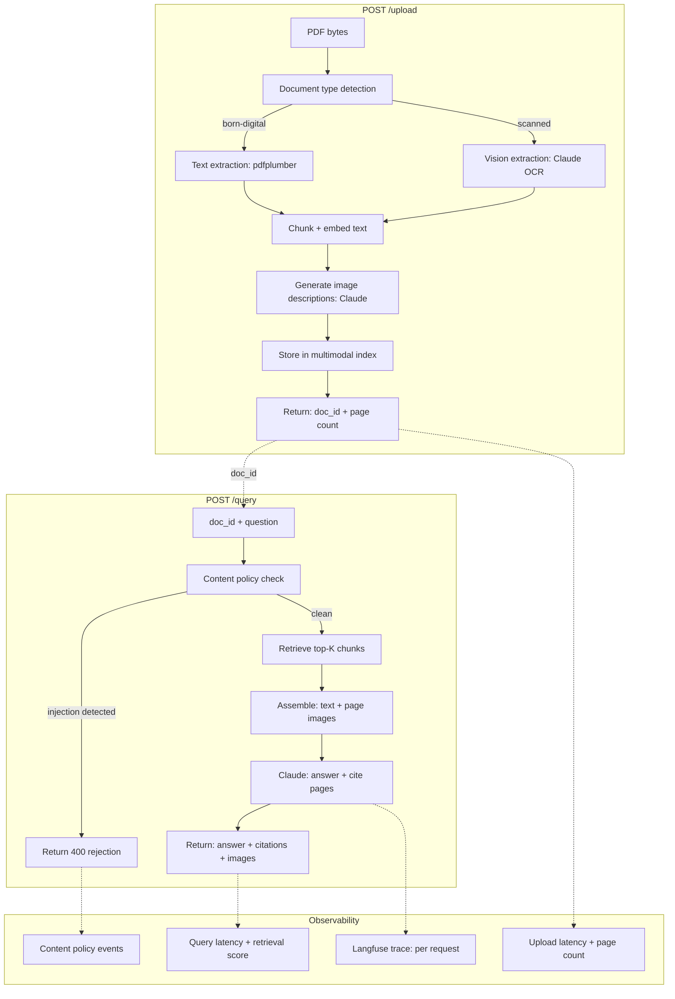

# Capstone: Multimodal Feature

> Multimodal is a feature, not a product. The hard part is integrating it safely into the system you already have.

**Type:** Build
**Languages:** Python
**Prerequisites:** Lessons 01-08 (all Phase 10 lessons), Phase 06 (shipping), Phase 07 (observability), Phase 08 (security)
**Time:** ~120 min
**Phase:** 10 · Multimodal and Voice

---

## Learning Objectives

- Compose Phase 10 capabilities into a deployable FastAPI service
- Implement document type detection and route to the correct extraction pipeline
- Build a multimodal query endpoint that returns structured responses with page citations
- Apply the content policy layer from Lesson 08 to a production service
- Deploy using Docker with a full runbook (environment variables, health checks, monitoring)

---

## The Problem

Phase 10 covered vision language models, document extraction, image generation, speech pipelines, voice agents, latency tuning, multimodal RAG, and multimodal security. Each lesson produced a working component. But components are not a product.

The capstone integrates them. The use case: a document-support assistant. Users upload PDFs, either born-digital or scanned. The system detects the document type, extracts content using the right pipeline, indexes it with image descriptions, and answers queries with citations that include the relevant page images. A content policy layer blocks injections before they reach the LLM. The whole system runs as a FastAPI service, deployable with Docker.

This is the pattern that repeats in production: build components, then build the integration. The integration is where production concerns appear: error handling between stages, observability across the full pipeline, security at the entry points, and deployment automation.

---

## The Concept

### Capstone Architecture



### How Phase Components Compose

| Phase | Component | Role in capstone |
|-------|-----------|-----------------|
| P10 L01 | Vision language models | Scanned document extraction |
| P10 L02 | Document AI | Document type detection, extraction routing |
| P10 L07 | Multimodal RAG | Index + retrieval pipeline |
| P10 L08 | Security | Content policy layer on query input |
| P06 | FastAPI patterns | Service structure, Pydantic models, error handling |
| P07 | Observability | Request tracing, latency logging |
| P08 | Security | Auth, input validation |

---

## Build It

A FastAPI service with two endpoints: POST /upload and POST /query.

The core extraction logic from Lesson 02, the multimodal index from Lesson 07, and the content policy layer from Lesson 08 all compose as modules.

```python
# See code/main.py for the full service.
# Key structure below.
```

**Upload endpoint - document type detection:**

```python
from fastapi import FastAPI, UploadFile, HTTPException
from pydantic import BaseModel

app = FastAPI()

def detect_document_type(pdf_bytes: bytes) -> str:
    """
    Determine whether a PDF is born-digital (text layer present)
    or scanned (image-only, OCR required).
    Returns 'digital' or 'scanned'.
    """
    try:
        import pdfplumber
        import io
        with pdfplumber.open(io.BytesIO(pdf_bytes)) as pdf:
            text_chars = sum(
                len(page.extract_text() or "")
                for page in pdf.pages[:3]  # check first 3 pages
            )
        # Heuristic: < 50 chars per page = likely scanned
        return "digital" if text_chars > 150 else "scanned"
    except Exception:
        return "scanned"  # safe default
```

**Query endpoint - content policy + RAG:**

```python
class QueryRequest(BaseModel):
    doc_id: str
    question: str

class Citation(BaseModel):
    page: int
    relevance_score: float
    has_image: bool

class QueryResponse(BaseModel):
    answer: str
    citations: list[Citation]
    policy_checked: bool

@app.post("/query", response_model=QueryResponse)
async def query_document(req: QueryRequest):
    # Content policy check (Lesson 08)
    if policy_violation := check_content_policy(req.question):
        raise HTTPException(status_code=400, detail=policy_violation)

    # Retrieve from multimodal index (Lesson 07)
    chunks = retrieve(req.question, get_index(req.doc_id))

    # Assemble context + call Claude
    answer, citations = answer_with_citations(req.question, chunks)

    return QueryResponse(
        answer=answer,
        citations=citations,
        policy_checked=True,
    )
```

**Demo mode:** When `DEMO_MODE=true`, the service creates a synthetic document at startup, loads it into an in-memory index, and all queries work without PDF uploads or API keys. Suitable for smoke testing the full pipeline.

> **Real-world check:** The document type detection step seems trivial: "just check if there is text." But in practice, PDFs can have a text layer added by a previous (bad) OCR pass that produces garbage text. The heuristic here checks text character count rather than text presence. A page with a low character count despite having a text layer signals either an empty page or a failed OCR output. Running vision extraction on those pages produces better results than trusting the bad text layer.

---

## Use It

### Deploy to Railway

Railway detects Dockerfiles and deploys automatically:

```bash
# Install Railway CLI
npm install -g @railway/cli

# Login and deploy
railway login
railway init
railway up

# Set environment variables
railway variables set ANTHROPIC_API_KEY=sk-ant-...
railway variables set DEMO_MODE=false
```

Railway automatically assigns a domain. Health check: `GET /health` returns `{"status": "ok", "version": "1.0"}`.

### Deploy to Render

```bash
# render.yaml (place in repo root)
services:
  - type: web
    name: multimodal-doc-assistant
    env: docker
    dockerfilePath: ./phases/10-multimodal-and-voice/09-capstone-multimodal-feature/code/Dockerfile
    envVars:
      - key: ANTHROPIC_API_KEY
        sync: false  # set in Render dashboard
      - key: DEMO_MODE
        value: false
    healthCheckPath: /health
```

The Phase 06 deployment patterns (`runbook-production-deploy.md`) cover the full Railway/Render workflow with rollback procedures.

> **Perspective shift:** The capstone is not the most technically complex lesson in Phase 10. The complexity belongs to the individual components. The capstone's challenge is integration: each component has its own error conditions, its own latency profile, and its own failure modes. A document upload that fails at the image description step leaves the index in a partial state. A query that fails at retrieval should not silently return an empty answer. Integration means handling all the transitions between components, not just the happy path.

---

## Ship It

See `outputs/runbook-multimodal-feature-deploy.md` for the full deployment runbook.

---

## Evaluate It

**End-to-end eval protocol:**

1. Upload 10 test PDFs:
   - 3 born-digital (clean text)
   - 3 born-digital (with diagrams)
   - 2 scanned (good quality scan)
   - 2 scanned (poor quality scan)

2. Run 20 queries (2 per document):
   - 10 text-only queries (answer in text)
   - 10 visual queries (answer requires a diagram or image)

3. Measure:

| Metric | Method | Target |
|--------|--------|--------|
| Extraction accuracy | Manual review of extracted text vs. original | > 90% for digital; > 75% for scanned |
| Retrieval precision | Is the correct page in top 3 results? | > 80% overall |
| Citation accuracy | Does cited page actually contain the answer? | > 85% |
| Injection resistance | Run 5 adversarial queries; measure blocked | 100% blocked |
| End-to-end latency | P95 of query response time | < 5s (no streaming) |

4. **Before/after content policy:** Run the 20 queries without the policy layer, then with it. Verify zero false positives on the 20 legitimate queries and 100% block rate on the 5 adversarial ones.

**Regression suite:** Store the 20 queries and expected citation pages in `tests/e2e_suite.json`. Run on each deploy to catch extraction or retrieval regressions.
