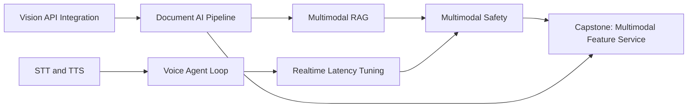

# Phase 10: Beyond Text - Multimodal and Voice

9 lessons. ~10 hours. Add vision, document AI, image generation, speech, and voice agent capabilities to production AI systems.

## The through-line

Most production AI systems start as text-only and add multimodal capabilities incrementally. This phase covers the applied patterns: how to encode images for the API, how to extract structured data from PDFs (born-digital vs scanned), how to build a voice agent loop that meets real latency budgets, and how cross-modal prompt injection extends the threat model from Phase 08. Every lesson ships a reusable pattern, not a toy demo.

## What you build

## Lessons

| # | Lesson | Artifact | Time |
|---|--------|----------|------|
| 01 | Vision-Language Models in Apps | `skill-vision-api-integration.md` | ~45 min |
| 02 | Document AI and Structured Extraction Pipelines | `skill-document-extraction-pipeline.md` | ~60 min |
| 03 | Image Generation in Products | `skill-image-generation-patterns.md` | ~45 min |
| 04 | Speech-to-Text and Text-to-Speech | `skill-audio-pipeline.md` | ~45 min |
| 05 | Building a Voice Agent Loop | `skill-voice-agent-architecture.md` | ~75 min |
| 06 | Realtime APIs and Voice Latency | `skill-realtime-latency-tuning.md` | ~60 min |
| 07 | Multimodal RAG | `skill-multimodal-rag-pipeline.md` | ~60 min |
| 08 | Multimodal Evals and Cross-Modal Injection | `skill-multimodal-safety-checklist.md` | ~45 min |
| 09 | Capstone: Multimodal Feature Service | `runbook-multimodal-feature-deploy.md` | ~75 min |

## Prerequisites

Phase 01 (Prompt Engineering) for API interaction patterns. Phase 02 (RAG) for lesson 07. Phase 06 (Shipping) for the capstone service. Phase 08 (Security) for the cross-modal injection lesson.

## Stack

- Python + `anthropic` SDK (primary vision and LLM API)
- `openai` SDK for image generation (DALL-E 3) and TTS/STT (Whisper)
- `pdfplumber` / `PyMuPDF` for born-digital PDF extraction
- `Pillow` for image manipulation in demos and security testing
- `pydub` for audio chunking
- `fastapi` + `uvicorn` for the capstone service
- `peft` / Deepgram / ElevenLabs referenced but not required for core lessons
- Docker for the capstone
- All lessons include a demo mode that works without external API keys
