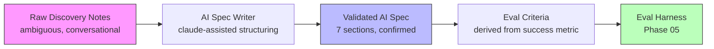

# الاكتشاف: من الطلب الغامض إلى مواصفات الذكاء الاصطناعي

> إن لم تستطع كتابة مقياس نجاح قابل للقياس، فأنت لا تملك معلومات كافية للبناء.

**النوع:** بناء
**اللغات:** Python
**المتطلبات:** 11-01 ما الذي يفعله الـ FDE فعليًا، 11-02 تحديد النطاق قبل الحل
**الوقت:** ~60 دقيقة
**المرحلة:** 11 - مهارات الـ FDE

## أهداف التعلّم

- وصف الأقسام السبعة لمواصفات الذكاء الاصطناعي (AI spec) وشرح لماذا يجب كتابة كل قسم قبل الكود
- استخدام Claude للمساعدة في هيكلة ملاحظات الاكتشاف (discovery) الخام إلى مواصفات ذكاء اصطناعي كاملة
- التعرّف على متى تنتج مكالمة الاكتشاف معلومات غير كافية لكتابة المواصفات
- تطبيق كاتب المواصفات على سيناريو واقعي من البداية إلى النهاية
- شرح كيف يصبح مقياس النجاح في المواصفات معيار التقييم (eval criterion) في المرحلة 05

---

## المشكلة

تنهي مكالمة اكتشاف مدتها 45 دقيقة مع عميل. لديك ثلاث صفحات من الملاحظات. تفهم المشكلة بحدسك. أصحاب المصلحة (stakeholders) متوافقون، وحالة الاستخدام واضحة، وأنت مستعد للبدء بالبناء.

ثم تفتح مستندًا فارغًا لتكتب المواصفات فتدرك أنك لا تملك مقياس نجاح واضحًا. تعرف ما ينبغي للنظام أن يفعله لكن لا تعرف كيف تقيس ما إن كان يفعله. لا تعرف من وافق على الوصول إلى البيانات. ولست متأكدًا ما إن كانت صيغة المخرج التي تتخيّلها تطابق ما يتوقعه العميل فعلًا.

هذه ليست فجوات يمكن ملؤها لاحقًا. بل فجوات ستظهر كعوائق في أسوأ لحظة ممكنة: أثناء العرض، أو أثناء التسليم، أو حين تحاول تشغيل التقييم. مواصفات الذكاء الاصطناعي موجودة لإجبار هذه الأسئلة على الظهور قبل بدء البناء. هي ليست توثيقًا: بل أداة تفكير منظّمة تحوّل ملاحظات الاكتشاف (الغامضة، المحادثاتية، الناقصة) إلى مواصفات قابلة للبناء وقابلة للتقييم وجاهزة للتسليم (handoff).

---

## المفهوم

### من ملاحظات الاكتشاف إلى مواصفات الذكاء الاصطناعي إلى معايير التقييم



كاتب المواصفات يجسر الفجوة بين ما قاله العميل (الملاحظات الخام) وما يحتاجه البناء (مواصفات قابلة للاختبار). يساعد Claude في اقتراح مقاييس نجاح حين يعطي العميل اتجاهًا فقط، وفي إبراز المجاهيل التي لا تتطرق إليها الملاحظات.

### الأقسام السبعة لمواصفات الذكاء الاصطناعي

يجب أن تحتوي كل مواصفات ذكاء اصطناعي على هذه الأقسام السبعة بالضبط:

```
Section              Purpose                              Blocker if missing
-------------------  -----------------------------------  ----------------------
Problem statement    Describes the pain in customer       Build may solve the
                     terms, not engineering terms         wrong problem

Success metric       Measurable target + baseline +       Cannot evaluate if
                     time horizon + data source           system worked

Input/output         What goes in, what comes out,        Integration surprises
contract             in what format                       post-build

Data sources         Owner, system, format,               Week-2 data blocker
                     access path

Integration points   Where output lands, who acts         Output format mismatch
                     on it, error handling                at demo

Risks and unknowns   Unresolved questions that            Silent failure in
                     could affect the build               production

Out of scope         What this system will NOT do         Scope creep post-demo
```

### لماذا يجب أن تسبق المواصفات الكود

المواصفات ليست متطلبًا بيروقراطيًا. بل هي وظيفة إجبارية (forcing function) تجعل ثلاثة أمور تحدث:

1. **الخلافات تظهر مبكرًا.** أصحاب المصلحة الذين يقرؤون مواصفات مكتوبة كثيرًا ما يكتشفون أن نماذجهم الذهنية مختلفة. "أوه، ظننت أننا نصنّف التذاكر، لا نصيغ ردودًا" محادثة تريدها في اليوم الثاني، لا في اليوم الثاني عشر.

2. **يُرسى معيار التقييم قبل النموذج الأولي.** مقياس النجاح في المواصفات يصبح درجة التقييم. المهندسون الذين يكتبون التقييمات قبل المواصفات يستنتجون المقياس عكسيًا من سلوك النموذج الأولي، ما يعني أن التقييم يقيس ما يفعله النظام، لا ما يحتاجه العميل.

3. **يُخطَّط للتسليم مسبقًا.** قسما "نقاط التكامل" و"المخاطر" في المواصفات يصبحان قائمة تحقّق التسليم. الفريق المستلِم للنظام يستطيع قراءة المواصفات ومعرفة كيف كان النظام مُصمَّمًا للعمل بالضبط.

---

## البناء

ابنِ كاتب مواصفات يأخذ ملاحظات خام من مكالمة اكتشاف ويستخدم Claude للمساعدة في هيكلتها إلى صيغة مواصفات الذكاء الاصطناعي ذات الأقسام السبعة. تكتشف الأداة الأقسام الناقصة، وتقترح مقاييس نجاح قابلة للقياس حين يُعطى اتجاه فقط، وتُشير إلى الأسئلة غير المحلولة.

```python
# The spec writer sends notes to Claude with a structured prompt
# and parses the response into the 7 spec sections.

SPEC_SYSTEM_PROMPT = """You are an AI spec writer for a Forward-Deployed Engineering team.
Your job is to take rough discovery notes and structure them into a formal AI spec.

The AI spec has exactly 7 sections:
1. Problem Statement
2. Success Metric (must include: number, baseline, time horizon, measurement source)
3. Input/Output Contract
4. Data Sources
5. Integration Points
6. Risks and Unknowns
7. Out of Scope

Rules:
- If the notes don't contain a specific success metric, suggest one based on the problem
  and flag it as [SUGGESTED - needs customer confirmation]
- If a section has no information in the notes, write [UNKNOWN - must resolve before build]
- Do not invent facts. Only suggest metrics from information present in the notes.
- Be concise: each section should be 1-3 sentences or bullet points.
"""
```

شغّل كاتب المواصفات:

```bash
python main.py --notes discovery-notes.txt
python main.py --notes discovery-notes.txt --output spec.json
python main.py --interactive  # type notes directly
```

مثال على المخرج (من ملاحظات اكتشاف فوضوية حول نظام تذاكر دعم):

```
=== AI SPEC ===

1. PROBLEM STATEMENT
Support agents manually read and respond to 300+ tickets per day. Tier 1
tickets (password resets, account questions) take an average of 8 minutes
each. Experienced agents take 2 minutes. The gap = training lag + no
decision support for new agents.

2. SUCCESS METRIC
[SUGGESTED - needs customer confirmation]
Reduce average response time for Tier 1 tickets from 8 minutes to under 3
minutes for agents in their first 90 days. Measured via Zendesk average
handle time report. Target: 90-day rolling average below 3 min by end of Q2.

3. INPUT/OUTPUT CONTRACT
Input: Zendesk ticket JSON (subject, body, customer tier, open timestamp)
Output: JSON with fields: suggested_category (string), confidence (0-1),
        draft_response (string), flags (list)

4. DATA SOURCES
[UNKNOWN - must resolve before build]
Assumed: Zendesk ticket history (18 months).
Owner: Not confirmed. Ask: Who is the Zendesk admin?
Access path: API key required. IT approval unknown.

5. INTEGRATION POINTS
AI output appears in Zendesk sidebar (app or browser extension TBD).
Agent reviews and clicks to apply category and response draft.
Human review step confirmed: no auto-send.

6. RISKS AND UNKNOWNS
- Zendesk plan tier: does it support custom sidebar apps?
- PII in ticket bodies: what is the data handling policy?
- Model latency: must be under 2 seconds for agent UX.
- Customer language: English only confirmed, but 15% of tickets may be Spanish.

7. OUT OF SCOPE
Auto-send responses. Tier 2 routing. Billing inquiries. Non-English tickets.

=== FLAGS (resolve before build) ===
  * Section 2: Success metric not confirmed by customer.
  * Section 4: Data owner and access path not confirmed.
  * Section 6: 4 open risks need resolution.
```

> **اختبار من الواقع:** تشغّل كاتب المواصفات فيُشار إلى القسم 2 بوصفه [SUGGESTED]. مقياس النجاح الذي ولّده Claude يقول "تقليص زمن الاستجابة من 8 دقائق إلى أقل من 3 دقائق." لم يؤكّد العميل هذا الرقم. ماذا تفعل قبل بدء البناء؟ ترسل للعميل سؤالًا واحدًا: "نخطّط لقياس النجاح بتقليص متوسط زمن استجابة المستوى الأول من 8 دقائق إلى أقل من 3 دقائق خلال 90 يومًا. هل يطابق ذلك توقعك؟" بريد واحد، تأكيد واحد. إن قال لا، فلديك محادثة تحديد نطاق. وإن قال نعم، فلديك معيار تقييم مُوقَّع عليه. المواصفات بمقياس نجاح غير مؤكَّد هي مجرد تخمين لما يقدّره العميل.

التنفيذ الكامل في `code/main.py`. وهو يستخدم Anthropic SDK لاستدعاء Claude، ويحلّل الاستجابة المنظّمة، ويكتشف الإشارات، ويصدّر JSON أو markdown.

---

## الاستخدام

اكتب مواصفات لسيناريو واقعي من البداية إلى النهاية.

**السيناريو:** شركة تقنية مالية (fintech) تريد استخدام الذكاء الاصطناعي لمساعدة فريق الالتزام (compliance) في مراجعة طلبات القروض. حاليًا يقرأ موظف القروض ملف PDF من 20 صفحة ويتحقق من 12 معيار خطر يدويًا. يستغرق ذلك 45 دقيقة لكل طلب. يراجعون 50 طلبًا في اليوم.

**ملاحظات الاكتشاف (خام):**
```
- Team: 8 compliance officers, 50 apps/day
- Each app is a PDF, 15-25 pages
- Currently takes 45 min per app, manual checklist
- Checklist has 12 criteria (income ratio, collateral, credit history, etc.)
- They want to go faster
- Data: 3 years of historical apps in S3
- Owner of S3: DevOps, Sam Rodriguez
- Integration: they use an internal dashboard built in React
- Want AI to pre-fill the checklist, human still makes final call
- Worried about wrong answers on edge cases
- Definitely not for mortgage applications, just personal loans
```

شغّل:
```bash
python main.py --notes loan-review-notes.txt --output loan-spec.json
```

تنتج الأداة مواصفات تتضمّن:
- بيان المشكلة من الملاحظات
- مقياس نجاح مقترح: "تقليص متوسط زمن مراجعة الالتزام من 45 دقيقة إلى أقل من 15 دقيقة لكل طلب، مقاسًا عبر تتبّع الوقت في لوحة التحكم، خلال 60 يومًا"
- عقد المدخلات/المخرجات (I/O contract): مدخل PDF، مخرج قائمة تحقّق بصيغة JSON مع درجات ثقة (confidence scores)
- مصدر البيانات: S3، المالك مؤكَّد (Sam Rodriguez)، مسار الوصول لم يُحدَّد بعد
- التكامل: لوحة تحكم React، نقطة نهاية API لملء قائمة التحقّق مسبقًا
- المخاطر: جودة تحليل الـ PDF، دقة الحالات الطرفية على المستندات غير الاعتيادية
- خارج النطاق: طلبات الرهن العقاري، قرارات الموافقة النهائية

عدد الإشارات: 1 (مقياس النجاح مقترح، غير مؤكَّد).

> **نقلة في المنظور:** قد يقرأ مدير مشروع هذه المواصفات فيقول إنها تبدو كوثيقة متطلبات معتادة رآها مئة مرة. الفرق أن مقياس النجاح يؤدي دورًا مزدوجًا كمعيار تقييم. في المرحلة 05، يشغّل إطار التقييم 50 طلبًا تاريخيًا عبر النظام ويفحص ما إن كان زمن المراجعة قد انخفض دون 15 دقيقة. المواصفات لم تصف النظام فحسب؛ بل عرّفت معنى "أن يعمل". بدون ذلك يكون التقييم مسألة رأي. ومعه يكون التقييم اختبارًا ينجح أو يفشل.

---

## التسليم

الأثر القابل لإعادة الاستخدام في هذا الدرس هو `outputs/prompt-ai-spec-template.md`: قالب مواصفات ذكاء اصطناعي فارغ مع عناوين الأقسام، ومحفّزات لكل قسم، وقائمة تحقّق الإشارات. استخدمه يدويًا حين لا يكون Claude متاحًا، أو كصيغة مخرج لأداة كاتب المواصفات (CLI).

---

## التقييم

كيف تعرف أن كاتب المواصفات ينتج مواصفات بجودة عالية:

1. **عدد الإشارات قبل أول دورة بناء** - مكالمة اكتشاف جيدة التحديد تنتج مواصفات بـ 0-1 إشارة. مواصفات بـ 3 إشارات أو أكثر تعني أن الاكتشاف كان ناقصًا. تابع متوسط عدد الإشارات لكل مواصفات عبر الارتباطات.

2. **معدّل تأكيد مقياس النجاح** - ما نسبة المواصفات التي تملك مقياس نجاح مؤكَّدًا من العميل قبل بدء البناء؟ الهدف: 100%. أي ارتباط يبدأ البناء بمقياس مقترح غير مؤكَّد معرّض لخطر البناء نحو هدف خاطئ.

3. **تغطية المواصفات للتقييم** - بعد بناء إطار التقييم، هل يختبر مباشرةً مقياس النجاح في المواصفات؟ مواصفات تقول "تقليص زمن المراجعة إلى أقل من 15 دقيقة" يجب أن يكون لها تقييم يقيس زمن المراجعة. إن كان التقييم يختبر شيئًا آخر، فالمواصفات لم تُستخدَم.

4. **فحص التوافق بعد التسليم** - اسأل الفريق المستلِم عند التسليم: "هل يطابق النظام المواصفات؟" التباينات تكشف إما انجرافًا في البناء (انجرف النظام عن المواصفات أثناء التطوير) أو فجوة في المواصفات (أغفلت المواصفات شيئًا مهمًا). تابِع كليهما.
