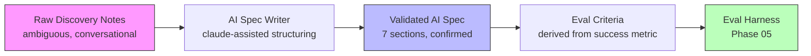

# Discovery: Vague Ask to AI Spec

> If you cannot write a measurable success metric, you do not have enough information to build.

**Type:** Build
**Languages:** Python
**Prerequisites:** 11-01 What an FDE Actually Does, 11-02 Scoping Before Solving
**Time:** ~60 min
**Phase:** 11 - FDE Skillset

## Learning Objectives

- Describe the 7 sections of an AI spec and explain why each one must be written before code
- Use Claude to help structure raw discovery notes into a complete AI spec
- Identify when a discovery call has produced insufficient information to write a spec
- Apply the spec writer to a realistic scenario end-to-end
- Explain how the success metric in the spec becomes the eval criterion in Phase 05

---

## The Problem

You finish a 45-minute discovery call with a customer. You have three pages of notes. You understand the problem intuitively. The stakeholders are aligned, the use case is clear, and you're ready to start building.

Then you open a blank document to write up the spec and realize you don't have a clear success metric. You know what the system should do but not how to measure whether it's doing it. You don't know who signed off on the data access. You're not sure if the output format you're imagining matches what the customer actually expects.

These are not gaps you can fill in later. They are gaps that will surface as blockers at the worst possible moment: during a demo, during handoff, or when you try to run the eval. The AI spec exists to force these questions to the surface before the build starts. It is not documentation: it is a structured thinking tool that converts discovery notes (ambiguous, conversational, incomplete) into a buildable, evaluable, handoff-ready specification.

---

## The Concept

### From Discovery Notes to AI Spec to Eval Criteria



The spec writer bridges the gap between what the customer said (raw notes) and what the build needs (a testable specification). Claude helps suggest success metrics when the customer only gave a direction, and surfaces unknowns that the notes don't address.

### The 7 Sections of an AI Spec

Every AI spec must have exactly these 7 sections:

```
Section              Purpose                              Blocker if missing
-------------------  -----------------------------------  ----------------------
Problem statement    Describes the pain in customer       Build may solve the
                     terms, not engineering terms         wrong problem

Success metric       Measurable target + baseline +       Cannot evaluate if
                     time horizon + data source           system worked

Input/output         What goes in, what comes out,        Integration surprises
contract             in what format                       post-build

Data sources         Owner, system, format,               Week-2 data blocker
                     access path

Integration points   Where output lands, who acts         Output format mismatch
                     on it, error handling                at demo

Risks and unknowns   Unresolved questions that            Silent failure in
                     could affect the build               production

Out of scope         What this system will NOT do         Scope creep post-demo
```

### Why the Spec Must Come Before Code

The spec is not a bureaucratic requirement. It is a forcing function that makes three things happen:

1. **Disagreements surface early.** Stakeholders who read a written spec often discover they had different mental models. "Oh, I thought we were classifying tickets, not drafting responses" is a conversation you want in day 2, not day 12.

2. **The eval criterion is established before the prototype.** The success metric in the spec becomes the eval score. Engineers who write evals before the spec reverse-engineer the metric from the prototype's behavior, which means the eval measures what the system does, not what the customer needs.

3. **Handoff is pre-planned.** The spec's "integration points" and "risks" sections become the handoff checklist. A team receiving the system can read the spec and know exactly how the system was intended to work.

---

## Build It

Build a spec writer that takes rough notes from a discovery call and uses Claude to help structure them into the 7-section AI spec format. The tool detects missing sections, suggests measurable success metrics when only a direction is given, and flags unresolved questions.

```python
# The spec writer sends notes to Claude with a structured prompt
# and parses the response into the 7 spec sections.

SPEC_SYSTEM_PROMPT = """You are an AI spec writer for a Forward-Deployed Engineering team.
Your job is to take rough discovery notes and structure them into a formal AI spec.

The AI spec has exactly 7 sections:
1. Problem Statement
2. Success Metric (must include: number, baseline, time horizon, measurement source)
3. Input/Output Contract
4. Data Sources
5. Integration Points
6. Risks and Unknowns
7. Out of Scope

Rules:
- If the notes don't contain a specific success metric, suggest one based on the problem
  and flag it as [SUGGESTED - needs customer confirmation]
- If a section has no information in the notes, write [UNKNOWN - must resolve before build]
- Do not invent facts. Only suggest metrics from information present in the notes.
- Be concise: each section should be 1-3 sentences or bullet points.
"""
```

Run the spec writer:

```bash
python main.py --notes discovery-notes.txt
python main.py --notes discovery-notes.txt --output spec.json
python main.py --interactive  # type notes directly
```

Sample output (from messy discovery notes about a support ticket system):

```
=== AI SPEC ===

1. PROBLEM STATEMENT
Support agents manually read and respond to 300+ tickets per day. Tier 1
tickets (password resets, account questions) take an average of 8 minutes
each. Experienced agents take 2 minutes. The gap = training lag + no
decision support for new agents.

2. SUCCESS METRIC
[SUGGESTED - needs customer confirmation]
Reduce average response time for Tier 1 tickets from 8 minutes to under 3
minutes for agents in their first 90 days. Measured via Zendesk average
handle time report. Target: 90-day rolling average below 3 min by end of Q2.

3. INPUT/OUTPUT CONTRACT
Input: Zendesk ticket JSON (subject, body, customer tier, open timestamp)
Output: JSON with fields: suggested_category (string), confidence (0-1),
        draft_response (string), flags (list)

4. DATA SOURCES
[UNKNOWN - must resolve before build]
Assumed: Zendesk ticket history (18 months).
Owner: Not confirmed. Ask: Who is the Zendesk admin?
Access path: API key required. IT approval unknown.

5. INTEGRATION POINTS
AI output appears in Zendesk sidebar (app or browser extension TBD).
Agent reviews and clicks to apply category and response draft.
Human review step confirmed: no auto-send.

6. RISKS AND UNKNOWNS
- Zendesk plan tier: does it support custom sidebar apps?
- PII in ticket bodies: what is the data handling policy?
- Model latency: must be under 2 seconds for agent UX.
- Customer language: English only confirmed, but 15% of tickets may be Spanish.

7. OUT OF SCOPE
Auto-send responses. Tier 2 routing. Billing inquiries. Non-English tickets.

=== FLAGS (resolve before build) ===
  * Section 2: Success metric not confirmed by customer.
  * Section 4: Data owner and access path not confirmed.
  * Section 6: 4 open risks need resolution.
```

> **Real-world check:** You run the spec writer and Section 2 is flagged as [SUGGESTED]. The Claude-generated success metric says "reduce response time from 8 minutes to under 3 minutes." The customer hasn't confirmed this number. What do you do before starting the build? You email the customer a single question: "We are planning to measure success as reducing average Tier 1 response time from 8 minutes to under 3 minutes within 90 days. Does that match your expectation?" One email, one confirmation. If they say no, you have a scoping conversation. If they say yes, you have a signed-off eval criterion. A spec with an unconfirmed success metric is a guess about what the customer values.

The full implementation is in `code/main.py`. It uses the Anthropic SDK to call Claude, parses the structured response, detects flags, and exports JSON or markdown.

---

## Use It

Write a spec for a realistic scenario end-to-end.

**Scenario:** A fintech company wants to use AI to help their compliance team review loan applications. A loan officer currently reads a 20-page application PDF and checks 12 risk criteria manually. It takes 45 minutes per application. They review 50 applications per day.

**Discovery notes (raw):**
```
- Team: 8 compliance officers, 50 apps/day
- Each app is a PDF, 15-25 pages
- Currently takes 45 min per app, manual checklist
- Checklist has 12 criteria (income ratio, collateral, credit history, etc.)
- They want to go faster
- Data: 3 years of historical apps in S3
- Owner of S3: DevOps, Sam Rodriguez
- Integration: they use an internal dashboard built in React
- Want AI to pre-fill the checklist, human still makes final call
- Worried about wrong answers on edge cases
- Definitely not for mortgage applications, just personal loans
```

Run:
```bash
python main.py --notes loan-review-notes.txt --output loan-spec.json
```

The tool produces a spec with:
- Problem statement from the notes
- Suggested success metric: "Reduce average compliance review time from 45 minutes to under 15 minutes per application, measured via dashboard time-tracking, within 60 days"
- I/O contract: PDF input, JSON checklist output with confidence scores
- Data source: S3, owner confirmed (Sam Rodriguez), access path TBD
- Integration: React dashboard, API endpoint to pre-fill checklist
- Risks: PDF parsing quality, edge case accuracy on unusual documents
- Out of scope: Mortgage applications, final approval decisions

Flag count: 1 (success metric suggested, not confirmed).

> **Perspective shift:** A project manager might read this spec and say it looks like a standard requirements document they've seen a hundred times. The difference is the success metric doubles as an eval criterion. In Phase 05, the eval harness runs 50 historical applications through the system and checks whether review time dropped to under 15 minutes. The spec didn't just describe the system; it defined what "working" means. Without that, eval is a matter of opinion. With it, eval is a test that passes or fails.

---

## Ship It

The reusable artifact for this lesson is `outputs/prompt-ai-spec-template.md`: a blank AI spec template with section headers, prompts for each section, and the flags checklist. Use it manually when Claude is not available, or as the output format for the spec writer CLI.

---

## Evaluate It

How to know the spec writer is producing quality specs:

1. **Flag count before first build cycle** - a well-scoped discovery call produces a spec with 0-1 flags. A spec with 3+ flags means discovery was incomplete. Track average flag count per spec across engagements.

2. **Success metric confirmed rate** - what percentage of specs have a customer-confirmed success metric before the build starts? Target: 100%. Any engagement that starts building with a suggested-not-confirmed metric is at risk of building toward the wrong goal.

3. **Spec-to-eval coverage** - after the eval harness is built, does it directly test the spec's success metric? A spec that says "reduce review time to under 15 minutes" should have an eval that measures review time. If the eval tests something else, the spec was not used.

4. **Post-handoff alignment check** - ask the receiving team at handoff: "Does the system match the spec?" Discrepancies reveal either a build drift (the system drifted from the spec during development) or a spec gap (the spec missed something important). Track both.
