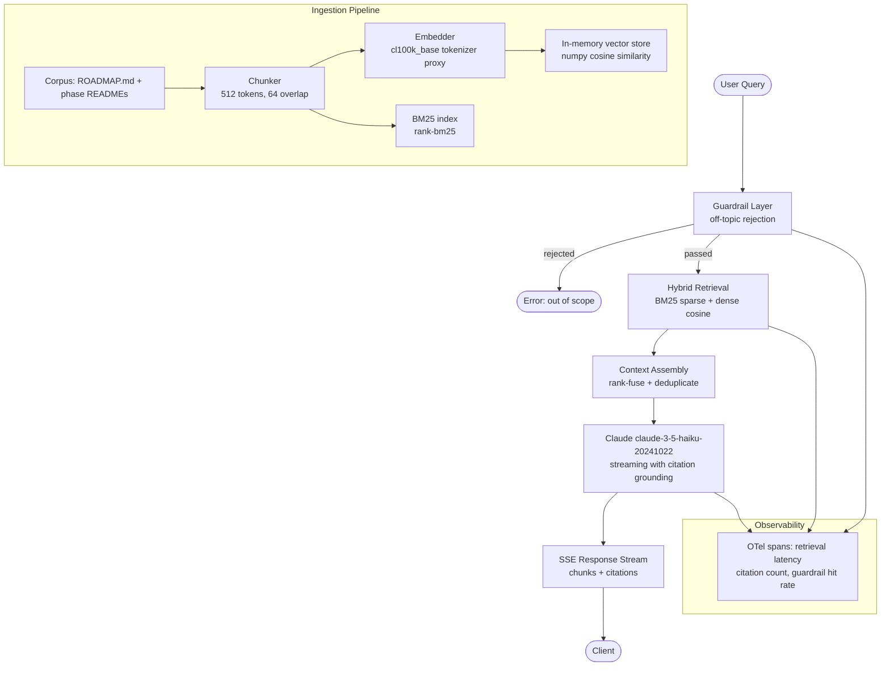

# مساعد RAG إنتاجي فوق مجموعة وثائق حقيقية

> مساعد RAG لا ينتهي عمله عندما يجيب إجابةً صحيحة. ينتهي عمله عندما يجيب بصورة صحيحة، ويُسنِد إجاباته إلى مصادرها، ويتعامل مع الأعطال بسلاسة، ويكلّف ما تتوقعه بالضبط.

**النوع:** بناء
**اللغات:** Python
**المتطلبات:** المراحل 00، 01، 02، 05، 06، 07، 08
**الوقت:** ~4 ساعات
**المرحلة:** 12 · المشاريع الختامية (Capstones)

**أهداف التعلّم:**
- بناء خط معالجة RAG كامل فوق مجموعة وثائق حقيقية باستخدام الاسترجاع الهجين BM25 + الكثيف (dense)
- بث الاستجابات عبر Server-Sent Events مع إسناد كل جزء (chunk) إلى مصدره (citation grounding)
- فرض حاجز حماية (guardrail) للأسئلة الخارجة عن الموضوع قبل الاسترجاع للتحكم في النطاق والتكلفة
- تجهيز خط المعالجة الكامل بقياسات spans عبر OpenTelemetry
- تشغيل ثلاثية RAG (RAG Triad): صلة الإجابة (answer relevance)، ودقة السياق (context precision)، والأمانة (faithfulness)، مقابل مجموعة استعلامات ذهبية (golden query set)

---

## المشكلة

أنهيت جميع دروس المرحلة 02. أنت تفهم التقطيع (chunking) والتضمين (embedding) ومخازن المتجهات (vector stores) و RAG البسيط (naive) والاسترجاع الهجين (hybrid). والآن يأتي السؤال الذي يواجهه كل مهندس في نهاية المطاف: كيف تحوّل هذه المعرفة إلى نظام تشغّله فعلاً في الإنتاج؟

نظام RAG الإنتاجي له ملف أعطال مختلف عن RAG في الدروس التعليمية. في الدرس، تختبر 5 استعلامات وتبدو كلها جيدة. أما في الإنتاج، فتكتشف: أن النموذج يفبرك استشهادات (citations) عندما لا يكون متأكداً، وأن الخدمة تنهار عندما يكون واجهة التضمين (embedding API) الخلفية بطيئة، وأن أحدهم يطلب منه كتابة خطاب زفافه فيمتثل بسرور (مهدراً الرموز/tokens على محتوى لا قيمة له)، وأنك لا تملك أدنى فكرة عن أي استدعاءات الاسترجاع تفشل ولماذا.

يدمج هذا المشروع الختامي كل شيء: استيعاب مجموعة الوثائق (corpus ingestion)، والاسترجاع الهجين، والبث مع إسناد المصادر، وطبقة حاجز الحماية، وقابلية الملاحظة (observability)، ودليل تشغيل للنشر (runbook). ومجموعة الوثائق هي توثيق هذا المنهج نفسه، ما يعني أنك تستطيع تقييمه مقابل أسئلة تعرف إجاباتها مسبقاً.

الهدف ليس عرضاً تجريبياً. الهدف خدمة تستطيع تسليمها لزميل وتقول له: هكذا تشغّلها، وهكذا تعيد الفهرسة عندما تُحدَّث الوثائق، وهكذا تعرف إن توقفت عن العمل، وهذه تكلفتها لكل استعلام.

---

## المفهوم

### البنية الكاملة

يمر كل طلب عبر خمس طبقات. كانت كل طبقة درساً منفصلاً في المراحل 02 و06 و07 و08. وهذا المشروع الختامي يصل بينها جميعاً.



### كيف تُسهم كل مرحلة سابقة

```
Phase 00 (Setup)       - uv environment, Dockerfile patterns
Phase 01 (Prompting)   - system prompt design, citation grounding instructions
Phase 02 (RAG)         - chunking, embedding, BM25, hybrid fusion
Phase 05 (Evaluation)  - RAG Triad, golden query set, RAGAS framework
Phase 06 (Shipping)    - FastAPI service, SSE streaming, health endpoint
Phase 07 (Observability) - OTel spans, latency histograms, cost tracking
Phase 08 (Security)    - off-topic guardrail, input sanitization
```

### الاسترجاع الهجين ودمج الترتيب (Rank Fusion)

يلتقط BM25 المطابقات الحرفية للكلمات المفتاحية. ويلتقط الاسترجاع الكثيف (dense) التشابه الدلالي. ولا يكفي أيٌّ منهما وحده. ويجمع دمج الترتيب المتبادل (Reciprocal Rank Fusion - RRF) بينهما دون الحاجة إلى معايرة وتطبيع الدرجات.

```
RRF score(d) = sum over each ranker r of: 1 / (k + rank_r(d))
where k = 60 (constant that smooths high-rank dominance)
```

المستند الذي يحتل المرتبة الثالثة في BM25 والخامسة في الكثيف يسجّل درجة أعلى من مستند يحتل المرتبة الأولى في مرتِّب واحد فقط. الدمج تجميعي ويعمل على القوائم (listwise)، ما يعني أنك لست بحاجة أبداً إلى مواءمة مقاييس الدرجات بين نظامي الاسترجاع.

---

## البناء

### الخطوة 1: استيعاب مجموعة الوثائق

يقرأ خط الاستيعاب كل ملف Markdown تحت `phases/` ويقسّمه إلى أجزاء (chunks) متداخلة. وفي الوضع التجريبي يمسح دليل المستودع الفعلي. ويخزّن كل جزء مسار ملفه المصدر وإزاحة الأحرف (character offset) لبناء الاستشهادات.

```python
import os
import re
import json
import math
import numpy as np
from pathlib import Path
from typing import Iterator

CHUNK_SIZE = 512      # characters (not tokens for simplicity)
CHUNK_OVERLAP = 64

def iter_corpus_files(root: str) -> Iterator[tuple[str, str]]:
    """Yield (filepath, content) for every .md file under root."""
    for path in Path(root).rglob("*.md"):
        try:
            yield str(path), path.read_text(encoding="utf-8", errors="ignore")
        except Exception:
            continue

def chunk_text(text: str, size: int = CHUNK_SIZE, overlap: int = CHUNK_OVERLAP) -> list[str]:
    chunks = []
    start = 0
    while start < len(text):
        end = min(start + size, len(text))
        chunks.append(text[start:end])
        start += size - overlap
    return chunks

def build_corpus(root: str) -> list[dict]:
    """Return list of {id, text, source} dicts."""
    docs = []
    for filepath, content in iter_corpus_files(root):
        for i, chunk in enumerate(chunk_text(content)):
            docs.append({
                "id": f"{filepath}::{i}",
                "text": chunk,
                "source": filepath,
            })
    return docs
```

### الخطوة 2: فهرسة BM25 + الكثيف

يستخدم BM25 مكتبة `rank_bm25`. وتستخدم الفهرسة الكثيفة وكيلاً خفيفاً للتضمين: في النشر الحقيقي، استبدله بعميل تضمينات Voyage AI أو OpenAI. وفي الوضع التجريبي، التضمين متجه TF-IDF لتكرار الأحرف يُحسب بـ numpy.

```python
from rank_bm25 import BM25Okapi

def tokenize(text: str) -> list[str]:
    return re.findall(r'\w+', text.lower())

def build_bm25_index(docs: list[dict]) -> BM25Okapi:
    corpus = [tokenize(d["text"]) for d in docs]
    return BM25Okapi(corpus)

def embed_text(text: str, vocab_size: int = 512) -> np.ndarray:
    """Demo embedding: bag-of-chars frequency vector, L2-normalized."""
    vec = np.zeros(vocab_size, dtype=np.float32)
    for ch in text:
        vec[ord(ch) % vocab_size] += 1.0
    norm = np.linalg.norm(vec)
    return vec / norm if norm > 0 else vec

def build_dense_index(docs: list[dict]) -> np.ndarray:
    """Return matrix of shape (n_docs, vocab_size)."""
    return np.stack([embed_text(d["text"]) for d in docs])
```

### الخطوة 3: الاسترجاع الهجين باستخدام RRF

```python
def hybrid_search(query: str, docs: list[dict],
                  bm25: BM25Okapi, dense_matrix: np.ndarray,
                  top_k: int = 5, rrf_k: int = 60) -> list[dict]:
    tokens = tokenize(query)
    bm25_scores = bm25.get_scores(tokens)
    bm25_ranks = np.argsort(-bm25_scores)

    q_vec = embed_text(query)
    cosine_scores = dense_matrix @ q_vec
    dense_ranks = np.argsort(-cosine_scores)

    # Reciprocal Rank Fusion
    rrf_scores: dict[int, float] = {}
    for rank, idx in enumerate(bm25_ranks):
        rrf_scores[int(idx)] = rrf_scores.get(int(idx), 0.0) + 1.0 / (rrf_k + rank + 1)
    for rank, idx in enumerate(dense_ranks):
        rrf_scores[int(idx)] = rrf_scores.get(int(idx), 0.0) + 1.0 / (rrf_k + rank + 1)

    top_indices = sorted(rrf_scores, key=rrf_scores.__getitem__, reverse=True)[:top_k]
    return [docs[i] for i in top_indices]
```

### الخطوة 4: حاجز حماية الأسئلة الخارجة عن الموضوع

يعمل حاجز الحماية قبل الاسترجاع. وهو فحص بسيط للكلمات المفتاحية + التضمين: إذا لم يكن للاستعلام أي تقاطع مع مفردات المنهج ولا تشابه دلالي مع مركز ثقل مجموعة الوثائق (corpus centroid)، فارفضه. وفي الإنتاج، استبدله باستدعاء مصنِّف (classifier) مخصص.

```python
CURRICULUM_KEYWORDS = {
    "rag", "agent", "llm", "prompt", "embedding", "vector", "retrieval",
    "evaluation", "fine-tuning", "observability", "tool", "mcp", "guardrail",
    "fastapi", "anthropic", "claude", "lesson", "phase", "capstone",
    "python", "typescript", "shipping", "multimodal", "security",
}

def is_on_topic(query: str) -> bool:
    words = set(tokenize(query))
    overlap = words & CURRICULUM_KEYWORDS
    if overlap:
        return True
    # Fallback: check embedding similarity to a fixed "curriculum" phrase
    curriculum_vec = embed_text("applied AI engineering curriculum lessons phases")
    q_vec = embed_text(query)
    similarity = float(np.dot(q_vec, curriculum_vec))
    return similarity > 0.85
```

### الخطوة 5: خدمة FastAPI للبث مع إسناد المصادر

تعرض الخدمة نقطة نهاية (endpoint) واحدة: `POST /query`. وتبث الاستجابة عبر SSE. ويحتوي كل حدث بيانات (data event) إما على جزء نصي أو على كتلة استشهاد (citation block).

```python
import anthropic
from fastapi import FastAPI, HTTPException
from fastapi.responses import StreamingResponse
from pydantic import BaseModel

app = FastAPI(title="RAG Assistant")
client = anthropic.Anthropic()

class QueryRequest(BaseModel):
    question: str
    top_k: int = 5

# Populated at startup
DOCS: list[dict] = []
BM25_INDEX = None
DENSE_MATRIX = None

def build_system_prompt(contexts: list[dict]) -> str:
    ctx_text = "\n\n---\n\n".join(
        f"[SOURCE {i+1}] {c['source']}\n{c['text']}"
        for i, c in enumerate(contexts)
    )
    return (
        "You are a teaching assistant for the appliedaifromscratch.com curriculum. "
        "Answer only based on the provided sources. "
        "After each factual claim, cite the source number in brackets like [1]. "
        "If the sources do not contain enough information to answer, say so clearly. "
        "Do not answer questions outside the AI engineering curriculum.\n\n"
        f"SOURCES:\n{ctx_text}"
    )

@app.post("/query")
async def query_endpoint(req: QueryRequest):
    if not is_on_topic(req.question):
        raise HTTPException(status_code=400, detail="Query is outside curriculum scope.")

    contexts = hybrid_search(req.question, DOCS, BM25_INDEX, DENSE_MATRIX, top_k=req.top_k)
    system = build_system_prompt(contexts)

    def event_stream():
        citations = [{"source": c["source"], "index": i+1} for i, c in enumerate(contexts)]
        yield f"data: {json.dumps({'type': 'citations', 'data': citations})}\n\n"

        with client.messages.stream(
            model="claude-3-5-haiku-20241022",
            max_tokens=1024,
            system=system,
            messages=[{"role": "user", "content": req.question}],
        ) as stream:
            for text_chunk in stream.text_stream:
                yield f"data: {json.dumps({'type': 'chunk', 'text': text_chunk})}\n\n"

        yield "data: [DONE]\n\n"

    return StreamingResponse(event_stream(), media_type="text/event-stream")

@app.get("/health")
def health():
    return {"status": "ok", "docs_indexed": len(DOCS)}
```

> **اختبار من الواقع:** مساعد RAG لديك يعطي إجابات واثقة باستشهادات مثل [1] و[2]، لكنك عند التحقق تجد أن الأجزاء المستشهد بها لا تدعم الادعاءات فعلاً. ما السببان الأرجح، وأي جزء من خط المعالجة تُصلحه أولاً؟

السببان الأرجح: أولاً، أن الاسترجاع يعيد أجزاءً مرتبطة ارتباطاً فضفاضاً تشترك في المفردات مع الاستعلام لكنها لا تحتوي على الحقيقة المحددة التي يستشهد بها النموذج (الإصلاح: شدِّد استراتيجية التقطيع، وقلّل حجم الجزء حتى يكون كل جزء أكثف موضوعياً). وثانياً، أن مطالبة النظام (system prompt) لا تأمر النموذج صراحةً بأن يستشهد فقط بالمصادر التي تدعم الادعاء مباشرة، فيستشهد النموذج بحسب الموضع لا بحسب الصلة (الإصلاح: حدّث مطالبة النظام لتقول "لا تستشهد برقم مصدر إلا إذا كان المصدر يحتوي مباشرة على دليل لذلك الادعاء المحدد"). أصلح مطالبة النظام أولاً. فهي لا تكلّف شيئاً. ثم أصلح الاسترجاع ثانياً إذا استمرت المشكلة.

---

## الاستخدام

### الانتقال إلى pgvector بنمط المحوِّل (Adapter Pattern)

يعمل مخزن المتجهات في الذاكرة جيداً مع مجموعة وثائق أقل من ~10,000 جزء. أما لمجموعة أكبر، أو للاستمرارية عبر إعادة التشغيل، فاستبدله بـ pgvector بتغيير من سطر واحد عند نقطة الاستدعاء. ويُبقي نمط المحوِّل بقية الكود مطابقاً تماماً.

```python
# adapter_pgvector.py
import psycopg2
import numpy as np

class PgVectorStore:
    def __init__(self, conn_str: str, table: str = "embeddings"):
        self.conn = psycopg2.connect(conn_str)
        self.table = table

    def search(self, query_vec: np.ndarray, top_k: int) -> list[int]:
        vec_str = "[" + ",".join(str(x) for x in query_vec.tolist()) + "]"
        cur = self.conn.cursor()
        cur.execute(
            f"SELECT id FROM {self.table} ORDER BY embedding <=> %s::vector LIMIT %s",
            (vec_str, top_k)
        )
        return [row[0] for row in cur.fetchall()]
```

في `hybrid_search`، استبدل `dense_matrix @ q_vec` بـ `pg_store.search(q_vec, top_k * 2)` وأعد ترتيب مجموعة المرشحين. يبقى فهرس BM25 دون تغيير. ويبقى دمج RRF دون تغيير.

### قياس جودة الاسترجاع باستخدام RAGAS

تقيّم RAGAS ثلاثة مكوّنات من ثلاثية RAG (RAG Triad) دون الحاجة إلى تسميات الحقيقة الأرضية (ground-truth labels) لدقة السياق والأمانة:

```python
# ragas_eval.py (conceptual - requires: pip install ragas)
from ragas import evaluate
from ragas.metrics import answer_relevancy, context_precision, faithfulness
from datasets import Dataset

# Build evaluation dataset from your golden query set
eval_data = {
    "question": [...],        # your 20 golden queries
    "answer": [...],          # model answers from your service
    "contexts": [...],        # list of retrieved chunk lists
    "ground_truth": [...],    # reference answers (for answer_relevancy)
}
dataset = Dataset.from_dict(eval_data)
results = evaluate(dataset, metrics=[answer_relevancy, context_precision, faithfulness])
print(results)
```

> **نقلة في المنظور:** يقول زميل "لسنا بحاجة إلى تقييمات (evals) لأن المستخدمين سيخبروننا عندما يتعطل النظام". ما نمط العطل المحدد الذي يغفل عنه هذا الموقف في نظام RAG؟

نمط العطل هو الانحراف الصامت في الاستشهادات (silent citation drift). يجيب النموذج إجابة صحيحة 95% من الوقت لكن الاستشهادات تصبح أقل دقة تدريجياً مع نمو مجموعة الوثائق وتداخل الأجزاء في المعنى. لا يبلّغ المستخدمون عن "كان الاستشهاد خاطئاً قليلاً" لأن الإجابة بدت صحيحة. ولا تكتشف المشكلة إلا بعد أشهر أثناء مراجعة (audit). درجة الأمانة (faithfulness) في RAGAS، عند تشغيلها أسبوعياً مقابل مجموعة ذهبية ثابتة، تلتقط هذا تلقائياً. تلتقط تغذية المستخدمين الراجعة الهلوسات (hallucinations) الخاطئة بوضوح. لكنها لا تلتقط الانحراف الخفي.

---

## التسليم

دليل تشغيل النشر موجود في `outputs/runbook-rag-assistant-deploy.md`. وهو يغطي:

- أوامر البناء والتشغيل
- متغيرات البيئة المطلوبة (`ANTHROPIC_API_KEY`، ومسار جذر مجموعة الوثائق)
- إجراء إعادة فهرسة مجموعة الوثائق (متى يُشغَّل، وكم يستغرق)
- أوامر تقييم ثلاثية RAG
- إعداد المراقبة (أي مقاييس OTel يجب التنبيه عليها)
- أنماط الأعطال المعروفة وسبل التخفيف منها

---

## التقييم

### تقييم ثلاثية RAG

شغّل 20 استعلاماً ذهبياً مقابل الخدمة المنشورة. ولكل استعلام، اجمع: السؤال، والسياقات المسترجعة، وإجابة النموذج، والإجابة المرجعية.

**صلة الإجابة (Answer Relevance):** هل تعالج الإجابة السؤال؟ الدرجة 0-1. الهدف: >= 0.85 عبر المجموعة الذهبية.

**دقة السياق (Context Precision):** هل الأجزاء المسترجعة ذات صلة فعلاً؟ الدرجة 0-1. الهدف: >= 0.75. وإذا قلّت عن 0.75، فالاسترجاع مزعج (noisy)؛ شدِّد `top_k` أو حسّن التقطيع.

**الأمانة (Faithfulness):** هل تقتصر الإجابة على ادعاءات تدعمها السياقات المسترجعة؟ الدرجة 0-1. الهدف: >= 0.90. وإذا قلّت عن 0.90، فالنموذج يهلوس خارج السياق؛ عزّز قيود مطالبة النظام.

### فحص دقة الاستشهادات

لكل رقم مصدر مستشهد به في الإجابة، تحقق برمجياً من أن نص الجزء المستشهد به يحتوي على سلسلة فرعية (substring) تدعم الادعاء. يكون الاستشهاد دقيقاً إذا كان حاضراً وذا صلة مباشرة. الهدف: >= 0.90 دقة الاستشهادات.

### التكلفة لكل استعلام

سجّل `input_tokens` و`output_tokens` من كل استدعاء API. وبتسعير Haiku، يكلّف استعلام RAG نموذجي بخمسة أجزاء مسترجعة أقل من 0.002 دولار. وإذا تجاوز متوسطك 0.005 دولار، فنافذة السياق (context window) كبيرة جداً: قلّل `top_k` أو قلّل حجم الجزء.

### نجاح/فشل المجموعة الذهبية المكوّنة من 20 استعلاماً

```
Query 1:  "What phases cover evaluation?"            -> PASS/FAIL
Query 2:  "Which lesson teaches BM25 retrieval?"     -> PASS/FAIL
Query 3:  "What is the difference between P04 and P05?" -> PASS/FAIL
...
Query 20: "What does the FDE skillset phase cover?"  -> PASS/FAIL
```

التقرير: عدد N من أصل 20 استعلاماً تجتاز مقاييس ثلاثية RAG الثلاثة في آن واحد. الهدف: 16/20 (80%).
