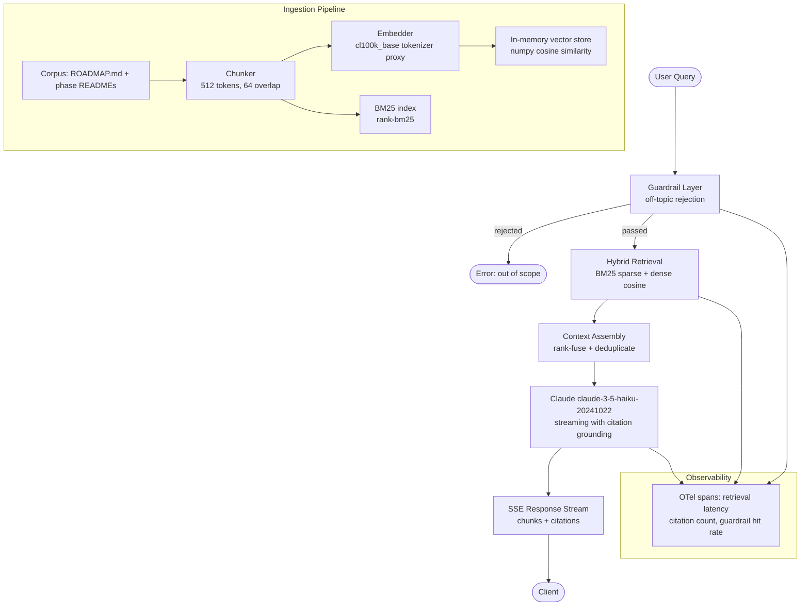

# Production RAG Assistant Over a Real Corpus

> A RAG assistant is not done when it answers correctly. It is done when it answers correctly, cites its sources, handles failures gracefully, and costs what you expect.

**Type:** Build
**Languages:** Python
**Prerequisites:** Phases 00, 01, 02, 05, 06, 07, 08
**Time:** ~4 hours
**Phase:** 12 · Capstones

**Learning Objectives:**
- Build a complete RAG pipeline over a real corpus using hybrid BM25 + dense retrieval
- Stream responses via Server-Sent Events with per-chunk citation grounding
- Enforce an off-topic guardrail before retrieval to control scope and cost
- Instrument the full pipeline with OpenTelemetry spans
- Run the RAG Triad (answer relevance, context precision, faithfulness) against a golden query set

---

## THE PROBLEM

You have completed all Phase 02 lessons. You understand chunking, embedding, vector stores, naive RAG, and hybrid retrieval. Now comes the question every engineer eventually faces: how do you turn that knowledge into a system you would actually run in production?

Production RAG has a different failure profile than tutorial RAG. In a tutorial, you test 5 queries and they all look good. In production, you discover: the model fabricates citations when it is unsure, the service falls over when the upstream embedding API is slow, someone asks it to write their wedding speech and it happily complies (burning tokens on garbage), and you have no idea which retrieval calls are failing or why.

This capstone integrates everything: corpus ingestion, hybrid retrieval, streaming with citation grounding, a guardrail layer, observability, and a deployment runbook. The corpus is this curriculum's own documentation, which means you can evaluate it against questions you know the answers to.

The goal is not a demo. The goal is a service you could hand to a colleague and say: here is how to run it, here is how to re-index when the docs update, here is how to know if it stops working, and here is what it costs per query.

---

## THE CONCEPT

### Full Architecture

Every request flows through five layers. Each layer was a separate lesson in Phases 02, 06, 07, and 08. This capstone wires them together.



### How Each Prior Phase Contributes

```
Phase 00 (Setup)       - uv environment, Dockerfile patterns
Phase 01 (Prompting)   - system prompt design, citation grounding instructions
Phase 02 (RAG)         - chunking, embedding, BM25, hybrid fusion
Phase 05 (Evaluation)  - RAG Triad, golden query set, RAGAS framework
Phase 06 (Shipping)    - FastAPI service, SSE streaming, health endpoint
Phase 07 (Observability) - OTel spans, latency histograms, cost tracking
Phase 08 (Security)    - off-topic guardrail, input sanitization
```

### Hybrid Retrieval and Rank Fusion

BM25 captures exact keyword matches. Dense retrieval captures semantic similarity. Neither is sufficient alone. Reciprocal Rank Fusion (RRF) combines both without requiring calibrated score normalization.

```
RRF score(d) = sum over each ranker r of: 1 / (k + rank_r(d))
where k = 60 (constant that smooths high-rank dominance)
```

A document that ranks 3rd in BM25 and 5th in dense scores higher than one that ranks 1st in only one ranker. The fusion is additive and listwise, which means you never need to align score scales between the two retrieval systems.

---

## BUILD IT

### Step 1: Corpus Ingestion

The ingestion pipeline reads every Markdown file under `phases/` and splits it into overlapping chunks. In demo mode it scans the actual repo directory. Each chunk stores its source file path and character offset for citation construction.

```python
import os
import re
import json
import math
import numpy as np
from pathlib import Path
from typing import Iterator

CHUNK_SIZE = 512      # characters (not tokens for simplicity)
CHUNK_OVERLAP = 64

def iter_corpus_files(root: str) -> Iterator[tuple[str, str]]:
    """Yield (filepath, content) for every .md file under root."""
    for path in Path(root).rglob("*.md"):
        try:
            yield str(path), path.read_text(encoding="utf-8", errors="ignore")
        except Exception:
            continue

def chunk_text(text: str, size: int = CHUNK_SIZE, overlap: int = CHUNK_OVERLAP) -> list[str]:
    chunks = []
    start = 0
    while start < len(text):
        end = min(start + size, len(text))
        chunks.append(text[start:end])
        start += size - overlap
    return chunks

def build_corpus(root: str) -> list[dict]:
    """Return list of {id, text, source} dicts."""
    docs = []
    for filepath, content in iter_corpus_files(root):
        for i, chunk in enumerate(chunk_text(content)):
            docs.append({
                "id": f"{filepath}::{i}",
                "text": chunk,
                "source": filepath,
            })
    return docs
```

### Step 2: BM25 + Dense Indexing

BM25 uses the `rank_bm25` library. Dense indexing uses a lightweight embedding proxy: for a real deployment, swap in the Voyage AI or OpenAI embeddings client. In demo mode, the embedding is a character-frequency TF-IDF vector computed with numpy.

```python
from rank_bm25 import BM25Okapi

def tokenize(text: str) -> list[str]:
    return re.findall(r'\w+', text.lower())

def build_bm25_index(docs: list[dict]) -> BM25Okapi:
    corpus = [tokenize(d["text"]) for d in docs]
    return BM25Okapi(corpus)

def embed_text(text: str, vocab_size: int = 512) -> np.ndarray:
    """Demo embedding: bag-of-chars frequency vector, L2-normalized."""
    vec = np.zeros(vocab_size, dtype=np.float32)
    for ch in text:
        vec[ord(ch) % vocab_size] += 1.0
    norm = np.linalg.norm(vec)
    return vec / norm if norm > 0 else vec

def build_dense_index(docs: list[dict]) -> np.ndarray:
    """Return matrix of shape (n_docs, vocab_size)."""
    return np.stack([embed_text(d["text"]) for d in docs])
```

### Step 3: Hybrid Retrieval with RRF

```python
def hybrid_search(query: str, docs: list[dict],
                  bm25: BM25Okapi, dense_matrix: np.ndarray,
                  top_k: int = 5, rrf_k: int = 60) -> list[dict]:
    tokens = tokenize(query)
    bm25_scores = bm25.get_scores(tokens)
    bm25_ranks = np.argsort(-bm25_scores)

    q_vec = embed_text(query)
    cosine_scores = dense_matrix @ q_vec
    dense_ranks = np.argsort(-cosine_scores)

    # Reciprocal Rank Fusion
    rrf_scores: dict[int, float] = {}
    for rank, idx in enumerate(bm25_ranks):
        rrf_scores[int(idx)] = rrf_scores.get(int(idx), 0.0) + 1.0 / (rrf_k + rank + 1)
    for rank, idx in enumerate(dense_ranks):
        rrf_scores[int(idx)] = rrf_scores.get(int(idx), 0.0) + 1.0 / (rrf_k + rank + 1)

    top_indices = sorted(rrf_scores, key=rrf_scores.__getitem__, reverse=True)[:top_k]
    return [docs[i] for i in top_indices]
```

### Step 4: Off-Topic Guardrail

The guardrail runs before retrieval. It is a simple keyword + embedding check: if the query has zero overlap with curriculum vocabulary and no semantic similarity to the corpus centroid, reject it. In production, replace with a dedicated classifier call.

```python
CURRICULUM_KEYWORDS = {
    "rag", "agent", "llm", "prompt", "embedding", "vector", "retrieval",
    "evaluation", "fine-tuning", "observability", "tool", "mcp", "guardrail",
    "fastapi", "anthropic", "claude", "lesson", "phase", "capstone",
    "python", "typescript", "shipping", "multimodal", "security",
}

def is_on_topic(query: str) -> bool:
    words = set(tokenize(query))
    overlap = words & CURRICULUM_KEYWORDS
    if overlap:
        return True
    # Fallback: check embedding similarity to a fixed "curriculum" phrase
    curriculum_vec = embed_text("applied AI engineering curriculum lessons phases")
    q_vec = embed_text(query)
    similarity = float(np.dot(q_vec, curriculum_vec))
    return similarity > 0.85
```

### Step 5: Streaming FastAPI Service with Citation Grounding

The service exposes one endpoint: `POST /query`. It streams the response via SSE. Each data event contains either a text chunk or a citation block.

```python
import anthropic
from fastapi import FastAPI, HTTPException
from fastapi.responses import StreamingResponse
from pydantic import BaseModel

app = FastAPI(title="RAG Assistant")
client = anthropic.Anthropic()

class QueryRequest(BaseModel):
    question: str
    top_k: int = 5

# Populated at startup
DOCS: list[dict] = []
BM25_INDEX = None
DENSE_MATRIX = None

def build_system_prompt(contexts: list[dict]) -> str:
    ctx_text = "\n\n---\n\n".join(
        f"[SOURCE {i+1}] {c['source']}\n{c['text']}"
        for i, c in enumerate(contexts)
    )
    return (
        "You are a teaching assistant for the appliedaifromscratch.com curriculum. "
        "Answer only based on the provided sources. "
        "After each factual claim, cite the source number in brackets like [1]. "
        "If the sources do not contain enough information to answer, say so clearly. "
        "Do not answer questions outside the AI engineering curriculum.\n\n"
        f"SOURCES:\n{ctx_text}"
    )

@app.post("/query")
async def query_endpoint(req: QueryRequest):
    if not is_on_topic(req.question):
        raise HTTPException(status_code=400, detail="Query is outside curriculum scope.")

    contexts = hybrid_search(req.question, DOCS, BM25_INDEX, DENSE_MATRIX, top_k=req.top_k)
    system = build_system_prompt(contexts)

    def event_stream():
        citations = [{"source": c["source"], "index": i+1} for i, c in enumerate(contexts)]
        yield f"data: {json.dumps({'type': 'citations', 'data': citations})}\n\n"

        with client.messages.stream(
            model="claude-3-5-haiku-20241022",
            max_tokens=1024,
            system=system,
            messages=[{"role": "user", "content": req.question}],
        ) as stream:
            for text_chunk in stream.text_stream:
                yield f"data: {json.dumps({'type': 'chunk', 'text': text_chunk})}\n\n"

        yield "data: [DONE]\n\n"

    return StreamingResponse(event_stream(), media_type="text/event-stream")

@app.get("/health")
def health():
    return {"status": "ok", "docs_indexed": len(DOCS)}
```

> **Real-world check:** Your RAG assistant is giving confident answers with citations like [1] and [2], but when you check, the cited chunks do not actually support the claims. What are the two most likely causes, and which part of the pipeline do you fix first?

The two most likely causes: first, the retrieval is returning loosely related chunks that share vocabulary with the query but do not contain the specific fact the model is citing (fix: tighten chunking strategy, reduce chunk size so each chunk is more topically dense). Second, the system prompt does not explicitly tell the model to only cite sources that directly support the claim, so the model cites by position rather than by relevance (fix: update system prompt to say "only cite a source number if the source directly contains evidence for that specific claim"). Fix the system prompt first. It costs nothing. Fix the retrieval second if the problem persists.

---

## USE IT

### Swapping to pgvector with an Adapter Pattern

The in-memory vector store works for a corpus under ~10,000 chunks. For a larger corpus, or for persistence across restarts, swap in pgvector with a one-line change at the call site. The adapter pattern keeps the rest of the code identical.

```python
# adapter_pgvector.py
import psycopg2
import numpy as np

class PgVectorStore:
    def __init__(self, conn_str: str, table: str = "embeddings"):
        self.conn = psycopg2.connect(conn_str)
        self.table = table

    def search(self, query_vec: np.ndarray, top_k: int) -> list[int]:
        vec_str = "[" + ",".join(str(x) for x in query_vec.tolist()) + "]"
        cur = self.conn.cursor()
        cur.execute(
            f"SELECT id FROM {self.table} ORDER BY embedding <=> %s::vector LIMIT %s",
            (vec_str, top_k)
        )
        return [row[0] for row in cur.fetchall()]
```

In `hybrid_search`, replace `dense_matrix @ q_vec` with `pg_store.search(q_vec, top_k * 2)` and rerank the candidate set. The BM25 index stays unchanged. The RRF fusion stays unchanged.

### Measuring Retrieval Quality with RAGAS

RAGAS evaluates three components of the RAG Triad without requiring ground-truth labels for context precision and faithfulness:

```python
# ragas_eval.py (conceptual - requires: pip install ragas)
from ragas import evaluate
from ragas.metrics import answer_relevancy, context_precision, faithfulness
from datasets import Dataset

# Build evaluation dataset from your golden query set
eval_data = {
    "question": [...],        # your 20 golden queries
    "answer": [...],          # model answers from your service
    "contexts": [...],        # list of retrieved chunk lists
    "ground_truth": [...],    # reference answers (for answer_relevancy)
}
dataset = Dataset.from_dict(eval_data)
results = evaluate(dataset, metrics=[answer_relevancy, context_precision, faithfulness])
print(results)
```

> **Perspective shift:** A colleague says "we do not need evals since users will tell us when it breaks." What is the specific failure mode this attitude misses in a RAG system?

Silent citation drift is the failure mode. The model answers correctly 95% of the time but the citations slowly become less accurate as the corpus grows and chunks overlap in meaning. Users do not report "the citation was slightly wrong" because the answer sounded right. You only discover the problem months later during an audit. RAGAS faithfulness score, run weekly against a fixed golden set, catches this automatically. User feedback catches hallucinations that are obviously wrong. It does not catch the subtle drift.

---

## SHIP IT

The deployment runbook is in `outputs/runbook-rag-assistant-deploy.md`. It covers:

- Build and run commands
- Required environment variables (`ANTHROPIC_API_KEY`, corpus root path)
- Corpus re-indexing procedure (when to trigger, how long it takes)
- RAG Triad eval commands
- Monitoring setup (which OTel metrics to alert on)
- Known failure modes and mitigations

---

## EVALUATE IT

### RAG Triad Evaluation

Run 20 golden queries against the deployed service. For each query, collect: the question, the retrieved contexts, the model answer, and the reference answer.

**Answer Relevance:** Does the answer address the question? Score 0-1. Target: >= 0.85 across the golden set.

**Context Precision:** Are the retrieved chunks actually relevant? Score 0-1. Target: >= 0.75. If below 0.75, the retrieval is noisy; tighten `top_k` or improve chunking.

**Faithfulness:** Does the answer only make claims supported by the retrieved contexts? Score 0-1. Target: >= 0.90. If below 0.90, the model is hallucinating beyond the context; strengthen the system prompt constraints.

### Citation Accuracy Check

For each cited source number in the answer, verify programmatically that the cited chunk text contains a substring that supports the claim. A citation is accurate if it is present and directly relevant. Target: >= 0.90 citation accuracy.

### Cost Per Query

Log `input_tokens` and `output_tokens` from every API call. At Haiku pricing, a typical RAG query with 5 retrieved chunks costs under $0.002. If your average exceeds $0.005, the context window is too large: reduce `top_k` or reduce chunk size.

### 20-Query Golden Set Pass/Fail

```
Query 1:  "What phases cover evaluation?"            -> PASS/FAIL
Query 2:  "Which lesson teaches BM25 retrieval?"     -> PASS/FAIL
Query 3:  "What is the difference between P04 and P05?" -> PASS/FAIL
...
Query 20: "What does the FDE skillset phase cover?"  -> PASS/FAIL
```

Report: N/20 queries pass all three RAG Triad metrics simultaneously. Target: 16/20 (80%).
