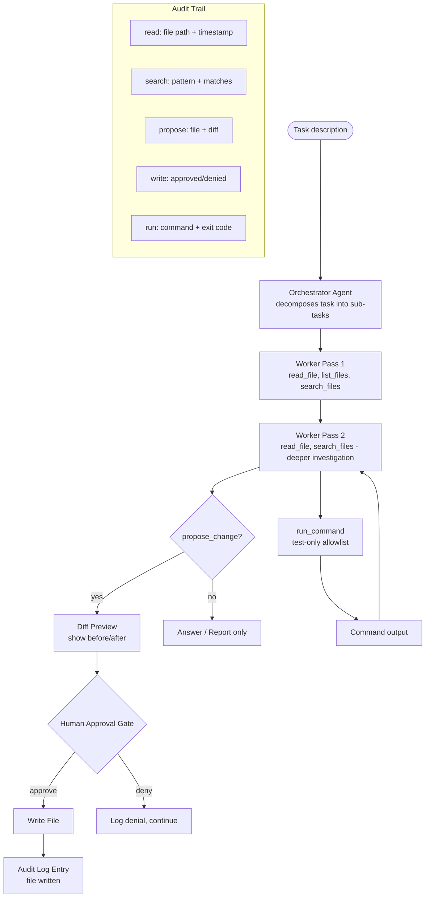

# وكيل أتمتة البرمجة (Coding Automation Agent) على مستودع حقيقي

> وكيل برمجة يستطيع كتابة الكود مفيد. ووكيل برمجة يعرف متى يتوقف ويسأل آمن.

**النوع:** بناء
**اللغات:** Python
**المتطلبات:** المراحل 03، 04، 05، 08
**الوقت:** ~4 ساعات
**المرحلة:** 12 · المشاريع الختامية (Capstones)

**أهداف التعلّم:**
- بناء وكيل برمجة بنمط المنسّق-العمّال (orchestrator-workers) بمجموعة أدوات للقراءة/البحث/الكتابة/التشغيل
- فرض بوابة موافقة على كل عمليات كتابة الملفات مع معاينة الفروق (diff preview)
- توليد أثر تدقيق (audit trail) لكل تشغيل يسجّل كل ملف قُرئ وبُحث عنه واقتُرح تعديله
- تقييم إنجاز المهام، ودقة اختيار الملفات (file selection precision)، ودقة التخطيط مقابل مجموعة اختبار من 5 مهام
- فهم أنماط الأعطال التي تميّز وكلاء البرمجة المفيدين عن المدمّرين

---

## المشكلة

مساعدو البرمجة بالذكاء الاصطناعي في كل مكان. ومعظمهم لديهم نمط العطل نفسه: يحاولون حلّ المهمة كاملةً بضربة واحدة، فيعدّلون ملفات ما كان ينبغي لمسها، ويتركون قاعدة الكود في حالة غامضة. ثم يقضي المهندس ساعة في معرفة ما تغير ولماذا.

العطل ليس مشكلة في قدرة النموذج. بل مشكلة في البنية المعمارية. وكيل برمجة يقرأ كل شيء، ويخطط صراحةً، ويقترح التغييرات مع الفروق، وينتظر موافقة بشرية قبل الكتابة هو أكثر أماناً بصورة جوهرية من وكيل يبدأ بتعديل الملفات مباشرة. وتأتي خصائص السلامة من تصميم الأدوات وبوابة الموافقة، لا من كون النموذج "حذراً".

يبني هذا المشروع الختامي وكيل برمجة لمستودع هذا المنهج نفسه. وهو يستطيع اكتشاف ما في المستودع، وقراءة الملفات، والبحث عن الأنماط، واقتراح التغييرات مع معاينة الفروق، وتشغيل أوامر الاختبار. ويُسجَّل كل ملف يقرؤه وكل تغيير يقترحه في أثر تدقيق. ولا يُكتب شيء دون موافقة بشرية صريحة. وتشمل المهام التجريبية: العثور على الدروس التي تنقصها أقسام مطلوبة، واقتراح ملف checks.json جديد.

---

## المفهوم

### بنية وكيل البرمجة

يستخدم الوكيل نمط المنسّق-العمّال (orchestrator-workers) من المرحلة 04. يقسّم المنسّق المهمة إلى مهام فرعية. وتنفّذ تمريرات العمّال (worker passes) كل مهمة فرعية بالأدوات المتاحة. وتقع بوابة الموافقة بين اقتراح الوكيل لتغيير وحدوث التغيير فعلاً.



### تصميم صلاحيات الأدوات

كل أداة في وكيل البرمجة تحمل خطورة. وملف الخطورة يحدّد متطلب الموافقة:

```
TOOL             RISK          APPROVAL    NOTES
read_file        none          auto        any path under cwd
list_files       none          auto        glob pattern only
search_files     none          auto        grep wrapper, no side effects
propose_change   write risk    HITL        shows diff, requires yes/no
run_command      exec risk     allowlist   only test/lint commands
```

بوابة الموافقة على `propose_change` تعرض فرقاً (diff) قبل أن تحدث أي كتابة. وهذا ليس اختيارياً. وكيل برمجة يكتب دون عرض فرق أولاً مسؤولية لا أصل من الأصول.

### تقسيم المنسّق-العمّال

لا يستخدم المنسّق الأدوات. بل يقرأ المهمة، ويستدل على المعلومات اللازمة، ويُخرِج خطة منظّمة. ويستخدم العامل الأدوات لتنفيذ كل خطوة. ولهذا التقسيم فائدتان: خطة المنسّق قابلة للتدقيق (تستطيع رؤية تفكيك المهمة قبل حدوث أي استدعاء أداة)، واستدعاءات أدوات العامل مؤسَّسة على خطة صريحة لا على استكشاف حرّ الشكل.

```
ORCHESTRATOR CALL:
  Input:  "Add a checks.json to lesson phases/04-agents/02-workflows-vs-agents"
  Output: {
    "steps": [
      "Read the lesson docs/en.md to understand what the lesson covers",
      "Read an existing checks.json (e.g. phases/04-agents/01-the-agent-loop/checks.json) to understand the format",
      "Generate 6-8 scenario-based questions about the lesson content",
      "Propose the new checks.json file with a diff preview"
    ]
  }

WORKER PASS:
  Executes each step in sequence using the tool set.
  Pauses at propose_change for human approval.
```

---

## البناء

### الخطوة 1: تنفيذ الأدوات

```python
import os
import re
import subprocess
import json
import difflib
from pathlib import Path

CWD = os.environ.get("AGENT_CWD", str(Path(__file__).resolve().parents[4]))
AUDIT_LOG = "agent_audit.jsonl"

# Commands allowed by run_command (test and lint only)
ALLOWED_COMMANDS = [
    re.compile(r'^python -m pytest'),
    re.compile(r'^python -m flake8'),
    re.compile(r'^grep '),
    re.compile(r'^find \.'),
    re.compile(r'^python main\.py --test'),
]

def write_audit(event: dict):
    from datetime import datetime
    entry = {"ts": datetime.utcnow().isoformat() + "Z", **event}
    with open(AUDIT_LOG, "a") as f:
        f.write(json.dumps(entry) + "\n")

def read_file(path: str) -> str:
    abs_path = os.path.normpath(os.path.join(CWD, path))
    if not abs_path.startswith(CWD):
        return "Error: path traversal outside allowed root."
    try:
        content = Path(abs_path).read_text(encoding="utf-8", errors="ignore")
        write_audit({"tool": "read_file", "path": path, "chars": len(content)})
        return content[:8000]  # truncate to avoid context overflow
    except FileNotFoundError:
        return f"File not found: {path}"
    except Exception as e:
        return f"Error reading {path}: {e}"

def list_files(pattern: str = "**/*.md") -> str:
    try:
        matches = sorted(str(p.relative_to(CWD)) for p in Path(CWD).glob(pattern))
        write_audit({"tool": "list_files", "pattern": pattern, "matches": len(matches)})
        return "\n".join(matches[:100]) or "(no matches)"
    except Exception as e:
        return f"Error: {e}"

def search_files(pattern: str, file_glob: str = "**/*.py") -> str:
    results = []
    for p in Path(CWD).glob(file_glob):
        try:
            content = p.read_text(encoding="utf-8", errors="ignore")
            for i, line in enumerate(content.splitlines(), 1):
                if re.search(pattern, line, re.IGNORECASE):
                    results.append(f"{p.relative_to(CWD)}:{i}: {line.strip()}")
        except Exception:
            continue
    write_audit({"tool": "search_files", "pattern": pattern, "matches": len(results)})
    return "\n".join(results[:50]) or "(no matches)"
```

### الخطوة 2: بوابة الموافقة

أداة `propose_change` هي قلب بنية السلامة. فهي تعرض فرقاً وتنتظر إدخالاً قبل كتابة أي شيء.

```python
def propose_change(path: str, new_content: str, reason: str) -> str:
    abs_path = os.path.normpath(os.path.join(CWD, path))
    if not abs_path.startswith(CWD):
        return "Error: path traversal blocked."

    # Generate diff
    try:
        existing = Path(abs_path).read_text(encoding="utf-8") if Path(abs_path).exists() else ""
    except Exception:
        existing = ""

    diff_lines = list(difflib.unified_diff(
        existing.splitlines(keepends=True),
        new_content.splitlines(keepends=True),
        fromfile=f"a/{path}",
        tofile=f"b/{path}",
        n=3,
    ))
    diff_text = "".join(diff_lines) or "(new file)"

    print(f"\n[PROPOSE CHANGE] {path}")
    print(f"  Reason: {reason}")
    print(f"  Diff preview:\n{diff_text[:2000]}")

    write_audit({
        "tool": "propose_change",
        "path": path,
        "reason": reason,
        "is_new_file": not Path(abs_path).exists(),
        "diff_lines": len(diff_lines),
    })

    try:
        decision = input("  Apply this change? (yes/no/view): ").strip().lower()
    except (EOFError, KeyboardInterrupt):
        decision = "no"

    if decision == "view":
        print(new_content)
        decision = input("  Apply this change? (yes/no): ").strip().lower()

    if decision in ("yes", "y"):
        Path(abs_path).parent.mkdir(parents=True, exist_ok=True)
        Path(abs_path).write_text(new_content, encoding="utf-8")
        write_audit({"tool": "write_file", "path": path, "approved": True})
        return f"File written: {path}"

    write_audit({"tool": "write_file", "path": path, "approved": False})
    return f"Change denied for: {path}"
```

### الخطوة 3: وكيل المنسّق-العمّال

```python
import anthropic

MODEL = "claude-3-5-haiku-20241022"
client = anthropic.Anthropic()

ORCHESTRATOR_SYSTEM = """You are a coding task planner. 
Given a task description and the available tools, produce a numbered list of steps 
that a coding agent should execute to complete the task.
Be specific: name files to read, patterns to search, and what the final output should be.
Output as JSON: {"steps": ["step 1", "step 2", ...]}
Do not execute any steps yourself. Only plan."""

WORKER_SYSTEM = """You are a coding agent operating on a software repository.
Complete the assigned step using the available tools.
Think step by step. Read files before modifying them.
Never propose a change without first reading the current file content.
If you are unsure, read more context before proposing anything.
"""

TOOLS = [
    {
        "name": "read_file",
        "description": "Read a file's content. Path is relative to repo root.",
        "input_schema": {
            "type": "object",
            "properties": {
                "path": {"type": "string", "description": "Relative file path from repo root"}
            },
            "required": ["path"]
        }
    },
    {
        "name": "list_files",
        "description": "List files matching a glob pattern relative to repo root.",
        "input_schema": {
            "type": "object",
            "properties": {
                "pattern": {"type": "string", "description": "Glob pattern, e.g. 'phases/**/*.md'"}
            },
            "required": ["pattern"]
        }
    },
    {
        "name": "search_files",
        "description": "Search for a regex pattern in files matching a glob. Returns matching lines with file:line format.",
        "input_schema": {
            "type": "object",
            "properties": {
                "pattern":   {"type": "string", "description": "Regex pattern to search for"},
                "file_glob": {"type": "string", "description": "Glob pattern for files to search. Default: **/*.md"}
            },
            "required": ["pattern"]
        }
    },
    {
        "name": "propose_change",
        "description": "Propose writing a file. Shows a diff and requires human approval before writing.",
        "input_schema": {
            "type": "object",
            "properties": {
                "path":        {"type": "string", "description": "Relative file path to write"},
                "new_content": {"type": "string", "description": "Complete new file content"},
                "reason":      {"type": "string", "description": "Why this change is needed"}
            },
            "required": ["path", "new_content", "reason"]
        }
    },
    {
        "name": "run_command",
        "description": "Run an allowed command (tests and linting only). Returns stdout + stderr.",
        "input_schema": {
            "type": "object",
            "properties": {
                "command": {"type": "string", "description": "Command to run (must match allowed list)"}
            },
            "required": ["command"]
        }
    }
]

TOOL_REGISTRY = {
    "read_file":     lambda args: read_file(args["path"]),
    "list_files":    lambda args: list_files(args.get("pattern", "**/*.md")),
    "search_files":  lambda args: search_files(args["pattern"], args.get("file_glob", "**/*.md")),
    "propose_change": lambda args: propose_change(args["path"], args["new_content"], args["reason"]),
    "run_command":   lambda args: run_command(args["command"]),
}
```

> **اختبار من الواقع:** ينهي وكيل البرمجة لديك مهمة ويبلّغ "حدّثت 6 ملفات". تتحقق من سجل التدقيق فتجد أنه قرأ 23 ملفاً لكن 6 فقط كانت ضرورية للمهمة. أي مقياس يلتقط هذا القصور، وأي تغيير في مطالبة النظام يقلّل القراءات غير الضرورية للملفات؟

المقياس هو دقة اختيار الملفات (file selection precision): الملفات ذات الصلة المقروءة مقسومة على إجمالي الملفات المقروءة. دقة 6/23 = 0.26 رديئة. والتغيير في مطالبة النظام: أضف تعليمة تخطيط صريحة تقول "قبل قراءة أي ملف، اذكر أي الملفات تتوقع أنك تحتاجها ولماذا، ثم اقرأ تلك فقط". وهذا يُلزم الوكيل بالالتزام بخطة استرجاع قبل تنفيذها، ما يقلّل القراءات الاستكشافية. ويمكنك أيضاً إضافة ميزانية قراءة ملفات لكل مهمة (مثل "اقرأ 8 ملفات على الأكثر") لفرض الانضباط.

---

## الاستخدام

### أدوات نظام الملفات في Claude Agent SDK

توفر Claude Agent SDK (في معاينة ميزات الوكلاء الموسّعة) أدوات نظام ملفات مكتوبة الأنواع (typed) يمكنها أن تحلّ محلّ التنفيذات المكتوبة يدوياً في هذا المشروع الختامي. النمط نفسه لكن الأدوات آمنة الأنواع، والـ SDK يتولى سجل الرسائل.

```python
# Conceptual: Claude Agent SDK file tool pattern
# The sdk tools follow the same read/list/search/propose interface
# Key advantage: input validation is handled by Pydantic models, not manual string checks

from pydantic import BaseModel, validator

class ReadFileInput(BaseModel):
    path: str

    @validator("path")
    def path_within_bounds(cls, v):
        normalized = os.path.normpath(v)
        if normalized.startswith(".."):
            raise ValueError("Path traversal not allowed")
        return v
```

كيف تنفّذ aider و Claude Code أنماطاً مماثلة على نطاق إنتاجي: كلاهما يستخدم خطوة معاينة فرق صريحة قبل الكتابة، وكلاهما يحفظ أثر تدقيق لعمليات الملفات، وكلاهما يتطلب موافقة صريحة أو استدعاءً من المستخدم قبل تعديل الملفات. بوابة الموافقة في هذا المشروع الختامي هي النسخة الأدنى من حلقة تأكيد "هل هذا التغيير ما أردته؟" التي تقود وكلاء البرمجة الإنتاجيين.

> **نقلة في المنظور:** يحاجج زميل: "ينبغي أن نمنح الوكيل صلاحية كتابة مباشرة. بوابة الموافقة تبطّئ الأمور". ما الخطر الملموس الذي يستهينون به؟

وكيل بصلاحية كتابة غير مقيّدة يستطيع أن يكتب فوق الملفات بصمت بناءً على مهمة أساء فهمها. الخطر ليس الخبث - بل سوء التفسير. مهمة مثل "حدّث كل ملفات README الدروس لإضافة صيغة الترويسة الجديدة" يمكن أن تُفسَّر على أنها "استبدل كل ملفات docs/en.md الدروس" إذا لم يكن لدى الوكيل فهم دقيق لأي الملفات هي README. وبوابة الموافقة تلتقط هذا قبل أن يُكتب فوق أي ملف. السرعة أقل أهمية من الصحة عندما يكون الإجراء غير قابل للتراجع. وفي السياقات القابلة للتراجع فعلاً (حيث كل شيء في git)، يمكن تخفيف البوابة، لكن ينبغي أن يبقى سجل التدقيق.

---

## التسليم

دليل تشغيل النشر والسلامة موجود في `outputs/runbook-coding-agent-deploy.md`. وهو يغطي الأدلة المسموح بها، وقائمة سماح الأوامر، وتهيئة بوابة الموافقة، وصيغة سجل التدقيق، وإجراء التراجع (rollback)، وتوثيق حدود القدرات.

---

## التقييم

### 5 مهام برمجية بنتائج صحيحة معروفة

**المهمة 1: العثور على ملفات checks.json المفقودة**
المهمة: "اعثر على كل الدروس في المرحلة 04 التي لا تملك ملف checks.json".
الإجابة المعروفة: قائمة بمجلدات دروس محددة.
المقياس: هل يطابق مُخرَج الوكيل القائمة المعروفة تماماً؟

**المهمة 2: إضافة ملف checks.json إلى درس محدد**
المهمة: "أضف checks.json إلى phases/04-agents/02-workflows-vs-agents".
النتيجة المعروفة: ملف checks.json صالح فيه 6-8 أسئلة بالصيغة الصحيحة.
المقياس: هل يطابق الملف المقترح مخطط checks.json؟ (تحقق بفحص مخطط JSON.)

**المهمة 3: العثور على الدروس التي ينقصها مقتبس اختبار من الواقع (Real-world check)**
المهمة: "اعثر على كل الدروس في المرحلة 02 التي ينقصها مقتبس السؤال المبسّط المطلوب في قسم البناء (Build It)".
الإجابة المعروفة: صفر (كل دروس المرحلة 02 لديها هذا القسم - إن لم يكن هذا صحيحاً في المستودع، فالإجابة هي القائمة الفعلية).
المقياس: هل يبلّغ الوكيل عن القائمة الصحيحة؟

**المهمة 4: تقرير عن ملفات الكود في المرحلة 03**
المهمة: "اسرد كل ملفات Python في المرحلة 03 وبلّغ أيها يستورد 'anthropic'".
الإجابة المعروفة: قائمة ملفات محددة مع حالة الاستيراد.
المقياس: هل تطابق الملفات المُبلَّغ عنها مُخرَج grep الفعلي؟

**المهمة 5: عدّ إجمالي الدروس**
المهمة: "كم عدد الدروس عبر كل المراحل (عُدّ مجلدات الدروس تحت phases/)؟"
الإجابة المعروفة: عدد الأدلة المطابقة لنمط phases/NN-*/NN-*/.
المقياس: هل يطابق العدد المُبلَّغ عنه العدد الفعلي؟

**أهداف المقاييس:**

- معدل إنجاز المهام: 4/5 (80%)
- دقة اختيار الملفات: >= 0.50 (يقرأ الوكيل ما لا يزيد على ضعف الملفات الضرورية)
- معدل الكتابة الخاطئة: 0% (لا عمليات كتابة جرى التراجع عنها لاحقاً)
- دقة التخطيط: 4/5 مهام تطابق فيها خطة خطوات المنسّق الخطوات الفعلية اللازمة

تتبّع كل المقاييس لكل تشغيل من سجل التدقيق.
