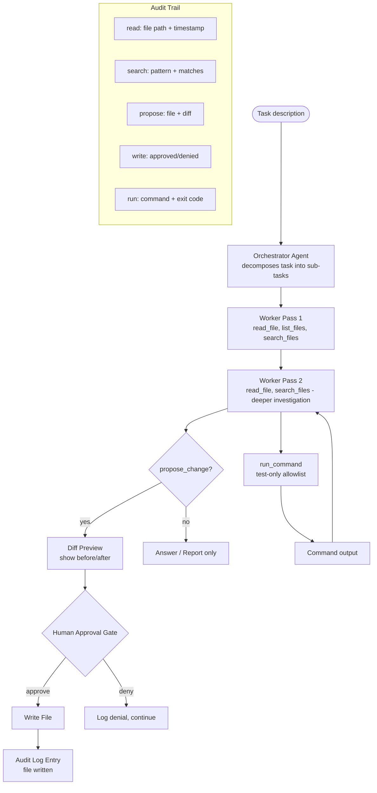

# Coding Automation Agent on a Real Repo

> A coding agent that can write code is useful. A coding agent that knows when to stop and ask is safe.

**Type:** Build
**Languages:** Python
**Prerequisites:** Phases 03, 04, 05, 08
**Time:** ~4 hours
**Phase:** 12 · Capstones

**Learning Objectives:**
- Build an orchestrator-workers coding agent with a read/search/write/run tool set
- Enforce an approval gate on all file writes with diff preview
- Generate a per-run audit trail of every file read, searched, and proposed for modification
- Evaluate task completion, file selection precision, and planning accuracy against a 5-task test suite
- Understand the failure modes that distinguish useful coding agents from destructive ones

---

## THE PROBLEM

AI coding assistants are everywhere. Most of them have the same failure mode: they try to solve the entire task in one shot, modify files they should not have touched, and leave the codebase in an ambiguous state. The engineer then spends an hour figuring out what changed and why.

The failure is not a model capability problem. It is an architecture problem. A coding agent that reads everything, plans explicitly, proposes changes with diffs, and waits for human approval before writing is fundamentally safer than one that just starts editing files. The safety properties come from the tool design and the approval gate, not from the model being "careful."

This capstone builds a coding agent for this curriculum's own repository. It can discover what is in the repo, read files, search for patterns, propose changes with diff preview, and run test commands. Every file it reads and every change it proposes is logged to an audit trail. Nothing is written without explicit human approval. Demo tasks include: finding lessons with missing required sections and proposing a new checks.json file.

---

## THE CONCEPT

### Coding Agent Architecture

The agent uses an orchestrator-workers pattern from Phase 04. The orchestrator breaks the task into sub-tasks. Worker passes execute each sub-task with the available tools. The approval gate sits between the agent proposing a change and the change actually happening.



### Tool Permission Design

Every tool in a coding agent carries risk. The risk profile determines the approval requirement:

```
TOOL             RISK          APPROVAL    NOTES
read_file        none          auto        any path under cwd
list_files       none          auto        glob pattern only
search_files     none          auto        grep wrapper, no side effects
propose_change   write risk    HITL        shows diff, requires yes/no
run_command      exec risk     allowlist   only test/lint commands
```

The approval gate for `propose_change` shows a diff before any write happens. This is not optional. A coding agent that writes without showing a diff first is a liability, not an asset.

### Orchestrator-Workers Split

The orchestrator does not use tools. It reads the task, reasons about what information is needed, and outputs a structured plan. The worker uses tools to execute each step. This split has two benefits: the orchestrator's plan is auditable (you can see the task decomposition before any tool calls happen), and the worker's tool calls are grounded in an explicit plan rather than free-form exploration.

```
ORCHESTRATOR CALL:
  Input:  "Add a checks.json to lesson phases/04-agents/02-workflows-vs-agents"
  Output: {
    "steps": [
      "Read the lesson docs/en.md to understand what the lesson covers",
      "Read an existing checks.json (e.g. phases/04-agents/01-the-agent-loop/checks.json) to understand the format",
      "Generate 6-8 scenario-based questions about the lesson content",
      "Propose the new checks.json file with a diff preview"
    ]
  }

WORKER PASS:
  Executes each step in sequence using the tool set.
  Pauses at propose_change for human approval.
```

---

## BUILD IT

### Step 1: Tool Implementations

```python
import os
import re
import subprocess
import json
import difflib
from pathlib import Path

CWD = os.environ.get("AGENT_CWD", str(Path(__file__).resolve().parents[4]))
AUDIT_LOG = "agent_audit.jsonl"

# Commands allowed by run_command (test and lint only)
ALLOWED_COMMANDS = [
    re.compile(r'^python -m pytest'),
    re.compile(r'^python -m flake8'),
    re.compile(r'^grep '),
    re.compile(r'^find \.'),
    re.compile(r'^python main\.py --test'),
]

def write_audit(event: dict):
    from datetime import datetime
    entry = {"ts": datetime.utcnow().isoformat() + "Z", **event}
    with open(AUDIT_LOG, "a") as f:
        f.write(json.dumps(entry) + "\n")

def read_file(path: str) -> str:
    abs_path = os.path.normpath(os.path.join(CWD, path))
    if not abs_path.startswith(CWD):
        return "Error: path traversal outside allowed root."
    try:
        content = Path(abs_path).read_text(encoding="utf-8", errors="ignore")
        write_audit({"tool": "read_file", "path": path, "chars": len(content)})
        return content[:8000]  # truncate to avoid context overflow
    except FileNotFoundError:
        return f"File not found: {path}"
    except Exception as e:
        return f"Error reading {path}: {e}"

def list_files(pattern: str = "**/*.md") -> str:
    try:
        matches = sorted(str(p.relative_to(CWD)) for p in Path(CWD).glob(pattern))
        write_audit({"tool": "list_files", "pattern": pattern, "matches": len(matches)})
        return "\n".join(matches[:100]) or "(no matches)"
    except Exception as e:
        return f"Error: {e}"

def search_files(pattern: str, file_glob: str = "**/*.py") -> str:
    results = []
    for p in Path(CWD).glob(file_glob):
        try:
            content = p.read_text(encoding="utf-8", errors="ignore")
            for i, line in enumerate(content.splitlines(), 1):
                if re.search(pattern, line, re.IGNORECASE):
                    results.append(f"{p.relative_to(CWD)}:{i}: {line.strip()}")
        except Exception:
            continue
    write_audit({"tool": "search_files", "pattern": pattern, "matches": len(results)})
    return "\n".join(results[:50]) or "(no matches)"
```

### Step 2: The Approval Gate

The `propose_change` tool is the heart of the safety architecture. It shows a diff and waits for input before writing anything.

```python
def propose_change(path: str, new_content: str, reason: str) -> str:
    abs_path = os.path.normpath(os.path.join(CWD, path))
    if not abs_path.startswith(CWD):
        return "Error: path traversal blocked."

    # Generate diff
    try:
        existing = Path(abs_path).read_text(encoding="utf-8") if Path(abs_path).exists() else ""
    except Exception:
        existing = ""

    diff_lines = list(difflib.unified_diff(
        existing.splitlines(keepends=True),
        new_content.splitlines(keepends=True),
        fromfile=f"a/{path}",
        tofile=f"b/{path}",
        n=3,
    ))
    diff_text = "".join(diff_lines) or "(new file)"

    print(f"\n[PROPOSE CHANGE] {path}")
    print(f"  Reason: {reason}")
    print(f"  Diff preview:\n{diff_text[:2000]}")

    write_audit({
        "tool": "propose_change",
        "path": path,
        "reason": reason,
        "is_new_file": not Path(abs_path).exists(),
        "diff_lines": len(diff_lines),
    })

    try:
        decision = input("  Apply this change? (yes/no/view): ").strip().lower()
    except (EOFError, KeyboardInterrupt):
        decision = "no"

    if decision == "view":
        print(new_content)
        decision = input("  Apply this change? (yes/no): ").strip().lower()

    if decision in ("yes", "y"):
        Path(abs_path).parent.mkdir(parents=True, exist_ok=True)
        Path(abs_path).write_text(new_content, encoding="utf-8")
        write_audit({"tool": "write_file", "path": path, "approved": True})
        return f"File written: {path}"

    write_audit({"tool": "write_file", "path": path, "approved": False})
    return f"Change denied for: {path}"
```

### Step 3: The Orchestrator-Workers Agent

```python
import anthropic

MODEL = "claude-3-5-haiku-20241022"
client = anthropic.Anthropic()

ORCHESTRATOR_SYSTEM = """You are a coding task planner. 
Given a task description and the available tools, produce a numbered list of steps 
that a coding agent should execute to complete the task.
Be specific: name files to read, patterns to search, and what the final output should be.
Output as JSON: {"steps": ["step 1", "step 2", ...]}
Do not execute any steps yourself. Only plan."""

WORKER_SYSTEM = """You are a coding agent operating on a software repository.
Complete the assigned step using the available tools.
Think step by step. Read files before modifying them.
Never propose a change without first reading the current file content.
If you are unsure, read more context before proposing anything.
"""

TOOLS = [
    {
        "name": "read_file",
        "description": "Read a file's content. Path is relative to repo root.",
        "input_schema": {
            "type": "object",
            "properties": {
                "path": {"type": "string", "description": "Relative file path from repo root"}
            },
            "required": ["path"]
        }
    },
    {
        "name": "list_files",
        "description": "List files matching a glob pattern relative to repo root.",
        "input_schema": {
            "type": "object",
            "properties": {
                "pattern": {"type": "string", "description": "Glob pattern, e.g. 'phases/**/*.md'"}
            },
            "required": ["pattern"]
        }
    },
    {
        "name": "search_files",
        "description": "Search for a regex pattern in files matching a glob. Returns matching lines with file:line format.",
        "input_schema": {
            "type": "object",
            "properties": {
                "pattern":   {"type": "string", "description": "Regex pattern to search for"},
                "file_glob": {"type": "string", "description": "Glob pattern for files to search. Default: **/*.md"}
            },
            "required": ["pattern"]
        }
    },
    {
        "name": "propose_change",
        "description": "Propose writing a file. Shows a diff and requires human approval before writing.",
        "input_schema": {
            "type": "object",
            "properties": {
                "path":        {"type": "string", "description": "Relative file path to write"},
                "new_content": {"type": "string", "description": "Complete new file content"},
                "reason":      {"type": "string", "description": "Why this change is needed"}
            },
            "required": ["path", "new_content", "reason"]
        }
    },
    {
        "name": "run_command",
        "description": "Run an allowed command (tests and linting only). Returns stdout + stderr.",
        "input_schema": {
            "type": "object",
            "properties": {
                "command": {"type": "string", "description": "Command to run (must match allowed list)"}
            },
            "required": ["command"]
        }
    }
]

TOOL_REGISTRY = {
    "read_file":     lambda args: read_file(args["path"]),
    "list_files":    lambda args: list_files(args.get("pattern", "**/*.md")),
    "search_files":  lambda args: search_files(args["pattern"], args.get("file_glob", "**/*.md")),
    "propose_change": lambda args: propose_change(args["path"], args["new_content"], args["reason"]),
    "run_command":   lambda args: run_command(args["command"]),
}
```

> **Real-world check:** Your coding agent finishes a task and reports "I have updated 6 files." You check the audit log and find it read 23 files but only 6 were necessary for the task. What metric captures this inefficiency, and what system prompt change reduces unnecessary file reads?

The metric is file selection precision: relevant files read divided by total files read. A precision of 6/23 = 0.26 is poor. The system prompt change: add an explicit planning instruction that says "before reading any file, state which files you expect to need and why, then read only those." This forces the agent to commit to a retrieval plan before executing it, reducing exploratory reads. You can also add a per-task file read budget (e.g. "read at most 8 files") to enforce discipline.

---

## USE IT

### Claude Agent SDK File System Tools

The Claude Agent SDK (in the extended agent features preview) provides typed file system tools that can replace the hand-written implementations in this capstone. The pattern is the same but the tools are type-safe and the SDK handles message history.

```python
# Conceptual: Claude Agent SDK file tool pattern
# The sdk tools follow the same read/list/search/propose interface
# Key advantage: input validation is handled by Pydantic models, not manual string checks

from pydantic import BaseModel, validator

class ReadFileInput(BaseModel):
    path: str

    @validator("path")
    def path_within_bounds(cls, v):
        normalized = os.path.normpath(v)
        if normalized.startswith(".."):
            raise ValueError("Path traversal not allowed")
        return v
```

How aider and Claude Code implement similar patterns at production scale: both use an explicit diff-preview step before writing, both maintain an audit trail of file operations, and both require explicit approval or user invocation before modifying files. The approval gate in this capstone is the minimal version of the "is this change what you wanted?" confirmation loop that drives production coding agents.

> **Perspective shift:** A colleague argues: "We should give the agent write access directly. The approval gate slows things down." What is the concrete risk they are underestimating?

An agent with unrestricted write access can silently overwrite files based on a misunderstood task. The risk is not malice - it is misinterpretation. A task like "update all lesson READMEs to add the new header format" can be interpreted as "replace all lesson docs/en.md files" if the agent does not have a precise understanding of which files are READMEs. The approval gate catches this before any file is overwritten. Speed matters less than correctness when the action is irreversible. For genuinely reversible contexts (where everything is in git), the gate can be relaxed, but the audit log should remain.

---

## SHIP IT

The deployment and safety runbook is in `outputs/runbook-coding-agent-deploy.md`. It covers allowed directories, command allowlist, approval gate configuration, audit log format, rollback procedure, and capability boundary documentation.

---

## EVALUATE IT

### 5 Coding Tasks with Known Correct Outcomes

**Task 1: Find missing checks.json**
Task: "Find all lessons in Phase 04 that do not have a checks.json file."
Known answer: list of specific lesson folders.
Metric: does the agent's output match the known list exactly?

**Task 2: Add a checks.json to a specific lesson**
Task: "Add a checks.json to phases/04-agents/02-workflows-vs-agents."
Known outcome: a valid checks.json with 6-8 questions in the correct format.
Metric: does the proposed file match the checks.json schema? (Validate with JSON schema check.)

**Task 3: Find lessons missing a Real-world check blockquote**
Task: "Find all lessons in Phase 02 that are missing a '> **Real-world check:**' section."
Known answer: zero (all Phase 02 lessons have this section - if this is not true in the repo, the answer is the actual list).
Metric: does the agent report the correct list?

**Task 4: Report code files in Phase 03**
Task: "List all Python files in Phase 03 and report which ones import 'anthropic'."
Known answer: specific file list with import status.
Metric: do the reported files match the actual grep output?

**Task 5: Count total lessons**
Task: "How many lessons are there across all phases (count lesson folders under phases/)?"
Known answer: count of directories matching phases/NN-*/NN-*/ pattern.
Metric: does the reported count match the actual count?

**Metric targets:**

- Task completion rate: 4/5 (80%)
- File selection precision: >= 0.50 (agent reads no more than 2x the necessary files)
- False write rate: 0% (no writes that were subsequently rolled back)
- Planning accuracy: 4/5 tasks where the orchestrator's step plan matches the actual steps needed

Track all metrics per run from the audit log.
