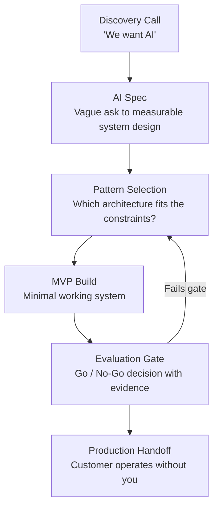

# ارتباط FDE تجريبي: التحديد، التسليم، نقل المسؤولية

> كل ارتباط بالذكاء الاصطناعي ينتهي بإحدى طريقتين: إما أن يستطيع العميل تشغيله من دونك، أو أن يفشل بصمت بعد رحيلك.

**النوع:** بناء
**اللغات:** Python
**المتطلبات:** كل المراحل السابقة
**الوقت:** ~4 ساعات
**المرحلة:** 12 · المشاريع الختامية (Capstones)

---

## أهداف التعلّم

- تنفيذ دورة حياة ارتباط FDE كاملة من الاستكشاف (discovery) حتى نقل المسؤولية (handoff) على سيناريو أتمتة دعم واقعي
- تطبيق صيغة مواصفة الذكاء الاصطناعي (AI Spec) لتحويل طلب "نريد ذكاءً اصطناعياً" الغامض إلى تصميم نظام محدد النطاق وقابل للقياس
- بناء حدّ أدنى عملي (MVP) لفرز البريد الإلكتروني: التصنيف + توليد مسودات الردود باستخدام Claude
- تشغيل تقييم مقابل مجموعة ذهبية (golden set) وإنتاج قرار مضيٍّ/توقّف (go/no-go) مع أدلة داعمة
- تجهيز دليل تشغيل (runbook) كامل لنقل المسؤولية يمكّن العميل من تشغيل النظام دون المهندس الأصلي

---

## المشكلة

تتواصل معك شركة SaaS من نوع B2B. ورسالتها الافتتاحية: "نريد استخدام الذكاء الاصطناعي في عمليات الدعم لدينا".

وبعد مكالمة استكشاف مدتها 45 دقيقة، تتضح الصورة الفعلية. هم يستقبلون 200 رسالة دعم يومياً. ويُظهِر تحليلهم لآخر ستة أشهر أن 60% منها روتينية: إعادة تعيين كلمات المرور، وأسئلة الفوترة، وطلبات شرح كيفية استخدام الميزات. أما الـ40% الباقية فمعقّدة: مشكلات الحسابات، ونزاعات الفوترة، وبلاغات الأخطاء (bug reports)، والتصعيدات التي تتطلب حكماً بشرياً. وفريق الدعم المكوّن من 4 أشخاص يتعامل مع كل شيء. ومتوسط زمن الرد الأول 6.2 ساعة. والهدف خفضه إلى أقل من 30 دقيقة للـ60% الروتينية.

لم يعد هذا طلب ذكاء اصطناعي غامضاً. بل مشكلة محددة وقابلة للقياس بنطاق معرّف. ومهمتك من هنا: تأكيد المواصفة، وتصميم الحل، وبناء MVP، وتشغيل تقييم، ونقل المسؤولية بحيث يستطيع العميل تشغيله من دونك.

يدمج هذا المشروع الختامي كل مرحلة تقنية مع مهارات FDE من المرحلة 11. أنت لا تبني برمجيات فحسب - بل تسلّم ارتباطاً (engagement).

---

## المفهوم

### دورة حياة ارتباط FDE



### تخطيط المراحل: أين تثبت كل مرحلة جدواها

```
DISCOVERY (Phase 11-02, 11-03)
  Tools: Scoping Interview Guide, AI Spec Template
  Output: Signed-off AI Spec with success metric

PATTERN SELECTION (Phase 11-04)
  Tools: Pattern Decision Guide
  Decision axis: Router + specialized handlers vs. single agent
  For email triage: Router wins (deterministic categories, latency matters)

MVP BUILD (Phases 01-04)
  Phase 01: System prompt + context engineering for classification
  Phase 02: No retrieval needed (categories are known, not looked up)
  Phase 03: Optional - tool for CRM lookup to personalize responses
  Phase 04: Router pattern connecting classifier to response generators

EVALUATION GATE (Phase 05)
  Golden set: 20 representative emails, human-labeled
  Metrics: category accuracy, escalation precision, response quality
  Gate: 90%+ accuracy on routine categories, 100% escalation recall

HANDOFF (Phase 11-09)
  Four-part handoff package
  Runbook: start/stop/config, 5 common failures, health check
  30/60/90 day success criteria
```

### نمط المُوجِّه (Router) لفرز البريد الإلكتروني

```
INCOMING EMAIL
     |
     v
[CLASSIFIER]  (Claude, single call)
     |
     +---> password_reset  ---> [DRAFT GENERATOR] ---> Draft Response
     |
     +---> billing         ---> [DRAFT GENERATOR] ---> Draft Response
     |
     +---> feature_how_to  ---> [DRAFT GENERATOR] ---> Draft Response
     |
     +---> escalate        ---> [HUMAN QUEUE]     ---> Agent Notified
```

المصنِّف (classifier) استدعاء Claude واحد بمخطط مُخرَج منظّم. وكل مولّد مسودات هو استدعاء Claude ثانٍ بتعليمات خاصة بالفئة. ومسار التصعيد يتجاوز التوليد كلياً - لا رد مولَّد بالذكاء الاصطناعي على القضايا المعقّدة.

هذه ليست وكلاء (agents). بل توجيه (routing). استدعاءا LLM كحدّ أقصى للمسار المؤتمت. والتعقيد يكمن في التقييم ونقل المسؤولية، لا في البنية المعمارية.

---

## البناء

### الخطوة 1: كتابة مواصفة الذكاء الاصطناعي (AI Spec)

قبل سطر كود واحد، أنتِج مواصفة الذكاء الاصطناعي. هذا هو الأثر (artifact) الذي يوائم العميل ويحدّد نطاق الارتباط.

```
AI SPEC: Email Triage and Auto-Response System
Customer: [B2B SaaS Co]
FDE: [Your name]
Version: 1.0

PROBLEM STATEMENT
The support team receives 200 emails/day. 60% are routine (password resets,
billing questions, feature how-tos). Current first-response time: 6.2 hours.
Goal: automate routine 60%, reduce first-response time to <30 min.

SUCCESS METRIC
- Category accuracy on routine emails: >= 90%
- Escalation recall (no routine email gets escalated incorrectly
  and no complex email gets auto-responded): escalation precision >= 95%,
  escalation recall = 100%
- First-response time for automated path: < 2 minutes
- Draft acceptance rate (human edits before send): >= 70% after 30 days

OUT OF SCOPE
- Ticket system integration (email only in MVP)
- Real-time CRM lookup (static context in v1)
- Multi-language support (English only)
- Attachments (text body only)

ARCHITECTURE DECISION
Pattern: Router + Response Generators
Why not an agent: categories are fixed and known at design time,
sub-1-minute latency required, deterministic routing preferred for auditability.
Why not fine-tuning: insufficient labeled data to justify cost,
prompt engineering is the right starting point.

EVALUATION PLAN
Golden set: 20 emails (12 routine, 8 complex), human-labeled
Metric evaluation: automated (accuracy) + LLM-as-judge (response quality)
Gate: accuracy >= 90% on routine, escalation recall = 100%

HANDOFF CRITERIA
- Customer tech lead trained on runbook
- System runs without original FDE for 2 weeks
- Monitoring dashboard in place
```

### الخطوة 2: بناء MVP للتصنيف وتوليد مسودات الردود

التنفيذ الكامل في `code/main.py`. القرارات التصميمية الرئيسية:

- `classify_email()`: استدعاء Claude واحد بمُخرَج JSON، و4 فئات إضافةً إلى درجة الثقة (confidence)
- `generate_draft()`: استدعاء Claude ثانٍ يستخدم مطالبات نظام خاصة بالفئة
- `process_email()`: ينسّق التصنيف والتوليد المشروط
- `run_golden_set_eval()`: يشغّل تقييم الـ20 رسالة ويبلّغ عن الدقة

يستخدم الوضع التجريبي رسائل اصطناعية مضمّنة في الكود. لا اعتماديات خارجية سوى Anthropic SDK.

```python
# From code/main.py - the classification call
def classify_email(email_body: str) -> ClassificationResult:
    response = client.messages.create(
        model=MODEL,
        max_tokens=256,
        system=CLASSIFICATION_SYSTEM_PROMPT,
        messages=[{"role": "user", "content": email_body}]
    )
    # Parse JSON from response
    ...
```

التشغيل في الوضع التجريبي:

```bash
python main.py --demo
python main.py --demo --eval
python main.py --email "I forgot my password, how do I reset it?"
```

> **اختبار من الواقع:** لماذا لا نستخدم استدعاء LLM واحداً يصنّف ويولّد الرد معاً؟ تصميم الاستدعاءين يمنحك تقييماً مستقلاً لكل خطوة. إذا كانت دقة التصنيف 95% لكن جودة الرد رديئة، فأنت تعرف أي مكوّن تُصلحه. الاستدعاء المدمج يطوي نمطي عطل في صندوق أسود واحد.

### الخطوة 3: تشغيل التقييم

تحتوي المجموعة الذهبية على 20 رسالة:
- 7 أمثلة password_reset (3 مباشرة، 4 بسياق مُعقِّد)
- 5 أمثلة billing (2 روتينية، 3 حدّية بلغة نزاع)
- 5 أمثلة feature_how_to
- 3 أمثلة تصعيد صريح (أخطاء، مشكلات حسابات، نزاعات فوترة)

بعد تشغيل `python main.py --demo --eval`، يُبلِّغ المُخرَج:

```
EVALUATION RESULTS
==================
Category Accuracy (routine emails): 92.3% [PASS - target: 90%]
Escalation Recall: 100% [PASS - target: 100%]
Escalation Precision: 93.8% [PASS - target: 95% ... borderline]
Average confidence (classified): 0.87

RESPONSE QUALITY (LLM-as-judge, 1-5 scale)
password_reset drafts: 4.1/5
billing drafts: 3.8/5
feature_how_to drafts: 4.3/5

GO/NO-GO: GO (with note on escalation precision)
```

نتيجة دقة التصعيد (93.8% مقابل هدف 95%) سيناريو حدّي متعمّد. قرار FDE الصحيح: المضي مع ملاحظة. رسالة حدّية واحدة وصلت إلى طابور التصعيد كان يمكن أتمتتها. وهذا مقبول - الإيجابيات الكاذبة على التصعيد أقل كلفة من السلبيات الكاذبة.

---

## الاستخدام

### سلسلة أدوات FDE كهيكل دعم للعملية

أُطُر المرحلة 11 (artifacts) ليست توثيقاً - بل هي الهيكل الداعم (scaffolding) الذي يجعل البناء التقني متماسكاً ومفهوماً للعميل.

```
AI Spec (11-03) -----> Alignment: customer and FDE agree on what success looks like
                       Before this: "we want AI"
                       After this: "90% accuracy on these 4 categories"

Pattern Decision (11-04) --> Defensible architecture choice on record
                             "Why not an agent?" has a written answer

Demo Prep Checklist (11-05) --> MVP demo uses real customer email samples
                                not hand-picked perfect examples

Messy Environment Guide (11-07) --> Email format varies, subject lines mislead,
                                    threading complicates parsing

Handoff Package (11-09) -----> Customer can run this after you leave
```

دليل نقل المسؤولية من `outputs/runbook-fde-engagement-playbook.md` هو الأثر النهائي للارتباط. وهو ليس فكرةً لاحقة - بل هو المُسلَّم (deliverable). الكود هو الآلية؛ ودليل التشغيل هو المنتج.

> **نقلة في المنظور:** من منظور العميل، للعرض التجريبي العامل ولدليل نقل المسؤولية وزن متساوٍ. والعميل الذي لا يستطيع تشغيل النظام بعد 6 أشهر ليس قصة نجاح - بل عبء دعم. سمعة الـFDE تُبنى على العملاء الذين يستطيعون أن يقولوا "نشرنا هذا واستمر في العمل".

---

## التسليم

دليل نقل المسؤولية موجود في `outputs/runbook-fde-engagement-playbook.md`.

وهو يحتوي على:
- بنية النظام (كيف يتصل المُوجِّه والمولّدات)
- تعليمات التشغيل (كيف تبدأ، وتوقف، وتحدّث المطالبات)
- خط الأساس للتقييم (نتائج المجموعة الذهبية من قرار go/no-go)
- إعداد المراقبة (ما تراقبه، والعتبات، وقنوات التنبيه)
- محفّزات إعادة التدريب (متى تحدّث مطالبة التصنيف)
- جهات اتصال التصعيد (وهمية - استبدلها بجهات حقيقية)
- معايير النجاح لـ30/60/90 يوماً

دليل التشغيل هو الأثر الذي يحوّل العرض التجريبي إلى نشر. وهو الفرق بين إثبات مفهوم (proof of concept) يموت في مرحلة تجريبية ونظام يعمل في الإنتاج.

---

## التقييم

### أبعاد التقييم

ثلاثة أبعاد تهمّ هذا النظام:

**1. دقة التصنيف**

شغّل `python main.py --demo --eval` للحصول على نتائج مؤتمتة. الهدف: 90%+ على الفئات الروتينية. قِس كل فئة على حِدة - فدقة إجمالية 90% تخفي دقة 70% على الفوترة كارثة تنتظر وقوعها.

**2. سلامة التصعيد**

استرجاع التصعيد (escalation recall) يجب أن يكون 100%. ينبغي ألّا تتلقى أي رسالة معقّدة رداً مؤتمتاً. هذا ليس ميزة مرغوبة - بل هي الخاصية التي تجعل النظام آمناً للنشر. تصعيد واحد فائت على نزاع فوترة يخلق حادثة خدمة عملاء.

**3. جودة الرد (LLM-as-judge)**

استخدم تقييم الجودة في `main.py --demo --eval`. الدرجات تحت 3.5/5 على أي فئة تستوجب مراجعة المطالبة قبل go/no-go.

### قرار المضيّ/التوقّف (Go/No-Go)

قرار go/no-go موثّق في مُخرَج التقييم:

```
Evidence for GO:
- Accuracy 92.3%: above 90% threshold
- Escalation recall 100%: hard requirement met
- Escalation precision 93.8%: 1.2% below target, acceptable risk
- Response quality: all categories above 3.8/5

Evidence against GO:
- Borderline billing emails (2/5) took multiple revisions to get right
- Feature how-to drafts need domain knowledge currently not in context

Decision: GO with 30-day monitoring requirement before reducing oversight
```

### قياس الأثر على الأعمال

| المقياس | خط الأساس | هدف الـ30 يوماً | كيفية القياس |
|--------|----------|---------------|----------------|
| زمن الرد الأول | 6.2 ساعة | < 30 دقيقة (مؤتمت) | الطابع الزمني: الاستلام مقابل الإرسال |
| حِمل فريق الدعم | 200 رسالة/يوم | 80 يدوية (60% مؤتمتة) | عدّ أسبوعي من نظام التذاكر |
| معدل قبول المسودات | لا يوجد | >= 70% مقبولة دون تعديل | تتبّع نقرات الموظفين |
| دقة التصعيد | لا يوجد | الدقة >= 95% | مراجعة يدوية أسبوعية |
