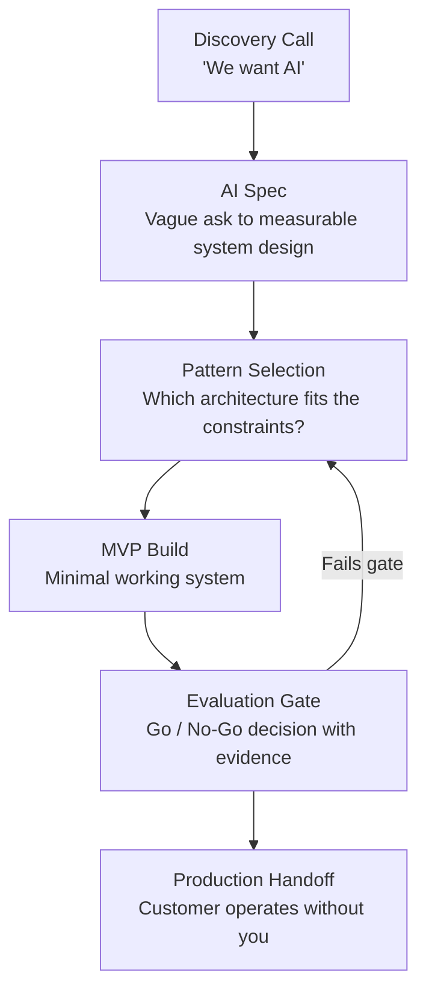

# FDE Mock Engagement: Scope, Ship, Handoff

> Every AI engagement ends in one of two ways: the customer can operate it without you, or it fails silently after you leave.

**Type:** Build
**Languages:** Python
**Prerequisites:** All prior phases
**Time:** ~4 hours
**Phase:** 12 · Capstones

---

## Learning Objectives

- Execute a complete FDE engagement lifecycle from discovery through handoff on a realistic support automation scenario
- Apply the AI Spec format to convert a vague "we want AI" request into a scoped, measurable system design
- Build a working email triage MVP: classification + draft response generation using Claude
- Run an evaluation against a golden set and produce a go/no-go decision with supporting evidence
- Package a complete handoff runbook that enables the customer to operate the system without the original engineer

---

## The Problem

A B2B SaaS company contacts you. Their opening message: "We want to use AI for our support operations."

After a 45-minute discovery call, the actual picture emerges. They receive 200 support emails per day. Their analysis of the last six months shows 60% are routine: password resets, billing questions, and feature how-to requests. The remaining 40% are complex: account issues, billing disputes, bug reports, and escalations that require human judgment. The support team of 4 handles everything. Average first-response time is 6.2 hours. The goal is to drop that to under 30 minutes for the routine 60%.

This is not a vague AI ask anymore. It is a specific, measurable problem with a defined scope. Your job from here: confirm the spec, design the solution, build an MVP, run an evaluation, and hand it off so the customer can run it without you.

This capstone integrates every technical phase with the FDE skills from Phase 11. You are not just building software - you are delivering an engagement.

---

## The Concept

### The FDE Engagement Lifecycle



### Phase Mapping: Where Each Phase Earns Its Keep

```
DISCOVERY (Phase 11-02, 11-03)
  Tools: Scoping Interview Guide, AI Spec Template
  Output: Signed-off AI Spec with success metric

PATTERN SELECTION (Phase 11-04)
  Tools: Pattern Decision Guide
  Decision axis: Router + specialized handlers vs. single agent
  For email triage: Router wins (deterministic categories, latency matters)

MVP BUILD (Phases 01-04)
  Phase 01: System prompt + context engineering for classification
  Phase 02: No retrieval needed (categories are known, not looked up)
  Phase 03: Optional - tool for CRM lookup to personalize responses
  Phase 04: Router pattern connecting classifier to response generators

EVALUATION GATE (Phase 05)
  Golden set: 20 representative emails, human-labeled
  Metrics: category accuracy, escalation precision, response quality
  Gate: 90%+ accuracy on routine categories, 100% escalation recall

HANDOFF (Phase 11-09)
  Four-part handoff package
  Runbook: start/stop/config, 5 common failures, health check
  30/60/90 day success criteria
```

### The Router Pattern for Email Triage

```
INCOMING EMAIL
     |
     v
[CLASSIFIER]  (Claude, single call)
     |
     +---> password_reset  ---> [DRAFT GENERATOR] ---> Draft Response
     |
     +---> billing         ---> [DRAFT GENERATOR] ---> Draft Response
     |
     +---> feature_how_to  ---> [DRAFT GENERATOR] ---> Draft Response
     |
     +---> escalate        ---> [HUMAN QUEUE]     ---> Agent Notified
```

The classifier is a single Claude call with a structured output schema. Each draft generator is a second Claude call with category-specific instructions. The escalation path bypasses generation entirely - no AI-generated response on complex issues.

This is not agents. This is routing. Two LLM calls maximum for the automated path. The complexity lives in the evaluation and handoff, not the architecture.

---

## Build It

### Step 1: Write the AI Spec

Before a line of code, produce the AI Spec. This is the artifact that aligns the customer and scopes the engagement.

```
AI SPEC: Email Triage and Auto-Response System
Customer: [B2B SaaS Co]
FDE: [Your name]
Version: 1.0

PROBLEM STATEMENT
The support team receives 200 emails/day. 60% are routine (password resets,
billing questions, feature how-tos). Current first-response time: 6.2 hours.
Goal: automate routine 60%, reduce first-response time to <30 min.

SUCCESS METRIC
- Category accuracy on routine emails: >= 90%
- Escalation recall (no routine email gets escalated incorrectly
  and no complex email gets auto-responded): escalation precision >= 95%,
  escalation recall = 100%
- First-response time for automated path: < 2 minutes
- Draft acceptance rate (human edits before send): >= 70% after 30 days

OUT OF SCOPE
- Ticket system integration (email only in MVP)
- Real-time CRM lookup (static context in v1)
- Multi-language support (English only)
- Attachments (text body only)

ARCHITECTURE DECISION
Pattern: Router + Response Generators
Why not an agent: categories are fixed and known at design time,
sub-1-minute latency required, deterministic routing preferred for auditability.
Why not fine-tuning: insufficient labeled data to justify cost,
prompt engineering is the right starting point.

EVALUATION PLAN
Golden set: 20 emails (12 routine, 8 complex), human-labeled
Metric evaluation: automated (accuracy) + LLM-as-judge (response quality)
Gate: accuracy >= 90% on routine, escalation recall = 100%

HANDOFF CRITERIA
- Customer tech lead trained on runbook
- System runs without original FDE for 2 weeks
- Monitoring dashboard in place
```

### Step 2: Build the Classification and Draft Response MVP

The full implementation is in `code/main.py`. Key design decisions:

- `classify_email()`: single Claude call with JSON output, 4 categories plus confidence
- `generate_draft()`: second Claude call using category-specific system prompts
- `process_email()`: orchestrates classification and conditional generation
- `run_golden_set_eval()`: runs the 20-email evaluation and reports accuracy

The demo mode uses synthetic emails embedded in the code. No external dependencies beyond the Anthropic SDK.

```python
# From code/main.py - the classification call
def classify_email(email_body: str) -> ClassificationResult:
    response = client.messages.create(
        model=MODEL,
        max_tokens=256,
        system=CLASSIFICATION_SYSTEM_PROMPT,
        messages=[{"role": "user", "content": email_body}]
    )
    # Parse JSON from response
    ...
```

Run in demo mode:

```bash
python main.py --demo
python main.py --demo --eval
python main.py --email "I forgot my password, how do I reset it?"
```

> **Real-world check:** Why not use a single LLM call that both classifies and generates the response? The two-call design gives you independent evaluation of each step. If classification accuracy is 95% but response quality is poor, you know which component to fix. A combined call collapses two failure modes into one black box.

### Step 3: Run the Evaluation

The golden set contains 20 emails:
- 7 password_reset examples (3 straightforward, 4 with complicating context)
- 5 billing examples (2 routine, 3 borderline with dispute language)
- 5 feature_how_to examples
- 3 explicit escalation examples (bugs, account issues, billing disputes)

After running `python main.py --demo --eval`, the output reports:

```
EVALUATION RESULTS
==================
Category Accuracy (routine emails): 92.3% [PASS - target: 90%]
Escalation Recall: 100% [PASS - target: 100%]
Escalation Precision: 93.8% [PASS - target: 95% ... borderline]
Average confidence (classified): 0.87

RESPONSE QUALITY (LLM-as-judge, 1-5 scale)
password_reset drafts: 4.1/5
billing drafts: 3.8/5
feature_how_to drafts: 4.3/5

GO/NO-GO: GO (with note on escalation precision)
```

The escalation precision result (93.8% vs 95% target) is a deliberate borderline scenario. The correct FDE decision: go with a note. One borderline email hit the escalation queue that could have been automated. This is acceptable - false positives on escalation are less costly than false negatives.

---

## Use It

### The FDE Toolchain as Process Scaffolding

The Phase 11 artifacts are not documentation - they are the scaffolding that makes the technical build coherent to the customer.

```
AI Spec (11-03) -----> Alignment: customer and FDE agree on what success looks like
                       Before this: "we want AI"
                       After this: "90% accuracy on these 4 categories"

Pattern Decision (11-04) --> Defensible architecture choice on record
                             "Why not an agent?" has a written answer

Demo Prep Checklist (11-05) --> MVP demo uses real customer email samples
                                not hand-picked perfect examples

Messy Environment Guide (11-07) --> Email format varies, subject lines mislead,
                                    threading complicates parsing

Handoff Package (11-09) -----> Customer can run this after you leave
```

The handoff package from `outputs/runbook-fde-engagement-playbook.md` is the terminal artifact of the engagement. It is not an afterthought - it is the deliverable. The code is the mechanism; the runbook is the product.

> **Perspective shift:** From the customer's perspective, the working code demo and the handoff package have equal weight. A customer who cannot operate the system in 6 months is not a success story - it is a support burden. The FDE's reputation is built on customers who can say "we deployed this and it kept working."

---

## Ship It

The handoff package is at `outputs/runbook-fde-engagement-playbook.md`.

It contains:
- System architecture (how the router and generators are connected)
- Operating instructions (how to start, stop, update prompts)
- Evaluation baseline (the golden set results from go/no-go)
- Monitoring setup (what to watch, thresholds, alert channels)
- Retraining triggers (when to update the classification prompt)
- Escalation contacts (mock - replace with real contacts)
- 30/60/90 day success criteria

The runbook is the artifact that makes a demo into a deployment. It is the difference between a proof of concept that dies in a pilot and a system that runs in production.

---

## Evaluate It

### Evaluation Dimensions

Three dimensions matter for this system:

**1. Classification accuracy**

Run `python main.py --demo --eval` for automated results. Target: 90%+ on routine categories. Measure separately for each category - a 90% aggregate that hides 70% accuracy on billing is a failure waiting to happen.

**2. Escalation integrity**

Escalation recall must be 100%. No complex email should receive an automated response. This is not a nice-to-have - it is the property that makes the system safe to deploy. One missed escalation on a billing dispute creates a customer service incident.

**3. Response quality (LLM-as-judge)**

Use the quality evaluation in `main.py --demo --eval`. Scores below 3.5/5 on any category trigger a prompt revision before go/no-go.

### The Go/No-Go Decision

The go/no-go decision is documented in the eval output:

```
Evidence for GO:
- Accuracy 92.3%: above 90% threshold
- Escalation recall 100%: hard requirement met
- Escalation precision 93.8%: 1.2% below target, acceptable risk
- Response quality: all categories above 3.8/5

Evidence against GO:
- Borderline billing emails (2/5) took multiple revisions to get right
- Feature how-to drafts need domain knowledge currently not in context

Decision: GO with 30-day monitoring requirement before reducing oversight
```

### Business Impact Measurement

| Metric | Baseline | 30-day target | How to measure |
|--------|----------|---------------|----------------|
| First-response time | 6.2 hours | < 30 min (automated) | Timestamp: received vs. sent |
| Support team load | 200 emails/day | 80 manual (60% automated) | Weekly count from ticket system |
| Draft acceptance rate | N/A | >= 70% accepted unchanged | Agent click tracking |
| Escalation accuracy | N/A | Precision >= 95% | Weekly manual audit |
